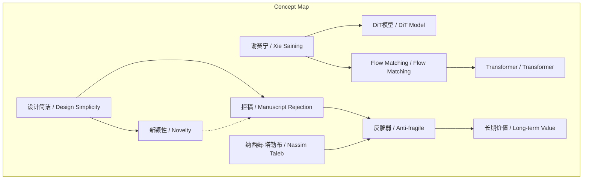
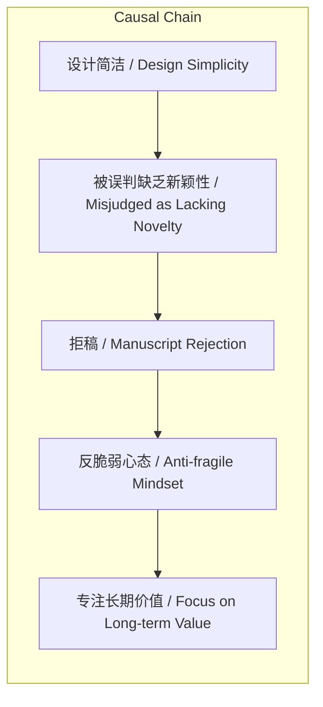

> 谢赛宁通过两次因设计简洁遭拒稿的经历，阐述并实践了基于塔勒布“反脆弱”概念的科研哲学。

## 元信息
- 分类：`ai-software/models-research`
- 优先级：`high` (`13`)
- 文档类型：`text-summary`
- 来源分组：`news`
- 原始文件：`reports/news/2026-03-21/1774103910669-news-news-task-1774103820665-w9fn06.md`
- 请求 ID：`1774103820665-w9fn06`

## 原始内容

#### 文本总结

### 谢赛宁：拒稿“免疫”与科研“反脆弱”哲学

#### 整体结构化文档表达
##### 文档卡片
- 主题（中文/English）：科研心态与论文发表 / Research Mindset and Paper Publication
- 一句话摘要：谢赛宁通过两次因设计简洁遭拒稿的经历，阐述并实践了基于塔勒布“反脆弱”概念的科研哲学。
- 目标读者：科研工作者、学者，尤其青年研究者
- 核心结论（3条）：
  1. 简洁设计可能因缺乏“新颖性”被误判而遭拒稿。
  2. 拒稿可转化为锻炼“反脆弱”心态、强化长期专注的契机。
  3. 优秀科研系统或研究者应优先追求长期价值，而非短期录用结果。

##### 内容结构树
1. 背景与问题定义：在完成DiT模型后，谢赛宁将Flow Matching引入Transformer，但论文因设计简洁被拒稿。
2. 核心观点与关键证据：核心观点是科研需“反脆弱”；关键证据是两次拒稿经历及谢赛宁的“免疫”反应。
3. 方法/机制/路径：方法为引入新目标函数至Transformer；路径为面对拒稿时调整心态，专注长期价值。
4. 风险与边界条件：风险是简洁设计易被误判为缺乏新颖性；边界条件是此哲学可能不适用于所有拒稿（如存在硬伤）。
5. 结论与行动建议：结论是专注研究长期价值；行动建议是培养对短期得失的“免疫”能力。

##### 结构化元数据（JSON）
```json
{
  "title": "谢赛宁：拒稿“免疫”与科研“反脆弱”哲学",
  "topic_zh": "科研心态与论文发表",
  "topic_en": "Research Mindset and Paper Publication",
  "audience": "科研工作者、学者，尤其青年研究者",
  "claims": [
    "简洁设计可能因缺乏“新颖性”被误判而遭拒稿。",
    "拒稿可转化为锻炼“反脆弱”心态、强化长期专注的契机。",
    "优秀科研系统或研究者应优先追求长期价值，而非短期录用结果。"
  ],
  "evidence": [
    "谢赛宁在完成DiT模型后，将Flow Matching引入Transformer。",
    "该论文因设计过于简洁、缺乏复杂公式堆砌，被认为缺乏新颖性，两次被拒稿。",
    "谢赛宁表示对拒稿已“基本免疫”，并借用塔勒布“反脆弱”概念解释此经历。",
    "他认为应从冲击中获得比损失更大的收益，如更坚韧的心态和对本质的纯粹坚持。"
  ],
  "risks": [
    "设计简洁易被审稿人误判为缺乏新颖性，导致拒稿。",
    "“反脆弱”心态可能不适用于所有拒稿情况（如论文存在实质性缺陷）。"
  ],
  "actions": [
    "放下对短期论文录用与否的得失心。",
    "将拒稿等挫折视为锻炼心态、聚焦长期价值的机会。",
    "在科研中坚持对事物本质的纯粹探索。"
  ]
}
```

#### 处理流程
1. 输入识别（来源：用户输入文本）
2. 信息抽取（实体、概念、问题、事实、观点）
3. 结构化归纳（定义/分类/比较/因果/方法论）
4. 关系建模（概念关系、等式/方程/逻辑链）
5. 可视化表达（Mermaid）

#### 概念清单（中英文）
- 谢赛宁 / Xie Saining
- DiT模型 / DiT Model
- Transformer / Transformer
- Flow Matching / Flow Matching
- 目标函数 / Objective Function
- 拒稿 / Manuscript Rejection
- 反脆弱 / Anti-fragile
- 纳西姆·塔勒布 / Nassim Taleb
- 短期论文录用 / Short-term Paper Acceptance
- 长期价值 / Long-term Value
- 设计简洁 / Design Simplicity
- 新颖性 / Novelty

#### 概念定义（中英文）
- 谢赛宁 / Xie Saining：文中提及的研究者，DiT模型作者之一。
- DiT模型 / DiT Model：文中提及的著名模型，全称Diffusion Transformer。
- Transformer / Transformer：文中提及的神经网络架构，但未提供具体定义。
- Flow Matching / Flow Matching：文中提及的新目标函数。
- 目标函数 / Objective Function：文中提及的用于优化模型性能的函数，但未提供具体定义。
- 拒稿 / Manuscript Rejection：论文被期刊或会议拒绝接收（文中描述）。
- 反脆弱 / Anti-fragile：塔勒布提出的概念，指系统从冲击中获益的特性；文中指面对挫折时能获得比损失更大收益的特性。
- 纳西姆·塔勒布 / Nassim Taleb：提出“反脆弱”概念的学者（文中提及）。
- 短期论文录用 / Short-term Paper Acceptance：指论文被录用的即时结果（文中语境）。
- 长期价值 / Long-term Value：指研究持久的重要性（文中语境）。
- 设计简洁 / Design Simplicity：指模型或论文设计不复杂、无冗余公式堆砌（文中描述）。
- 新颖性 / Novelty：指研究的新颖程度，文中是拒稿的常见原因。

#### 概念关联与逻辑关系（中英文）
1. 谢赛宁的研究工作（引入Flow Matching到Transformer） --> 导致 --> 论文被拒稿（因设计简洁）
2. 拒稿事件（作为外部冲击） 与 反脆弱心态（作为内在特性） 共同影响 --> 研究者的行为（专注长期价值）
3. 设计简洁性（特征） --> 被判断为 --> 缺乏新颖性（原因） --> 导致 --> 拒稿

#### COT逻辑梳理（定义/分类/比较/因果/科学方法论）
- Step 1（定义）：基于塔勒布理论，定义“反脆弱”为从冲击中获益的特性；文中将其应用于科研挫折应对。
- Step 2（分类）：将科研拒稿原因分类，文中拒稿属于“因设计风格被误判”类（简洁 vs 新颖性）。
- Step 3（比较）：比较两次拒稿事件，发现原因（设计简洁被误判）和反应（免疫、幽默对待）完全相同。
- Step 4（因果）：因果链为：设计简洁 → 被误判缺乏新颖性 → 遭拒稿 → 触发反脆弱心态 → 放下短期得失 → 专注长期价值。
- Step 5（科学方法论）：通过重复实验（两次拒稿）验证反脆弱心态的有效性，体现“从冲击中学习”的实证精神。

#### 事实与看法（病毒）
##### 事实
- 谢赛宁完成了DiT模型。
- 他将Flow Matching引入Transformer架构。
- 该论文因设计过于简洁、没有复杂公式堆砌，被认为缺乏新颖性，两次被拒稿。
- 他借用了纳西姆·塔勒布的“反脆弱”概念。
- 他表示经过几次打击，对拒稿已“基本免疫”。
##### 看法
- 设计简洁被认为缺乏所谓的新颖性。
- 一个优秀的科研系统或研究者必须是反脆弱的。
- 面对挫折时，应从冲击中获得比损失更大的收益（如更坚韧的心态）。
- 应彻底放下对短期论文录用与否的得失心，更专注于研究本身的长期价值。

#### FAQ（原文问题整理）
- 未发现明确提问（原文为陈述性访谈内容，无直接提问句）。

#### Visualization
##### Mermaid 图 1（概念结构图）

##### Mermaid 图 2（逻辑/因果图）


#### 文章中的类比
- 未发现明确类比（原文未使用类比修辞，仅引用“反脆弱”概念）。

#### 10个金句
1. “技术的延伸：将新目标函数引入 Transformer”
2. “戏剧性的重演：再次遭到拒稿”
3. “彻底‘免疫’与‘反脆弱’的科研哲学”
4. “一个优秀的科研系统或者研究者必须是反脆弱的。”
5. “在面对意外的打击、挫折（如莫名其妙被拒稿）时，你不能被击倒，而是要从这种冲击中获得比损失更大的收益。”
6. “这段经历让他彻底放下了对短期论文录用与否的得失心，更专注于研究本身的长期价值。”
7. “经过了这几次的打击，自己已经对拒稿‘基本免疫’了。”
8. “通常是因为设计过于简洁，没有复杂的公式堆砌，被认为缺乏所谓的新颖性”
9. “借用纳西姆·塔勒布（Nassim Taleb）的‘反脆弱 (Anti-fragile)’概念”
10. “将 Flow Matching 这一新的目标函数拓展并应用到了 Transformer 的架构设置之下”
