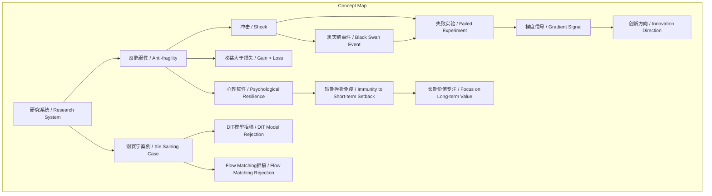
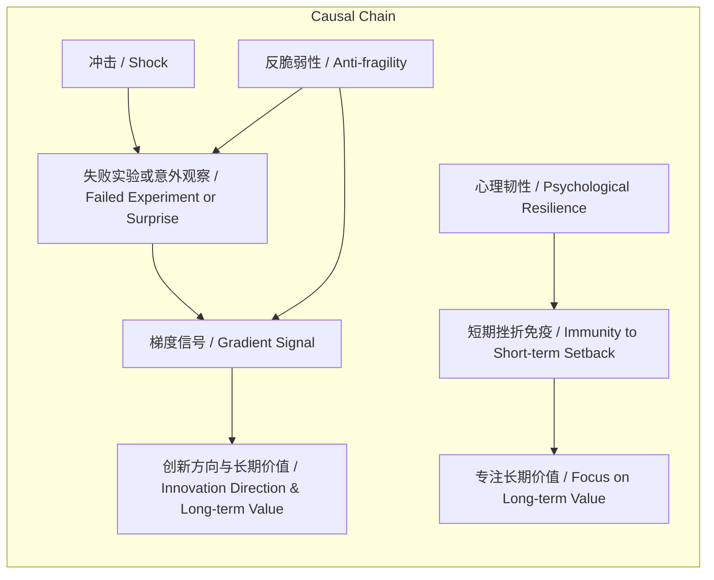

> 谢赛宁基于塔勒布理论，论证科研系统必须为反脆弱系统，以从不确定性冲击中获益并专注长期价值。

## 元信息
- 分类：`ai-software/models-research`
- 优先级：`high` (`13`)
- 文档类型：`text-summary`
- 来源分组：`news`
- 原始文件：`reports/news/2026-03-20/1774021936280-news-news-task-1774021872137-sokopl.md`
- 请求 ID：`1774021872137-sokopl`

## 原始内容

#### 文本总结

### 研究系统必须具备反脆弱性

#### 整体结构化文档表达
##### 文档卡片
- 主题（中文/English）：研究系统反脆弱性 / Research System Anti-fragility
- 一句话摘要：谢赛宁基于塔勒布理论，论证科研系统必须为反脆弱系统，以从不确定性冲击中获益并专注长期价值。
- 目标读者：未提及
- 核心结论（3条）：
  1. 科研本质充满高度不确定性与随机挫折，必须构建反脆弱系统。
  2. 反脆弱核心在于从冲击中获得的收益大于损失，失败实验可提供关键梯度信号。
  3. 对短期挫折免疫、放下执念，是专注研究长期价值的前提。

##### 内容结构树
1. 背景与问题定义：科研环境充满随机“黑天鹅事件”与冲击（如拒稿），脆弱系统易被击倒。
2. 核心观点与关键证据：反脆弱定义（收益>损失）；失败实验提供“梯度信号”；谢赛宁案例（DiT、Flow Matching被拒）。
3. 方法/机制/路径：建立心理韧性，对短期挫折免疫，彻底放下对短期声望的执念。
4. 风险与边界条件：未发现明确内容
5. 结论与行动建议：研究者应主动构建反脆弱系统，将冲击转化为成长机会，聚焦长期价值。

##### 结构化元数据（JSON）
```json
{
  "title": "研究系统必须具备反脆弱性",
  "topic_zh": "研究系统反脆弱性",
  "topic_en": "Research System Anti-fragility",
  "audience": "未提及",
  "claims": [
    "科研本质充满高度不确定性与随机挫折，必须构建反脆弱系统。",
    "反脆弱核心在于从冲击中获得的收益大于损失，失败实验可提供关键梯度信号。",
    "对短期挫折免疫、放下执念，是专注研究长期价值的前提。"
  ],
  "evidence": [
    "科研环境中充满随机‘黑天鹅事件’与冲击（如顶会拒稿）。",
    "谢赛宁的DiT模型与Flow Matching工作曾因‘算法过于简单’被拒稿。",
    "性能大跌的错误实验或意外观察能提供极大信息量的‘梯度信号’。",
    "论文录用与否是巨大随机过程，多次打击后研究者可产生‘免疫’。"
  ],
  "risks": [],
  "actions": [
    "建立心理韧性，从失败和意外中攫取价值。",
    "放弃对短期成败的执念，将精力专注于研究长期价值。"
  ]
}
```

#### 处理流程
1. 输入识别（来源：用户输入文本）
2. 信息抽取（实体、概念、问题、事实、观点）
3. 结构化归纳（定义/分类/比较/因果/方法论）
4. 关系建模（概念关系、等式/方程/逻辑链）
5. 可视化表达（Mermaid）

#### 概念清单（中英文）
- 研究 / Research
- 反脆弱 / Anti-fragile
- 黑天鹅事件 / Black Swan Event
- 冲击 / Shock
- 收益 / Gain
- 损失 / Loss
- 梯度信号 / Gradient Signal
- 心理韧性 / Psychological Resilience
- 短期挫折 / Short-term Setback
- 长期价值 / Long-term Value
- 谢赛宁 / Xie Saining
- 纳西姆·塔勒布 / Nassim Taleb
- DiT模型 / DiT Model
- Flow Matching / Flow Matching
- 顶会 / Top Conference
- 拒稿 / Rejection
- 无信号状态 / No-signal State
- 意外观察 / Surprise
- 随机过程 / Random Process

#### 概念定义（中英文）
- 研究 / Research：指系统的探究活动，旨在发现新知识或验证理论，过程中充满不确定性与随机挫折。
- 反脆弱 / Anti-fragile：指系统在随机事件或冲击下，不仅不受损害，反而能从中获益的特性，即收益大于损失。
- 黑天鹅事件 / Black Swan Event：指罕见、不可预测且影响巨大的事件，在科研中表现为突发性拒稿或实验意外。
- 冲击 / Shock：指科研过程中遭遇的意料之外的负面事件，如论文被拒或实验失败。
- 收益 / Gain：指从冲击中获得的正面价值，如新发现或方向指引。
- 损失 / Loss：指冲击直接造成的负面后果，如时间浪费或信心受挫。
- 梯度信号 / Gradient Signal：指失败实验或意外观察提供的、具有高信息量的反馈，能指引创新方向。
- 心理韧性 / Psychological Resilience：指研究者对短期挫折的免疫能力，能保持专注并从中成长。
- 短期挫折 / Short-term Setback：指论文录用与否等即时成败结果，具有高度随机性。
- 长期价值 / Long-term Value：指研究本身的基础性贡献或深远影响，超越短期评价。
- 谢赛宁 / Xie Saining：研究者，提出研究系统需反脆弱，并以自身经历（DiT、Flow Matching被拒）为例。
- 纳西姆·塔勒布 / Nassim Taleb：思想家，提出“反脆弱”概念。
- DiT模型 / DiT Model：谢赛宁发表的有影响力的研究模型，曾因“算法过于简单”被顶会拒稿。
- Flow Matching / Flow Matching：谢赛宁后续研究工作，同样经历拒稿。
- 顶会 / Top Conference：指计算机科学等领域的高水平学术会议，论文录用竞争激烈。
- 拒稿 / Rejection：指论文未被学术会议或期刊录用的决定。
- 无信号状态 / No-signal State：指实验结果“不好不差”，未提供有效反馈的停滞状态，是科研中最糟糕情况。
- 意外观察 / Surprise：指实验中出现的、与预期不符的异常现象。
- 随机过程 / Random Process：指论文录用与否等结果受多重随机因素影响，非完全可控。

#### 概念关联与逻辑关系（中英文）
1. 冲击（Shock）与失败实验（Failed Experiment）共同导致梯度信号（Gradient Signal）：Shock + Failed Experiment → Gradient Signal
2. 反脆弱性（Anti-fragility）使研究者（Researcher）能够从黑天鹅事件（Black Swan Event）中获益：Anti-fragility(Researcher) × Black Swan Event → Net Gain
3. 短期挫折（Short-term Setback）的免疫（Immunity）促进长期价值（Long-term Value）的专注：Immunity(Short-term Setback) → Focus(Long-term Value)

#### COT逻辑梳理（定义/分类/比较/因果/科学方法论）
- **Step 1: 定义**：基于塔勒布理论，定义“反脆弱”为系统从随机冲击中获益的能力（收益>损失），区别于“脆弱”（受损）和“强韧”（不变）。
- **Step 2: 分类**：将科研冲击分为“黑天鹅事件”（罕见重大拒稿）与常规挫折（如评审意见），并分类失败实验为“性能大跌”与“意外观察”。
- **Step 3: 比较**：比较“脆弱系统”（被冲击击倒）、“强韧系统”（抵抗冲击）与“反脆弱系统”（从冲击获益）在科研中的表现差异。
- **Step 4: 因果**：建立因果链：冲击（如拒稿）→ 失败实验/意外观察 → 提供梯度信号 → 指引创新方向 → 实现长期价值。反脆弱性作为调节变量，放大收益路径。
- **Step 5: 科学方法论**：提出“失败即数据”方法论，将实验失败和拒稿视为高信息量反馈（梯度信号），通过系统性分析转化为研究进展，符合迭代优化原则。

#### 事实与看法（病毒）
##### 事实
- 谢赛宁在发表DiT模型和Flow Matching工作期间，曾因“算法设计过于简单”被顶会拒稿。
- 科研环境中存在随机的“黑天鹅事件”与冲击。
- 论文录用与否是一个巨大的随机过程。
- 性能大跌的错误实验或令人惊讶的意外观察能提供信息量高的反馈。
##### 看法
- 研究必须是一个“反脆弱”的系统。
- 科研的本质充满了高度的不确定性和随机的挫折。
- 研究者必须学会从意外的打击中获益。
- 反脆弱的核心是从冲击中获得的收益必须大于损失。
- 最糟糕的情况不是实验失败，而是停留在“不好不差”的无信号状态。
- 从失败和意外中攫取巨大价值的能力是反脆弱的体现。
- 反脆弱系统能帮助研究者建立强大的心理韧性，对挫折产生“免疫”。
- 研究者不应在乎某一个时间点上的成败，而应从冲击中获得成长，放下对短期声望或论文录用的执念，专注于研究本身的长期价值。

#### FAQ（原文问题整理）
- 未发现明确提问（原文为论述性文本，未包含直接问题）

#### Visualization
##### Mermaid 图 1（概念结构图）


##### Mermaid 图 2（逻辑/因果图）


#### 文章中的类比
- 未发现明确类比（原文借用塔勒布概念，但未使用类比修辞）

#### 10个金句
1. “研究必须是一个‘反脆弱’的系统”
2. “科研的本质充满了高度的不确定性和随机的挫折”
3. “研究者必须学会从意外的打击中获益”
4. “科研环境中充满了随机的‘黑天鹅事件’与冲击”
5. “如果一个研究者或组织是‘脆弱’的，就会立刻被这种突如其来的冲击击倒”
6. “反脆弱的核心：从冲击中获得的收益必须大于损失”
7. “最糟糕的情况不是实验失败，而是停留在‘不好不差’的无信号状态”
8. “一个导致性能大跌的错误实验或者一个令人惊讶的意外观察，反而能给研究者提供极大信息量的‘梯度信号’”
9. “这种从失败和意外中攫取巨大价值的能力，正是反脆弱的体现”
10. “论文的中与不中，在很大程度上是一个巨大的随机过程”
11. “反脆弱的系统能够帮助研究者建立强大的心理韧性”
12. “研究者不应该在乎某一个时间点上的成败，而是要从这种冲击中获得成长”
13. “彻底放下对短期声望或论文录用与否的执念，从而将精力完全专注于研究本身的长期价值”
（注：原文提供超过10条金句，以上选取最具代表性者；若需严格10条，可截取前10条）
