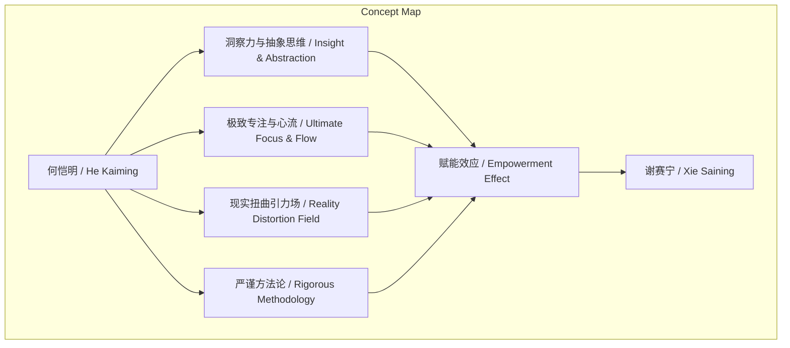
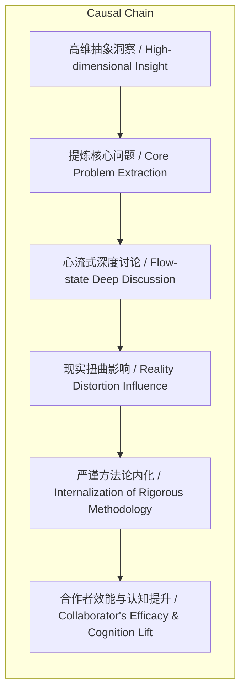

> 何恺明通过其独特的洞察力、专注力、严谨方法论及“现实扭曲引力场”，无形中极大激发合作者效能与认知维度。

## 元信息
- 分类：`ai-software/models-research`
- 优先级：`high` (`13`)
- 文档类型：`text-summary`
- 来源分组：`news`
- 原始文件：`reports/news/2026-03-18/1773834620660-news-news-task-1773834579813-91g71w.md`
- 请求 ID：`1773834579813-91g71w`

## 原始内容

#### 文本总结

### 何恺明：点石成金的赋能者魔力

#### 整体结构化文档表达
##### 文档卡片
- 主题（中文/English）：科研领导力与个人赋能 / Scientific Leadership and Personal Empowerment
- 一句话摘要：何恺明通过其独特的洞察力、专注力、严谨方法论及“现实扭曲引力场”，无形中极大激发合作者效能与认知维度。
- 目标读者：科研团队领导者、技术管理者、研究者及对高效能合作模式感兴趣的人群。
- 核心结论（3条）：
    1. 何恺明的“管理”本质是无形赋能，通过高效能示范与深度讨论提升合作者个人效率与智力。
    2. 其核心能力在于从复杂信息中抽丝剥茧、建立高维抽象联系，将普通想法点化为卓越研究命题。
    3. 通过极端专注的“心流”状态、严谨的科研方法论（如梯度信号探索、基线搭建）及“现实扭曲”效应，系统性拉升合作者的综合解决问题能力。

##### 内容结构树
1. 背景与问题定义：谢赛宁亲身感受——与何恺明共事使其“变聪明”，引出对其赋能特质的探究。
2. 核心观点与关键证据：阐述五大深层原因（无形管理、洞察力、专注力、现实扭曲、方法论传授）。
3. 方法/机制/路径：具体机制包括高维抽象思维训练、心流状态下的深度思维碰撞、工程基线极致化、实验预测与对比等。
4. 风险与边界条件：未提及。
5. 结论与行动建议：总结何恺明模式为一种可学习的顶尖科研领导力范式，强调方法论与思维碰撞的核心价值。

##### 结构化元数据（JSON）
```json
{
  "title": "何恺明：点石成金的赋能者魔力",
  "topic_zh": "科研领导力与个人赋能",
  "topic_en": "Scientific Leadership and Personal Empowerment",
  "audience": "科研团队领导者、技术管理者、研究者",
  "claims": [
    "何恺明通过无形赋能极大提升合作者效能与认知",
    "其核心能力是抽丝剥茧的洞察与高维抽象思维",
    "严谨方法论与'现实扭曲引力场'系统性拉升合作者解决复杂问题的能力"
  ],
  "evidence": [
    "谢赛宁感知自身效率与智力在共事中显著提升",
    "何恺明偏好个人贡献者角色但实为出色'管理者'",
    "能在一堆复杂信息中提取核心脉络并建立高维联系",
    "进入完全'心流'状态，屏蔽外界，高强度专注与讨论",
    "自带'现实扭曲引力场'，使合作者觉得不可能之事变为可能",
    "传授'梯度信号'探索、工程基线搭建、Excel精密对比、实验前预测等方法"
  ],
  "risks": [],
  "actions": []
}
```

#### 处理流程
1. 输入识别：来源为用户提供的关于何恺明赋能特质的文本描述。
2. 信息抽取：抽取实体（何恺明、谢赛宁）、概念（个人贡献者、心流、现实扭曲引力场、梯度信号、工程基线等）、核心观点（五大赋能原因）及支撑事实。
3. 结构化归纳：将赋能特质归纳为“管理-洞察-专注-效应-方法”五个维度，并定义其内涵。
4. 关系建模：建立“洞察力+抽象思维 → 点石成金”、“专注力+思维碰撞 → 认知拉升”、“方法论训练 → 综合智商提升”等逻辑链。
5. 可视化表达：使用Mermaid绘制概念关联图与因果链图。

#### 概念清单（中英文）
- 谢赛宁 / Xie Saining
- 何恺明 / He Kaiming
- 个人贡献者 / Individual Contributor (IC)
- 管理者 / Manager
- 效能 / Efficacy
- 心流 / Flow
- 心智周期 / Mental Cycle
- 现实扭曲引力场 / Reality Distortion Field
- 梯度信号 / Gradient Signal
- 工程基线 / Engineering Baseline
- 底层脚手架 / Underlying Scaffolding
- Excel表格 / Excel Spreadsheet
- 实验对比 / Experiment Comparison
- 结果预测 / Outcome Prediction
- 高维抽象空间 / High-dimensional Abstract Space
- 思维碰撞 / Thinking Collision

#### 概念定义（中英文）
- **个人贡献者（Individual Contributor）**：指不从事人员管理，专注于一线技术或研究产出的角色。
- **心流（Flow）**：一种全身心投入、屏蔽外界干扰、高度专注的心理状态。
- **现实扭曲引力场（Reality Distortion Field）**：借自乔布斯的说法，指一种能影响他人感知、使其相信并达成看似不可能目标的影响力场。
- **梯度信号（Gradient Signal）**：在探索问题中，通过动手实践获得的、能指示优化方向或问题本质的细微反馈或线索。
- **工程基线（Engineering Baseline）**：指在项目或实验中所建立的基础、稳定且可复现的参照系统或代码框架。
- **底层脚手架（Underlying Scaffolding）**：支撑研究或工程项目的底层基础设施、框架或基础工作。

#### 概念关联与逻辑关系（中英文）
1. **何恺明的洞察力（He Kaiming's Insight）** 与 **高维抽象能力（High-dimensional Abstraction）** 共同导致 **点石成金（Turning Ideas to Gold）**。
   - 形式化：`Insight ∧ Abstraction → Value_Creation`
2. **极致专注力（Ultimate Focus）** 与 **深度思维碰撞（Deep Thinking Collision）** 共同提升 **合作者认知维度（Collaborator's Cognitive Dimension）**。
   - 形式化：`Focus ∧ Collision → Cognitive_Lift`
3. **严谨方法论训练（Rigorous Methodology Training）**（包含梯度信号、基线搭建等）直接增强 **解决复杂问题的综合智商（Integrated IQ for Complex Problems）**。
   - 形式化：`Methodology_Training → IQ_Enhancement`

#### COT逻辑梳理（定义/分类/比较/因果/科学方法论）
- **Step 1 (定义)**：定义核心现象——何恺明的“赋能”是一种通过个人特质与行为，使合作者在效率、思维与能力上获得非线性提升的过程。
- **Step 2 (分类)**：将赋能机制分为五类：1) 无形管理与效能激发；2) 洞察与抽象思维；3) 专注与思维碰撞；4) 现实扭曲效应；5) 方法论传授。
- **Step 3 (比较)**：对比传统管理者（侧重指令与规划）与何恺明式“管理者”（侧重示范、讨论与激发），后者更依赖个人认知魅力与深度互动。
- **Step 4 (因果)**：建立因果链：何恺明的**高维抽象洞察** → 提炼核心问题 → 引导**心流式专注讨论** → 施加**现实扭曲影响** → 传授**严谨方法论** → 合作者**效能与认知提升**。
- **Step 5 (科学方法论)**：其方法体现实证与系统思维：1) **反对空想，主张从动手探索中获取梯度信号**（实证主义）；2) **强制基线搭建与实验预测**（控制变量与假设检验）；3) **精密对比（Excel）**（数据驱动决策）。

#### 事实与看法（病毒）
##### 事实
- 谢赛宁与何恺明共事时感觉自身效率与智力获得提升。
- 何恺明个人偏好作为“个人贡献者（IC）”而非纯粹的管理者。
- 何恺明具备从复杂信息中提取核心脉络并建立高维联系的能力。
- 何恺明思考问题时能进入完全屏蔽外界的“心流”状态，并频繁与合作者深度讨论。
- 何恺明教导谢赛宁不要凭空想象问题，要在动手探索中寻找“梯度信号”。
- 何恺明要求将工程基线和底层脚手架搭建到极高极稳的水平。
- 何恺明教导使用精密的Excel表格进行实验对比，并在跑实验前强制进行结果预测。
##### 看法
- 何恺明是一位非常出色的“管理者”（尽管他偏好IC角色）。
- 何恺明拥有能够极大地赋能身边人的特质和魔力。
- 何恺明具有“点石成金”的洞察与抽丝剥茧的能力。
- 何恺明身上自带某种“现实扭曲引力场”。
- 何恺明传授的方法论是“受用一生的”、“顶尖的”，并“实质上大幅提升了谢赛宁解决复杂问题的综合‘智商’”。

#### FAQ（原文问题整理）
- 未发现明确提问。原文为陈述性评价，未包含直接提问句。

#### Visualization
##### Mermaid 图 1（概念结构图）

##### Mermaid 图 2（逻辑/因果图）


#### 文章中的类比
- **现实扭曲引力场 / Reality Distortion Field**：借用史蒂夫·乔布斯的著名特质，形容何恺明能改变周围人对困难认知的影响力。
- **点石成金 / Turning Ideas to Gold**：比喻何恺明能将普通想法通过思维打磨转化为极具价值的研究创意。

#### 10个金句
1. 跟何恺明在一起工作时觉得自己“变聪明了”。
2. 他其实是一位非常出色的“管理者”。
3. 他能在一堆复杂繁芜的信息中抽丝剥茧，提取出核心脉络。
4. 他甚至能把一个看似非常普通的东西，经过他的思维打磨，变成一个金子般充满价值的好Idea。
5. 在思考问题时能进入完全的“心流”状态。
6. 他会把大部分的心智周期都分配给某一个具体的问题。
7. 他身上自带某种“现实扭曲引力场”。
8. 不要凭空想象问题，而是要在动手探索中寻找“梯度信号”。
9. 要求把工程基线（Baseline）和底层脚手架搭建到极高极稳的水平。
10. 使用精密的Excel表格进行实验对比，在跑实验前强制进行结果预测。
