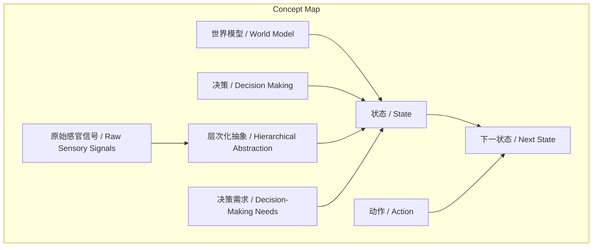
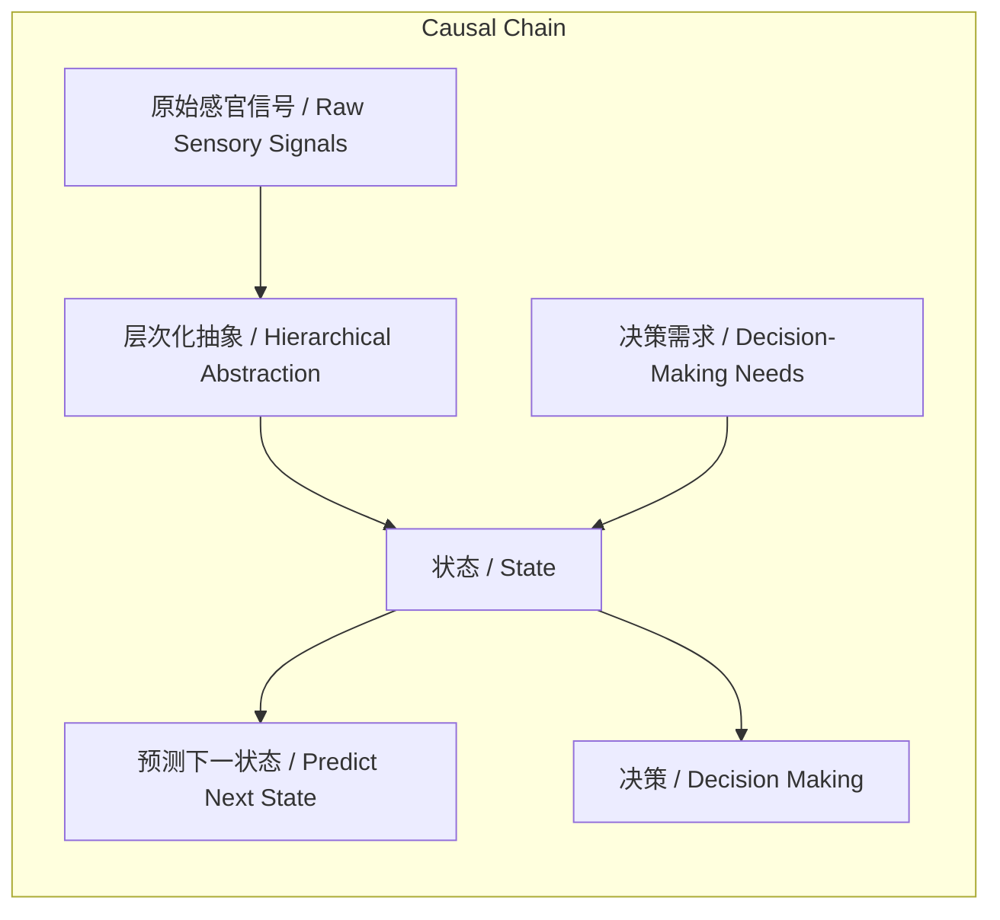

> State是世界模型中面向决策的最少有效信息层次化抽象。

## 元信息
- 分类：`ai-software/models-research`
- 优先级：`high` (`13`)
- 文档类型：`text-summary`
- 来源分组：`news`
- 原始文件：`reports/news/2026-03-21/1774058893441-news-news-task-1774058838945-p769ol.md`
- 请求 ID：`1774058838945-p769ol`

## 原始内容

#### 文本总结

### 世界模型中的State：决策导向的抽象表征

#### 整体结构化文档表达
##### 文档卡片
- 主题（中文/English）：世界模型中的状态概念 / State Concept in World Models
- 一句话摘要：State是世界模型中面向决策的最少有效信息层次化抽象。
- 目标读者：人工智能研究者、世界模型开发者、决策理论学者
- 核心结论（3条）：
  1. State是系统在特定时刻的环境切片，世界模型基于当前state和action预测下一state。
  2. State不是物理环境的完整复刻，而是满足决策需求的最少有效信息。
  3. State的构建本质是表征学习，通过层次化抽象从原始信号中提取对决策最有意义的表征。

##### 内容结构树
1. 背景与问题定义：世界模型需要预测下一状态，但物理世界细节无限，如何定义有效的State？
2. 核心观点与关键证据：State是系统当前快照；State是最少有效信息；State信息量取决于决策需求；State是层次化抽象结果。
3. 方法/机制/路径：通过表征学习，从原始感官信号进行层次化抽象，提取State。
4. 风险与边界条件：未提及
5. 结论与行动建议：State是决策导向的核心抽象，构建State需聚焦决策相关特征。

##### 结构化元数据（JSON）
```json
{
  "title": "世界模型中的State：决策导向的抽象表征",
  "topic_zh": "世界模型中的状态概念",
  "topic_en": "State Concept in World Models",
  "audience": "人工智能研究者、世界模型开发者、决策理论学者",
  "claims": [
    "State是系统在特定时刻的环境切片，世界模型基于当前state和action预测下一state。",
    "State不是物理环境的完整复刻，而是满足决策需求的最少有效信息。",
    "State的构建本质是表征学习，通过层次化抽象从原始信号中提取对决策最有意义的表征。"
  ],
  "evidence": [
    "世界模型的底层预测架构是基于当前的state以及智能体施加的动作去预测系统下一步的state。",
    "State是能够描述一个系统状态的最少信息来源。",
    "State的构建本质上直接等同于表征学习的结果。"
  ],
  "risks": [],
  "actions": []
}
```

#### 处理流程
1. 输入识别（来源：用户输入文本）
2. 信息抽取（实体、概念、问题、事实、观点）
3. 结构化归纳（定义/分类/比较/因果/方法论）
4. 关系建模（概念关系、等式/方程/逻辑链）
5. 可视化表达（Mermaid）

#### 概念清单（中英文）
- 世界模型 / World Model
- 状态 / State
- 系统 / System
- 物理环境 / Physical Environment
- 智能体 / Agent
- 动作 / Action
- 预测 / Prediction
- 大语言模型 / Large Language Model
- 预测下一个词 / Predict Next Word
- 预测下一个状态 / Predict Next State
- 最少有效信息 / Minimal Descriptions
- 决策需求 / Decision-Making Needs
- 表征学习 / Representation Learning
- 原始感官信号 / Raw Sensory Signals
- 层次化抽象 / Hierarchical Abstraction
- 决策 / Decision Making

#### 概念定义（中英文）
- 世界模型 / World Model：一种预测架构，基于当前状态（state）和智能体施加的动作（action）来预测系统下一步的状态（state）。
- 状态 / State：系统或物理环境在特定时刻的特定状态，是能够描述系统状态的最少信息来源，取决于智能体的决策需求，是层次化抽象的表征。
- 系统 / System：被世界模型所建模的物理环境或实体。
- 物理环境 / Physical Environment：系统所处的客观世界，包含无限细节。
- 智能体 / Agent：在世界模型中施加动作并利用状态进行决策的实体。
- 动作 / Action：智能体对系统施加的影响，用于预测下一状态。
- 预测 / Prediction：世界模型的核心功能，基于当前state和action预测下一state。
- 大语言模型 / Large Language Model：以预测下一个词为核心的语言模型。
- 预测下一个词 / Predict Next Word：大语言模型的核心任务。
- 预测下一个状态 / Predict Next State：世界模型的核心任务。
- 最少有效信息 / Minimal Descriptions：能够描述系统状态所需的最少信息来源，排除不重要的噪音。
- 决策需求 / Decision-Making Needs：智能体需要解决的问题，决定了state需要包含的信息量。
- 表征学习 / Representation Learning：从原始感官信号中提取抽象表征的过程，state的构建本质等同于表征学习的结果。
- 原始感官信号 / Raw Sensory Signals：系统摄入的海量初始信号，如像素、声音等。
- 层次化抽象 / Hierarchical Abstraction：在统计学意义上逐层迭代与抽象，从原始信号中提取高层特征的过程。
- 决策 / Decision Making：智能体基于state采取行动的过程，state的构建最终服务于决策。

#### 概念关联与逻辑关系（中英文）
- State(状态) + Action(动作) --> Next State(下一状态)  [预测下一状态]
- Raw Sensory Signals(原始感官信号) --通过--> Hierarchical Abstraction(层次化抽象) --> State(状态)  [构建state]
- Decision-Making Needs(决策需求) --> 决定 State(状态)的信息量  [信息量取决于决策需求]

#### COT逻辑梳理（定义/分类/比较/因果/科学方法论）
Step 1: 定义State为系统在特定时刻的环境切片，是世界模型预测下一状态的基础。
Step 2: 分类State不是物理环境的完整复刻，而是抽象表征，排除无关细节。
Step 3: 比较State与像素级描述：State是“最少有效信息”，像素级描述是“巨细无遗”但无用。
Step 4: 因果：决策需求决定State的信息量，因为不同任务需要不同抽象层次。
Step 5: 科学方法论：State的构建通过表征学习实现，即从原始信号进行层次化抽象，提取对决策最有意义的特征。

#### 事实与看法（病毒）
##### 事实
- 谢赛宁提出“世界模型”体系。
- “State”是世界模型中的核心基础概念。
- 世界模型的底层预测架构是基于当前state和action预测下一state。
- 大语言模型的核心是预测下一个词。
- 物理世界充满无限细节。
- 智能体的决策需要state作为输入。

##### 看法
- State是能够描述一个系统状态的最少信息来源。
- 试图重建所有物理细节是“极其愚蠢”的。
- 物理细节对决策而言大多是“不重要的噪音”。
- State的信息量取决于智能体需要解决的具体问题。
- State的构建本质上等同于表征学习的结果。
- State是世界模型经过信息过滤后留存的核心物理世界抽象。

#### FAQ（原文问题整理）
原文未发现明确提问句，均为陈述句。

#### Visualization
##### Mermaid 图 1（概念结构图）


##### Mermaid 图 2（逻辑/因果图）


#### 文章中的类比
未发现明确类比。

#### 10个金句
1. “State 并不是对物理环境巨细无遗的像素级复刻。”
2. “State 是能够描述一个系统状态的最少信息来源（minimal descriptions）。”
3. “真实的物理世界充满了无限的细节……如果我们试图在底层一比一地去重建和刻画所有细节 不仅行不通 而且极其愚蠢。”
4. “对于智能体的决策而言 绝大多数繁杂的物理细节都是不重要的噪音。”
5. “一个 state 到底需要包含多大的信息量 完全取决于智能体需要解决什么样的 [问题]。”
6. “State 的构建本质上直接等同于表征学习（Representation Learning）的结果。”
7. “系统摄入海量的原始感官信号后 需要像流体力学抽象分子运动一样 在统计学意义上进行一层一层的迭代与抽象。”
8. “最终提取出来的 state 就是那些对智能体做决策（decision making）最有意义、最有价值的抽象表征。”
9. “State 是世界模型经过极其强大的信息过滤后 为指导行动和决策而留存下来的核心物理世界抽象。”
10. “大语言模型的核心是‘预测下一个词（predict next word）’ 而世界模型的核心则是‘预测下一个状态（predict next state）’。”
