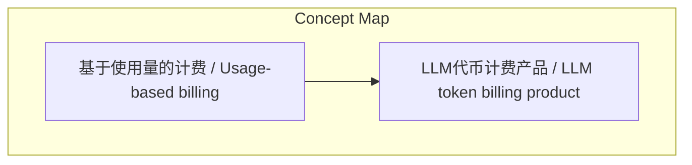
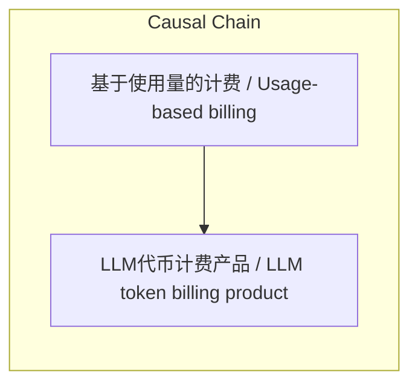

> Stripe提供两种计费方式：通用基于使用量的计费适用于各种业务指标，而LLM代币计费产品则专门针对大语言模型（LLM）的Token消耗，两者在AI时代的应用场景不同。

## 元信息
- 分类：`ai-software/models-research`
- 优先级：`high` (`13`)
- 文档类型：`text-summary`
- 来源分组：`news`
- 原始文件：`reports/news/2026-03-27/1774605503394-news-news-task-1774605437960-vx9td8.md`
- 请求 ID：`1774605437960-vx9td8`

## 原始内容

#### 文本总结

##### 运行信息
- model: openrouter/free
- schema_fallback: no
- attempted_models: openrouter/free

### Stripe的AI计费方法

#### 整体结构化文档表达
##### 文档卡片
- 主题（中文/English）：Stripe的AI计费方法 / Stripe's AI billing methods
- 一句话摘要：Stripe提供两种计费方式：通用基于使用量的计费适用于各种业务指标，而LLM代币计费产品则专门针对大语言模型（LLM）的Token消耗，两者在AI时代的应用场景不同。
- 目标读者：AI企业
- 核心结论（3条）：
- LLM代币计费产品是Stripe针对大语言模型时代Token即货币特性的新产品
- 基于使用量的计费是传统、通用计费框架
- LLM代币计费产品是垂直细分工具，解决AI企业根据Token数量计费需求

##### 内容结构树
1. 背景与问题定义
2. 核心观点与关键证据
3. 方法/机制/路径
4. 风险与边界条件
5. 结论与行动建议

##### 结构化元数据（JSON）
```json
{
  "title": "Stripe的AI计费方法",
  "topic_zh": "Stripe的AI计费方法",
  "topic_en": "Stripe's AI billing methods",
  "audience": "AI企业",
  "claims": [
    "LLM代币计费产品是Stripe针对大语言模型时代Token即货币特性的新产品"
  ],
  "evidence": [
    "访谈中没有对这两者的技术细节进行深度对比",
    "结合他后续对 AI 消费模式的讨论",
    "Steve 指出在使用大模型时“代币（Token）”和支撑它的真实货币之间的关系变得“前所未有地紧密”"
  ],
  "risks": [
    "未提及"
  ],
  "actions": [
    "生成最终结构化总结对象"
  ]
}
```

#### 处理流程
1. 输入识别
2. 信息抽取（实体、概念、问题、事实、观点）
3. 结构化归纳（定义/分类/比较/因果/方法论）
4. 关系建模（概念关系、等式/方程/逻辑链）
5. 可视化表达（Mermaid）

#### 概念清单（中英文）
- 基于使用量的计费 / Usage-based billing
- LLM代币计费产品 / LLM token billing product

#### 概念定义（中英文）
##### 基于使用量的计费 / Usage-based billing
- 中文定义：这是一种相对广泛的计费大类（即“按量付费”）。客户不再支付固定的订阅费，而是根据他们实际消耗的基础服务量来付费。
- English Definition: Usage-based billing is a broad category of pay-as-you-go pricing where customers pay based on actual consumption of services.

##### LLM代币计费产品 / LLM token billing product
- 中文定义：这是 Stripe 刚刚宣布推出的一个处于 Beta（测试）阶段的新产品，它是专门针对大语言模型（LLM）的“代币（Token）”这一特定消耗单位定制的计费方案。
- English Definition: LLM token billing product is a new beta product from Stripe specifically designed for large language models (LLM) with a focus on token consumption.


#### 概念关联与逻辑关系（中英文）
- 基于使用量的计费/Usage-based billing -> LLM代币计费产品/LLM token billing product | support | LLM代币计费产品是其垂直细分工具

##### 可形式化关系
- LLM代币计费产品是基于使用量的计费的垂直细分工具
- LLM代币计费产品针对大语言模型（LLM）的Token消耗
- 基于使用量的计费适用于通用业务指标

#### COT逻辑梳理（定义/分类/比较/因果/科学方法论）
- Step 1: 介绍两种计费方式的基本定义
- Step 2: 分析两者核心区别
- Step 3: 总结两者在AI时代的应用场景

#### 事实与看法（区分）
##### 事实
- 基于使用量的计费适用于各种通用业务指标（如API调用次数、计算时间、存储空间）
- LLM代币计费产品处于Beta测试阶段
- LLM代币计费产品专门针对大语言模型（LLM）

##### 看法
- LLM代币计费产品是Stripe在AI时代针对Token即货币特性的创新工具

#### FAQ（原文问题整理）
##### 技术细节对比
- 未提及

#### Visualization
##### Mermaid 图 1（概念结构图）


##### Mermaid 图 2（逻辑/因果图）


#### 文章中的类比
- 基于使用量的计费是传统计费模式，LLM代币计费是针对生成式AI的垂直细分工具

#### 10个金句
- Steve 指出在使用大模型时“代币（Token）”和支撑它的真实货币之间的关系变得“前所未有地紧密”
