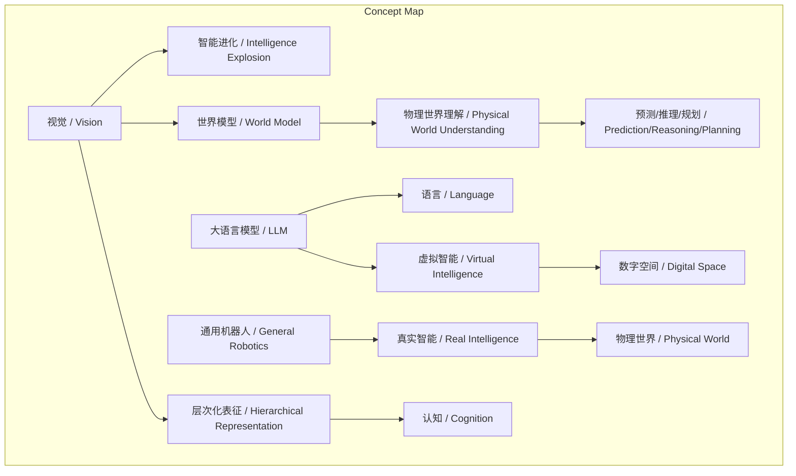
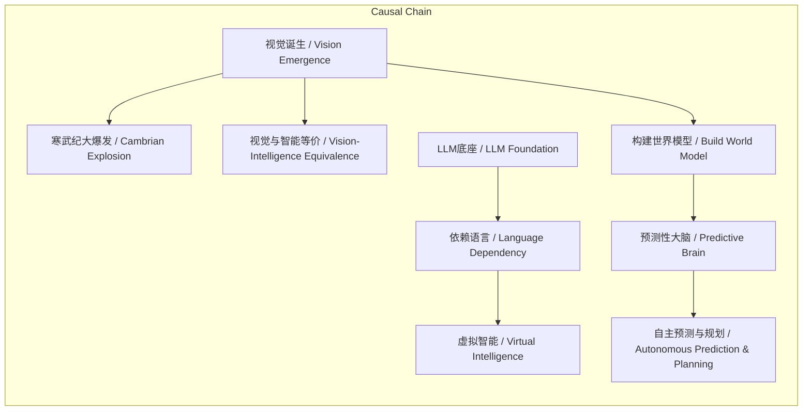

> 谢赛宁提出视觉与智能本质等价，视觉是驱动生物智能进化、构建AI世界模型并使其从虚拟走向物理世界的绝对基石。

## 元信息
- 分类：`ai-software/models-research`
- 优先级：`high` (`14`)
- 文档类型：`text-summary`
- 来源分组：`news`
- 原始文件：`reports/news/2026-03-20/1774015565684-news-news-task-1774015501589-67f1am.md`
- 请求 ID：`1774015501589-67f1am`

## 原始内容

#### 文本总结

### 视觉即智能：谢赛宁论AI的物理世界基石

#### 整体结构化文档表达
##### 文档卡片
- 主题（中文/English）：视觉与智能体的等价关系 / The Equivalence between Vision and Agent
- 一句话摘要：谢赛宁提出视觉与智能本质等价，视觉是驱动生物智能进化、构建AI世界模型并使其从虚拟走向物理世界的绝对基石。
- 目标读者：人工智能研究者、科技政策制定者、对AGI发展路径感兴趣的专业人士与爱好者。
- 核心结论（3条）：
    1.  视觉与智能存在深刻等价关系，解决视觉本质是解决智能本身。
    2.  当前大语言模型（LLM）智能体是依赖低带宽语言的“虚拟智能”，缺乏真实物理世界理解与行动能力。
    3.  基于高带宽视觉信号构建“世界模型”是智能体成为“预测性大脑”、实现物理世界自主预测与规划的关键路径。

##### 内容结构树
1.  **背景与问题定义**：AI发展路径分歧——基于语言的虚拟智能（LLM）与基于视觉/物理交互的真实智能（机器人）之争；核心问题是智能的本质与基石是什么。
2.  **核心观点与关键证据**：
    -   **进化视角**：视觉诞生驱动了寒武纪生物智能大爆发；眼睛是暴露于物理世界的大脑部分，视觉智能演进等同于大脑心智演进。
    -   **认知本质**：计算机视觉是处理真实物理世界（连续、高维、有噪音信号）的视角，要求层次化表征与并行处理，这正是高级智能核心。
    -   **真实 vs 虚拟**：LLM基于低带宽、高度压缩的语言，是“虚拟智能”或“拄拐杖”；真实智能体（如机器人）必须处理视觉流、进行空间认知与物理预测。
    -   **世界模型**：世界模型是智能体的“预测性大脑”，通过高带宽视觉传感器过滤噪音，形成对物理世界的理解，实现无语言提示的自发预测、推理与规划。
3.  **方法/机制/路径**：通过构建以视觉等高带宽信号为输入、能进行层次化表征与因果推理的“世界模型”，打造智能体的“预测性大脑”。
4.  **风险与边界条件**：过度依赖语言模型（LLM）作为底座，将导致智能体永远无法在真实物理世界中有效行动，局限于数字空间的“虚拟对话框”。
5.  **结论与行动建议**：视觉是智能的基石，研究重心应从纯语言模型转向以视觉为核心的物理世界模型与具身智能，以实现从“虚拟”到“真实”的跨越。

##### 结构化元数据（JSON）
```json
{
  "title": "视觉即智能：谢赛宁论AI的物理世界基石",
  "topic_zh": "视觉与智能体的等价关系",
  "topic_en": "The Equivalence between Vision and Agent",
  "audience": "人工智能研究者、科技政策制定者、AGI发展路径关注者",
  "claims": [
    "视觉与智能存在深刻等价关系，解决视觉本质是解决智能本身。",
    "当前大语言模型（LLM）智能体是依赖低带宽语言的“虚拟智能”，缺乏真实物理世界理解与行动能力。",
    "基于高带宽视觉信号构建“世界模型”是智能体成为“预测性大脑”、实现物理世界自主预测与规划的关键路径。"
  ],
  "evidence": [
    "寒武纪视觉诞生后，生物为捕食与避敌展开视觉“军备竞赛”，直接导致物种与智能大爆发。",
    "眼睛是大脑的一部分，且是唯一暴露在真实物理世界中的大脑部分。",
    "真实物理世界充满连续、高维、有噪音的信号，智能体必须处理这些信号。",
    "视觉要求建立“层次化表征”并进行大规模并行化处理以掌握因果与物理规律。",
    "语言是高度压缩、脱水、带宽极低的交流工具，是“捷径”甚至“鸦片”。",
    "视觉传感器信息带宽高达每秒10亿比特，远高于语言。"
  ],
  "risks": [
    "智能体过度依赖语言模型作为底座，将如同“拄着拐杖”走路，永远无法在真实物理世界中奔跑。",
    "仅发展LLM可能导致AI陷入数字空间的“虚拟对话框”，无法成为物理世界的“真实行动者”。"
  ],
  "actions": [
    "将研究重心从纯语言模型转向以视觉为核心的物理世界模型构建。",
    "发展通用机器人（Robotics），使其具备处理复杂视觉流、空间认知和物理动态预测的能力。",
    "构建基于连续信号（如视觉）的“世界模型”，使智能体能自发进行预测、推理与规划。"
  ]
}
```

#### 处理流程
1.  **输入识别**：来源为用户提供的关于谢赛宁访谈的文本，主题为视觉与智能体的关系。
2.  **信息抽取**：抽取实体（视觉、智能体、寒武纪、LLM、世界模型等）、概念（等价关系、层次化表征、虚拟智能等）、观点（核心断言与四个维度）、事实（进化论据、技术特征描述）。
3.  **结构化归纳**：将散落的观点归纳为“进化视角”、“认知本质”、“真实vs虚拟”、“世界模型基石”四个逻辑维度；定义核心概念；区分事实与看法。
4.  **关系建模**：建立“视觉 → 智能进化”、“视觉 → 世界模型 → 物理理解”、“LLM+语言 → 虚拟智能”等因果与构成关系。
5.  **可视化表达**：使用Mermaid绘制概念结构图与逻辑因果图。

#### 概念清单（中英文）
-  视觉 / Vision
-  智能体 / Agent
-  寒武纪大爆发 / Cambrian Explosion
-  层次化表征 / Hierarchical Representation
-  大语言模型 / Large Language Model (LLM)
-  数字空间 / Digital Space
-  虚拟智能 / Virtual Intelligence
-  通用机器人 / General-purpose Robotics
-  世界模型 / World Model
-  预测性大脑 / Predictive Brain
-  物理世界理解 / Physical World Understanding
-  预测 / Prediction
-  推理 / Reasoning
-  行为规划 / Planning

#### 概念定义（中英文）
-  **视觉 / Vision**：智能体处理真实物理世界连续、高维、有噪音信号的能力，是建立层次化表征、掌握因果与物理规律的核心感官与认知过程。
-  **智能体 / Agent**：能够感知环境、进行决策并执行物理动作的实体，其高级形式需具备在真实物理世界中自主行动的能力。
-  **寒武纪大爆发 / Cambrian Explosion**：约5.3亿年前，地球生物在视觉诞生后，因捕食与防御压力，物种与智能水平急剧演化的地质历史事件。
-  **层次化表征 / Hierarchical Representation**：通过逐层抽象从原始感官信号（如像素）中提取越来越复杂、语义化特征的信息处理结构，是理解世界的关键。
-  **大语言模型 / Large Language Model (LLM)**：基于海量文本数据训练、以生成离散语言Token为核心能力的统计模型，是当前数字空间虚拟智能的主要底座。
-  **数字空间 / Digital Space**：由离散符号（如文本、代码）构成的虚拟信息环境，与连续的物理世界相对。
-  **虚拟智能 / Virtual Intelligence**：主要依赖低带宽语言信号、在数字空间内运作、缺乏直接物理感知与行动能力的智能形态。
-  **通用机器人 / General-purpose Robotics**：能够像人类一样在多样化物理环境中执行多种任务（如拿刀切菜、端水倒茶）的物理实体。
-  **世界模型 / World Model**：智能体内部构建的、用于基于感官输入（尤其是视觉）预测未来状态、理解物理规律并指导行动的认知模型，是“预测性大脑”的核心。
-  **预测性大脑 / Predictive Brain**：一种以持续预测未来感官输入和状态为核心功能的认知架构，是成熟智能体的标志。
-  **物理世界理解 / Physical World Understanding**：智能体对客观世界中物体属性、相互作用、动态规律等的内在认知与建模能力。
-  **预测 / Prediction**：基于当前状态与内部模型，对未来可能发生的状态或事件进行估计。
-  **推理 / Reasoning**：基于已有知识与规则，推导出新的结论或解决新问题的思维过程。
-  **行为规划 / Planning**：为达成特定目标，在物理空间中序列化设计一系列动作的过程。

#### 概念关联与逻辑关系（中英文）
1.  **视觉(Vision) 驱动 智能进化(Intelligence Evolution)**：视觉的诞生直接触发了生物界的“军备竞赛”，导致了寒武纪大爆发，是智能大爆发的核心引擎。
    `Vision → Intelligence Explosion`
2.  **视觉(Vision) 是构建 世界模型(World Model) 的基石**：世界模型依赖高带宽视觉传感器输入，通过处理连续视觉流来过滤噪音、形成对物理世界的有效表征。
    `Vision → World Model`
3.  **大语言模型(LLM) 与 语言(Language) 共同导致 虚拟智能(Virtual Intelligence)**：LLM以低带宽、离散的语言Token为基础，使智能体局限于数字空间，无法获得物理世界理解与行动能力。
    `LLM + Language → Virtual Intelligence`
4.  **世界模型(World Model) 实现 物理世界理解(Physical World Understanding)**：强大的世界模型使智能体能不依赖人类语言提示，自发理解物理世界并进行预测、推理与规划。
    `World Model → Physical World Understanding`
5.  **层次化表征(Hierarchical Representation) 是 视觉(Vision) 实现 认知(Cognition) 的机制**：视觉通过逐层抽象建立层次化表征，这是处理复杂物理信号、掌握规律并实现高级认知（如推理、规划）的必要方法。
    `Vision → Hierarchical Representation → Cognition`

#### COT逻辑梳理（定义/分类/比较/因果/科学方法论）
-   **Step 1 (定义核心问题)**：定义智能的本质是什么？其基石是语言还是与物理世界直接交互的感知（尤其是视觉）？
-   **Step 2 (分类智能形态)**：将智能体分为两类：A) 基于语言、存在于数字空间的“虚拟智能”（以LLM为代表）；B) 基于物理感知与行动、存在于物理世界的“真实智能”（以通用机器人为目标）。
-   **Step 3 (比较关键差异)**：比较两类智能的核心输入与能力。虚拟智能输入为低带宽离散语言Token，能力限于符号操作与对话；真实智能输入为高带宽连续多模态信号（如视觉），能力需包含空间认知、物理预测与具身行动。
-   **Step 4 (追溯进化因果)**：从生物进化史追溯因果链：视觉(Vision)的出现 → 引发生存竞争（捕食/防御）→ 驱动神经系统与认知能力急剧发展 → 导致寒武纪物种与智能大爆发。证明视觉是智能演化的“原动力”。
-   **Step 5 (提出科学方法论)**：为构建真实智能，提出以“世界模型”为核心的方法论。科学路径是：让智能体通过高带宽视觉传感器持续摄入物理世界信号 → 在内部构建能进行层次化表征与因果推理的“世界模型”（预测性大脑）→ 该模型过滤噪音，输出对决策有用的状态表征 → 最终支持自发的预测、推理与规划行为。此方法论强调从物理世界中直接学习，而非仅从语言数据中学习。

#### 事实与看法（病毒）
##### 事实
-  在5.3亿年前的寒武纪之前，地球生物多在深海生存。
-  视觉诞生后，生物为捕食和躲避天敌在视觉层面展开竞争。
-  眼睛是大脑的一部分，且是唯一暴露在真实物理世界中的大脑部分。
-  真实的物理世界充满连续的、高维度的、有噪音的信号。
-  视觉要求建立“层次化表征”，需要大脑皮层进行大规模并行化处理。
-  语言是人类经过高度压缩、脱水的交流工具，带宽极低。
-  视觉传感器信息带宽可达每秒高达10亿比特。
-  谢赛宁及其团队当前致力于构建“世界模型”。
##### 看法
-  视觉与智能体之间存在着极其深刻的等价关系。
-  “解决视觉不是要解决视觉本身，而是要解决智能本身”。
-  视觉是智能演化的核心引擎，直接导致了物种和智能的“寒武纪大爆发”。
-  视觉智能的演进直接等同于大脑心智的演进。
-  “计算机视觉”不应仅仅被视为一个具体领域，而是一种“视角”和智能的本质总和。
-  当前基于LLM的智能体只是一种存在于数字空间中的“虚拟智能”。
-  如果智能体过度依赖语言模型作为底座，它就如同“拄着拐杖”走路，永远无法在真实的物理世界中奔跑。
-  真正的智能体（如通用机器人）必须能够走进物理世界执行任务。
-  世界模型的本质是为智能体打造一个“预测性大脑”。
-  有了基于视觉等连续信号的强大世界模型，智能体才能真正理解物理世界，并自发地进行预测、推理和行为规划。
-  视觉是构建智能体底层“世界模型”、使其从数字空间的“虚拟对话框”走向物理世界“真实行动者”的绝对基石。

#### FAQ（原文问题整理）
-   **Q：视觉与智能的关系是什么？**
    A：存在极其深刻的等价关系，解决视觉本质就是解决智能本身。视觉是智能演化的核心引擎和本质总和。
-   **Q：为何说视觉驱动了智能大爆发？**
    A：寒武纪视觉诞生后，生物为生存展开视觉“军备竞赛”，直接推动了物种和智能的爆发式增长；且眼睛作为暴露于物理世界的大脑部分，其演进即心智演进。
-   **Q：如何理解视觉代表了处理真实物理世界的能力？**
    A：因为真实物理世界信号连续、高维、有噪音，智能体必须通过视觉建立层次化表征并进行并行处理来掌握因果与规律，这正是高级智能的核心特征。
-   **Q：大语言模型（LLM）智能体有何根本局限？**
    A：LLM基于低带宽、离散的语言，是数字空间的“虚拟智能”，如同“拄拐杖”，无法获得处理物理世界连续信号、进行空间认知和物理预测的能力，故不能成为真实行动者。
-   **Q：什么是“世界模型”？其作用是什么？**
    A：世界模型是智能体的“预测性大脑”，通过高带宽视觉等传感器摄入信息，过滤噪音，形成对物理世界的有效表征，使智能体能自发预测未来、推理并规划行动，无需依赖人类语言提示。

#### Visualization
##### Mermaid 图 1（概念结构图）


##### Mermaid 图 2（逻辑/因果图）


#### 文章中的类比
-  未发现明确类比。

#### 10个金句
1.  解决视觉不是要解决视觉本身，而是要解决智能本身。
2.  视觉是智能演化的核心引擎。
3.  眼睛其实是大脑的一部分，而且是唯一暴露在真实物理世界中的大脑部分。
4.  计算机视觉不应仅仅被视为一个具体的领域，而是一种“视角”和智能的本质总和。
5.  语言是人类经过高度压缩、脱水的交流工具（带宽极低），它是一种“捷径”甚至“鸦片”。
6.  如果智能体过度依赖语言模型作为底座，它就如同“拄着拐杖”走路，虽然能走，但永远无法在真实的物理世界中奔跑。
7.  真正的智能体（如通用机器人）必须能够走进物理世界执行。
8.  世界模型的本质就是为智能体打造一个“预测性大脑”。
9.  有了基于视觉等连续信号的强大世界模型，智能体才能真正理解物理世界。
10. 视觉是构建智能体底层“世界模型”、使其从数字空间的“虚拟对话框”走向物理世界“真实行动者”的绝对基石。
