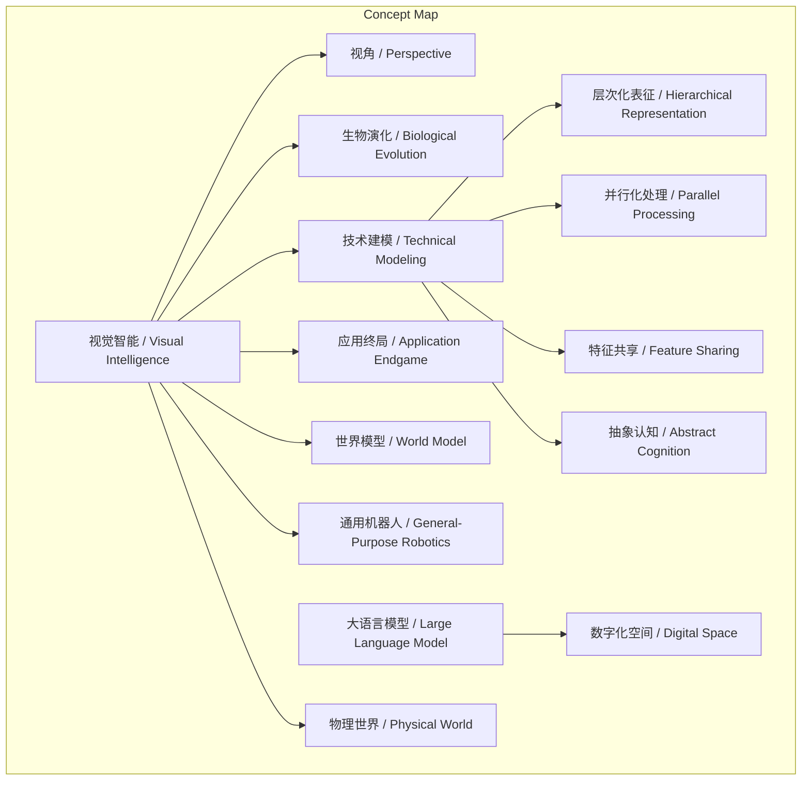
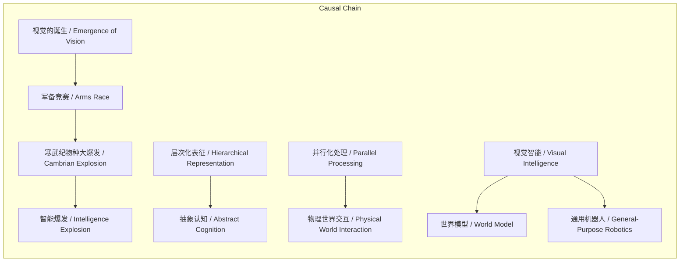

> 谢赛宁提出视觉智能不仅是研究领域，更是理解智能本质的视角，并从生物演化、技术建模、应用终局三个维度定义其核心内涵。

## 元信息
- 分类：`ai-software/models-research`
- 优先级：`high` (`13`)
- 文档类型：`text-summary`
- 来源分组：`news`
- 原始文件：`reports/news/2026-03-20/1774015136229-news-news-task-1774015073456-efgjoi.md`
- 请求 ID：`1774015073456-efgjoi`

## 原始内容

#### 文本总结

### 视觉智能：理解智能本质的核心视角

#### 整体结构化文档表达
##### 文档卡片
- 主题（中文/English）：视觉智能的本质与核心维度 / The Essence and Core Dimensions of Visual Intelligence
- 一句话摘要：谢赛宁提出视觉智能不仅是研究领域，更是理解智能本质的视角，并从生物演化、技术建模、应用终局三个维度定义其核心内涵。
- 目标读者：AI研究者、技术决策者、科技哲学爱好者
- 核心结论（3条）：
  1. 视觉智能是理解智能本质的“视角”，而非狭隘的研究领域。
  2. 视觉智能在技术层面必须具备处理真实信号、层次化表征、大规模并行、特征共享与抽象认知四大能力。
  3. 视觉智能是连接物理世界与通用智能体（如机器人）的必经之路，超越了大语言模型在数字化空间的局限。

##### 内容结构树
1. 背景与问题定义：谢赛宁对“视觉智能”的重新定位——从具体领域到智能本质的视角。
2. 核心观点与关键证据：三个核心维度的论述（生物演化、技术建模、应用终局）。
3. 方法/机制/路径：技术建模维度下的四大核心能力（处理复杂信号、层次化表征、并行化处理、特征共享与抽象认知）。
4. 风险与边界条件：未提及
5. 结论与行动建议：未提及

##### 结构化元数据（JSON）
```json
{
  "title": "视觉智能：理解智能本质的核心视角",
  "topic_zh": "视觉智能的本质与核心维度",
  "topic_en": "The Essence and Core Dimensions of Visual Intelligence",
  "audience": "AI研究者、技术决策者、科技哲学爱好者",
  "claims": [
    "视觉智能是理解智能本质的视角，而非狭隘研究领域。",
    "视觉智能必须处理真实世界的连续、高维、 noisy 信号。",
    "视觉智能是构建世界模型和通用机器人的核心底座。"
  ],
  "evidence": [
    "眼睛是大脑唯一暴露在真实世界中的部分，解决视觉问题即解决智能问题。",
    "视觉诞生引发物种生存‘军备竞赛’，促成寒武纪物种大爆发。",
    "视觉智能需实现从具象到抽象的层次化表征与泛化。",
    "视觉智能需大规模并行处理不同时空的物体、物理规律与因果变化。",
    "视觉智能能跨越像素差异，建立‘狗’的通用抽象认知。",
    "大语言模型（LLM）的成功局限在虚拟数字化空间。"
  ],
  "risks": [],
  "actions": []
}
```

#### 处理流程
1. 输入识别：用户提供谢赛宁关于“视觉智能”的论述文本，包含其核心观点与三个维度的详细阐释。
2. 信息抽取：抽取实体（视觉智能、大语言模型、层次化表征等）、概念（视角、智能本质、物理世界交互等）、问题（视觉智能是什么）、事实（生物演化论据、技术能力描述）、观点（视觉智能代表智能本质、LLM局限等）。
3. 结构化归纳：将内容归纳为“背景-观点-方法-风险-结论”结构；按生物演化、技术建模、应用终局对观点进行分类；对比视觉智能与LLM的能力差异。
4. 关系建模：建立概念间逻辑关系，如“视觉诞生”导致“寒武纪爆发”进而“推动智能爆发”；“层次化表征”是“抽象认知”的必要条件；“视觉智能”与“物理世界交互”构成“世界模型”基础。
5. 可视化表达：使用Mermaid绘制概念结构图与逻辑因果图。

#### 概念清单（中英文）
- 视觉智能 / Visual Intelligence
- 计算机视觉 / Computer Vision
- 视角 / Perspective
- 眼睛 / Eye
- 大脑 / Brain
- 真实世界 / Real World
- 智能 / Intelligence
- 生物演化 / Biological Evolution
- 物种 / Species
- 军备竞赛 / Arms Race
- 寒武纪物种大爆发 / Cambrian Explosion
- 感官 / Sense Organ
- 技术建模 / Technical Modeling
- 大语言模型 / Large Language Model (LLM)
- 复杂信号 / Complex Signals
- 连续空间 / Continuous Space
- 高维度 / High-Dimensional
- 噪音 / Noise
- 层次化表征 / Hierarchical Representation
- 并行化处理 / Parallel Processing
- 特征共享 / Feature Sharing
- 抽象认知 / Abstract Cognition
- 应用终局 / Application Endgame
- 物理世界 / Physical World
- 交互 / Interaction
- 世界模型 / World Model
- 通用机器人 / General-Purpose Robotics
- 数字化空间 / Digital Space

#### 概念定义（中英文）
- 视觉智能 / Visual Intelligence：一种能够理解、处理并与真实物理世界进行视觉交互的智能系统，代表智能的本质，而不仅是计算机视觉研究领域。
- 视角 / Perspective：观察和理解问题的根本立场或框架，此处指视觉智能作为洞察智能本质的基本方式。
- 层次化表征 / Hierarchical Representation：视觉系统对像素信息进行逐层抽象、从具象到泛化的迭代处理过程，是解决现实问题的基石。
- 大语言模型 / Large Language Model (LLM)：一种主要处理文本数据、在虚拟数字化空间表现出色但难以直接处理物理世界复杂信号的人工智能模型。
- 世界模型 / World Model：对物理世界运行规律进行预测和决策的内部模型，视觉智能是其构建的必经之路。
- 并行化处理 / Parallel Processing：同时捕获和处理不同时空中的多个物体、物理规律及因果变化的能力。

#### 概念关联与逻辑关系（中英文）
1. 视觉智能 / Visual Intelligence 与 大语言模型 / Large Language Model 在输入模态上互斥：视觉智能处理真实物理世界的连续高维信号，LLM处理数字化空间的离散文本。
2. 层次化表征 / Hierarchical Representation 是 视觉智能 / Visual Intelligence 实现 抽象认知 / Abstract Cognition 的必要条件：只有通过逐层抽象，才能跨越像素差异建立通用概念。
3. 视觉的诞生 / Emergence of Vision 导致 军备竞赛 / Arms Race，进而引发 寒武纪物种大爆发 / Cambrian Explosion，最终推动 智能爆发 / Intelligence Explosion。

#### COT逻辑梳理（定义/分类/比较/因果/科学方法论）
- **Step 1 (定义)**：谢赛宁将“视觉智能”重新定义为一种“视角”，认为其代表智能的本质，因为眼睛是大脑暴露于真实世界的唯一部分，解决视觉问题即解决智能本身问题。
- **Step 2 (分类)**：从三个维度理解视觉智能：①生物演化（视觉推动物种生存竞争与智能爆发）；②技术建模（需具备四大核心能力）；③应用终局（与物理世界交互，构建世界模型与机器人智能）。
- **Step 3 (比较)**：对比视觉智能与大语言模型（LLM）：视觉智能处理真实、连续、高维、 noisy 的物理信号，需并行处理时空变化；LLM处理提纯的数字化文本，局限在虚拟空间。
- **Step 4 (因果)**：生物演化上，视觉的诞生 → 引发捕食/逃避的军备竞赛 → 促成寒武纪物种大爆发 → 推动生物智能进化。技术上，层次化表征与并行处理能力 → 使视觉智能能抽象认知并交互物理世界。
- **Step 5 (科学方法论)**：构建视觉智能需遵循方法论：①输入层处理复杂信号；②通过层次化表征实现从具象到抽象；③利用大规模并行捕获时空变化；④通过特征共享建立跨实例的通用认知。

#### 事实与看法（病毒）
##### 事实
- 谢赛宁提出“视觉智能”是一种“视角”，代表智能的本质。
- 眼睛是大脑唯一暴露在真实世界中的部分。
- 视觉的诞生引发了物种为生存展开的“军备竞赛”。
- 视觉智能必须处理真实世界的连续空间、高维度、充满噪音的信号。
- 视觉系统必须构建层次化的表征，完成从具象到抽象的转化。
- 视觉智能必须大规模并行地捕获并处理不同时空的变化。
- 视觉智能能跨越像素差异，建立“狗”的通用抽象认知。
- 大语言模型（LLM）的成功很大程度上局限在虚拟的数字化空间。
- 视觉智能是构建“世界模型”的必经之路，是打造通用机器人的大脑。
##### 看法
- 视觉是生物建立对物理世界认知、获得个体独立性的最重要感官。
- 解决视觉问题其实就是要解决智能本身的问题。
- 视觉的诞生直接促成了地球历史上的“寒武纪物种大爆发”。
- 一个真正的视觉智能系统能够把真实狗、手绘狗、卡通狗联系在一起。
- 真正的视觉智能必须与真实的物理世界发生交互。

#### FAQ（原文问题整理）
- 未发现明确提问

#### Visualization
##### Mermaid 图 1（概念结构图）

##### Mermaid 图 2（逻辑/因果图）


#### 文章中的类比
- 未发现明确类比

#### 10个金句
1. 视觉智能并不仅仅是一个具体的或狭隘的研究领域，而是一种“视角”，它代表了智能的本质。
2. 眼睛是大脑唯一暴露在真实世界中的部分。
3. 解决视觉问题，其实就是要解决智能本身的问题。
4. 视觉的诞生引发了物种为了生存（捕食与逃避天敌）而展开的“军备竞赛”。
5. 视觉是生物建立对物理世界认知、获得个体独立性的最重要感官。
6. 视觉智能面对的不是人类高度提纯的文字标签，而是真实物理世界中连续空间的、高维度的、且充满噪音的信号。
7. 视觉系统必须能够一层一层地对庞杂的像素信息进行迭代，完成从具象到抽象的转化与泛化。
8. 视觉智能必须能够大规模并行地捕获并处理所有这些变化。
9. 一个真正的视觉智能系统，能够跨越底层像素的巨大差异，把真实世界里跑动的狗、小孩手绘的狗、以及动画片里的卡通狗联系在一起，建立起“它们都是狗”的通用抽象认知。
10. 大语言模型（LLM）的成功很大程度上局限在虚拟的数字化空间里。
