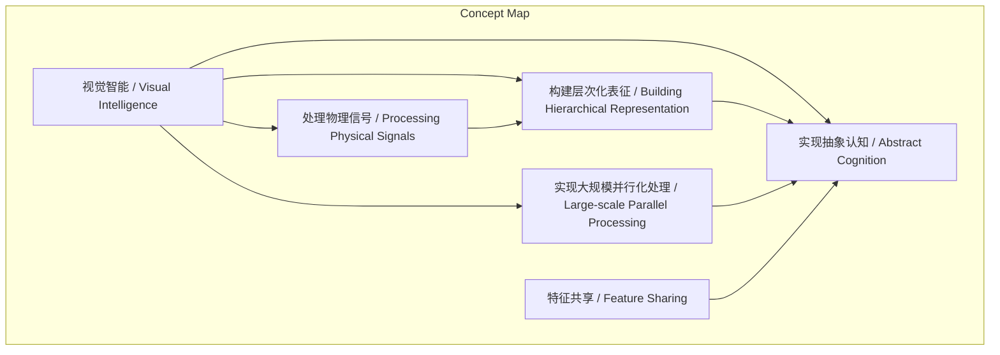
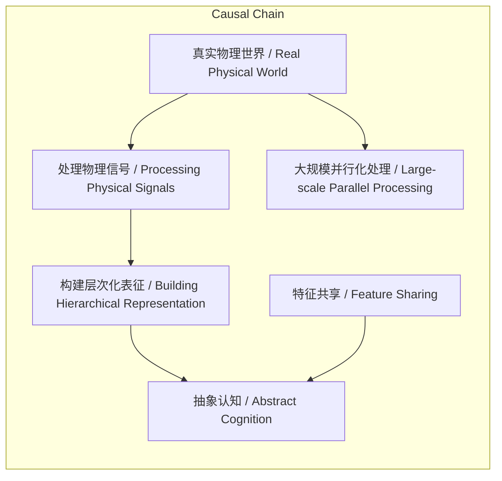

> 谢赛宁将视觉智能定义为智能本质的视角，并系统阐述其必须解决的四个核心维度问题。

## 元信息
- 分类：`ai-software/models-research`
- 优先级：`high` (`13`)
- 文档类型：`text-summary`
- 来源分组：`news`
- 原始文件：`reports/news/2026-03-20/1774014976391-news-news-task-1774014869256-rou3i9.md`
- 请求 ID：`1774014869256-rou3i9`

## 原始内容

#### 文本总结

### 视觉智能四维度：本质与核心问题

#### 整体结构化文档表达
##### 文档卡片
- 主题（中文/English）：视觉智能的本质与核心问题 / The Essence and Core Problems of Visual Intelligence
- 一句话摘要：谢赛宁将视觉智能定义为智能本质的视角，并系统阐述其必须解决的四个核心维度问题。
- 目标读者：人工智能研究者、计算机视觉领域学生及从业者
- 核心结论（3条）：
  1. 视觉智能是智能本质的具体体现，而非一个孤立的技术领域。
  2. 其核心问题涵盖处理原始物理信号、构建层次化表征、实现大规模并行化与构建抽象认知四个维度。
  3. 与大语言模型相比，视觉智能更直接面对和處理物理世界的原始复杂性。

##### 内容结构树
1. 背景与问题定义：谢赛宁对视觉智能的独特界定及其核心问题范畴。
2. 核心观点与关键证据：四个核心维度的具体内容与论证。
3. 方法/机制/路径：未提及
4. 风险与边界条件：未提及
5. 结论与行动建议：未提及

##### 结构化元数据（JSON）
```json
{
  "title": "视觉智能四维度：本质与核心问题",
  "topic_zh": "视觉智能的本质与核心问题",
  "topic_en": "The Essence and Core Problems of Visual Intelligence",
  "audience": "人工智能研究者、计算机视觉领域学生及从业者",
  "claims": [
    "视觉智能是智能本质的视角，而非单一领域。",
    "视觉智能的核心问题包括四个维度：处理物理信号、层次化表征、并行化、抽象认知。",
    "视觉智能直面连续、高维、嘈杂的物理信号，与大语言模型处理的文本符号有本质不同。"
  ],
  "evidence": [
    "处理连续、高维、嘈杂的物理信号",
    "构建层次化的表征（Hierarchical Representation）",
    "实现大规模的并行化处理",
    "实现特征共享与构建抽象认知"
  ],
  "risks": [],
  "actions": []
}
```

#### 处理流程
未提及

#### 概念清单（中英文）
- 谢赛宁 / Xie Saining
- 视觉智能 / Visual Intelligence
- 计算机视觉 / Computer Vision
- 智能本质 / Essence of Intelligence
- 领域 / Domain
- 问题 / Problem
- 物理信号 / Physical Signals
- 大语言模型 / Large Language Model (LLM)
- 文本符号 / Text Symbols
- 连续空间 / Continuous Space
- 高维度 / High Dimensionality
- 噪音 / Noise
- 层次化表征 / Hierarchical Representation
- 底层数据 / Low-level Data
- 特征提取 / Feature Extraction
- 迭代 / Iteration
- 抽象 / Abstraction
- 泛化 / Generalization
- 深度学习 / Deep Learning
- 现实问题 / Real-world Problems
- 大规模并行化处理 / Large-scale Parallel Processing
- 物体 / Objects
- 物理动力学 / Physical Dynamics
- 因果规律 / Causal Laws
- 时空 / Spatiotemporal
- 同步捕获 / Synchronous Capture
- 特征共享 / Feature Sharing
- 抽象认知 / Abstract Cognition
- 底层像素 / Low-level Pixels
- 视觉形态 / Visual Forms
- 通用抽象认知 / General Abstract Cognition

#### 概念定义（中英文）
- 谢赛宁 / Xie Saining：提出视觉智能本质观点的学者。
- 视觉智能 / Visual Intelligence：代表“智能本质”的视角，是智能一定要解决的一系列问题的总和。
- 计算机视觉 / Computer Vision：视觉智能所涉及的具体技术领域。
- 智能本质 / Essence of Intelligence：智能的根本属性或核心特征。
- 领域 / Domain：特定的研究或应用范围。
- 问题 / Problem：需要被解决的挑战或任务。
- 物理信号 / Physical Signals：来自真实物理世界的连续、高维、充满噪音的原始数据。
- 大语言模型 / Large Language Model (LLM)：主要处理被人类高度凝练和打好标签的文本符号的AI模型。
- 文本符号 / Text Symbols：离散的、经过人类加工和标注的符号系统。
- 连续空间 / Continuous Space：数值在区间内可以取任意值的空间，无离散跳跃。
- 高维度 / High Dimensionality：数据特征数量极其庞大。
- 噪音 / Noise：信号中非预期的、干扰性的随机变异。
- 层次化表征 / Hierarchical Representation：从简单到复杂、从具体到抽象逐层构建的数据表示方式。
- 底层数据 / Low-level Data：最原始、未经处理的传感器输入数据。
- 特征提取 / Feature Extraction：从数据中自动发现和抽取有用信息的过程。
- 迭代 / Iteration：通过重复循环逐步优化和精炼的过程。
- 抽象 / Abstraction：忽略具体细节，提取共同本质的过程。
- 泛化 / Generalization：将学到的模式应用到未见过的新情境的能力。
- 深度学习 / Deep Learning：使用多层神经网络进行表示学习和模式识别的方法。
- 现实问题 / Real-world Problems：在复杂、非理想的实际环境中遇到的挑战。
- 大规模并行化处理 / Large-scale Parallel Processing：同时处理多个独立或关联任务与数据流的能力。
- 物体 / Objects：物理世界中存在的实体。
- 物理动力学 / Physical Dynamics：描述物体运动与变化的基本物理规律。
- 因果规律 / Causal Laws：支配事件之间因果关系的根本法则。
- 时空 / Spatiotemporal：空间与时间的统一维度。
- 同步捕获 / Synchronous Capture：在同一时间框架内记录和理解多个事件。
- 特征共享 / Feature Sharing：不同实例或类别之间共用部分特征表示。
- 抽象认知 / Abstract Cognition：形成超越具体感官输入的概念性理解。
- 底层像素 / Low-level Pixels：构成数字图像的最小亮度/颜色单元。
- 视觉形态 / Visual Forms：物体在视觉感知上呈现的具体样貌。
- 通用抽象认知 / General Abstract Cognition：跨越巨大视觉差异，识别本质同一性的高级认知能力。

#### 概念关联与逻辑关系（中英文）
1. 视觉智能 / Visual Intelligence 的实现必须建立在 处理物理信号 / Processing Physical Signals 与 构建层次化表征 / Building Hierarchical Representation 的基础之上。
   形式化：VI ∝ f(PS, HR)，其中VI为视觉智能，PS为处理物理信号的能力，HR为构建层次化表征的能力。
2. 构建层次化表征 / Building Hierarchical Representation 通过 特征提取 / Feature Extraction 与 迭代 / Iteration 过程，直接导向 抽象认知 / Abstract Cognition 的形成。
   形式化：AC = g(HR, FE, I)，其中AC为抽象认知，FE为特征提取，I为迭代。
3. 大规模并行化处理 / Large-scale Parallel Processing 与 特征共享 / Feature Sharing 是 抽象认知 / Abstract Cognition 得以跨越具体 视觉形态 / Visual Forms 差异的两个关键支撑机制。
   形式化：AC = h(LPP, FS)，其中LPP为大规模并行化处理，FS为特征共享。

#### COT逻辑梳理（定义/分类/比较/因果/科学方法论）
**Step 1 (定义):** 首先界定核心概念。谢赛宁定义视觉智能并非一个孤立的“领域”，而是代表“智能本质”的视角，是智能系统必须解决的一系列问题的总和。
**Step 2 (分类):** 将视觉智能需要解决的核心问题归纳为四个互相关联的维度：1) 处理连续、高维、嘈杂的物理信号；2) 构建层次化的表征；3) 实现大规模的并行化处理；4) 实现特征共享与构建抽象认知。
**Step 3 (比较):** 通过与大语言模型（LLM）对比，凸显视觉智能的独特性。LLM处理的是被人类高度凝练、离散、带标签的文本符号，而视觉智能必须直接面对真实物理世界原始、连续、高维且充满噪音的信号。这一比较揭示了不同智能形态面对的信息本质差异。
**Step 4 (因果):** 分析为何需要这四个维度。根本原因在于物理世界的固有复杂性：信号是连续高维嘈杂的（因1），不同物体及其动力学在时空中并行发生（因2），且同一实体可能有极大视觉差异（因3）。因此，视觉智能必须发展出层次化表征以逐层抽象（果1），大规模并行处理以同步理解（果2），以及特征共享与抽象认知以建立通用概念（果3）。
**Step 5 (科学方法论):** 上述维度的实现依赖于深度学习等科学方法。例如，层次化表征通过多层神经网络的迭代训练实现；大规模并行化依赖于分布式计算架构；特征共享与抽象认知则通过表示学习（如共享权重、对比学习）来达成。这构成了从问题定义到工程实现的逻辑闭环。

#### 事实与看法（病毒）
##### 事实
- 视觉智能需要处理连续、高维、嘈杂的物理信号。
- 视觉系统必须从底层数据中进行层次化的特征提取。
- 通过一层层迭代可以完成抽象和泛化。
- 真实的物理世界中，不同物体及其物理动力学变化在时空中同时发生。
- 视觉智能需要大规模并行处理能力去同步捕获并理解复杂变化。
- 视觉智能能够跨越底层像素层面的巨大差异。
- 它需要识别出真实世界跑动的狗、小孩手绘的狗、动画片里的卡通狗。
- 在跨度极大的视觉形态背后建立“它们都是狗”的通用抽象认知。
##### 看法
- 视觉智能并不仅仅是一个具体的领域。
- 视觉智能是一种代表了“智能本质”的视角。
- 视觉智能是智能一定要解决的一系列问题的总和。
- 构建层次化表征是视觉智能甚至整个深度学习解决复杂现实问题的基石。
- 实现特征共享与构建抽象认知是真正的视觉智能的标志。

#### FAQ（原文问题整理）
未发现明确提问

#### Visualization
##### Mermaid 图 1（概念结构图）


##### Mermaid 图 2（逻辑/因果图）


#### 文章中的类比
未发现明确类比

#### 10个金句
1. 视觉智能并不仅仅是一个具体的领域，而是一种代表了“智能本质”的视角。
2. 它是智能一定要解决的一系列问题的总和。
3. 视觉智能需要直接面对和处理真实物理世界中连续空间的、高维度的且充满噪音的原始信号。
4. 视觉系统必须学会从庞杂的底层数据中进行层次化的特征提取。
5. 通过一层层的迭代完成抽象和泛化。
6. 视觉智能需要具备大规模并行的处理能力去同步捕获并理解这些复杂的变化。
7. 真正的视觉智能能够跨越底层像素层面的巨大差异。
8. 将视觉上迥异但本质相同的实体联系起来。
9. 例如，它需要能够识别出真实世界里跑动的狗、小孩手绘的狗以及动画片里的卡通狗。
10. 在跨度极大的视觉形态背后建立起“它们都是狗”的通用抽象认知。
