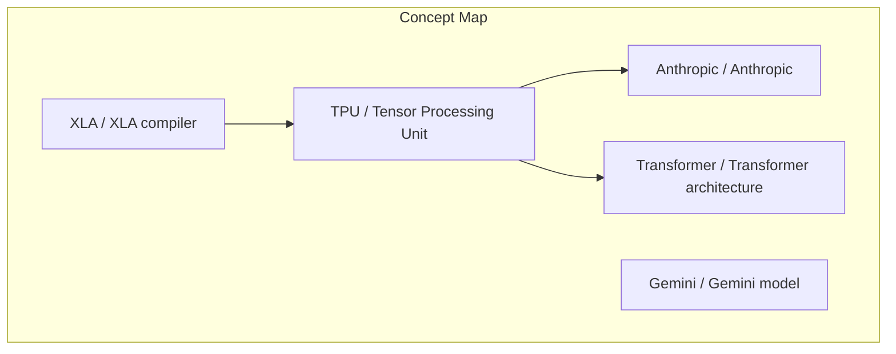
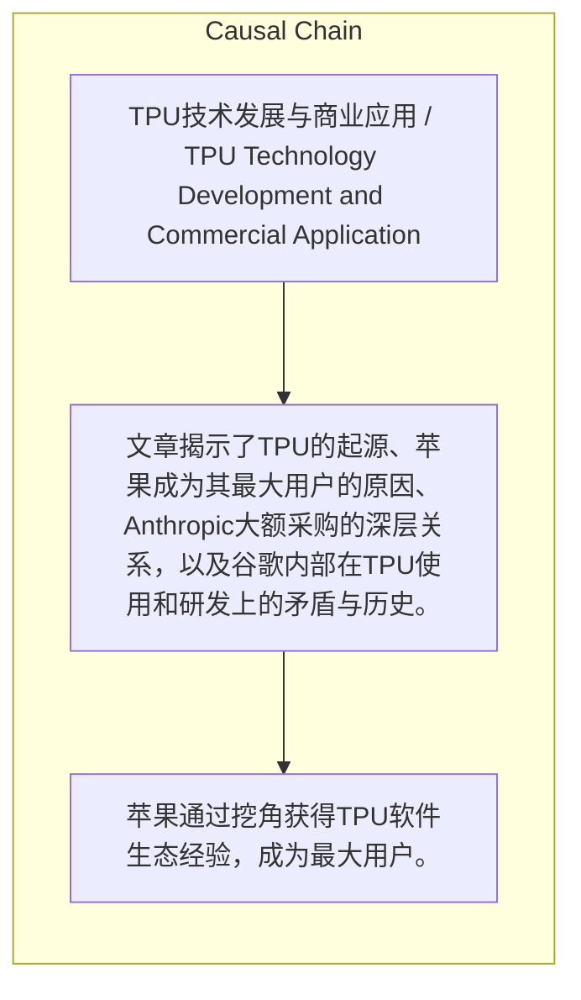

> 文章揭示了TPU的起源、苹果成为其最大用户的原因、Anthropic大额采购的深层关系，以及谷歌内部在TPU使用和研发上的矛盾与历史。

## 元信息
- 分类：`ai-software/models-research`
- 优先级：`high` (`13`)
- 文档类型：`text-summary`
- 来源分组：`news`
- 原始文件：`reports/news/2026-03-25/1774445889048-news-news-task-1774445829138-ikk700.md`
- 请求 ID：`1774445829138-ikk700`

## 原始内容

#### 文本总结

##### 运行信息
- model: stepfun/step-3.5-flash:free
- schema_fallback: yes
- attempted_models: stepfun/step-3.5-flash:free

### TPU发展史：巨头合作与谷歌内部故事

#### 整体结构化文档表达
##### 文档卡片
- 主题（中文/English）：TPU技术发展与商业应用 / TPU Technology Development and Commercial Application
- 一句话摘要：文章揭示了TPU的起源、苹果成为其最大用户的原因、Anthropic大额采购的深层关系，以及谷歌内部在TPU使用和研发上的矛盾与历史。
- 目标读者：未提及
- 核心结论（3条）：
- 苹果通过挖角获得TPU软件生态经验，成为最大用户。
- Anthropic因谷歌投资和团队背景成功采购TPU，并克服XLA编译器难题。
- TPU诞生源于谷歌无法承受GPU成本，且因Transformer架构获得先发优势。

##### 内容结构树
1. 背景与问题定义
2. 核心观点与关键证据
3. 方法/机制/路径
4. 风险与边界条件
5. 结论与行动建议

##### 结构化元数据（JSON）
```json
{
  "title": "TPU发展史：巨头合作与谷歌内部故事",
  "topic_zh": "TPU技术发展与商业应用",
  "topic_en": "TPU Technology Development and Commercial Application",
  "audience": "未提及",
  "claims": [
    "苹果是TPU的最大用户，得益于从谷歌挖角庞若明。",
    "Anthropic拿下TPU大单有谷歌投资和团队背景的‘人情世故’。",
    "Transformer架构让TPU团队有‘内幕消息’式先发优势。",
    "TPU诞生的直接原因是谷歌‘太穷’，付不起GPU成本。",
    "谷歌内部Gemini团队面临TPU短缺，导致服务报错。",
    "大模型爆发前，TPU团队工作相对轻松。",
    "底层工程师对TPU战略了解很少，靠同事聊天拼凑故事。"
  ],
  "evidence": [
    "前谷歌员工庞若明跳槽至苹果，带来TPU软件生态使用经验。",
    "谷歌是Anthropic投资方，且Anthropic团队多人来自谷歌，熟悉XLA编译器。",
    "Transformer由谷歌发明，TPU硬件团队提前知晓AI计算负载需求。",
    "2013年Jonathan Ross汇报GPU成本将翻倍增加数百亿美元，迫使谷歌自研芯片。",
    "Gemini用户请求过多时，后台‘没有卡了’，导致报错或崩溃。",
    "大模型爆发前，TPU研发主要满足内部推荐系统，市场需求不大。",
    "受访工程师称战略布局了解少，故事从同事聊天中拼凑。"
  ],
  "risks": [],
  "actions": []
}
```

#### 处理流程
1. 输入识别
2. 信息抽取（实体、概念、问题、事实、观点）
3. 结构化归纳（定义/分类/比较/因果/方法论）
4. 关系建模（概念关系、等式/方程/逻辑链）
5. 可视化表达（Mermaid）

#### 概念清单（中英文）
- TPU / Tensor Processing Unit
- Anthropic / Anthropic
- Transformer / Transformer architecture
- XLA / XLA compiler
- Gemini / Gemini model

#### 概念定义（中英文）
##### TPU / Tensor Processing Unit
- 中文定义：谷歌开发的专用AI加速芯片
- English Definition: AI accelerator chip developed by Google

##### Anthropic / Anthropic
- 中文定义：谷歌投资的AI公司，采购大量TPU
- English Definition: AI company invested by Google, procured large quantities of TPUs

##### Transformer / Transformer architecture
- 中文定义：谷歌发明的神经网络架构，为TPU定制提供先发优势
- English Definition: Neural network architecture invented by Google, providing first-mover advantage for TPU customization

##### XLA / XLA compiler
- 中文定义：谷歌的软件编译器，被视为封闭黑盒
- English Definition: Google's software compiler, considered a closed black box

##### Gemini / Gemini model
- 中文定义：谷歌的大语言模型，内部团队面临TPU短缺
- English Definition: Google's large language model, with internal team facing TPU shortage


#### 概念关联与逻辑关系（中英文）
- TPU/Tensor Processing Unit -> Anthropic/Anthropic | concept | 采购关系
- TPU/Tensor Processing Unit -> Transformer/Transformer architecture | concept | 定制关系（为Transformer负载优化）
- XLA/XLA compiler -> TPU/Tensor Processing Unit | concept | 软件依赖（TPU依赖XLA编译器）

##### 可形式化关系
- 苹果成为TPU最大用户 ← 庞若明从谷歌跳槽至苹果（人才流动导致技术转移）
- Anthropic成功采购TPU → 谷歌投资Anthropic ∧ Anthropic团队有谷歌背景（投资关系与团队背景促成采购）
- TPU诞生 → 谷歌无法承受GPU成本（成本压力驱动自研芯片）

#### COT逻辑梳理（定义/分类/比较/因果/科学方法论）
- Step 1: 2013年Jeff Dean演示深度学习突破，证明GPU有效性，但成本分析显示不可承受。
- Step 2: 成本压力促使谷歌决定自研芯片，TPU诞生。
- Step 3: 因Transformer架构由谷歌发明，TPU团队提前知晓负载需求，获得先发优势，后续被苹果、Anthropic等采用。

#### 事实与看法（区分）
##### 事实
- 苹果是TPU的最大用户。
- Anthropic下单了100万颗TPU。
- 谷歌是Anthropic的投资方。
- Transformer架构由谷歌内部发明。
- TPU诞生于2013年左右。
- 谷歌内部Gemini团队缺TPU卡。
- 大模型爆发前，TPU研发主要满足谷歌内部推荐系统。

##### 看法
- 苹果成为最大用户得益于‘挖角’。
- Anthropic采购有‘人情世故’。
- TPU团队有‘内幕消息’式优势。
- TPU诞生因‘太窮了’。
- 谷歌内部‘一卡難求’。
- 大模型爆发前TPU团队工作‘輕鬆’。
- 底层工程师靠‘八卦拼凑’了解战略。

#### FAQ（原文问题整理）
- 未发现明确 FAQ

#### Visualization
##### Mermaid 图 1（概念结构图）


##### Mermaid 图 2（逻辑/因果图）


#### 文章中的类比
- 未发现明确类比

#### 10个金句
- Insider news（内幕消息）
