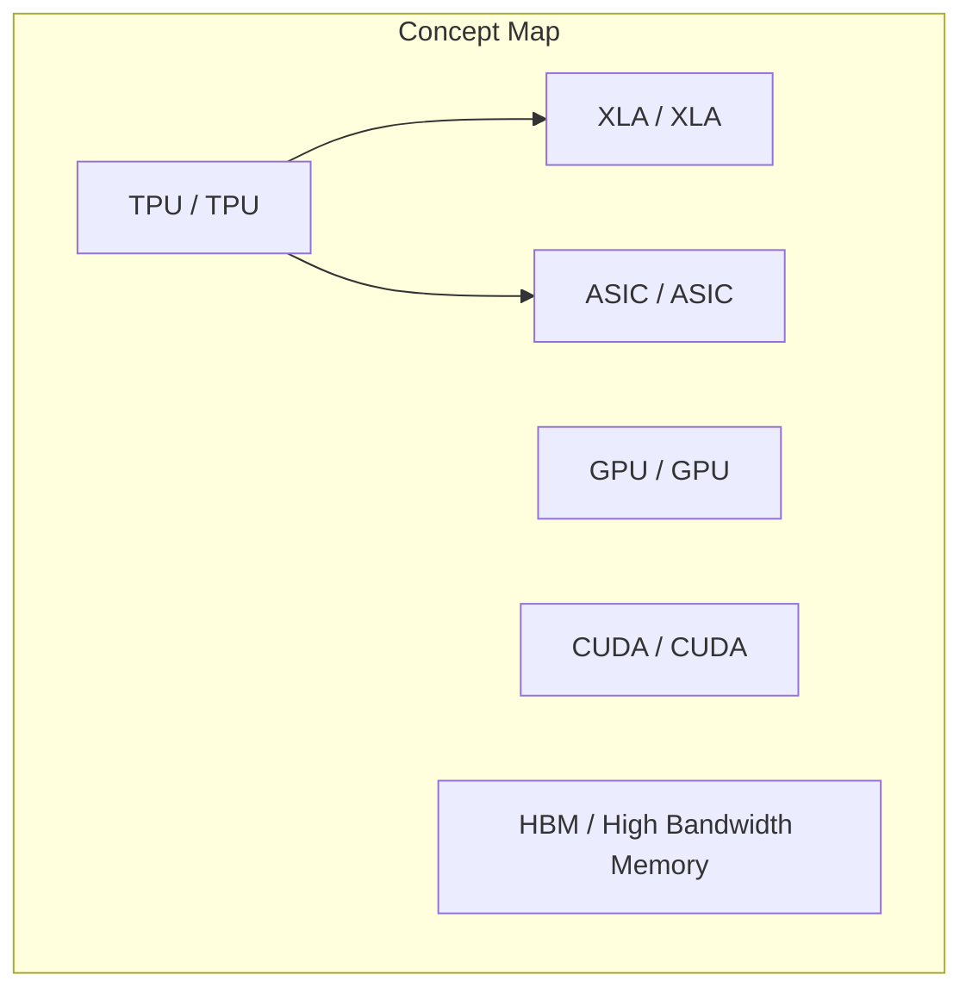
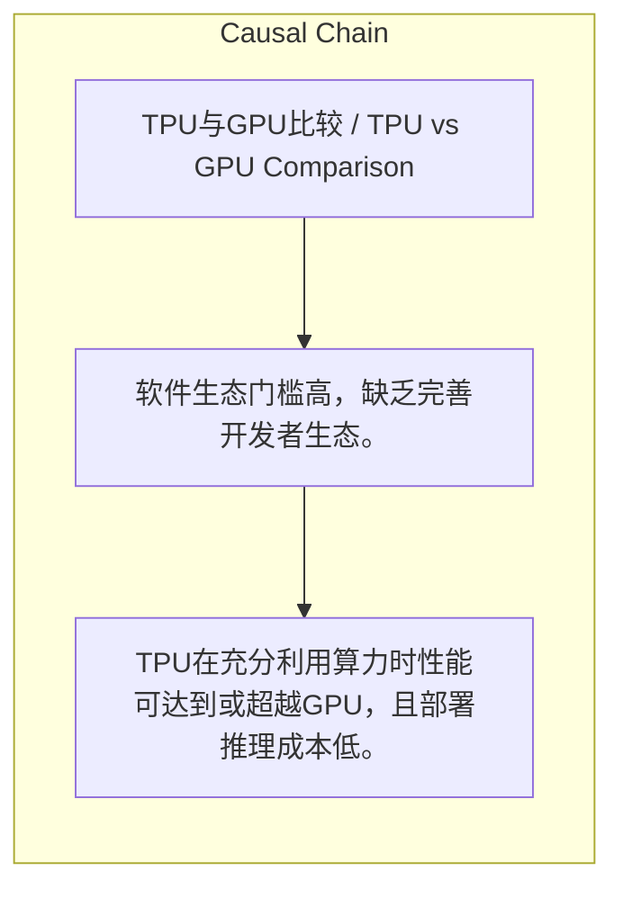

> TPU在算法适配时性能与成本优势显著，但受限于软件生态、供应链及算法迭代风险。

## 元信息
- 分类：`ai-software/models-research`
- 优先级：`high` (`13`)
- 文档类型：`text-summary`
- 来源分组：`news`
- 原始文件：`reports/news/2026-03-25/1774445414591-news-news-task-1774445241134-dw2s2r.md`
- 请求 ID：`1774445241134-dw2s2r`

## 原始内容

#### 文本总结

##### 运行信息
- model: stepfun/step-3.5-flash:free
- schema_fallback: yes
- attempted_models: stepfun/step-3.5-flash:free

### TPU与GPU优劣势对比分析

#### 整体结构化文档表达
##### 文档卡片
- 主题（中文/English）：TPU与GPU比较 / TPU vs GPU Comparison
- 一句话摘要：TPU在算法适配时性能与成本优势显著，但受限于软件生态、供应链及算法迭代风险。
- 目标读者：未提及
- 核心结论（3条）：
- TPU在充分利用算力时性能可达到或超越GPU，且部署推理成本低。
- TPU面临软件生态门槛高、供应链话语权弱、黑盒依赖专业人才等劣势。
- TPU的长期优势取决于当前算法方向（如Transformer）的持续性，否则GPU通用性更佳。

##### 内容结构树
1. 背景与问题定义
2. 核心观点与关键证据
3. 方法/机制/路径
4. 风险与边界条件
5. 结论与行动建议

##### 结构化元数据（JSON）
```json
{
  "title": "TPU与GPU优劣势对比分析",
  "topic_zh": "TPU与GPU比较",
  "topic_en": "TPU vs GPU Comparison",
  "audience": "未提及",
  "claims": [
    "TPU的性能可以达到甚至超越GPU的表现。",
    "TPU具有省钱的核心优势并且能够有效降低推理成本。",
    "TPU使用的XLA系统较难入门是一个核心门槛。",
    "目前没有类似英伟达CUDA那样完善的开发者生态。",
    "在芯片整体量产规模以及对HBM等供应链的控制力上TPU目前还比较弱。",
    "TPU对外部开发者而言像一个黑盒，缺乏专业调优工程师可能只能发挥50%到60%的性能。",
    "TPU本质上类似于一款专用的ASIC芯片，若底层算法重大改变，GPU将更具优势。"
  ],
  "evidence": [],
  "risks": [
    "软件生态门槛高，缺乏完善开发者生态。",
    "供应链话语权弱，对HBM等控制力不足。",
    "黑盒特性依赖专业人才，否则性能利用率低。",
    "底层算法迭代风险，若算法改变则TPU优势丧失。"
  ],
  "actions": []
}
```

#### 处理流程
1. 输入识别
2. 信息抽取（实体、概念、问题、事实、观点）
3. 结构化归纳（定义/分类/比较/因果/方法论）
4. 关系建模（概念关系、等式/方程/逻辑链）
5. 可视化表达（Mermaid）

#### 概念清单（中英文）
- TPU / TPU
- GPU / GPU
- XLA / XLA
- CUDA / CUDA
- HBM / High Bandwidth Memory
- ASIC / ASIC
- Transformer / Transformer

#### 概念定义（中英文）
##### TPU / TPU
- 中文定义：一种专用的芯片，适用于模型训练
- English Definition: A specialized chip for model training

##### GPU / GPU
- 中文定义：未提及
- English Definition: Not mentioned

##### XLA / XLA
- 中文定义：未提及
- English Definition: Not mentioned

##### CUDA / CUDA
- 中文定义：未提及
- English Definition: Not mentioned

##### HBM / High Bandwidth Memory
- 中文定义：高带宽内存
- English Definition: High Bandwidth Memory

##### ASIC / ASIC
- 中文定义：未提及
- English Definition: Not mentioned

##### Transformer / Transformer
- 中文定义：未提及
- English Definition: Not mentioned


#### 概念关联与逻辑关系（中英文）
- TPU/TPU -> XLA/XLA | concept | 使用
- TPU/TPU -> ASIC/ASIC | concept | 类似于

##### 可形式化关系
- 跑满算力 → TPU性能 ≥ GPU性能
- 缺乏专业调优工程师 → TPU性能利用率 ≤ 60%
- 算法重大改变 → GPU相对优势增加

#### COT逻辑梳理（定义/分类/比较/因果/科学方法论）
- Step 1: 分析TPU在模型训练性能和部署推理成本上的优势。
- Step 2: 分析TPU在软件生态、供应链、黑盒特性和算法迭代上的劣势。
- Step 3: 综合判断TPU的适用性取决于算法方向和专业能力。

#### 事实与看法（区分）
##### 事实
- 未发现明确客观事实

##### 看法
- 未发现明确主观看法

#### FAQ（原文问题整理）
- 未发现明确 FAQ

#### Visualization
##### Mermaid 图 1（概念结构图）


##### Mermaid 图 2（逻辑/因果图）


#### 文章中的类比
- 未发现明确类比

#### 10个金句
- 原文未提供
