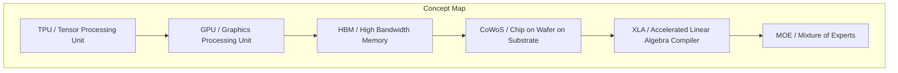
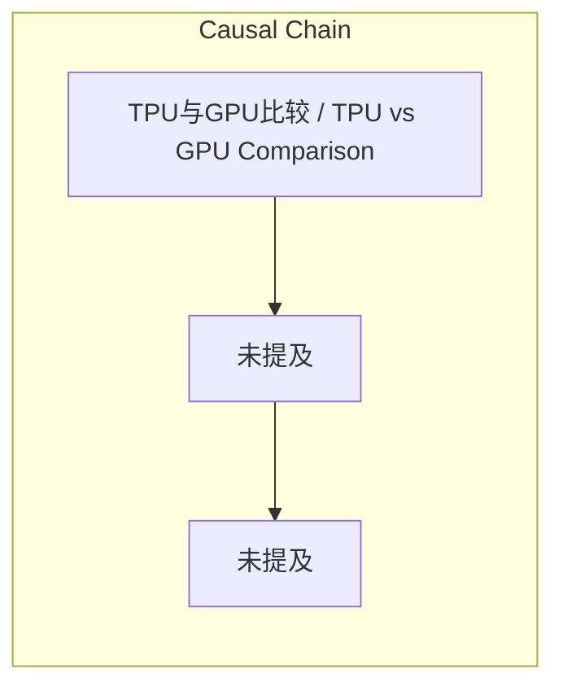

> 未提及

## 元信息
- 分类：`ai-software/models-research`
- 优先级：`medium` (`12`)
- 文档类型：`text-summary`
- 来源分组：`news`
- 原始文件：`reports/news/2026-03-25/1774445966713-news-news-task-1774445907831-mtjtmw.md`
- 请求 ID：`1774445907831-mtjtmw`

## 原始内容

#### 文本总结

##### 运行信息
- model: stepfun/step-3.5-flash:free
- schema_fallback: yes
- attempted_models: stepfun/step-3.5-flash:free

### TPU与GPU竞争差异FAQ汇总

#### 整体结构化文档表达
##### 文档卡片
- 主题（中文/English）：TPU与GPU比较 / TPU vs GPU Comparison
- 一句话摘要：未提及
- 目标读者：未提及
- 核心结论（3条）：
- 未发现明确核心结论

##### 内容结构树
1. 背景与问题定义
2. 核心观点与关键证据
3. 方法/机制/路径
4. 风险与边界条件
5. 结论与行动建议

##### 结构化元数据（JSON）
```json
{
  "title": "TPU与GPU竞争差异FAQ汇总",
  "topic_zh": "TPU与GPU比较",
  "topic_en": "TPU vs GPU Comparison",
  "audience": "未提及",
  "claims": [],
  "evidence": [],
  "risks": [],
  "actions": []
}
```

#### 处理流程
1. 输入识别
2. 信息抽取（实体、概念、问题、事实、观点）
3. 结构化归纳（定义/分类/比较/因果/方法论）
4. 关系建模（概念关系、等式/方程/逻辑链）
5. 可视化表达（Mermaid）

#### 概念清单（中英文）
- TPU / Tensor Processing Unit
- GPU / Graphics Processing Unit
- HBM / High Bandwidth Memory
- CoWoS / Chip on Wafer on Substrate
- XLA / Accelerated Linear Algebra Compiler
- MOE / Mixture of Experts
- ASIC / Application-Specific Integrated Circuit
- Agent / Agent
- RL / Reinforcement Learning

#### 概念定义（中英文）
##### TPU / Tensor Processing Unit
- 中文定义：未提及
- English Definition: 未提及

##### GPU / Graphics Processing Unit
- 中文定义：未提及
- English Definition: 未提及

##### HBM / High Bandwidth Memory
- 中文定义：未提及
- English Definition: 未提及

##### CoWoS / Chip on Wafer on Substrate
- 中文定义：未提及
- English Definition: 未提及

##### XLA / Accelerated Linear Algebra Compiler
- 中文定义：未提及
- English Definition: 未提及

##### MOE / Mixture of Experts
- 中文定义：未提及
- English Definition: 未提及

##### ASIC / Application-Specific Integrated Circuit
- 中文定义：未提及
- English Definition: 未提及

##### Agent / Agent
- 中文定义：未提及
- English Definition: 未提及

##### RL / Reinforcement Learning
- 中文定义：未提及
- English Definition: 未提及


#### 概念关联与逻辑关系（中英文）
- 未发现明确概念关系

##### 可形式化关系
- 未发现明确形式化关系

#### COT逻辑梳理（定义/分类/比较/因果/科学方法论）
- 未发现明确逻辑步骤

#### 事实与看法（区分）
##### 事实
- 未发现明确客观事实

##### 看法
- 未发现明确主观看法

#### FAQ（原文问题整理）
##### 谷歌的TPU可以挑战英伟达在GPU的垄断地位吗？能不能阻挠英伟达在这个市场上的绝对定价权？
- 未提及

##### TPU跟目前英伟达的GPU（如H100或GB200）有什么不一样？尤其在预训练方向上的不同之处是什么？
- 未提及

##### 如果用做菜来比喻TPU的话 它的流程跟GPU有什么不一样？
- 未提及

##### 在模型的训练上 这两种不同架构各自的优势跟缺点是什么？谁更强 能优化多少？
- 未提及

##### 同样是训练一个同等参数量的Gemini模型 用GPU跟用谷歌的TPU谁更省钱？
- 未提及

##### 更高性能的HBM内存现在在市场上从供应链环节好找货吗？
- 未提及

##### 现在谷歌TPU它的产量是多少？
- 未提及

##### 谷歌能直接跟台积电（TSMC）就CoWoS封装产能来议价吗？决定的核心要素是什么？
- 未提及

#### Visualization
##### Mermaid 图 1（概念结构图）


##### Mermaid 图 2（逻辑/因果图）


#### 文章中的类比
- 未发现明确类比

#### 10个金句
- 原文未提供
