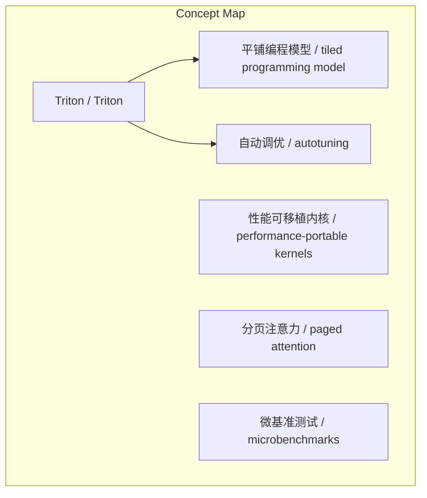
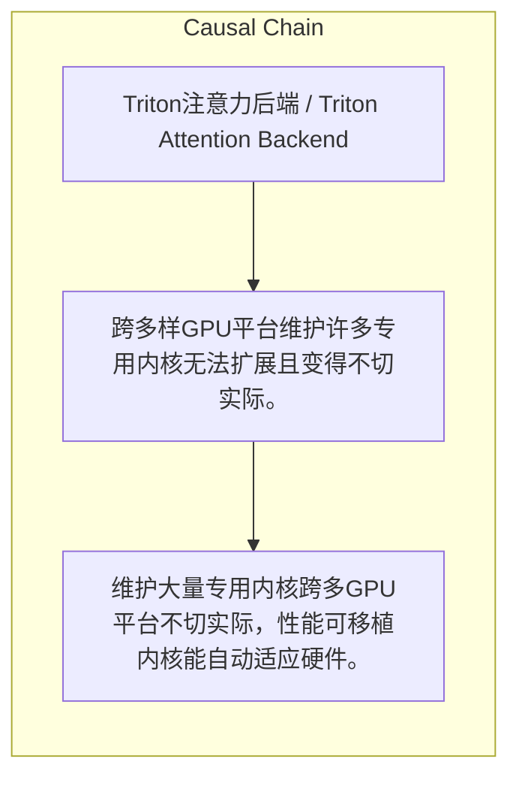

> vLLM采用Triton实现注意力后端，利用性能可移植内核与平铺编程模型，在NVIDIA H100和AMD MI300上达到高效性能，并通过分页注意力优化内存使用。

## 元信息
- 分类：`ai-software/models-research`
- 优先级：`medium` (`12`)
- 文档类型：`link-summary`
- 来源分组：`news`
- 原始文件：`reports/news/2026-03-27/1774587205093-news-news-task-1774586844979-5y2ufp.md`
- 请求 ID：`1774586844979-5y2ufp`

## 原始内容

#### 链接总结

- URL: https://vllm.ai/blog/vllm-triton-backend-deep-dive

##### 运行信息
- model: stepfun/step-3.5-flash:free
- schema_fallback: yes
- attempted_models: stepfun/step-3.5-flash:free

### vLLM Triton注意力后端深度解析

#### 整体结构化文档表达
##### 文档卡片
- 主题（中文/English）：Triton注意力后端 / Triton Attention Backend
- 一句话摘要：vLLM采用Triton实现注意力后端，利用性能可移植内核与平铺编程模型，在NVIDIA H100和AMD MI300上达到高效性能，并通过分页注意力优化内存使用。
- 目标读者：未提及
- 核心结论（3条）：
- 维护大量专用内核跨多GPU平台不切实际，性能可移植内核能自动适应硬件。
- Triton的平铺编程模型通过自动调优平衡硬件相关优化与硬件无关性。
- Microbenchmarks对评估跨预填充、解码和混合工作负载的性能行为至关重要，且不同内核变体在不同场景下表现不同，无单一配置主导所有场景。
- Triton注意力后端在NVIDIA H100上对长解码请求性能达FlashAttention 3的100.7%，在AMD MI300上比早期实现快约5.8倍。
- 同一Triton内核源代码可在NVIDIA H100和AMD MI300上高效运行，且分页注意力实现代码量（约800行）远少于FlashAttention 3（约70,000行）。

##### 内容结构树
1. 背景与问题定义
2. 核心观点与关键证据
3. 方法/机制/路径
4. 风险与边界条件
5. 结论与行动建议

##### 结构化元数据（JSON）
```json
{
  "title": "vLLM Triton注意力后端深度解析",
  "topic_zh": "Triton注意力后端",
  "topic_en": "Triton Attention Backend",
  "audience": "未提及",
  "claims": [
    "跨多个GPU平台维护数百个内核很快变得不切实际。",
    "我们青睐能自动适应运行硬件的性能可移植内核。",
    "Triton的平铺编程模型取得了平衡：它足够底层以表达硬件相关优化，又足够高层以保持硬件无关性。",
    "Microbenchmarks对于理解跨预填充、解码和混合工作负载以及不同批次大小和上下文长度的性能行为至关重要。",
    "不同的内核变体在不同场景下表现出色，没有单一配置能在所有场景中占主导地位。",
    "Triton注意力后端在H100上对长解码请求的性能达到FlashAttention 3的100.7%",
    "在AMD MI300上，Triton注意力后端比早期实现有约5.8倍的加速",
    "同一Triton内核源代码可在NVIDIA H100和AMD MI300上高效运行"
  ],
  "evidence": [
    "Triton是一种领域特定语言，允许开发者用Python编写GPU内核。",
    "这些内核被编译为多平台的高效GPU代码。",
    "开发者通过逻辑平铺表达计算，Triton编译器和自动调优器决定这些平铺如何映射到底层硬件。",
    "内核首先在vLLM外实现，并使用广泛的微基准测试进行评估。",
    "图2显示了具有代表性的微基准测试结果，展示不同工作负载下不同内核变体的性能。",
    "微基准测试通过暴露可能被系统级效应隐藏的内核级行为，补充了端到端基准测试。",
    "在H100上，Triton注意力后端达到FlashAttention 3的100.7%性能（针对长解码请求）",
    "在MI300上，Triton注意力后端比早期实现快约5.8倍"
  ],
  "risks": [
    "跨多样GPU平台维护许多专用内核无法扩展且变得不切实际。"
  ],
  "actions": []
}
```

#### 处理流程
1. 输入识别
2. 信息抽取（实体、概念、问题、事实、观点）
3. 结构化归纳（定义/分类/比较/因果/方法论）
4. 关系建模（概念关系、等式/方程/逻辑链）
5. 可视化表达（Mermaid）

#### 概念清单（中英文）
- Triton / Triton
- 性能可移植内核 / performance-portable kernels
- 平铺编程模型 / tiled programming model
- 自动调优 / autotuning
- 分页注意力 / paged attention
- 微基准测试 / microbenchmarks
- 内核变体 / kernel variants
- KV缓存 / KV cache
- 查询令牌 / query tokens
- 查询头 / query heads
- KV头 / KV heads
- 端到端延迟 / end-to-end latency

#### 概念定义（中英文）
##### Triton / Triton
- 中文定义：一种领域特定语言，允许开发者用Python编写GPU内核，可编译为多平台高效代码。
- English Definition: A domain-specific language for writing GPU kernels in Python, compiled to efficient code for multiple platforms.

##### 性能可移植内核 / performance-portable kernels
- 中文定义：能自动适应运行硬件的内核，无需为每个平台单独优化。
- English Definition: Kernels that adapt automatically to the hardware they run on, without per-platform tuning.

##### 平铺编程模型 / tiled programming model
- 中文定义：开发者通过逻辑平铺表达计算，由编译器和自动调优器决定如何映射到硬件的模型。
- English Definition: A model where developers express computation in logical tiles, and the compiler and autotuner map them to hardware.

##### 自动调优 / autotuning
- 中文定义：通过自动搜索确定最佳配置（如平铺形状）的技术，用于优化GPU内核性能。
- English Definition: A technique that automatically searches for optimal configurations (e.g., tile shapes) to optimize GPU kernel performance.

##### 分页注意力 / paged attention
- 中文定义：通过分页KV缓存实现内存高效的注意力机制。
- English Definition: Attention implemented in a memory-efficient way by paging the KV cache.

##### 微基准测试 / microbenchmarks
- 中文定义：用于评估内核性能的小规模基准测试，暴露内核级行为。
- English Definition: Small-scale benchmarks for evaluating kernel performance, exposing kernel-level behavior.

##### 内核变体 / kernel variants
- 中文定义：Triton attention内核的不同配置或实现版本。
- English Definition: Different configurations or implementations of the Triton attention kernel.

##### KV缓存 / KV cache
- 中文定义：存储键和值向量的缓存，用于注意力计算。
- English Definition: Cache storing key and value vectors for attention computation.

##### 查询令牌 / query tokens
- 中文定义：输入序列中用于计算注意力的令牌。
- English Definition: Tokens in the input sequence for which attention is computed.

##### 查询头 / query heads
- 中文定义：注意力机制中的查询头。
- English Definition: Query heads in the attention mechanism.

##### KV头 / KV heads
- 中文定义：注意力机制中的键值头。
- English Definition: Key-Value heads in the attention mechanism.

##### 端到端延迟 / end-to-end latency
- 中文定义：未提及
- English Definition: not mentioned


#### 概念关联与逻辑关系（中英文）
- Triton/Triton -> 平铺编程模型/tiled programming model | concept | has
- Triton/Triton -> 自动调优/autotuning | concept | uses
- 微基准测试/microbenchmarks -> 内核变体/kernel variants | concept | 评估
- 分页注意力/paged attention -> KV缓存/KV cache | concept | 使用分页
- 分页注意力/paged attention -> 查询令牌/query tokens | concept | 处理
- 分页注意力/paged attention -> 查询头/query heads | concept | 遍历
- 分页注意力/paged attention -> KV头/KV heads | concept | 遍历
- Triton注意力后端/Triton attention backend -> FlashAttention 3/FlashAttention 3 | concept | 性能比较
- Triton内核源代码/Triton kernel source code -> NVIDIA H100/NVIDIA H100 | concept | 兼容
- Triton内核源代码/Triton kernel source code -> AMD MI300/AMD MI300 | concept | 兼容
- 分页注意力实现/paged attention implementation -> 代码行数/lines of code | concept | 代码量对比

##### 可形式化关系
- Triton/Triton -> 平铺编程模型/tiled programming model: has
- Triton/Triton -> 自动调优/autotuning: uses
- 微基准测试/microbenchmarks -> 内核变体/kernel variants: 评估
- 分页注意力/paged attention -> KV缓存/KV cache: 使用分页
- 分页注意力/paged attention -> 查询令牌/query tokens: 处理
- 分页注意力/paged attention -> 查询头/query heads: 遍历

#### COT逻辑梳理（定义/分类/比较/因果/科学方法论）
- 对于批次中的每个查询，处理每个查询令牌。
- 对于每个令牌，遍历查询头和对应的KV头。
- 遍历分页KV缓存以计算注意力分数并应用值向量。

#### 事实与看法（区分）
##### 事实
- Triton attention backend的开发始于在vLLM外实现内核。
- Microbenchmarks用于评估不同工作负载下的性能。
- 图2展示了microbenchmark结果。
- Paged attention通过分页KV缓存实现内存高效。
- 基准测试结果来自2025年末
- 测试模型为Llama 3.1 8B
- 测试配置：批量大小1，输入长度500令牌
- 输出长度在图表x轴表示
- Triton分页注意力实现约800行代码
- FlashAttention 3约70,000行代码

##### 看法
- 基准测试结果证明了该方法的有效性

#### FAQ（原文问题整理）
- 未发现明确 FAQ

#### Visualization
##### Mermaid 图 1（概念结构图）


##### Mermaid 图 2（逻辑/因果图）


#### 文章中的类比
- 未发现明确类比

#### 10个金句
- 原文未提供
