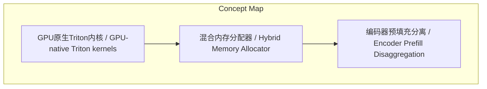
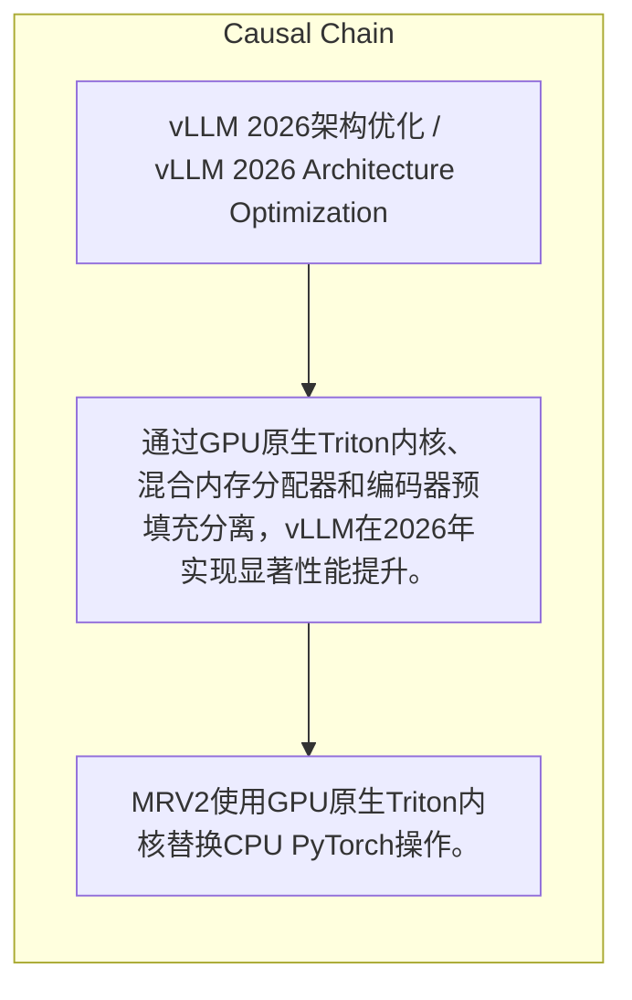

> 通过GPU原生Triton内核、混合内存分配器和编码器预填充分离，vLLM在2026年实现显著性能提升。

## 元信息
- 分类：`ai-software/models-research`
- 优先级：`medium` (`12`)
- 文档类型：`text-summary`
- 来源分组：`news`
- 原始文件：`reports/news/2026-03-25/1774451134622-news-news-task-1774450956523-t43vfg.md`
- 请求 ID：`1774450956523-t43vfg`

## 原始内容

#### 文本总结

##### 运行信息
- model: openrouter/free
- schema_fallback: no
- attempted_models: openrouter/free

### vLLM 2026架构优化

#### 整体结构化文档表达
##### 文档卡片
- 主题（中文/English）：vLLM 2026架构优化 / vLLM 2026 Architecture Optimization
- 一句话摘要：通过GPU原生Triton内核、混合内存分配器和编码器预填充分离，vLLM在2026年实现显著性能提升。
- 目标读者：技术研究者
- 核心结论（3条）：
- MRV2使用GPU原生Triton内核替换CPU PyTorch操作。
- 混合内存分配器将OSS模型的内存浪费控制在0–12%。
- 编码器预填充分离使多模态工作负载的P99吞吐量最高提升2.5倍。

##### 内容结构树
1. 背景与问题定义
2. 核心观点与关键证据
3. 方法/机制/路径
4. 风险与边界条件
5. 结论与行动建议

##### 结构化元数据（JSON）
```json
{
  "title": "vLLM 2026架构优化",
  "topic_zh": "vLLM 2026架构优化",
  "topic_en": "vLLM 2026 Architecture Optimization",
  "audience": "技术研究者",
  "claims": [
    "GPU原生Triton内核替换CPU PyTorch操作。",
    "混合内存分配器将内存浪费降至0–12%。",
    "编码器预填充分离提升P99吞吐量最高2.5倍。"
  ],
  "evidence": [
    "Model Runner V2 (MRV2)：GPU-native Triton kernels replace CPU PyTorch ops。",
    "Hybrid Memory Allocator：0–12% memory waste across OSS models。",
    "Encoder Prefill Disaggregation：up to 2.5x P99 throughput for multimodal workloads。"
  ],
  "risks": [],
  "actions": []
}
```

#### 处理流程
1. 输入识别
2. 信息抽取（实体、概念、问题、事实、观点）
3. 结构化归纳（定义/分类/比较/因果/方法论）
4. 关系建模（概念关系、等式/方程/逻辑链）
5. 可视化表达（Mermaid）

#### 概念清单（中英文）
- GPU原生Triton内核 / GPU-native Triton kernels
- 混合内存分配器 / Hybrid Memory Allocator
- 编码器预填充分离 / Encoder Prefill Disaggregation

#### 概念定义（中英文）
##### GPU原生Triton内核 / GPU-native Triton kernels
- 中文定义：在GPU上直接运行的Triton编译内核，替代CPU上的PyTorch操作。
- English Definition: Triton kernels that run natively on GPU, replacing CPU PyTorch ops.

##### 混合内存分配器 / Hybrid Memory Allocator
- 中文定义：一种内存管理机制，使OSS模型的内存浪费限制在0–12%。
- English Definition: A memory management mechanism that limits OSS model memory waste to 0–12%.

##### 编码器预填充分离 / Encoder Prefill Disaggregation
- 中文定义：将编码器的预填充阶段与其他阶段解耦，以提高多模态工作负载的吞吐量。
- English Definition: Decoupling the encoder prefill stage from other stages to boost throughput for multimodal workloads.


#### 概念关联与逻辑关系（中英文）
- MRV2/MRV2 -> CPU PyTorch ops/CPU PyTorch ops | comparison | replaces
- Hybrid Memory Allocator/Hybrid Memory Allocator -> memory waste/memory waste | comparison | ensures
- Encoder Prefill Disaggregation/Encoder Prefill Disaggregation -> P99 throughput/P99 throughput | comparison | achieves

##### 可形式化关系
- MRV2 → replaces → CPU PyTorch ops
- Hybrid Memory Allocator → ensures → memory waste ∈ [0%,12%]
- Encoder Prefill Disaggregation → achieves → P99 throughput ×2.5 (multimodal workloads)

#### COT逻辑梳理（定义/分类/比较/因果/科学方法论）
- Step 1: 用GPU原生Triton内核替换MRV2中的CPU PyTorch操作。
- Step 2: 应用混合内存分配器，将内存浪费控制在0–12%。
- Step 3: 实现编码器预填充分离，以实现多模态工作负载最高2.5倍的P99吞吐量提升。

#### 事实与看法（区分）
##### 事实
- MRV2：GPU-native Triton kernels replace CPU PyTorch ops。
- Hybrid Memory Allocator：0–12% memory waste across OSS models。
- Encoder Prefill Disaggregation：up to 2.5x P99 throughput for multimodal workloads。
- ModularKernel for MoE：mix-and-match GEMM all-to-all kernels。
- Case study：Kimi K2.5 (NVFP4) on GB200。

##### 看法
- 未发现明确主观看法

#### FAQ（原文问题整理）
- 未发现明确 FAQ

#### Visualization
##### Mermaid 图 1（概念结构图）


##### Mermaid 图 2（逻辑/因果图）


#### 文章中的类比
- 未发现明确类比

#### 10个金句
- 原文未提供
