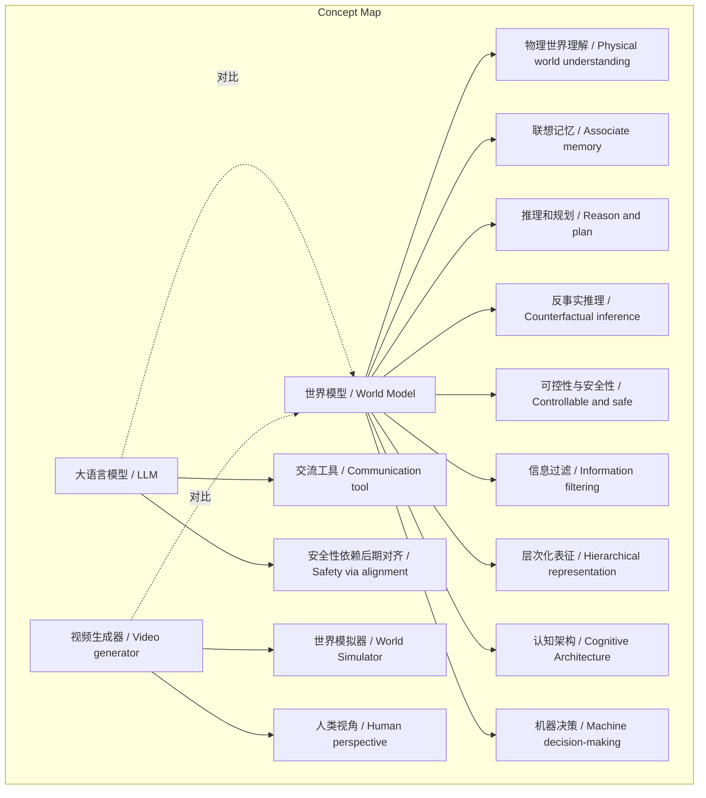
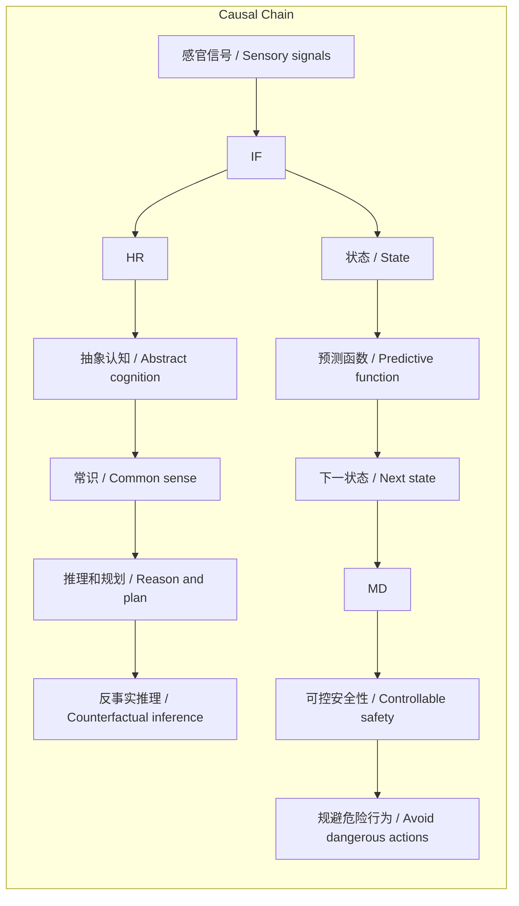

> 世界模型是通过预测环境状态变化来指导决策的底层架构，强调原生安全与机器认知，区别于大语言模型和视频生成器。

## 元信息
- 分类：`ai-software/models-research`
- 优先级：`high` (`14`)
- 文档类型：`text-summary`
- 来源分组：`news`
- 原始文件：`reports/news/2026-03-21/1774058588917-news-news-task-1774058507847-cp3uod.md`
- 请求 ID：`1774058507847-cp3uod`

## 原始内容

#### 文本总结

### 世界模型：AI的预测性大脑与认知底座

#### 整体结构化文档表达
##### 文档卡片
- 主题（中文/English）：世界模型 / World Model
- 一句话摘要：世界模型是通过预测环境状态变化来指导决策的底层架构，强调原生安全与机器认知，区别于大语言模型和视频生成器。
- 目标读者：人工智能研究者、开发者、科技政策制定者及对AI前沿感兴趣的人群。
- 核心结论（3条）：
  1. 世界模型是面向通用智能体的预测性认知架构，而非单一算法。
  2. 其核心机制是信息过滤与层次化表征，提供原生安全性，区别于LLM的后期对齐和视频生成器的人类视角。
  3. 未来将作为智能体的认知底座，支撑机器人在物理世界的决策与行动。

##### 内容结构树
1. 背景与问题定义：世界模型的概念起源（Craik 1943）及谢赛宁团队的目标（构建预测性大脑）。
2. 核心观点与关键证据：五个核心特征（物理理解、联想记忆、推理规划、反事实推理、可控安全）；运作核心是信息过滤；与LLM和视频生成器的区别。
3. 方法/机制/路径：通过过滤高维感官信号，提取状态，建立抽象认知；作为认知架构的神经模块连接。
4. 风险与边界条件：未明确提及风险，但对比LLM的安全性脆弱，暗示世界模型的原生安全优势；边界可能在于物理世界的复杂性。
5. 结论与行动建议：世界模型是未来通用机器人和AI穿戴设备的大脑底座；未提供具体行动建议。

##### 结构化元数据（JSON）
```json
{
  "title": "世界模型：AI的预测性大脑与认知底座",
  "topic_zh": "世界模型",
  "topic_en": "World Model",
  "audience": "人工智能研究者、开发者、科技政策制定者及对AI前沿感兴趣的人群",
  "claims": [
    "世界模型是面向通用智能体的预测性认知架构，而非单一算法。",
    "其核心机制是信息过滤与层次化表征，提供原生安全性，区别于LLM的后期对齐和视频生成器的人类视角。",
    "未来将作为智能体的认知底座，支撑机器人在物理世界的决策与行动。"
  ],
  "evidence": [
    "五个核心特征：物理世界理解、联想记忆、推理规划、反事实推理、可控安全。",
    "运作核心：信息过滤与层次化表征，从高维感官信号中提取决策相关状态。",
    "与LLM区别：LLM是沟通工具，安全性依赖后期对齐；世界模型是认知底座，安全性原生。",
    "与视频生成器区别：视频生成器构建世界模拟器给人类看；世界模型关注机器决策，预测给智能系统自己看。"
  ],
  "risks": ["未提及"],
  "actions": ["未提及"]
}
```

#### 处理流程
1. 输入识别：识别输入文本讨论世界模型的概念、特征及与其他模型的区别。
2. 信息抽取：抽取关键实体（世界模型、Kenneth Craik、谢赛宁、LLM、Sora等）、概念（预测性大脑、认知架构等）、观点（五个特征、信息过滤等）。
3. 结构化归纳：将内容归纳为背景、核心观点、机制、区别、结论等部分。
4. 关系建模：建立概念间关系，如世界模型与LLM的对比关系、信息过滤与状态预测的因果链。
5. 可视化表达：准备Mermaid图展示概念结构和因果链。

#### 概念清单（中英文）
- 世界模型 / World Model
- 状态 / State
- 动作 / Action
- 预测函数 / Predictive function
- Kenneth Craik
- 预测性大脑 / Predictive Brain
- 通用智能体 / General Agent
- 智能本身 / Intelligence itself
- 物理世界理解 / Physical world understanding
- 联想记忆 / Associate memory
- 推理和规划 / Reason and plan
- 反事实推理 / Counterfactual inference
- 因果推断 / Causal inference
- 可控性与安全性 / Controllable and safe
- 信息过滤 / Information filtering
- 层次化表征 / Hierarchical representation
- 感官信号 / Sensory signals
- 抽象认知 / Abstract cognition
- 常识 / Common sense
- 大语言模型 / Large Language Model (LLM)
- 交流工具 / Communication tool
- 高级搜索引擎 / Advanced search engine
- 符号空间 / Symbolic space
- 微调 / Fine-tuning
- 对齐 / Alignment
- 认知架构 / Cognitive Architecture
- 神经网络权重 / Neural network weights
- 神经模块 / Neural modules
- 视频生成器 / Video generator
- Sora
- 世界模拟器 / World Simulator
- 像素视频 / Pixel videos
- 人类视角 / Human perspective
- 机器决策 / Machine decision-making
- 通用机器人 / General Robotics
- AI可穿戴设备 / AI wearable devices
- 智能眼镜 / Smart glasses

#### 概念定义（中英文）
- 世界模型 / World Model: 基于当前系统或环境状态和施加的动作，通过学习预测函数来预测系统下一个状态的底层架构。
- 状态 / State: 系统或环境的当前状况。
- 动作 / Action: 施加于系统的干预或操作。
- 预测函数 / Predictive function: 用于根据状态和动作预测下一状态的学习函数。
- Kenneth Craik: 英国生理学家，1943年提出大脑中存在预知动作后果的模型的观点。
- 预测性大脑 / Predictive Brain: 为通用智能体打造的预测性认知系统，以提升智能本身。
- 通用智能体 / General Agent: 具备广泛适应能力的智能系统。
- 智能本身 / Intelligence itself: 智能的核心本质或能力。
- 物理世界理解 / Physical world understanding: 对真实物理规律和环境的认知能力。
- 联想记忆 / Associate memory: 能够关联和回忆相关信息的大规模记忆系统。
- 推理和规划 / Reason and plan: 基于逻辑进行推导和制定行动方案的能力。
- 反事实推理 / Counterfactual inference: 对未发生情景进行假设性推理的能力。
- 因果推断 / Causal inference: 识别变量间因果关系的能力。
- 可控性与安全性 / Controllable and safe: 系统在决策中能自发规避风险的原生特性。
- 信息过滤 / Information filtering: 从高维嘈杂信号中提取决策相关核心信息的过程。
- 层次化表征 / Hierarchical representation: 对信息进行多层次抽象表示的方法。
- 感官信号 / Sensory signals: 通过感官接收的连续、高维、嘈杂的数据。
- 抽象认知 / Abstract cognition: 对具体信息进行概括和概念化的认知能力。
- 常识 / Common sense: 关于世界的基本知识和直觉。
- 大语言模型 / Large Language Model (LLM): 基于大规模文本数据训练的离散符号处理模型，主要作为交流工具。
- 交流工具 / Communication tool: 用于人际或人机交互的媒介。
- 高级搜索引擎 / Advanced search engine: 能高效检索信息的系统。
- 符号空间 / Symbolic space: 由离散符号组成的处理领域。
- 微调 / Fine-tuning: 对预训练模型进行针对性调整的过程。
- 对齐 / Alignment: 使模型行为符合人类价值观的技术。
- 认知架构 / Cognitive Architecture: 由多个神经模块连接而成的整体认知系统。
- 神经网络权重 / Neural network weights: 神经网络中的可学习参数。
- 神经模块 / Neural modules: 神经网络中功能特定的子单元。
- 视频生成器 / Video generator: 生成视频内容的模型，如Sora。
- Sora: 一种大火的视频生成模型，构建世界模拟器。
- 世界模拟器 / World Simulator: 用于渲染逼真视频的模型，聚焦人类视角。
- 像素视频 / Pixel videos: 由像素组成的视频输出。
- 人类视角 / Human perspective: 以人类观察者为中心的表现方式。
- 机器决策 / Machine decision-making: 机器自主进行决策的过程。
- 通用机器人 / General Robotics: 能适应多种任务的机器人系统。
- AI可穿戴设备 / AI wearable devices: 集成AI功能的穿戴设备，如智能眼镜。
- 智能眼镜 / Smart glasses: 具备智能功能的眼镜设备。

#### 概念关联与逻辑关系（中英文）
1. 世界模型 (World Model) 通过 信息过滤 (Information filtering) 与 层次化表征 (Hierarchical representation) 实现 状态预测 (State prediction)。
2. 大语言模型 (LLM) 作为 交流工具 (Communication tool) 与 世界模型 (World Model) 作为 认知架构 (Cognitive Architecture) 形成功能对比。
3. 视频生成器 (Video generator) 关注 人类视角 (Human perspective) 而 世界模型 (World Model) 关注 机器决策 (Machine decision-making)，导致目标差异。

#### COT逻辑梳理（定义/分类/比较/因果/科学方法论）
Step 1: 定义世界模型为基于状态和动作预测下一状态的底层架构，源自Craik的预测性大脑观点。
Step 2: 分类其核心特征为五点：物理理解、联想记忆、推理规划、反事实推理、可控安全。
Step 3: 比较与LLM的区别：LLM是符号空间的交流工具，安全性依赖后期对齐；世界模型是认知底座，安全性原生。
Step 4: 比较与视频生成器的区别：视频生成器构建世界模拟器供人类观看；世界模型捕捉物理规律供机器决策。
Step 5: 因果分析：信息过滤从高维感官信号中提取状态，建立抽象认知和常识，从而支持推理规划和反事实推断，最终实现安全决策。
Step 6: 科学方法论：世界模型通过学习预测函数，在物理世界中验证和优化预测，形成闭环认知。

#### 事实与看法
##### 事实
- 世界模型概念最早可追溯到1943年英国生理学家Kenneth Craik的观点。
- 谢赛宁及其团队（AMI Labs）构想构建世界模型作为“预测性大脑”。
- 一个真正的世界模型必须具备五个核心特征：物理世界理解、联想记忆、推理和规划、反事实/因果推断、可控和安全。
- 人类感官每秒摄入信息带宽高达10亿比特，但转化为行为决策的带宽只有每秒10到100比特。
- 当前语言模型更像是一个带有目的性的“交流工具”或高级搜索引擎，停留在离散的符号空间。
- LLM的安全性极其脆弱，依赖于后期微调和对齐。
- 世界模型的安全性是原生的，因为它能在后台预测动作的后果。
- 像Sora这样的视频生成模型主要聚焦于构建“世界模拟器”，渲染像素视频给人类看。
- 世界模型不是某种单一的算法，而是人工智能领域正在迈向的一个终点。
- 世界模型是未来通用机器人和AI可穿戴设备（如智能眼镜）不可或缺的大脑底座。

##### 看法
- 世界模型的本质是一个极其强大的信息过滤系统。
- 世界模型不需要去“死记硬背”物理世界里的细枝末节，而是在极低功耗下剔除噪音，提取核心信息。
- 在未来的终极智能体架构中，世界模型不再仅仅是一个神经网络权重，而是一个由多个神经模块连接而成的“认知架构”。
- 语言模型最终只会退化为智能体的一个“沟通接口”。
- 世界模型所捕捉和预测的物理规律是“给智能系统自己看”的，关注机器如何在物理世界中生存和预测环境变化。

#### FAQ（原文问题整理）
- 未发现明确提问。原文均为陈述性内容，未直接提出问题。

#### Visualization
##### Mermaid 图 1（概念结构图）


##### Mermaid 图 2（逻辑/因果图）


#### 文章中的类比
- “预测性大脑”：将世界模型比作人脑，能够预知动作后果。
- “世界模拟器”：将视频生成器（如Sora）比作模拟物理世界的系统，但聚焦人类视角。
- “沟通接口”：将语言模型比作智能体的交流工具。
- “降维打击”：形容世界模型在安全维度上对LLM的原生优势。

#### 10个金句
1. 世界模型是一个基于当前系统或环境状态（State）和施加的动作（Action/Intervention），通过学习预测函数（Predictive function）来预测系统下一个状态的底层架构。
2. 人的大脑中存在这样一个模型，能够预知自身动作带来的后果，从而指导未来的决策与行动。
3. 构建世界模型本质上是为了给通用智能体打造一个“预测性大脑（Predictive Brain）”，以此来提升机器的“智能本身”。
4. 一个真正的世界模型必须具备以下五个核心特征：理解真实的物理世界、拥有足够庞大的联想记忆、具备推理和规划的能力、能够进行反事实推理与因果推断、系统原生具备可控性与安全性。
5. 世界模型的本质就是一个极其强大的信息过滤系统。
6. LLM的安全性极其脆弱，依赖于后期微调和对齐（强行告诉它什么话不能说）。
7. 世界模型的安全性是原生的，因为它能在后台预测动作的后果（例如它能预知机器人拿着刀向后转会伤人），从而在决策层自发规避危险行为。
8. 在未来的终极智能体架构中，世界模型不再仅仅是一个神经网络权重，而是一个由多个神经模块连接而成的“认知架构（Cognitive Architecture）”。
9. 真正的世界模型不需要刻意去生成视频，它所捕捉和预测的物理规律是“给智能系统自己看”的。
10. 世界模型是未来通用机器人（Robotics）和AI可穿戴设备（如智能眼镜）不可或缺的大脑底座。
