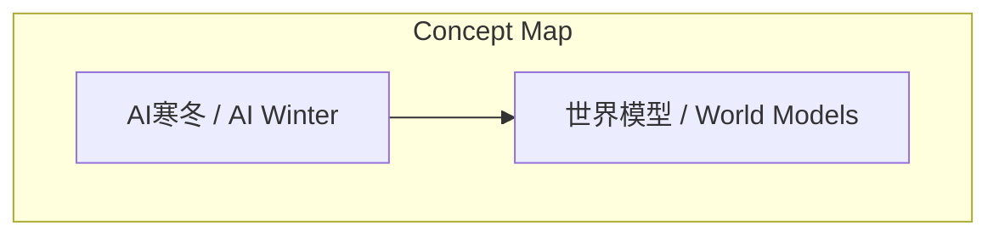
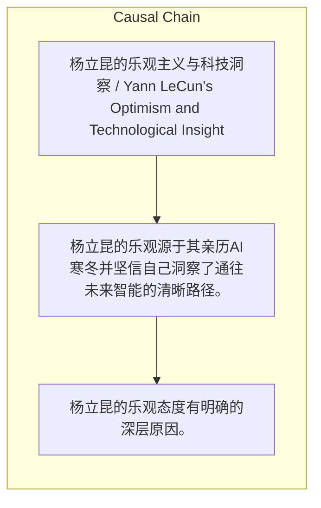

> 杨立昆的乐观源于其亲历AI寒冬并坚信自己洞察了通往未来智能的清晰路径。

## 元信息
- 分类：`ai-software/models-research`
- 优先级：`medium` (`12`)
- 文档类型：`text-summary`
- 来源分组：`news`
- 原始文件：`reports/news/2026-03-23/1774225293586-news-news-task-1774225266355-u7qhrv.md`
- 请求 ID：`1774225266355-u7qhrv`

## 原始内容

#### 文本总结

##### 运行信息
- model: stepfun/step-3.5-flash:free
- schema_fallback: yes
- attempted_models: stepfun/step-3.5-flash:free

### 杨立昆乐观源于AI寒冬经历与科技洞察自信

#### 整体结构化文档表达
##### 文档卡片
- 主题（中文/English）：杨立昆的乐观主义与科技洞察 / Yann LeCun's Optimism and Technological Insight
- 一句话摘要：杨立昆的乐观源于其亲历AI寒冬并坚信自己洞察了通往未来智能的清晰路径。
- 目标读者：AI研究者、科技政策制定者、科技爱好者
- 核心结论（3条）：
- 杨立昆的乐观态度有明确的深层原因。
- 穿越AI寒冬并获胜的经历为其提供了强大的心理支撑。
- 他极度自信能清晰洞察科技发展的真实脉络。

##### 内容结构树
1. 背景与问题定义
2. 核心观点与关键证据
3. 方法/机制/路径
4. 风险与边界条件
5. 结论与行动建议

##### 结构化元数据（JSON）
```json
{
  "title": "杨立昆乐观源于AI寒冬经历与科技洞察自信",
  "topic_zh": "杨立昆的乐观主义与科技洞察",
  "topic_en": "Yann LeCun's Optimism and Technological Insight",
  "audience": "AI研究者、科技政策制定者、科技爱好者",
  "claims": [
    "杨立昆是一个非常乐观的人。",
    "他的乐观来源于两个深层原因。",
    "他亲历过人工智能的极度低谷（AI寒冬）并坚持路线最终获胜。",
    "他坚信自己能够清晰洞察科技发展的真实脉络。",
    "他的乐观本质上是一种极度的自信（confidence）。"
  ],
  "evidence": [
    "他穿越过'AI寒冬'并最终获胜（深度学习和神经网络的最终爆发）。",
    "他经常将当下关于'世界模型'的探索与过去深度学习的发展历程相类比，认为两者情况'一模一样'。"
  ],
  "risks": [],
  "actions": []
}
```

#### 处理流程
1. 输入识别
2. 信息抽取（实体、概念、问题、事实、观点）
3. 结构化归纳（定义/分类/比较/因果/方法论）
4. 关系建模（概念关系、等式/方程/逻辑链）
5. 可视化表达（Mermaid）

#### 概念清单（中英文）
- AI寒冬 / AI Winter
- 世界模型 / World Models

#### 概念定义（中英文）
##### AI寒冬 / AI Winter
- 中文定义：人工智能发展的极度低谷期，充满质疑的漫长岁月。
- English Definition: A period of extreme downturn in AI development, a long era filled with skepticism.

##### 世界模型 / World Models
- 中文定义：当前人工智能领域关于探索未来智能的重要方向。
- English Definition: A current important direction in AI research concerning the exploration of future intelligence.


#### 概念关联与逻辑关系（中英文）
- AI寒冬/AI Winter -> 心理支撑/Psychological Support | concept | 经历导致
- 科技发展真实脉络洞察/Insight into the True Thread of Technological Development -> 乐观态度/Optimistic Attitude | concept | 强化
- 深度学习发展历程/History of Deep Learning Development -> 世界模型探索/World Models Exploration | concept | 类比

##### 可形式化关系
- 经历AI寒冬并最终获胜 → 积淀强大的心理支撑和信心
- 坚信自己能够清晰洞察科技发展的真实脉络 → 形成极度自信（confidence）
- 将当下'世界模型'探索与过去深度学习发展类比（情况'一模一样'） → 坚信当前路线是清晰且重要的

#### COT逻辑梳理（定义/分类/比较/因果/科学方法论）
- Step 1: 提出核心观点：杨立昆是一个乐观的人，其乐观有深层原因。
- Step 2: 阐述原因一：亲历并穿越AI寒冬、最终获胜的经历，为其提供了心理支撑和信心。
- Step 3: 阐述原因二：他极度自信，坚信自己能像过去看清深度学习一样，看清当前'世界模型'探索是通往未来的清晰道路。

#### 事实与看法（区分）
##### 事实
- 杨立昆亲历过人工智能的极度低谷（AI寒冬）。
- 他坚持了自己的路线，并最终向所有人证明他是对的（深度学习和神经网络的最终爆发）。
- 杨立昆经常将当下关于'世界模型'的探索与过去深度学习的发展历程相类比。

##### 看法
- 杨立昆是一个非常乐观的人。
- 他的乐观本质上是一种极度的自信（confidence）。
- 他确信自己当前正在关注的事情是真正重要的。
- 他所看到的通往未来智能的路线是一条无比清晰的道路。

#### FAQ（原文问题整理）
- 未发现明确 FAQ

#### Visualization
##### Mermaid 图 1（概念结构图）


##### Mermaid 图 2（逻辑/因果图）


#### 文章中的类比
- 将当下关于'世界模型'的探索与过去深度学习的发展历程相类比，认为两者的情况'一模一样'。

#### 10个金句
- 原文未提供
