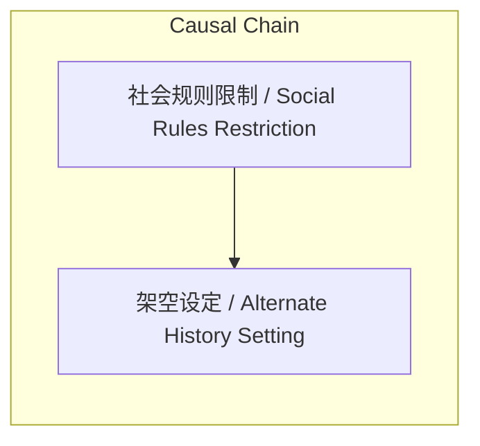

> 叶县故事展示历史小说创作中社会规则与逻辑自洽的重要性

## 元信息
- 分类：`ai-software/models-research`
- 优先级：`high` (`13`)
- 文档类型：`text-summary`
- 来源分组：`news`
- 原始文件：`reports/news/2026-03-29/1774779748424-news-news-task-1774779731785-x0demn.md`
- 请求 ID：`1774779731785-x0demn`

## 原始内容

#### 文本总结

##### 运行信息
- model: openrouter/free
- schema_fallback: yes
- attempted_models: stepfun/step-3.5-flash:free, qwen/qwen-2.5-72b-instruct:free, deepseek/deepseek-chat:free, openrouter/free

### 叶县故事揭示历史小说创作逻辑

#### 整体结构化文档表达
##### 文档卡片
- 主题（中文/English）：叶县故事 / Ye County Story
- 一句话摘要：叶县故事展示历史小说创作中社会规则与逻辑自洽的重要性
- 目标读者：历史小说读者
- 核心结论（3条）：
- 西方《灰姑娘》原型源自中国叶县故事
- 历史小说需符合当时的社会规则与三观
- 真实历史语境下故事逻辑不通需架空设定

##### 内容结构树
1. 背景与问题定义
2. 核心观点与关键证据
3. 方法/机制/路径
4. 风险与边界条件
5. 结论与行动建议

##### 结构化元数据（JSON）
```json
{
  "title": "叶县故事揭示历史小说创作逻辑",
  "topic_zh": "叶县故事",
  "topic_en": "Ye County Story",
  "audience": "历史小说读者",
  "claims": [
    "叶县故事发生在虚构的南蛮国",
    "金鱼骨灰埋门槛下有求必应",
    "海外岛主拿绣花鞋寻找失主"
  ],
  "evidence": [
    "叶县生母早逝后受继母和三个姐姐虐待",
    "金鱼被姐姐残忍踩死",
    "绣花鞋几经辗转落入海外岛主手中"
  ],
  "risks": [],
  "actions": []
}
```

#### 处理流程
1. 输入识别
2. 信息抽取（实体、概念、问题、事实、观点）
3. 结构化归纳（定义/分类/比较/因果/方法论）
4. 关系建模（概念关系、等式/方程/逻辑链）
5. 可视化表达（Mermaid）

#### 概念清单（中英文）
- 社会规则 / Social Rules
- 三观 / Three Views
- 架空 / Alternate History

#### 概念定义（中英文）
##### 社会规则 / Social Rules
- 中文定义：特定历史时期的社会行为规范和制度约束
- English Definition: Social behavior norms and institutional constraints in specific historical periods

##### 三观 / Three Views
- 中文定义：世界观、人生观、价值观的合称
- English Definition: A collective term for worldview, outlook on life, and values

##### 架空 / Alternate History
- 中文定义：脱离真实历史背景的虚构设定
- English Definition: Fictional settings detached from real historical backgrounds


#### 概念关联与逻辑关系（中英文）
- 叶县故事/Ye County Story -> 灰姑娘故事/Cinderella Story | comparison | 原型关系
- 社会规则限制/Social Rules Restriction -> 架空设定/Alternate History Setting | causal | 逻辑推理

##### 可形式化关系
- 叶县故事 ∈ 中国古代童话
- 灰姑娘故事 ∈ 西方经典童话
- 架空设定 ∈ 历史小说创作策略

#### COT逻辑梳理（定义/分类/比较/因果/科学方法论）
- Step 1: 叶县故事与灰姑娘故事内核相似
- Step 2: 欧洲中世纪社会规则允许故事逻辑成立
- Step 3: 中国古代皇权严苛导致故事逻辑不通
- Step 4: 作者选择架空设定确保故事自洽

#### 事实与看法（区分）
##### 事实
- 叶县故事发生在虚构的南蛮国
- 金鱼骨灰埋门槛下有求必应
- 海外岛主拿绣花鞋寻找失主

##### 看法
- 历史小说必须符合当时的社会规则与逻辑
- 叶县故事是灰姑娘的最早原型
- 架空设定是历史小说创作的必然选择

#### FAQ（原文问题整理）
##### 为什么叶县故事在中国不像灰姑娘那样著名？
- 因为叶县故事需要架空设定才能逻辑自洽，而灰姑娘符合欧洲中世纪的社会规则

##### 什么是历史小说中的'三观'？
- 指世界观、人生观、价值观，即特定历史时期人们的思维方式和价值判断

##### 为什么不能将灰姑娘直接搬到中国古代？
- 因为中国古代皇权控制力极强，皇宫戒备森严，单身女子不可能自由出入

#### Visualization
##### Mermaid 图 1（概念结构图）


##### Mermaid 图 2（逻辑/因果图）


#### 文章中的类比
- 叶县故事与灰姑娘的关系，如同中国古代神话与西方神话的关系

#### 10个金句
- 一部好的历史小说必须符合当时的社会规则与逻辑，否则就只能走向架空
