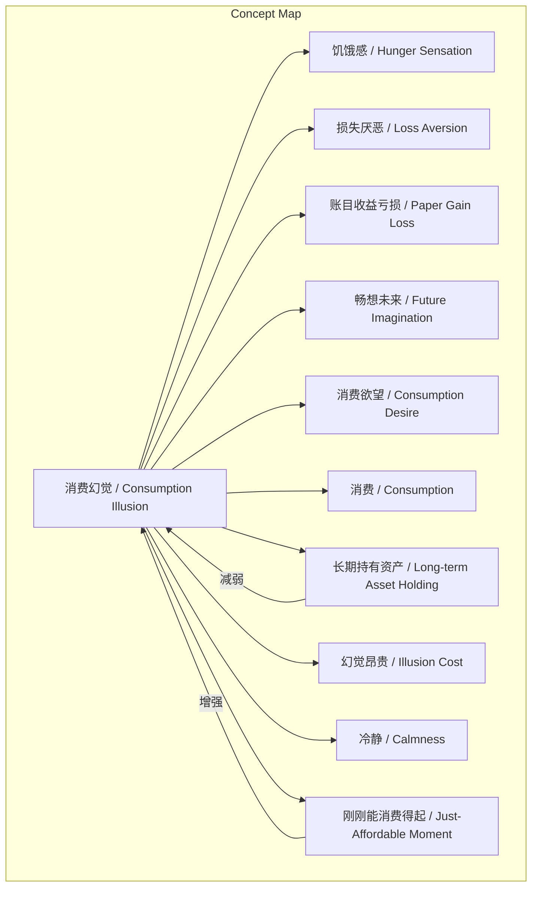
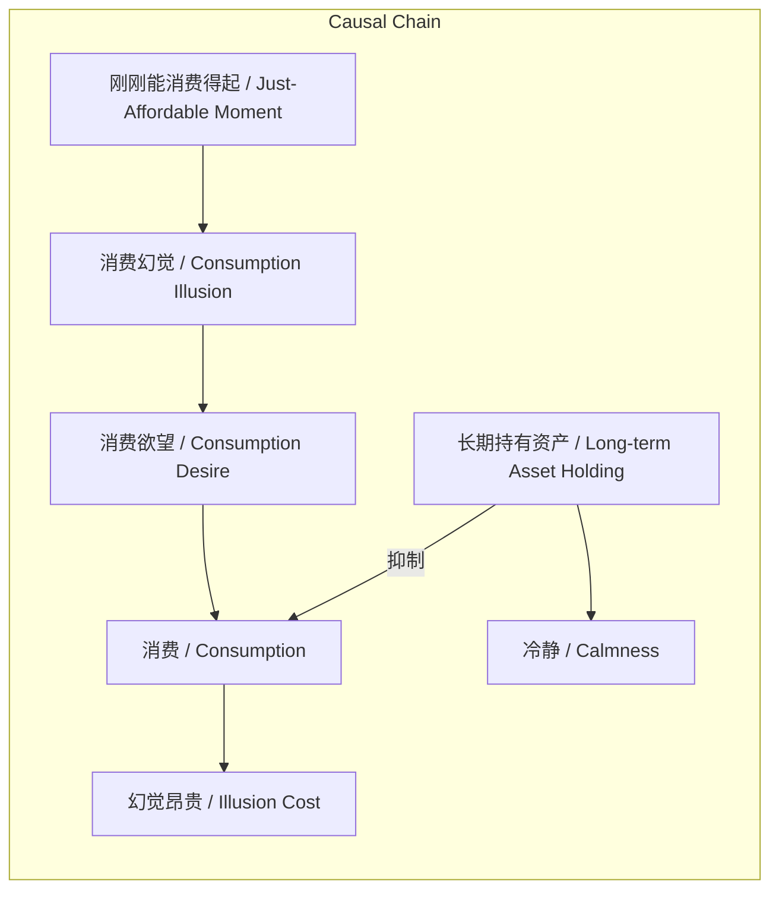

> 文章揭示了人在经济状况变化时产生的多种消费心理错觉，并指出通过长期持有优质资产可避免其负面影响。

## 元信息
- 分类：`markets-wealth/investing-strategy`
- 优先级：`high` (`13`)
- 文档类型：`text-summary`
- 来源分组：`news`
- 原始文件：`reports/news/2026-03-20/1773965523398-news-news-task-1773965426631-nehgvp.md`
- 请求 ID：`1773965426631-nehgvp`

## 原始内容

#### 文本总结

### 消费幻觉的识别与应对

#### 整体结构化文档表达
##### 文档卡片
- 主题（中文/English）：消费幻觉 / Consumption Illusion
- 一句话摘要：文章揭示了人在经济状况变化时产生的多种消费心理错觉，并指出通过长期持有优质资产可避免其负面影响。
- 目标读者：对个人理财与行为经济学感兴趣的普通读者
- 核心结论（3条）：
  1. 消费幻觉在刚能消费时最强烈。
  2. 损失厌恶导致对账面亏损更敏感。
  3. 持有长期资产是应对幻觉的有效策略。

##### 内容结构树
1. 背景与问题定义：未提及明确背景，但隐含问题为人们常因心理错觉做出非理性消费决策。
2. 核心观点与关键证据：列举8点具体表现，如饥饿感幻觉、损失厌恶、消费欲望源于经济不足等。
3. 方法/机制/路径：找到值得长期持有的资产并持有，避免即时消费。
4. 风险与边界条件：消费幻觉在刚刚能消费得起时最强烈，此时决策风险最高。
5. 结论与行动建议：结论如核心结论；行动建议包括识别幻觉状态、配置长期资产、延迟消费决策。

##### 结构化元数据（JSON）
```json
{
  "title": "消费幻觉的识别与应对",
  "topic_zh": "消费幻觉",
  "topic_en": "Consumption Illusion",
  "audience": "对个人理财与行为经济学感兴趣的普通读者",
  "claims": [
    "消费幻觉在刚能消费时最强烈",
    "损失厌恶导致对账面亏损更敏感",
    "持有长期资产是应对幻觉的有效策略"
  ],
  "evidence": [
    "减肥时饿是一种幻觉，吃了东西反而感觉更饿",
    "赚到的钱丢了比原本的钱丢了更难受，账目收益亏损更难受",
    "赚了钱会不由自主畅想未来",
    "消费欲望是幻觉，因穷而想消费",
    "现在消费相当于花掉未来",
    "找到值得长期持有的资产就应持有，否则幻觉会昂贵",
    "若干年后能买得起会变得冷静，不会乱消费",
    "消费幻觉最强烈在刚刚能消费得起时"
  ],
  "risks": [
    "在消费幻觉强烈时做出冲动消费决策"
  ],
  "actions": [
    "识别自身所处的经济状态与幻觉强度",
    "寻找并长期持有优质资产",
    "延迟消费决策以冷静评估"
  ]
}
```

#### 处理流程
1. 输入识别：识别出用户输入为关于消费幻觉的8点论述文本。
2. 信息抽取：抽取了概念（如消费幻觉、损失厌恶）、问题（如何应对消费幻觉）、事实（8点具体表现）、观点（作者对幻觉成因和应对的看法）。
3. 结构化归纳：将内容归纳为背景、观点、方法、风险、结论五个部分。
4. 关系建模：建立了消费幻觉与经济状态、损失厌恶与心理感受、资产持有与幻觉减弱等关系。
5. 可视化表达：生成了概念结构图和逻辑因果图。

#### 概念清单（中英文）
- 消费幻觉 / Consumption Illusion
- 饥饿感 / Hunger Sensation
- 损失厌恶 / Loss Aversion
- 账目收益亏损 / Paper Gain Loss
- 畅想未来 / Future Imagination
- 消费欲望 / Consumption Desire
- 消费 / Consumption
- 长期持有资产 / Long-term Asset Holding
- 幻觉昂贵 / Illusion Cost
- 冷静 / Calmness
- 刚刚能消费得起 / Just-Affordable Moment

#### 概念定义（中英文）
- 消费幻觉 / Consumption Illusion：指人在特定经济状态下产生的非理性消费心理错觉，导致对消费、损失和未来产生扭曲认知。
- 饥饿感 / Hunger Sensation：在减肥过程中，因心理作用产生的饥饿错觉，实际进食后反而加剧。
- 损失厌恶 / Loss Aversion：行为经济学概念，指人们对损失的敏感度远高于对同等金额收益的敏感度，尤其对已赚取资金的损失更难以接受。
- 账目收益亏损 / Paper Gain Loss：指投资或账面上未实现的收益减少或亏损，相比实际资金损失更引发不适。
- 畅想未来 / Future Imagination：赚钱后不由自主地想象未来消费场景，受消费幻觉驱动。
- 消费欲望 / Consumption Desire：因经济状况不足（穷）而产生的强烈购物冲动，是一种心理幻觉。
- 消费 / Consumption：指购买商品或服务的行为，在文中受消费幻觉驱动。
- 长期持有资产 / Long-term Asset Holding：将资金配置于值得长期持有的资产，避免短期消费，以抵御消费幻觉。
- 幻觉昂贵 / Illusion Cost：指因消费幻觉做出错误决策而付出的隐性代价，随时间推移变得显著。
- 冷静 / Calmness：当经济能力提升至能轻松购买某物时，对该物的消费冲动减弱，决策更理性。
- 刚刚能消费得起 / Just-Affordable Moment：指个人经济状况首次达到可购买某商品或服务但尚未完全宽裕的阶段，消费幻觉最强烈。

#### 概念关联与逻辑关系（中英文）
1. 消费幻觉 / Consumption Illusion 在 刚刚能消费得起时 / Just-Affordable Moment 达到峰值。
2. 损失厌恶 / Loss Aversion 导致对 账目收益亏损 / Paper Gain Loss 的心理痛苦大于实际资金损失。
3. 长期持有资产 / Long-term Asset Holding 与 时间 / Time 共同减弱 消费幻觉 / Consumption Illusion。

#### COT逻辑梳理（定义/分类/比较/因果/科学方法论）
- Step 1: 定义 - 消费幻觉是核心概念，指非理性消费心理错觉。
- Step 2: 分类 - 幻觉类型包括饥饿幻觉、损失幻觉、未来畅想幻觉、消费欲望幻觉。
- Step 3: 比较 - 比较不同经济状态：穷时、刚能消费时、富有后，幻觉强度变化。
- Step 4: 因果 - 因经济状况变化（如刚能消费）导致幻觉增强；因持有长期资产导致幻觉减弱。
- Step 5: 科学方法论 - 基于行为经济学原理（如损失厌恶），提出通过资产配置应对幻觉的实践方法。

#### 事实与看法（病毒）
##### 事实
- 未发现明确可核验的客观事实（原文均为作者观点或观察）。
##### 看法
- 减肥时饿是一种幻觉，吃了东西反而感觉更饿。
- 赚到的钱丢了比原本的钱丢了更难受，账目收益亏损更难受。
- 赚了钱会不由自主畅想未来。
- 消费欲望是幻觉，因穷而想消费。
- 现在消费相当于花掉未来。
- 找到值得长期持有的资产就应持有，否则幻觉会昂贵。
- 若干年后能买得起会变得冷静，不会乱消费。
- 消费幻觉最强烈在刚刚能消费得起时。

#### FAQ（原文问题整理）
- 未发现明确提问（原文为陈述句）。

#### Visualization
##### Mermaid 图 1（概念结构图）


##### Mermaid 图 2（逻辑/因果图）


#### 文章中的类比
- 未发现明确类比。

#### 10个金句
1. 减肥的时候 饿是一种幻觉 体现在如果你吃了东西 会感觉越饿
2. 我们最厌恶的损失是赚到的钱丢了 而不是原本的钱丢了 账目收益亏损更难受
3. 赚了钱了 不由自主地畅想未来
4. 消费欲望是一种幻觉 你之所以想消费是因为你穷 还不够富有
5. 现在如果消费 就相当于花掉了未来
6. 找到了值得长期持有的资产 就应该把钱放在那里 不然以后你会发现 当初的幻觉有多么昂贵
7. 若干年后 因为您能买的起 就会变得冷静 不会乱消费
8. 消费幻觉最强烈的时候出现在刚刚能消费得起的时候
9. 原文未提供
10. 原文未提供
