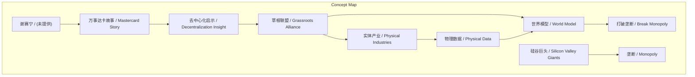
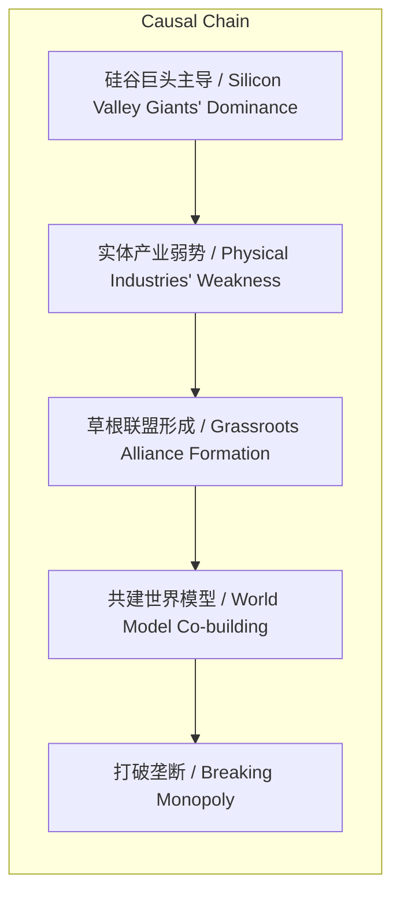

> 谢赛宁借万事达卡发源故事，阐述AMI Labs联合实体产业构建去中心化“世界模型”以打破AI巨头垄断的愿景。

## 元信息
- 分类：`markets-wealth/investing-strategy`
- 优先级：`medium` (`12`)
- 文档类型：`text-summary`
- 来源分组：`news`
- 原始文件：`reports/news/2026-03-21/1774103794245-news-news-task-1774103678117-lez3rt.md`
- 请求 ID：`1774103678117-lez3rt`

## 原始内容

#### 文本总结

### 去中心化联盟构建世界模型破局AI垄断

#### 整体结构化文档表达
##### 文档卡片
- 主题（中文/English）：去中心化AI联盟与世界模型构建 / Decentralized AI Alliance & World Model Building
- 一句话摘要：谢赛宁借万事达卡发源故事，阐述AMI Labs联合实体产业构建去中心化“世界模型”以打破AI巨头垄断的愿景。
- 目标读者：AI产业从业者、实体行业决策者、科技投资者
- 核心结论（3条）：
  1. AMI Labs旨在构建“去中心化”的AI发展模式，避免重蹈巨头垄断覆辙。
  2. 其路径是联合千行百业，利用其真实物理数据与痛点，共建“世界模型”。
  3. 该模式以万事达卡诞生为喻，强调“草根联盟”对抗单一主导者的可行性。

##### 内容结构树
1. 背景与问题定义：当前AI领域由少数硅谷巨头主导，实体产业虽有数据和需求但处于弱势焦虑。
2. 核心观点与关键证据：核心观点是“反向OpenAI”的去中心化联盟模式。关键证据是万事达卡发源故事（Visa隐瞒盈利、小银行恐慌、联合成立Mastercard）。
3. 方法/机制/路径：联合实体产业，结盟共建“世界模型”，实现去中心化。
4. 风险与边界条件：未提及明确风险。
5. 结论与行动建议：未提供具体行动建议，仅阐述战略愿景。

##### 结构化元数据（JSON）
```json
{
  "title": "去中心化联盟构建世界模型破局AI垄断",
  "topic_zh": "去中心化AI联盟与世界模型构建",
  "topic_en": "Decentralized AI Alliance & World Model Building",
  "audience": "AI产业从业者、实体行业决策者、科技投资者",
  "claims": [
    "AMI Labs旨在构建“去中心化”的AI发展模式，避免重蹈巨头垄断覆辙。",
    "其路径是联合千行百业，利用其真实物理数据与痛点，共建“世界模型”。",
    "该模式以万事达卡诞生为喻，强调“草根联盟”对抗单一主导者的可行性。"
  ],
  "evidence": [
    "美国银行首创Visa卡并隐瞒盈利",
    "小型银行因恐慌而联合",
    "万事达卡由小银行联盟推出",
    "谢赛宁将此故事用于解释AMI Labs模式"
  ],
  "risks": ["未提及"],
  "actions": ["未提供具体行动建议"]
}
```

#### 处理流程
1. 输入识别（来源：用户输入文本）
2. 信息抽取（实体、概念、问题、事实、观点）
3. 结构化归纳（定义/分类/比较/因果/方法论）
4. 关系建模（概念关系、等式/方程/逻辑链）
5. 可视化表达（Mermaid）

#### 概念清单（中英文）
- 谢赛宁 / (未提及)
- 万事达卡 / Mastercard
- 世界模型 / World Model
- AMI Labs / AMI Labs
- 杨立昆 / Yann LeCun
- 反向OpenAI模式 / Reverse OpenAI Model
- 去中心化 / Decentralization
- 草根联盟 / Grassroots Alliance
- 硅谷巨头 / Silicon Valley Giants
- 实体产业 / Physical Industries
- 物理数据 / Physical Data

#### 概念定义（中英文）
- 谢赛宁：访谈中的讲述者，AMI Labs联合创始人之一。
- 万事达卡：由小型银行联合推出的信用卡品牌，在故事中象征联盟对抗主导者的成功案例。
- 世界模型：AMI Labs旨在构建的、能够模拟真实物理世界的AI模型体系，需多方数据共建。
- AMI Labs：由谢赛宁与杨立昆创办的实验室，致力于去中心化AI发展。
- 杨立昆：AMI Labs联合创始人，AI领域知名学者。
- 反向OpenAI模式：区别于OpenAI等巨头中心化开发模式的路径，强调联合实体产业共建共享。
- 去中心化：不依赖单一中心控制，由多个参与者协作、共享利益的模式。
- 草根联盟：由小型实体（如本地银行）自发联合形成的协作组织，以对抗市场主导者。
- 硅谷巨头：指OpenAI、Google等主导AI大模型开发的少数科技公司。
- 实体产业：指农场、医院、工厂等拥有真实物理场景和数据的传统行业。
- 物理数据：实体产业在真实物理世界中产生的数据，是训练世界模型的关键资源。

#### 概念关联与逻辑关系（中英文）
1. 硅谷巨头 / Silicon Valley Giants 的垄断行为 导致 实体产业 / Physical Industries 的弱势与焦虑。
2. 草根联盟 / Grassroots Alliance 的组建 旨在 实现 去中心化 / Decentralization 的AI发展模式。
3. 实体产业 / Physical Industries 的物理数据 / Physical Data 与 去中心化模式 / Decentralization 共同驱动 世界模型 / World Model 的构建。

#### COT逻辑梳理（定义/分类/比较/因果/科学方法论）
- Step 1: 定义核心概念。世界模型指模拟物理世界的AI模型；去中心化指多方协作模式；草根联盟指弱势方联合组织。
- Step 2: 分类AI发展模式。分为中心化（巨头主导）与去中心化（联盟共建）两类。
- Step 3: 比较两种模式。中心化模式易导致垄断，去中心化模式促进共享与抗垄断。
- Step 4: 建立因果链。硅谷巨头垄断 → 实体产业焦虑 → 草根联盟形成 → 共建世界模型 → 打破垄断。
- Step 5: 方法论。采用历史类比法，通过万事达卡案例推导去中心化路径在AI领域的可行性。

#### 事实与看法（病毒）
##### 事实
- 美国银行（BOA）首创了信用卡模式并推出了Visa卡。
- Visa卡最初被美国银行隐瞒盈利，谎称赔钱。
- 财务数据公开后，小型银行陷入恐慌。
- 小型本地银行联合组建了万事达卡（Mastercard）。
- 谢赛宁在访谈中分享了这个故事。
- 谢赛宁与杨立昆创办了AMI Labs。
- 千行百业（如农场、医院、工厂）拥有海量真实物理数据。
##### 看法
- 硅谷少数巨头（如OpenAI、Google）试图主导和垄断底层大模型叙事。
- 千行百业在巨头面前处于弱势和焦虑。
- AMI Labs的目标是成为“去中心化”的草根联盟，而非垄断巨头。
- 通过合作共建世界模型可以打破单一巨头垄断。
- 万事达卡诞生路径可效仿于AI领域。

#### FAQ（原文问题整理）
- 问：谢赛宁为何要讲万事达卡发源的趣事？
  答：为了解释AMI Labs构想的“反向OpenAI”去中心化模式，即联合实体产业共建世界模型以打破AI巨头垄断。

#### Visualization
##### Mermaid 图 1（概念结构图）

##### Mermaid 图 2（逻辑/因果图）


#### 文章中的类比
- 将当前AI领域巨头比作当年美国银行，将AMI Labs的去中心化联盟模式比作万事达卡的诞生。

#### 10个金句
1. “Visa的‘闷声发大财’”
2. “谎言拆穿与同行的恐慌”
3. “小银行联合组建‘草根联盟’”
4. “谢赛宁借用这个故事，是为了解释他与杨立昆创办AMI Labs时构想的‘反向OpenAI’模式”
5. “在当前的AI浪潮中，硅谷的少数巨头（如OpenAI、Google等）就像当年的美国银行一样试图主导和垄断底层的大模型叙事”
6. “存在于硅谷视野之外的千行百业（如农场、医院、实体工厂等）虽然掌握着海量真实的物理数据并且极度渴望AI的赋能，但在巨头面前却处于弱势和焦虑之中”
7. “AMI Labs的目标并不想成为另一个垄断巨头”
8. “希望效仿万事达卡的诞生路径，走向‘去中心化’”
9. “将这些拥有真实痛点与数据的实体产业联合起来，结成一个强大的‘草根联盟’”
10. “大家通过合作共建真正的世界模型，从而打破单一巨头的垄断，共同完成下一次AI革命”
