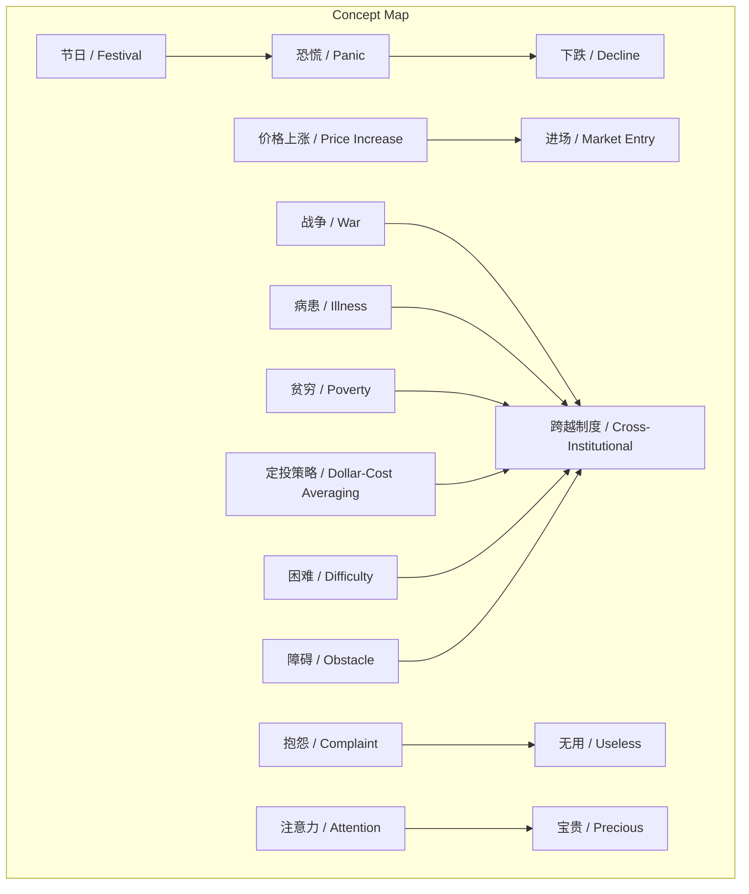
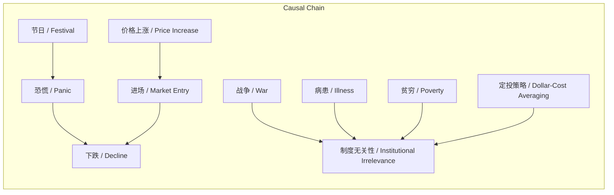

> 定投策略通过应对普遍人性弱点和跨越制度的风险，实现有效性。

## 元信息
- 分类：`markets-wealth/investing-strategy`
- 优先级：`high` (`13`)
- 文档类型：`text-summary`
- 来源分组：`news`
- 原始文件：`reports/news/2026-03-21/1774102919368-news-news-task-1774102795974-gdpxts.md`
- 请求 ID：`1774102795974-gdpxts`

## 原始内容

#### 文本总结

### 定投策略有效性跨越制度限制

#### 整体结构化文档表达
##### 文档卡片
- 主题（中文/English）：定投策略的制度无关性 / Dollar-Cost Averaging's Institutional Irrelevance
- 一句话摘要：定投策略通过应对普遍人性弱点和跨越制度的风险，实现有效性。
- 目标读者：投资者、金融学习者
- 核心结论（3条）：
  1. 定投策略有效因其跨越制度限制。
  2. 投资者行为受节日效应等普遍心理影响，导致追涨杀跌。
  3. 抱怨无用，应专注可控因素如坚持定投。

##### 内容结构树
1. 背景与问题定义：投资者在节日等时间点恐慌性抛售，价格上涨时追涨，导致“一买就下跌”的现象。
2. 核心观点与关键证据：定投策略制度无关，因为战争、病患、贫穷等风险跨越制度和时空；日常困难障碍也跨越制度；抱怨无益，注意力宝贵。
3. 方法/机制/路径：定期定额投资（定投）作为应对策略。
4. 风险与边界条件：未明确提及。
5. 结论与行动建议：采用定投策略，避免抱怨，将注意力集中于可控制因素。

##### 结构化元数据（JSON）
```json
{
  "title": "定投策略有效性跨越制度限制",
  "topic_zh": "定投策略的制度无关性",
  "topic_en": "Dollar-Cost Averaging's Institutional Irrelevance",
  "audience": "投资者、金融学习者",
  "claims": ["定投策略有效因其跨越制度", "投资者行为受普遍心理影响", "抱怨无用，应专注定投"],
  "evidence": ["一般节日投资者恐慌造成下跌", "价格上涨吸引人进场导致一买就跌", "战争、病患、贫穷跨越制度和时空", "困难障碍跨越制度", "注意力宝贵"],
  "risks": ["未提及"],
  "actions": ["采用定投策略", "避免抱怨，专注可控因素"]
}
```

#### 处理流程
1. 输入识别：未提及
2. 信息抽取：未提及
3. 结构化归纳：未提及
4. 关系建模：未提及
5. 可视化表达：未提及

#### 概念清单（中英文）
- 定投策略 / Dollar-Cost Averaging
- 节日 / Festival
- 投资者 / Investor
- 恐慌 / Panic
- 下跌 / Decline
- 价格上涨 / Price Increase
- 进场 / Market Entry
- 政治 / Politics
- 战争 / War
- 病患 / Illness
- 贫穷 / Poverty
- 制度 / Institution
- 时空 / Time and Space
- 困难 / Difficulty
- 障碍 / Obstacle
- 抱怨 / Complaint
- 注意力 / Attention
- 宝贵 / Precious

#### 概念定义（中英文）
- 定投策略 / Dollar-Cost Averaging：一种定期定额投资方法，据称其有效性不依赖于特定制度环境。
- 节日 / Festival：指投资者容易产生恐慌情绪的时间点，可能导致市场下跌。
- 投资者 / Investor：参与金融市场投资的主体。
- 恐慌 / Panic：投资者在特定时期产生的非理性恐惧情绪。
- 下跌 / Decline：市场价格下降的现象。
- 价格上涨 / Price Increase：市场价格上升的现象。
- 进场 / Market Entry：投资者进入市场进行购买的行为。
- 政治 / Politics：与社会治理相关的活动，文中被排除讨论范围。
- 战争 / War：大规模武装冲突，被视为跨越制度的存在。
- 病患 / Illness：健康问题，被视为跨越制度的存在。
- 贫穷 / Poverty：经济贫困状态，被视为跨越制度的存在。
- 制度 / Institution：社会或组织的规则体系，定投策略被认为与之无关。
- 时空 / Time and Space：时间和空间的维度，某些存在跨越此维度。
- 困难 / Difficulty：遇到的挑战或逆境。
- 障碍 / Obstacle：阻碍进展的因素。
- 抱怨 / Complaint：表达不满的行为，文中被认为无用。
- 注意力 / Attention：精神专注的资源，被认为是宝贵的。
- 宝贵 / Precious：具有高度价值或重要性。

#### 概念关联与逻辑关系（中英文）
1. 节日 / Festival 导致 恐慌 / Panic，进而引起 下跌 / Decline。
2. 价格上涨 / Price Increase 吸引 进场 / Market Entry，导致“一买就下跌”现象。
3. 战争 / War、病患 / Illness、贫穷 / Poverty 共同证明 定投策略 / Dollar-Cost Averaging 的 制度无关性 / Institutional Irrelevance。

#### COT逻辑梳理（定义/分类/比较/因果/科学方法论）
- Step 1: 定义 - 定投策略：定期定额投资方法，不依赖制度环境。
- Step 2: 分类 - 风险类型：制度内风险（如政治）与跨越制度风险（如战争、病患、贫穷）。
- Step 3: 比较 - 定投策略 vs 其他策略：定投因应对跨越制度风险而更有效。
- Step 4: 因果 - 节日导致恐慌，恐慌导致下跌；价格上涨吸引进场，进场后下跌。
- Step 5: 科学方法论 - 通过观察普遍现象（节日效应、追涨杀跌）和抽象风险（跨越制度），归纳出定投策略的有效性。

#### 事实与看法（病毒）
##### 事实
- 2020年12月22日（日期）
##### 看法
- 一般节日投资者们都会有一定的恐慌造成下跌。
- 价格上涨吸引人进场。
- 这就是为什么人们一买就下跌。
- 战争、病患、贫穷都是跨越制度和时空的存在。
- 我们遇到的很多困难障碍都是跨越制度的存在。
- 抱怨是没有用的。
- 注意力是宝贵的。
- 我们不讨论政治。
- 定投策略是制度无关的。

#### FAQ（原文问题整理）
- 未发现明确提问

#### Visualization
##### Mermaid 图 1（概念结构图）

##### Mermaid 图 2（逻辑/因果图）


#### 文章中的类比
- 未发现明确类比

#### 10个金句
1. 定投策略是制度无关的。
2. 一般节日投资者们都会有一定的恐慌造成下跌。
3. 价格上涨吸引人进场。
4. 战争、病患、贫穷都是跨越制度和时空的存在。
5. 我们遇到的很多困难障碍都是跨越制度的存在。
6. 抱怨是没有用的。
7. 注意力是宝贵的。
8. 我们不讨论政治。
9. 这就是为什么人们一买就下跌。
10. 原文未提供
