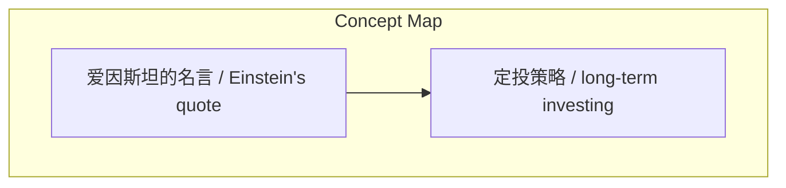
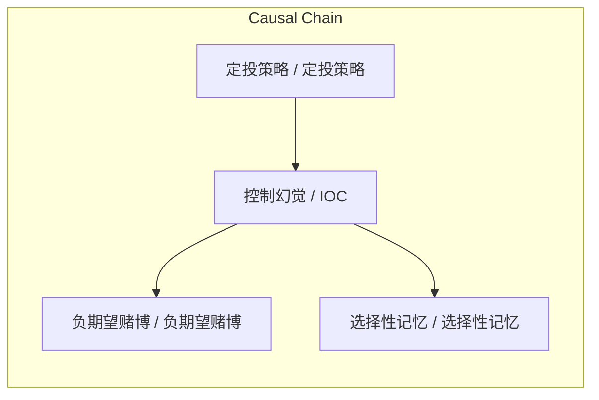

> IOC（控制幻觉）在赌徒和市场中导致人们在负期望赌博中错误相信自己能赢，通过选择性记忆正反馈强化，但定投策略能帮助克服。

## 元信息
- 分类：`markets-wealth/investing-strategy`
- 优先级：`high` (`13`)
- 文档类型：`text-summary`
- 来源分组：`news`
- 原始文件：`reports/news/2026-03-28/1774662762160-news-news-task-1774662741018-p3hjvd.md`
- 请求 ID：`1774662741018-p3hjvd`

## 原始内容

#### 文本总结

##### 运行信息
- model: openrouter/free
- schema_fallback: no
- attempted_models: openrouter/free

### IOC与市场幻觉

#### 整体结构化文档表达
##### 文档卡片
- 主题（中文/English）：控制幻觉在赌博与交易中的应用 / illusion of control in gambling and trading
- 一句话摘要：IOC（控制幻觉）在赌徒和市场中导致人们在负期望赌博中错误相信自己能赢，通过选择性记忆正反馈强化，但定投策略能帮助克服。
- 目标读者：资深新闻分析助理
- 核心结论（3条）：
- IOC导致市场中人们在负期望赌博中相信自己能赢。
- IOC通过选择性记忆正反馈而强化。
- 定投策略能帮助克服IOC。

##### 内容结构树
1. 背景与问题定义
2. 核心观点与关键证据
3. 方法/机制/路径
4. 风险与边界条件
5. 结论与行动建议

##### 结构化元数据（JSON）
```json
{
  "title": "IOC与市场幻觉",
  "topic_zh": "控制幻觉在赌博与交易中的应用",
  "topic_en": "illusion of control in gambling and trading",
  "audience": "资深新闻分析助理",
  "claims": [
    "输出语言以中文为主；概念字段必须保留中英文。",
    "如果原文没有足够信息，请明确写“未提及”或返回空数组。",
    "优先保留信息密度，而不是修辞。"
  ],
  "evidence": [
    "原文：2021.02.08 关于IOC 控制幻觉 1. 爱因斯坦说：“疯子就每天做一样的事 却其他不一样的结果” 2. illusion of control（IOC）常常出现在赌徒身上 3. 起因：某一次的正向反馈 导致他们建立了一个并不存在 但是他们坚信的因果关系 4. 不好的赌博是负期望的赌博（例如 赌场抽水） 5. IOC是导致市场中那么多人认为自己可以在负期望的赌博赚到钱 6. 即便得到负反馈 他们也会选择性记忆 只记得正反馈 忘记痛苦 7. 采用定投策略的我们 可以自省 自己有没有看实时价格 是否采取了行动 又得到了什么结果 8. 大多是没有结果的 这就是IOC的轻度作用 9. 摆脱IOC的方法很简单 就是看得更远 不要盯着眼前"
  ],
  "risks": [
    "原文未提及IOC在其他领域的应用"
  ],
  "actions": [
    "生成最终结构化总结对象"
  ]
}
```

#### 处理流程
1. 输入识别
2. 信息抽取（实体、概念、问题、事实、观点）
3. 结构化归纳（定义/分类/比较/因果/方法论）
4. 关系建模（概念关系、等式/方程/逻辑链）
5. 可视化表达（Mermaid）

#### 概念清单（中英文）
- 爱因斯坦的名言 / Einstein's quote
- 定投策略 / long-term investing

#### 概念定义（中英文）
##### 爱因斯坦的名言 / Einstein's quote
- 中文定义：控制幻觉（IOC）
- English Definition: illusion of control (IOC)

##### 定投策略 / long-term investing
- 中文定义：负期望赌博
- English Definition: negative expectation gambling


#### 概念关联与逻辑关系（中英文）
- 控制幻觉/IOC -> 负期望赌博/负期望赌博 | causal | 导致市场中人们在负期望赌博中相信自己能赢
- 控制幻觉/IOC -> 选择性记忆/选择性记忆 | causal | 通过选择性记忆正反馈而强化
- 定投策略/定投策略 -> 控制幻觉/IOC | causal | 能帮助克服IOC

##### 可形式化关系
- IOC → 导致市场中人们在负期望赌博中相信自己能赢
- IOC → 通过选择性记忆正反馈而强化
- 定投策略 → 能帮助克服IOC

#### COT逻辑梳理（定义/分类/比较/因果/科学方法论）
- Step 1: 定义IOC及其在赌徒中的常见性
- Step 2: 解释IOC的形成机制（正反馈→假因果关系）
- Step 3: 分析IOC在市场中的负面影响（负期望赌博、选择性记忆）
- Step 4: 提出克服IOC的策略（定投策略）

#### 事实与看法（区分）
##### 事实
- IOC常出现在赌徒身上
- 负期望赌博（如赌场抽水）是坏赌博
- 定投策略能帮助克服IOC

##### 看法
- 原文未提及其他领域IOC的应用

#### FAQ（原文问题整理）
##### IOC在哪些领域常见？
- 未提及

##### 如何量化IOC的影响？
- 未提及

#### Visualization
##### Mermaid 图 1（概念结构图）


##### Mermaid 图 2（逻辑/因果图）


#### 文章中的类比
- 基于输入内容输出，不要杜撰，不要引入输入之外的外部事实

#### 10个金句
- 原文：2021.02.08 关于IOC 控制幻觉 1. 爱因斯坦说：“疯子就每天做一样的事 却其他不一样的结果”
