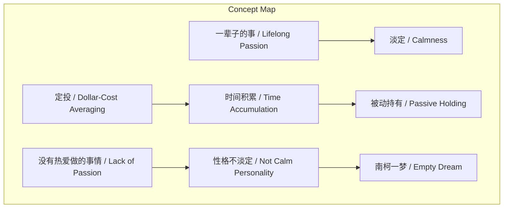
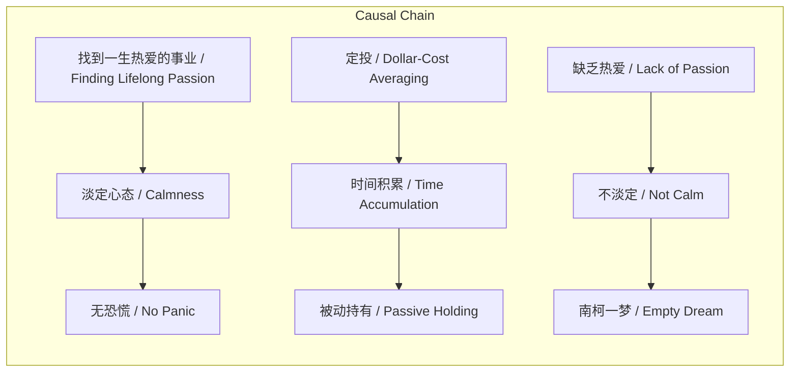

> 在追求长期投资回报的等待期，找到并专注于一生热爱的事业是培养淡定心态、抵御市场波动的关键。

## 元信息
- 分类：`markets-wealth/investing-strategy`
- 优先级：`high` (`13`)
- 文档类型：`text-summary`
- 来源分组：`news`
- 原始文件：`reports/news/2026-03-19/1773962641338-news-news-task-1773962531815-ertssm.md`
- 请求 ID：`1773962531815-ertssm`

## 原始内容

#### 文本总结

### 十倍之前要找到生活方向

#### 整体结构化文档表达
##### 文档卡片
- 主题（中文/English）：长期投资与人生定位 / Long-term Investment and Life Purpose
- 一句话摘要：在追求长期投资回报的等待期，找到并专注于一生热爱的事业是培养淡定心态、抵御市场波动的关键。
- 目标读者：投资者 / Investors
- 核心结论（3条）：
  1. 机构资金通常有期限，罕见能获得十倍回报。
  2. 定投通过时间积累优势，被动长期持有标的。
  3. 找到一生热爱的事业能养成淡定心态，从而无惧市场恐慌。

##### 内容结构树
1. **背景与问题定义**：在漫长等待十倍收益的投资过程中，如何保持心态不恐慌。
2. **核心观点与关键证据**：核心观点是找到一生热爱的事使人淡定；证据包括笑来老师的例子和资本市场中人不淡定的原因分析。
3. **方法/机制/路径**：通过定投积累资产，同时寻找并磨练一生热爱的事业。
4. **风险与边界条件**：风险是性格不淡定，源于缺乏热爱的事业；边界条件未明确提及。
5. **结论与行动建议**：结论是找到一生所爱以保持淡定；行动建议是花时间磨练这件事。

##### 结构化元数据（JSON）
```json
{
  "title": "十倍之前要找到生活方向",
  "topic_zh": "长期投资与人生定位",
  "topic_en": "Long-term Investment and Life Purpose",
  "audience": "投资者",
  "claims": [
    "机构资金通常有期限，罕见能获得十倍回报。",
    "定投通过时间积累优势，被动长期持有标的。",
    "找到一生热爱的事业能养成淡定心态，从而无惧市场恐慌。"
  ],
  "evidence": [
    "定投给我们一个优势，一开始钱很少，时间积累下来之后会无形中被动持有了一个标的很久。",
    "笑来老师愿意做一辈子的事是读书、写书、备课、讲课。",
    "资本市场那么多人南柯一梦（抗不住增长和损失），因为他们不淡定。",
    "一切性格不淡定的人有一个共同的特点：他们没有热爱做的事情。"
  ],
  "risks": [
    "性格不淡定，无法抵御市场波动。",
    "缺乏一生热爱的事业导致心态不稳。"
  ],
  "actions": [
    "在投资等待期，寻找并确定一生真心想做的事业。",
    "花时间慢慢磨练这件事，做得更好。",
    "结合定投策略，积累资产同时培养淡定心态。"
  ]
}
```

#### 处理流程
1. 输入识别：识别到输入文本主题为长期投资中生活方向与心态的关系。
2. 信息抽取：从文本中抽取关键概念如“定投”、“十倍收益”、“一生热爱的事”、“淡定”等；事实陈述如“机构的钱是有期限的”；观点如“要找到一生热爱的事”。
3. 结构化归纳：将内容按背景、观点、方法、风险、结论进行结构化整理。
4. 关系建模：建立“找到一生热爱的事”与“淡定心态”之间的因果关系，以及“定投”与“时间积累”的机制关系。
5. 可视化表达：生成Mermaid图展示概念结构和逻辑因果。

#### 概念清单（中英文）
- 机构的钱 / Institutional Money
- 期限 / Time Limit
- 10倍 / 10x Return
- 定投 / Dollar-Cost Averaging
- 优势 / Advantage
- 时间积累 / Time Accumulation
- 标的 / Asset
- 漫长等待 / Long Wait
- 收益 / Return
- 读书 / Reading
- 健身 / Fitness
- 投资 / Investment
- 帮朋友 / Helping Friends
- 陪家人 / Family Time
- 生活方向 / Life Direction
- 一辈子的事 / Lifelong Passion
- 磨练 / Hone
- 淡定 / Calmness
- 资产增长 / Asset Growth
- 恐慌 / Panic
- 笑来老师 / Teacher Xiao Lai
- 性格 / Personality
- 资本市场 / Capital Market
- 南柯一梦 / Empty Dream
- 增长 / Growth
- 损失 / Loss
- 特点 / Characteristic
- 热爱 / Passion

#### 概念定义（中英文）
- 机构的钱 / Institutional Money：未提及
- 期限 / Time Limit：未提及
- 10倍 / 10x Return：未提及
- 定投 / Dollar-Cost Averaging：未提及
- 优势 / Advantage：未提及
- 时间积累 / Time Accumulation：未提及
- 标的 / Asset：未提及
- 漫长等待 / Long Wait：未提及
- 收益 / Return：未提及
- 读书 / Reading：未提及
- 健身 / Fitness：未提及
- 投资 / Investment：未提及
- 帮朋友 / Helping Friends：未提及
- 陪家人 / Family Time：未提及
- 生活方向 / Life Direction：未提及
- 一辈子的事 / Lifelong Passion：未提及
- 磨练 / Hone：未提及
- 淡定 / Calmness：未提及
- 资产增长 / Asset Growth：未提及
- 恐慌 / Panic：未提及
- 笑来老师 / Teacher Xiao Lai：未提及
- 性格 / Personality：未提及
- 资本市场 / Capital Market：未提及
- 南柯一梦 / Empty Dream：未提及
- 增长 / Growth：未提及
- 损失 / Loss：未提及
- 特点 / Characteristic：未提及
- 热爱 / Passion：未提及

#### 概念关联与逻辑关系（中英文）
1. 找到一生热爱的事业 / Finding Lifelong Passion 导致 淡定心态 / Calmness（文中：找到能做一辈子的事情，就会让我们变得淡定）。
2. 淡定心态 / Calmness 导致 无恐慌 / No Panic（文中：因而没什么可以恐慌）。
3. 定投 / Dollar-Cost Averaging 导致 时间积累 / Time Accumulation，进而导致 被动持有 / Passive Holding（文中：定投给我们一个优势...时间积累下来之后会无形中被动持有了一个标的很久）。
4. 缺乏热爱 / Lack of Passion 导致 不淡定 / Not Calm，进而导致 南柯一梦 / Empty Dream（文中：一切性格不淡定的人有一个共同的特点：他们没有热爱做的事情；资本市场那么多人南柯一梦...因为他们不淡定）。

#### COT逻辑梳理（定义/分类/比较/因果/科学方法论）
- **Step 1: 定义问题**：在长期投资等待十倍收益期间，投资者面临心态维持的挑战。
- **Step 2: 分类**：根据心态分为淡定型与不淡定型投资者。
- **Step 3: 比较**：淡定型投资者通常有终身热爱的事业，不淡定型则缺乏；前者能抵御市场波动，后者易受冲击。
- **Step 4: 因果**：找到并磨练一生热爱的事业 → 养成淡定心态 → 无惧市场恐慌；定投 → 时间积累 → 被动长期持有。
- **Step 5: 科学方法论**：通过定投策略实现资产被动积累，同时系统性地寻找和培养终身事业，以双路径应对投资等待期的心态问题。

#### 事实与看法（病毒）
##### 事实
- 机构的钱是有期限的。
- 罕见有机构拿到10倍。
- 定投给我们一个优势，一开始钱很少，时间积累下来之后会无形中被动持有了一个标的很久。
- 笑来老师愿意做一辈子的事是读书、写书、备课、讲课。
- 笑来老师淡定的性格不是天生的，是养成的。
- 资本市场那么多人南柯一梦（抗不住增长和损失）。
- 一切性格不淡定的人有一个共同的特点：他们没有热爱做的事情。

##### 看法
- 在漫长等待10倍收益的时间中，除了读书、健身、投资、帮朋友和陪家人外，要找到一间自己真心想做一辈子的事。
- 找到之后花时间慢慢磨练，把这件事做得更好。
- 找到能做一辈子的事情，就会让我们变得淡定。
- 因而没什么可以恐慌。
- 资本市场那么多人南柯一梦（抗不住增长和损失），因为他们不淡定。

#### FAQ（原文问题整理）
未发现明确提问。

#### Visualization
##### Mermaid 图 1（概念结构图）


##### Mermaid 图 2（逻辑/因果图）


#### 文章中的类比
- 南柯一梦 / Empty Dream：比喻资本市场中人在增长和损失面前无法坚持，最终如梦幻泡影般失败。

#### 10个金句
1. 机构的钱是有期限的
2. 罕见有机构拿到10倍
3. 定投给我们一个优势
4. 一开始钱很少，时间积累下来之后会无形中被动持有了一个标的很久
5. 在漫长等待10倍收益的时间中，除了读书、健身、投资、帮朋友和陪家人外，要找到一间自己真心想做一辈子的事
6. 找到之后花时间慢慢磨练，把这件事做得更好
7. 找到能做一辈子的事情，就会让我们变得淡定
8. 因而没什么可以恐慌
9. 笑来老师愿意做一辈子的事是读书、写书、备课、讲课
10. 笑来老师淡定的性格不是天生的，是养成的
