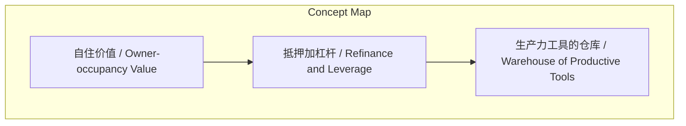
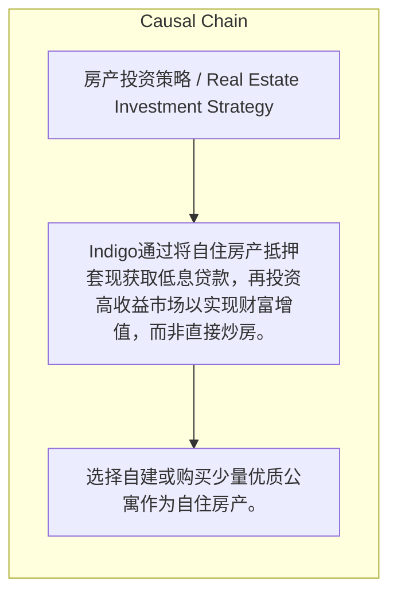

> Indigo通过将自住房产抵押套现获取低息贷款，再投资高收益市场以实现财富增值，而非直接炒房。

## 元信息
- 分类：`markets-wealth/investing-strategy`
- 优先级：`high` (`13`)
- 文档类型：`text-summary`
- 来源分组：`news`
- 原始文件：`reports/news/2026-03-23/1774276112045-news-news-task-1774276073893-mejvqe.md`
- 请求 ID：`1774276073893-mejvqe`

## 原始内容

#### 文本总结

##### 运行信息
- model: stepfun/step-3.5-flash:free
- schema_fallback: yes
- attempted_models: stepfun/step-3.5-flash:free

### Indigo房产投资策略：自住为核，抵押加杠杆

#### 整体结构化文档表达
##### 文档卡片
- 主题（中文/English）：房产投资策略 / Real Estate Investment Strategy
- 一句话摘要：Indigo通过将自住房产抵押套现获取低息贷款，再投资高收益市场以实现财富增值，而非直接炒房。
- 目标读者：未提及
- 核心结论（3条）：
- 房产的核心属性是居住，是'生产力工具的仓库'，首要价值在于让人住得舒服以发挥生产力。
- 策略核心是购买或自建优质房产供自住，而非大量投资或买卖房产赚取差价。
- 通过抵押增值后的自住房产套取低息资金（Refinance），加杠杆投资于高回报市场（如美股、黄金、加密货币）以赚取跨市场利差。

##### 内容结构树
1. 背景与问题定义
2. 核心观点与关键证据
3. 方法/机制/路径
4. 风险与边界条件
5. 结论与行动建议

##### 结构化元数据（JSON）
```json
{
  "title": "Indigo房产投资策略：自住为核，抵押加杠杆",
  "topic_zh": "房产投资策略",
  "topic_en": "Real Estate Investment Strategy",
  "audience": "未提及",
  "claims": [
    "房子是用来住的，不是直接用来炒作的投资品。",
    "房产是非常好的加杠杆工具。",
    "只要其他投资回报率能跑赢房贷利息（4%-5%），就能通过杠杆实现财富有效增值。"
  ],
  "evidence": [
    "具体操作：买地自己建房或买少量公寓自住。",
    "操作方式：将建好的房产抵押给银行借出现金。",
    "资金投向：收益率更高的其他资产，如美股、黄金或加密货币。"
  ],
  "risks": [],
  "actions": [
    "选择自建或购买少量优质公寓作为自住房产。",
    "在房产增值后，将其抵押（Refinance）给银行以套现。",
    "将抵押获得的低息资金投入高收益市场进行投资。"
  ]
}
```

#### 处理流程
1. 输入识别
2. 信息抽取（实体、概念、问题、事实、观点）
3. 结构化归纳（定义/分类/比较/因果/方法论）
4. 关系建模（概念关系、等式/方程/逻辑链）
5. 可视化表达（Mermaid）

#### 概念清单（中英文）
- 自住价值 / Owner-occupancy Value
- 抵押加杠杆 / Refinance and Leverage
- 生产力工具的仓库 / Warehouse of Productive Tools

#### 概念定义（中英文）
##### 自住价值 / Owner-occupancy Value
- 中文定义：房产的首要价值在于居住舒适，以提升个人生产力，而非投资炒作。
- English Definition: The primary value of property lies in comfortable living to enhance personal productivity, not for speculative investment.

##### 抵押加杠杆 / Refinance and Leverage
- 中文定义：将增值后的房产抵押给银行借出现金，利用低息房贷作为杠杆去投资高收益资产。
- English Definition: Mortgaging an appreciated property to borrow cash from a bank, using low-interest mortgage as leverage to invest in high-yield assets.

##### 生产力工具的仓库 / Warehouse of Productive Tools
- 中文定义：将住宅定义为存放人本身（生产力工具）的仓库，强调其居住功能。
- English Definition: Defining residential property as a warehouse storing human beings (productive tools), emphasizing its living function.


#### 概念关联与逻辑关系（中英文）
- 自住价值/Owner-occupancy Value -> 房产核心属性/Core Attribute of Property | concept | 定义
- 抵押加杠杆/Refinance and Leverage -> 加杠杆工具/Leverage Tool | concept | 实现方式
- 低息房贷/Low-interest Mortgage -> 高回报投资/High-return Investment | concept | 利差交易

##### 可形式化关系
- 自住价值 → 房产核心属性
- 抵押套现 → 加杠杆工具
- 低息资金投入高回报市场 → 赚取跨市场利差

#### COT逻辑梳理（定义/分类/比较/因果/科学方法论）
- Step 1: 购买或自建优质房产作为自住房，确保其居住价值与未来增值潜力。
- Step 2: 房产增值后，将其抵押（Refinance）给银行，套取低息现金（利息约4%-5%）。
- Step 3: 将抵押所得资金投入高收益市场（如美股、黄金、加密货币），追求回报率跑赢房贷利息。

#### 事实与看法（区分）
##### 事实
- 房贷利息相对较低，例如每年4%-5%。
- 投资市场包括美股、黄金或加密货币等。

##### 看法
- Indigo认为房产的核心属性是居住，而不是投资品。
- Indigo不热衷于大量投资房地产或通过买卖赚取差价。
- Indigo将高质量自住房产视为稳健的底层抵押物。

#### FAQ（原文问题整理）
- 未发现明确 FAQ

#### Visualization
##### Mermaid 图 1（概念结构图）


##### Mermaid 图 2（逻辑/因果图）


#### 文章中的类比
- 未发现明确类比

#### 10个金句
- 房子是用来住的。
- 房子是'生产力工具的仓库'。
