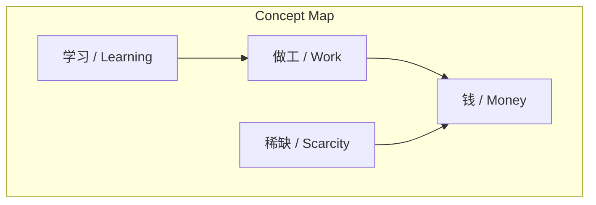
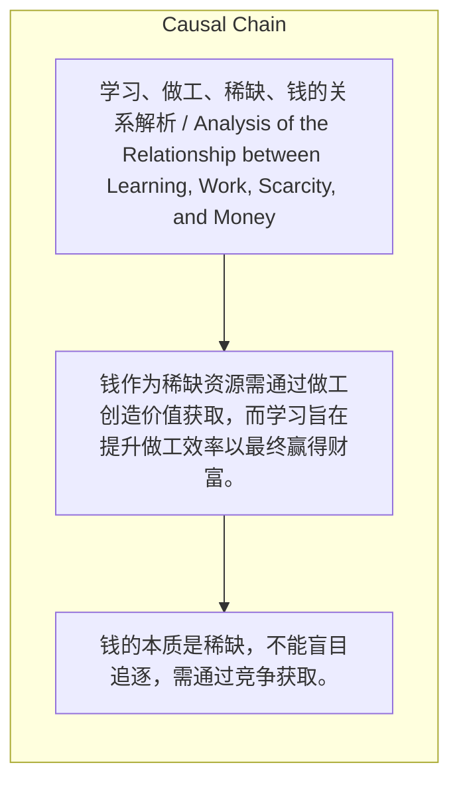

> 钱作为稀缺资源需通过做工创造价值获取，而学习旨在提升做工效率以最终赢得财富。

## 元信息
- 分类：`markets-wealth/wealth-psychology`
- 优先级：`high` (`13`)
- 文档类型：`text-summary`
- 来源分组：`news`
- 原始文件：`reports/news/2026-03-23/1774274244762-news-news-task-1774274196706-0vk1uv.md`
- 请求 ID：`1774274196706-0vk1uv`

## 原始内容

#### 文本总结

##### 运行信息
- model: stepfun/step-3.5-flash:free
- schema_fallback: yes
- attempted_models: stepfun/step-3.5-flash:free

### 学习、做工、稀缺与钱的逻辑链条

#### 整体结构化文档表达
##### 文档卡片
- 主题（中文/English）：学习、做工、稀缺、钱的关系解析 / Analysis of the Relationship between Learning, Work, Scarcity, and Money
- 一句话摘要：钱作为稀缺资源需通过做工创造价值获取，而学习旨在提升做工效率以最终赢得财富。
- 目标读者：未提及
- 核心结论（3条）：
- 钱的本质是稀缺，不能盲目追逐，需通过竞争获取。
- 获取钱的前提是通过做工创造真实价值。
- 学习的本质是升级自我这台'做工的机器'，以提高未来做工的效率和杠杆。

##### 内容结构树
1. 背景与问题定义
2. 核心观点与关键证据
3. 方法/机制/路径
4. 风险与边界条件
5. 结论与行动建议

##### 结构化元数据（JSON）
```json
{
  "title": "学习、做工、稀缺与钱的逻辑链条",
  "topic_zh": "学习、做工、稀缺、钱的关系解析",
  "topic_en": "Analysis of the Relationship between Learning, Work, Scarcity, and Money",
  "audience": "未提及",
  "claims": [],
  "evidence": [],
  "risks": [],
  "actions": []
}
```

#### 处理流程
1. 输入识别
2. 信息抽取（实体、概念、问题、事实、观点）
3. 结构化归纳（定义/分类/比较/因果/方法论）
4. 关系建模（概念关系、等式/方程/逻辑链）
5. 可视化表达（Mermaid）

#### 概念清单（中英文）
- 学习 / Learning
- 做工 / Work
- 稀缺 / Scarcity
- 钱 / Money

#### 概念定义（中英文）
##### 学习 / Learning
- 中文定义：改变做工的机器，对自身系统进行迭代和强化，以提高未来做工效率。
- English Definition: To change the 'work machine', iterating and strengthening one's own system to improve future work efficiency.

##### 做工 / Work
- 中文定义：在真实世界里付出实际行动，创造价值。
- English Definition: To take practical actions in the real world to create value.

##### 稀缺 / Scarcity
- 中文定义：钱的本质，资源有限，需在社会中竞争才能获取。
- English Definition: The essence of money; resources are limited and must be competed for in society.

##### 钱 / Money
- 中文定义：一种稀缺资源，是创造价值后的一种奖赏。
- English Definition: A scarce resource that serves as a reward after creating value.


#### 概念关联与逻辑关系（中英文）
- 学习/Learning -> 做工/Work | concept | 优化
- 做工/Work -> 钱/Money | concept | 奖赏
- 稀缺/Scarcity -> 钱/Money | concept | 本质

##### 可形式化关系
- 钱 ≡ 稀缺资源
- 获取钱 ⇔ 通过做工创造价值
- 学习 ⇒ 升级做工机器 ⇒ 价值产出↑

#### COT逻辑梳理（定义/分类/比较/因果/科学方法论）
- Step 1: 认识到钱的本质是稀缺资源，因此不能盲目追逐。
- Step 2: 必须通过脚踏实地的做工来创造真实价值，以在竞争中获取钱。
- Step 3: 通过持续学习来升级自我这台'做工的机器'，从而提高做工效率，在未来产出更大价值并收获财富。

#### 事实与看法（区分）
##### 事实
- 未发现明确客观事实

##### 看法
- 未发现明确主观看法

#### FAQ（原文问题整理）
- 未发现明确 FAQ

#### Visualization
##### Mermaid 图 1（概念结构图）


##### Mermaid 图 2（逻辑/因果图）


#### 文章中的类比
- 未发现明确类比

#### 10个金句
- 原文未提供
