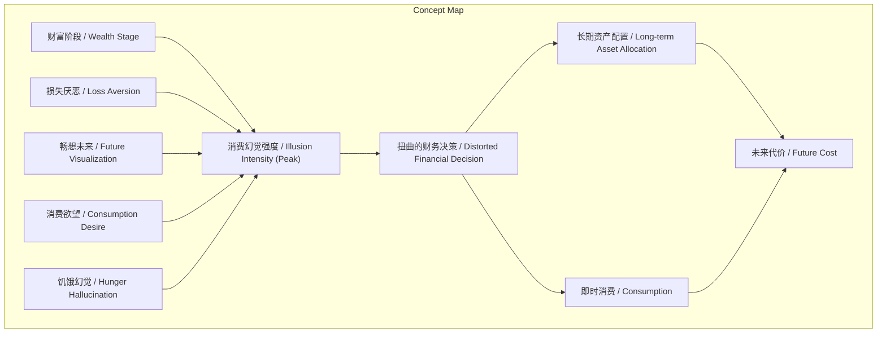
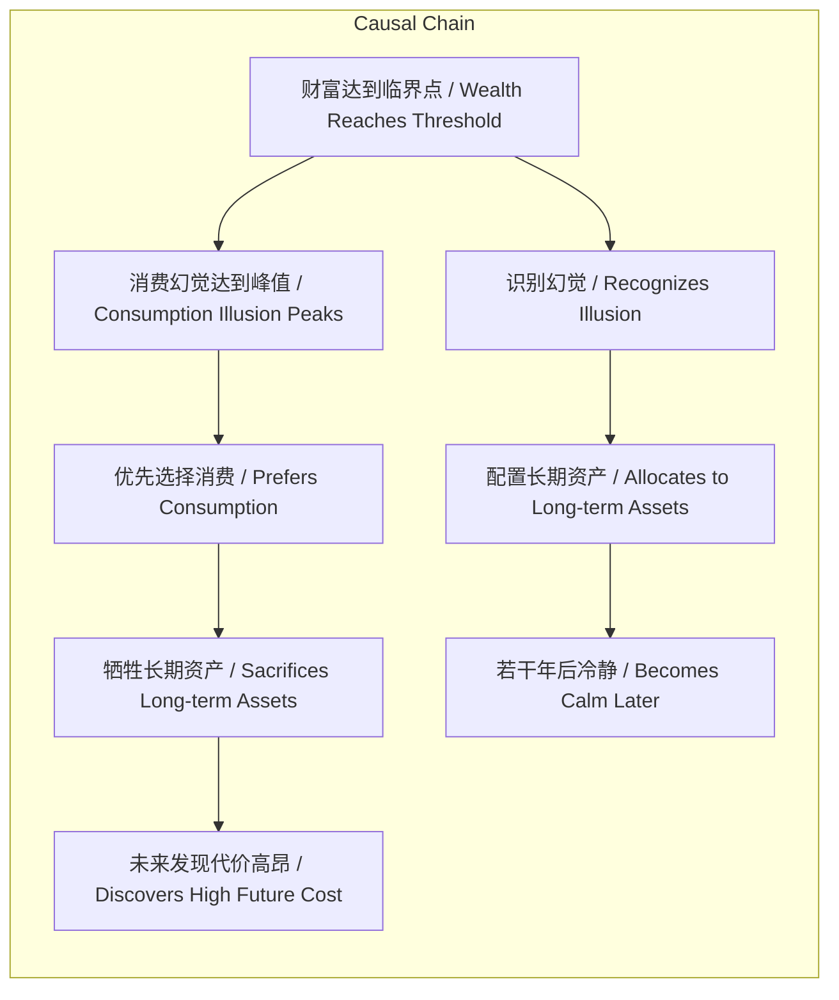

> 论述消费在财富初期形成的心理幻觉及其对财务决策的扭曲影响。

## 元信息
- 分类：`markets-wealth/wealth-psychology`
- 优先级：`medium` (`12`)
- 文档类型：`text-summary`
- 来源分组：`news`
- 原始文件：`reports/news/2026-03-09/1773015599850-news-news-task-1773015572089-8psiu6.md`
- 请求 ID：`1773015572089-8psiu6`

## 原始内容

#### 文本总结

### 消费幻觉：财富初期的心理陷阱

#### 整体结构化文档表达
##### 文档卡片
- 主题（中文/English）：消费幻觉 / Consumption Illusion
- 一句话摘要：论述消费在财富初期形成的心理幻觉及其对财务决策的扭曲影响。
- 目标读者：个人投资者、对行为经济学与个人理财感兴趣的普通读者。
- 核心结论（3条）：
    1.  消费幻觉在财富水平刚刚提升至可消费阶段时最为强烈。
    2.  幻觉扭曲了对损失（如账目亏损）与收益（如畅想未来）的感知。
    3.  对抗幻觉的核心路径是识别并配置长期资产，牺牲即时消费。

##### 内容结构树
1.  **背景与问题定义**：个人在财富增长初期面临非理性的消费冲动，这种心理现象被定义为“消费幻觉”。
2.  **核心观点与关键证据**：提出消费幻觉的八种具体表现形式，涵盖生理感知（饥饿）、心理感知（损失厌恶、未来畅想）及行为动机（因“穷”而欲消费）。
3.  **方法/机制/路径**：通过识别幻觉本质（“花掉了未来”），将资金转向“值得长期持有的资产”以规避幻觉代价。
4.  **风险与边界条件**：幻觉强度与财富阶段相关，在“刚刚能消费得起的时候”达到峰值，随时间与财富增长可能减弱（“若干年后...变得冷静”）。
5.  **结论与行动建议**：抑制初期消费幻觉是财务决策的关键，否则将付出“昂贵”的代价。

##### 结构化元数据（JSON）
```json
{
  "title": "消费幻觉：财富初期的心理陷阱",
  "topic_zh": "消费幻觉",
  "topic_en": "Consumption Illusion",
  "audience": "个人投资者、对行为经济学与个人理财感兴趣的普通读者",
  "claims": [
    "消费幻觉在财富水平刚刚提升至可消费阶段时最为强烈",
    "幻觉扭曲了对损失与收益的感知",
    "对抗幻觉的核心路径是识别并配置长期资产"
  ],
  "evidence": [
    "减肥时饿是一种幻觉，吃了东西反而感觉更饿",
    "对损失的厌恶更针对‘赚到的钱丢了’而非‘原本的钱丢了’",
    "赚钱后不由自主地畅想未来",
    "消费欲望源于‘穷’而非富有",
    "现在消费相当于花掉了未来",
    "若干年后能买得起时会变得冷静，不会乱消费",
    "消费幻觉最强烈的时候出现在刚刚能消费得起的时候"
  ],
  "risks": [
    "在幻觉强烈期进行消费，会付出未来代价",
    "未能识别幻觉可能导致长期资产配置失败"
  ],
  "actions": [
    "识别自身处于‘刚刚能消费得起’的阶段",
    "将资金优先配置于‘值得长期持有的资产’",
    "抑制即时消费冲动，为未来储备"
  ]
}
```

#### 处理流程
1.  **输入识别**：来源为用户提供的关于“消费幻觉”的论述文本。
2.  **信息抽取**：抽取实体（消费幻觉、长期资产）、概念（损失厌恶、账目收益）、问题（财富初期的非理性消费）、事实（幻觉的八种表现）、观点（消费是幻觉，应投资）。
3.  **结构化归纳**：将散点论述归纳为“现象描述-核心机制-应对方案”的逻辑链。
4.  **关系建模**：建立“财富阶段 → 幻觉强度 → 消费决策 → 长期后果”的因果链。
5.  **可视化表达**：使用Mermaid绘制概念与因果图。

#### 概念清单（中英文）
- 消费幻觉 / Consumption Illusion
- 减肥 / Dieting
- 饿 / Hunger
- 损失厌恶 / Loss Aversion
- 账目收益 / Bookkeeping Profit
- 畅想未来 / Future Visualization
- 消费欲望 / Consumption Desire
- 长期持有的资产 / Long-term Holdable Asset
- 财富阶段 / Wealth Stage
- 财务决策 / Financial Decision

#### 概念定义（中英文）
- **消费幻觉 / Consumption Illusion**：一种在财富水平初步提升时产生的非理性心理感知，导致对消费行为产生扭曲的渴望与判断。
- **减肥 / Dieting**：文中作为场景，指代一种因生理或心理需求而产生的行为。
- **饿 / Hunger**：在减肥场景下，被描述为一种因消费（进食）行为而加剧的幻觉性感知。
- **损失厌恶 / Loss Aversion**：一种心理现象，指人们对损失的痛苦感大于等量收益的快乐感，文中特指对“已赚未得”损失的敏感。
- **账目收益 / Bookkeeping Profit**：指账面上记录的、尚未实际落袋的收益。
- **畅想未来 / Future Visualization**：赚钱后不由自主地对未来消费或生活进行想象的心理活动。
- **消费欲望 / Consumption Desire**：驱动消费行为的内在冲动，文中认为其根源是“穷”而非富有。
- **长期持有的资产 / Long-term Holdable Asset**：指具有长期价值、能抵御短期幻觉影响的投资或资产。
- **财富阶段 / Wealth Stage**：个人财富水平所处的特定时期，文中特指“刚刚能消费得起”的初期阶段。
- **财务决策 / Financial Decision**：涉及资金分配（消费或投资）的选择。

#### 概念关联与逻辑关系（中英文）
1.  **财富阶段（Wealth Stage）** 与 **消费幻觉强度（Consumption Illusion Intensity）** 呈正相关关系，尤其在初期阶段。形式化：`I_illusion ∝ f(W)`，其中 `W` 为财富水平，`f` 在 `W` 初期阶段为增函数。
2.  **损失厌恶（Loss Aversion）** 与 **账目收益亏损（Bookkeeping Profit Loss）** 共同导致更强烈的负面情绪。逻辑关系：`Loss_Aversion ∧ Bookkeeping_Loss → Intense_Negative_Feeling`。
3.  **长期资产持有（Long-term Asset Holding）** 与 **消费幻觉抑制（Consumption Illusion Suppression）** 呈负相关。形式化：`Suppression ∝ 1 / H`，其中 `H` 为对长期资产的持有与关注度。

#### COT逻辑梳理（定义/分类/比较/因果/科学方法论）
- **Step 1 (定义)**：界定核心概念“消费幻觉”为财富初期的非理性消费心理。
- **Step 2 (分类)**：将幻觉现象分为三类：A. 生理感知幻觉（如减肥时的饿）；B. 财务感知幻觉（如损失厌恶、账目损益）；C. 未来导向幻觉（如畅想未来、因穷欲消费）。
- **Step 3 (比较)**：比较不同幻觉的触发点与表现，发现其共同根源在于财富水平的“临界变化”（从不能消费到能消费）。
- **Step 4 (因果)**：建立因果链：`财富水平提升（至临界点） → 消费幻觉强度达到峰值 → 扭曲财务决策（倾向于消费） → 牺牲长期资产积累 → 未来代价高昂`。
- **Step 5 (科学方法论)**：提出“识别-替代”方法论：首先通过自我觉察识别幻觉期（“刚刚能消费得起”），其次通过行为干预（“把钱放在长期资产”）替代非理性消费，以验证幻觉的“昂贵”代价并实现理性决策。

#### 事实与看法（病毒）
##### 事实
- 文中列举了消费幻觉的八种具体表现（如减肥时吃了更饿、厌恶赚到的钱丢失等）。
- 指出消费幻觉最强烈的时间点是“刚刚能消费得起的时候”。
- 提出“找到了值得长期持有的资产，就应该把钱放在那里”的行动建议。
- 断言“现在如果消费，就相当于花掉了未来”。
- 预测“若干年后...能买的起，就会变得冷静，不会乱消费”。
##### 看法
- “饿是一种幻觉”。
- “我们最厌恶的损失是赚到的钱丢了”。
- “赚了钱了，不由自主地畅想未来”。
- “消费欲望是一种幻觉。你之所以想消费是因为你穷，还不够富有”。
- “当初的幻觉有多么昂贵”。
- 将上述现象统一定义为“消费幻觉”并作为核心论点。

#### FAQ（原文问题整理）
- **原文未发现明确提问**。全文为论述性陈述，未包含直接疑问句。

#### Visualization
##### Mermaid 图 1（概念结构图）


##### Mermaid 图 2（逻辑/因果图）


#### 文章中的类比
- **未发现明确类比**。原文使用直接论述与列举，未发现使用比喻或类比手法。

#### 10个金句
1.  你现在脑子里充满了消费幻觉...
2.  减肥的时候，饿是一种幻觉，体现在如果你吃了东西，会感觉越饿。
3.  我们最厌恶的损失是赚到的钱丢了，而不是原本的钱丢了，账目收益亏损更难受。
4.  赚了钱了，不由自主地畅想未来。
5.  消费欲望是一种幻觉，你之所以想消费是因为你穷，还不够富有。
6.  现在如果消费，就相当于花掉了未来。
7.  找到了值得长期持有的资产，就应该把钱放在那里。
8.  不然以后你会发现，当初的幻觉有多么昂贵。
9.  若干年后，因为您能买的起，就会变得冷静，不会乱消费。
10. 消费幻觉最强烈的时候出现在刚刚能消费得起的时候。
