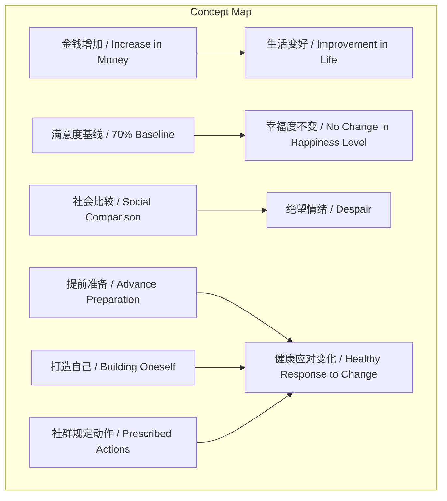
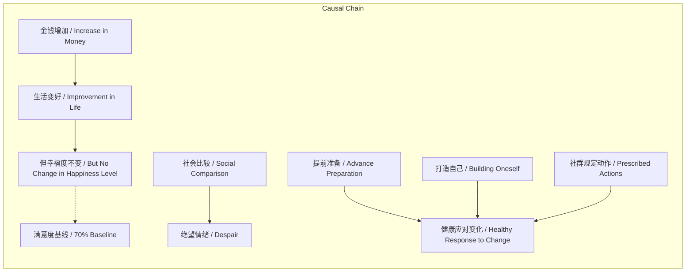

> 金钱增加不必然提升幸福感，因满意度基线及社会比较导致持续不满。

## 元信息
- 分类：`markets-wealth/wealth-psychology`
- 优先级：`medium` (`12`)
- 文档类型：`text-summary`
- 来源分组：`news`
- 原始文件：`reports/news/2026-03-19/1773963948273-news-news-task-1773963897728-hq4vh4.md`
- 请求 ID：`1773963897728-hq4vh4`

## 原始内容

#### 文本总结

### 金钱与幸福：满意度基线与比较陷阱

#### 整体结构化文档表达
##### 文档卡片
- 主题（幸福感与金钱关系 / Happiness and Money Relationship）：
- 一句话摘要：金钱增加不必然提升幸福感，因满意度基线及社会比较导致持续不满。
- 目标读者：对个人成长、心理学感兴趣的普通读者。
- 核心结论（3条）：
  1. 金钱与幸福无自动正相关。
  2. 满意度存在约70%的基线。
  3. 社会比较引发持续不满。

##### 内容结构树
1. 背景与问题定义：生活变好但幸福度可能降低，金钱不自动带来幸福。
2. 核心观点与关键证据：案例显示生活变好幸福度低；调查表明满意度保持在70%；人们总在比较中感到不足。
3. 方法/机制/路径：提前准备打造自己；做好社群规定动作以应对巨变。
4. 风险与边界条件：大变化可能带来坏影响（罗伯特·麦基观点）。
5. 结论与行动建议：绝望源于无准备；通过规定动作保持健康。

##### 结构化元数据（JSON）
```json
{
  "title": "金钱与幸福：满意度基线与比较陷阱",
  "topic_zh": "幸福感与金钱关系",
  "topic_en": "Happiness and Money Relationship",
  "audience": "对个人成长、心理学感兴趣的普通读者",
  "claims": ["金钱增加不必然提升幸福感", "满意度存在约70%的基线", "社会比较引发持续不满"],
  "evidence": ["无数案例显示生活变好幸福度变低", "调查表明人们对一切满意度保持在70%", "无论身处何种情况，总有一方面比不上别人"],
  "risks": ["大变化可能带来负面影响（罗伯特·麦基观点）"],
  "actions": ["提前准备打造自己", "做好社群规定动作以应对巨变"]
}
```

#### 处理流程
1. 输入识别：识别出文本讨论金钱与幸福感的关系，提出满意度基线和比较陷阱。
2. 信息抽取：抽取实体如金钱、幸福度、满意度、70%、比较、绝望、准备、社群规定动作等。
3. 结构化归纳：归纳出背景、观点、方法、风险、结论五个部分。
4. 关系建模：建立金钱→生活变好但幸福度不变（因基线），比较→绝望，准备→健康应对等关系。
5. 可视化表达：使用Mermaid绘制概念图和因果图。

#### 概念清单（中英文）
- 生活 / Life
- 有钱 / Having Money
- 幸福度 / Happiness Level
- 幻觉 / Illusion
- 调查 / Survey
- 满意度 / Satisfaction
- 70% / 70% Baseline
- 情况 / Situation
- 绝望 / Despair
- 提前准备 / Advance Preparation
- 打造 / Build
- 赚钱 / Earning Money
- 生活满意度 / Life Satisfaction
- 罗伯特·麦基 / Robert McKee
- 变化 / Change
- 社群 / Community
- 规定动作 / Prescribed Actions
- 健康 / Health

#### 概念定义（中英文）
- 生活：指个人的日常存在状态。
- 有钱：指拥有较多金钱或财富。
- 幸福度：指主观感受到的幸福程度。
- 幻觉：指与事实不符的错误信念。
- 调查：指通过问卷或研究收集数据的方法。
- 满意度：指对生活各方面的满足程度。
- 70%：文中指人们对一切事物满意度的平均基线水平。
- 情况：指个人所处的境遇或状态。
- 绝望：指感到无望的情绪。
- 提前准备：指在变化发生前采取的准备措施。
- 打造：指通过努力建设或提升自己。
- 赚钱：指通过工作或其他方式获取金钱。
- 生活满意度：指对整体生活的满意程度。
- 罗伯特·麦基：文中引用的一个人物，认为一切大的变化都是坏的。
- 变化：指事物状态的改变。
- 社群：指具有共同兴趣或目标的群体。
- 规定动作：指社群中规定的标准行动或练习。
- 健康：指身体或心理的良好状态。

#### 概念关联与逻辑关系（中英文）
1. 金钱增加 / Increase in Money → 生活变好 / Improvement in Life，但幸福度不变 / No Change in Happiness Level（因满意度基线 / Due to Satisfaction Baseline）。
   形式化：金钱增加 → 生活变好 ∧ (满意度基线 → 幸福度不变)
2. 社会比较 / Social Comparison → 绝望情绪 / Despair（当总有人比自己好时 / When there is always someone better）。
   形式化：社会比较 ∧ (存在更好者) → 绝望
3. 提前准备 / Advance Preparation ∧ 打造自己 / Building Oneself → 健康应对变化 / Healthy Response to Change。
   形式化：提前准备 ∧ 打造自己 → 健康应对变化

#### COT逻辑梳理（定义/分类/比较/因果/科学方法论）
Step 1: 定义问题：金钱是否自动带来幸福？文中通过案例和调查否定自动关联。
Step 2: 分类：将影响因素分为内在（满意度基线）和外在（社会比较）。
Step 3: 比较：生活变好但幸福度不变，与直觉“有钱更幸福”比较，揭示幻觉。
Step 4: 因果：金钱增加导致生活变好，但满意度基线导致幸福度不变；社会比较导致绝望；提前准备导致健康应对。
Step 5: 科学方法论：基于调查数据（事实）和逻辑推理（观点）得出结论，强调基线效应和比较机制。

#### 事实与看法（病毒）
##### 事实
- 有无数的案例表明，人们在生活变好之后幸福度变低了。
- 调查表明，人们对一切的满意度保持在70%。
- 无论你身处任何一种情况，你都会发现有人在某一方面比你做得更好。
- 当你赚钱而变相，你的生活满意度很快又会掉回70%。
##### 看法
- 觉得生活会随着有钱而自动更幸福是一种幻觉。
- 绝望的情绪，来源于你没有提前准备打造过自己。
- 罗伯特·麦基：一切大的变化都是坏的。
- 做好我们社群的规定动作，当生活发生巨变时，我们也是健康的。

#### FAQ（原文问题整理）
未提及

#### Visualization
##### Mermaid 图 1（概念结构图）


##### Mermaid 图 2（逻辑/因果图）


#### 文章中的类比
未发现明确类比

#### 10个金句
1. 你的生活不会因为更有钱而自动更幸福。
2. 有无数的案例表明，人们在生活变好之后幸福度变低了。
3. 觉得生活会随着有钱而自动更幸福是一种幻觉。
4. 调查表明，人们对一切的满意度保持在70%。
5. 其结果就是满意度不会自动提高，即生活变好，满意度不变。
6. 无论你身处任何一种情况，你都会发现有人在某一方面比你做得更好。
7. 不管自己好到什么程度，总有一方面比不上人家。
8. 绝望的情绪，来源于你没有提前准备打造过自己。
9. 当你赚钱而变相，你的生活满意度很快又会掉回70%。
10. 罗伯特·麦基：一切大的变化都是坏的。
