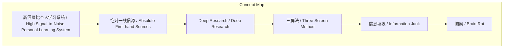
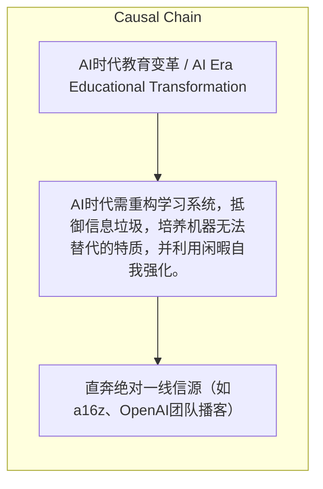

> AI时代需重构学习系统，抵御信息垃圾，培养机器无法替代的特质，并利用闲暇自我强化。

## 元信息
- 分类：`operations/systems-workflows`
- 优先级：`medium` (`12`)
- 文档类型：`text-summary`
- 来源分组：`news`
- 原始文件：`reports/news/2026-03-23/1774274571662-news-news-task-1774274458821-qlcc95.md`
- 请求 ID：`1774274458821-qlcc95`

## 原始内容

#### 文本总结

##### 运行信息
- model: stepfun/step-3.5-flash:free
- schema_fallback: yes
- attempted_models: stepfun/step-3.5-flash:free

### AI时代学习与教育重构的核心路径

#### 整体结构化文档表达
##### 文档卡片
- 主题（中文/English）：AI时代教育变革 / AI Era Educational Transformation
- 一句话摘要：AI时代需重构学习系统，抵御信息垃圾，培养机器无法替代的特质，并利用闲暇自我强化。
- 目标读者：普通学习者、教育者及家长
- 核心结论（3条）：
- 建立高信噪比个人学习系统：直达一线信源、利用AI深度挖掘、实践三屏法闭环。
- 抵御信息垃圾：警惕算法碎片化，严格限制短视频接触，避免脑腐。
- 下一代教育核心是培养独立思考、好奇心和品味，成年人应利用闲暇系统性自我强化。

##### 内容结构树
1. 背景与问题定义
2. 核心观点与关键证据
3. 方法/机制/路径
4. 风险与边界条件
5. 结论与行动建议

##### 结构化元数据（JSON）
```json
{
  "title": "AI时代学习与教育重构的核心路径",
  "topic_zh": "AI时代教育变革",
  "topic_en": "AI Era Educational Transformation",
  "audience": "普通学习者、教育者及家长",
  "claims": [],
  "evidence": [],
  "risks": [],
  "actions": [
    "直奔绝对一线信源（如a16z、OpenAI团队播客）",
    "实践三屏法学习闭环（专家输入、AI助教、个人输出）",
    "严格限制下一代接触短视频，培养自主决策能力"
  ]
}
```

#### 处理流程
1. 输入识别
2. 信息抽取（实体、概念、问题、事实、观点）
3. 结构化归纳（定义/分类/比较/因果/方法论）
4. 关系建模（概念关系、等式/方程/逻辑链）
5. 可视化表达（Mermaid）

#### 概念清单（中英文）
- 高信噪比个人学习系统 / High Signal-to-Noise Personal Learning System
- 绝对一线信源 / Absolute First-hand Sources
- Deep Research / Deep Research
- 三屏法 / Three-Screen Method
- 信息垃圾 / Information Junk
- 脑腐 / Brain Rot
- 独立思考 / Independent Thinking
- 好奇心 / Curiosity
- 品味 / Taste
- 复利价值 / Compounding Value
- 推荐算法 / Recommendation Algorithm
- 人工智能 / Artificial Intelligence

#### 概念定义（中英文）
##### 高信噪比个人学习系统 / High Signal-to-Noise Personal Learning System
- 中文定义：通过精选前沿信源、AI工具和输出闭环构建的高效学习框架
- English Definition: An efficient learning framework built by curating cutting-edge sources, utilizing AI tools, and completing output loops.

##### 绝对一线信源 / Absolute First-hand Sources
- 中文定义：如顶尖创投机构、一线研究员等直接获取前沿信息的渠道
- English Definition: Channels for directly accessing cutting-edge information, such as top venture capital firms or frontline researchers.

##### Deep Research / Deep Research
- 中文定义：利用AI进行深度搜索以编排系统化学习教程
- English Definition: Using AI for deep search to compile systematic learning tutorials.

##### 三屏法 / Three-Screen Method
- 中文定义：学习时展开三个屏幕：观看专家输入、挂载AI助教、用于个人输出
- English Definition: A learning approach using three screens: one for expert inputs, one for AI assistant, and one for personal output.

##### 信息垃圾 / Information Junk
- 中文定义：由算法推荐的碎片化、低质量信息，导致思维混乱
- English Definition: Fragmented, low-quality information recommended by algorithms, leading to cognitive chaos.

##### 脑腐 / Brain Rot
- 中文定义：信息垃圾带来的思维混乱和能力退化
- English Definition: Cognitive confusion and degradation caused by information junk.

##### 独立思考 / Independent Thinking
- 中文定义：独立做决定的能力，不依赖他人，并承担后果
- English Definition: The ability to make decisions independently and bear the consequences.

##### 好奇心 / Curiosity
- 中文定义：提出好问题的能力，驱动AI设定目标
- English Definition: The ability to ask good questions, driving AI to set goals.

##### 品味 / Taste
- 中文定义：跨学科涌现的审美和判断力，决定内容高度和差异化
- English Definition: An interdisciplinary aesthetic and judgment that determines the quality and differentiation of content.

##### 复利价值 / Compounding Value
- 中文定义：通过持续输出和AI放大产生的累积效应
- English Definition: The cumulative effect generated through continuous output and AI amplification.

##### 推荐算法 / Recommendation Algorithm
- 中文定义：社交网络和短视频用于吸引眼球和提供即时满足的算法
- English Definition: Algorithms used by social networks and short videos to capture attention and provide instant gratification.

##### 人工智能 / Artificial Intelligence
- 中文定义：能执行任务的智能系统，作为学习工具和输出放大器
- English Definition: Intelligent systems capable of performing tasks, serving as learning tools and output amplifiers.


#### 概念关联与逻辑关系（中英文）
- 推荐算法/Recommendation Algorithm -> 脑腐/Brain Rot | concept | 导致
- 好奇心/Curiosity -> 人工智能/Artificial Intelligence | concept | 驱动目标设定
- 高信噪比个人学习系统/High Signal-to-Noise Personal Learning System -> 复利价值/Compounding Value | concept | 产生

##### 可形式化关系
- 推荐算法使用 ⇒ 脑腐
- 好奇心驱动人工智能设定目标
- 高信噪比个人学习系统 ∧ 人工智能 ⇒ 复利价值

#### COT逻辑梳理（定义/分类/比较/因果/科学方法论）
- Step 1: 构建高信噪比学习系统：直达绝对一线信源，利用AI进行深度挖掘（Deep Research），实践三屏法闭环（专家输入、AI助教、个人输出）。
- Step 2: 抵御信息垃圾：警惕推荐算法导致的碎片化，严格限制短视频接触，避免脑腐。
- Step 3: 培养AI无法替代特质：对下一代强调独立思考、好奇心和品味；成年人利用闲暇进行系统性自我强化，产生复利价值。

#### 事实与看法（区分）
##### 事实
- 未发现明确客观事实

##### 看法
- 未发现明确主观看法

#### FAQ（原文问题整理）
- 未发现明确 FAQ

#### Visualization
##### Mermaid 图 1（概念结构图）


##### Mermaid 图 2（逻辑/因果图）


#### 文章中的类比
- 未发现明确类比

#### 10个金句
- 原文未提供
