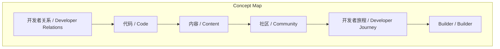
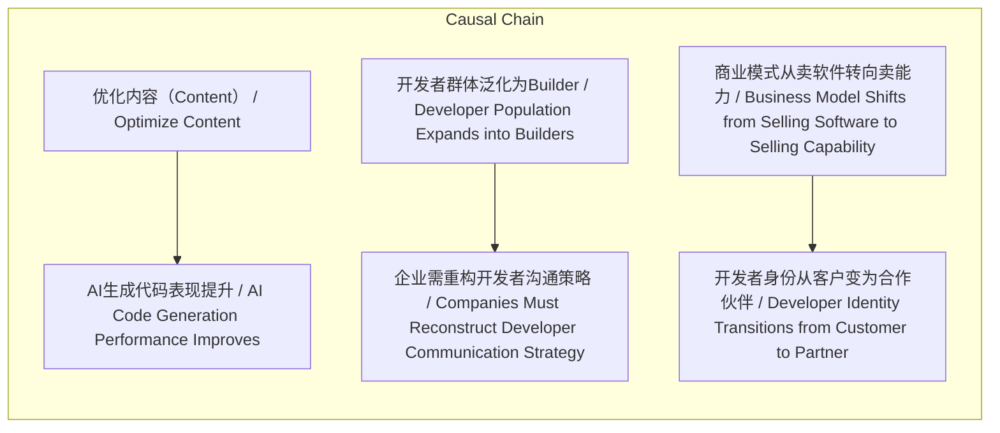

> 在AI时代，开发者关系是连接能力提供者与价值创造者的桥梁，依赖代码、内容、社区三大支柱，并需重构对开发者旅程与群体的认知。

## 元信息
- 分类：`operations/systems-workflows`
- 优先级：`medium` (`12`)
- 文档类型：`text-summary`
- 来源分组：`news`
- 原始文件：`reports/news/2026-03-24/1774312854164-news-news-task-1774312834419-d9g7ip.md`
- 请求 ID：`1774312834419-d9g7ip`

## 原始内容

#### 文本总结

##### 运行信息
- model: openrouter/free
- schema_fallback: no
- attempted_models: openrouter/free

### AI时代开发者关系的核心框架

#### 整体结构化文档表达
##### 文档卡片
- 主题（中文/English）：开发者关系 / Developer Relations
- 一句话摘要：在AI时代，开发者关系是连接能力提供者与价值创造者的桥梁，依赖代码、内容、社区三大支柱，并需重构对开发者旅程与群体的认知。
- 目标读者：AI厂商、开发者生态建设者
- 核心结论（3条）：
- 开发者关系是融合工程、销售与管理的交叉学科，非单纯技术营销。
- 构建开发者关系的三大支柱为代码（Code）、内容（Content）和社区（Community），其中内容需同时适配人类与AI阅读。
- AI时代开发者群体泛化为‘Builder’，企业需从‘卖软件’转向‘卖能力’，开发者成为价值共创的合作伙伴（Partner）而非单纯客户（Customer）。

##### 内容结构树
1. 背景与问题定义
2. 核心观点与关键证据
3. 方法/机制/路径
4. 风险与边界条件
5. 结论与行动建议

##### 结构化元数据（JSON）
```json
{
  "title": "AI时代开发者关系的核心框架",
  "topic_zh": "开发者关系",
  "topic_en": "Developer Relations",
  "audience": "AI厂商、开发者生态建设者",
  "claims": [
    "开发者关系 = 工程 + 销售 + 管理",
    "内容（Content）质量 → 影响AI自动生成代码的表现",
    "开发者从 Customer → Partner，商业模式从卖软件 → 卖能力"
  ],
  "evidence": [
    "书中指出开发者关系不是简单办活动或写公关稿",
    "主讲人补充：内容需‘写给AI读的’以优化AI代码生成",
    "李强（译者）与主讲人共识：‘得开发者得天下’，Builder群体崛起"
  ],
  "risks": [],
  "actions": []
}
```

#### 处理流程
1. 输入识别
2. 信息抽取（实体、概念、问题、事实、观点）
3. 结构化归纳（定义/分类/比较/因果/方法论）
4. 关系建模（概念关系、等式/方程/逻辑链）
5. 可视化表达（Mermaid）

#### 概念清单（中英文）
- 开发者关系 / Developer Relations
- 代码 / Code
- 内容 / Content
- 社区 / Community
- 开发者旅程 / Developer Journey
- Builder / Builder
- 合作伙伴 / Partner
- 卖能力 / Sell Capability

#### 概念定义（中英文）
##### 开发者关系 / Developer Relations
- 中文定义：融合工程、销售与管理的交叉学科，用于构建开发者与技术产品之间的长期价值关系。
- English Definition: An interdisciplinary field integrating engineering, sales, and management to build long-term value relationships between developers and technology products.

##### 代码 / Code
- 中文定义：产品基础体验的核心，包括API/SDK的稳定性、易用性与文档清晰度。
- English Definition: The core of product experience, including API/SDK stability, usability, and clarity of documentation.

##### 内容 / Content
- 中文定义：教程、示例与最佳实践，需同时优化供人类与AI阅读，以提升AI辅助编程效果。
- English Definition: Tutorials, examples, and best practices that must be optimized for both human and AI consumption to enhance AI-assisted coding.

##### 社区 / Community
- 中文定义：技术生态的沉淀载体，通过互动运营连接日益泛化的开发者群体。
- English Definition: A vehicle for technical ecosystem accumulation, connecting the expanding population of developers through interactive operations.

##### 开发者旅程 / Developer Journey
- 中文定义：开发者接触与使用技术产品的四个阶段：探索评估、学习、构建（Build）、规模化。
- English Definition: The four-stage process of developer engagement: Explore & Evaluate, Learn, Build, Scale.

##### Builder / Builder
- 中文定义：借助AI工具降低编程门槛后崛起的新型开发者群体，可独立创建产品甚至成立‘一人公司’。
- English Definition: A new class of developers empowered by AI tools to create products independently, even forming 'one-person companies'.

##### 合作伙伴 / Partner
- 中文定义：在AI时代，开发者从被动客户转变为共同创造应用价值的生态伙伴。
- English Definition: In the AI era, developers transform from passive customers into co-creators of application value within the ecosystem.

##### 卖能力 / Sell Capability
- 中文定义：科技企业通过API和模型平台提供底层技术能力，而非直接销售软件或SaaS产品。
- English Definition: Technology companies provide underlying technical capabilities via APIs and model platforms, rather than selling software or SaaS directly.


#### 概念关联与逻辑关系（中英文）
- 优化内容（Content）/Optimize Content -> AI生成代码表现提升/AI Code Generation Performance Improves | causal | 正向影响
- 开发者群体泛化为Builder/Developer Population Expands into Builders -> 企业需重构开发者沟通策略/Companies Must Reconstruct Developer Communication Strategy | causal | 正向影响
- 商业模式从卖软件转向卖能力/Business Model Shifts from Selling Software to Selling Capability -> 开发者身份从客户变为合作伙伴/Developer Identity Transitions from Customer to Partner | causal | 正向影响

##### 可形式化关系
- Developer Relations ≡ Engineering + Sales + Management
- Content Quality ↑ → AI Code Generation Performance ↑
- Developer Role = Customer → Partner

#### COT逻辑梳理（定义/分类/比较/因果/科学方法论）
- Step 1: 开发者关系被重新定义为工程、销售与管理的交叉学科，而非传统技术营销。
- Step 2: 其核心依赖三大支柱——代码（Code）、内容（Content）、社区（Community），其中内容需适配AI阅读以提升AI辅助开发能力。
- Step 3: 在AI时代，开发者群体扩展为海量Builder，企业需从卖软件转向卖能力，开发者成为价值共创的Partner，开发者关系成为生态统治力的关键桥梁。

#### 事实与看法（区分）
##### 事实
- 《开发者关系：方法与实践》（Developer Relations: Methods and Practice）英文原版出版于2021年。
- 主讲人认为该书在AI时代不仅未过时，反而更重要。
- 书中提出开发者关系的三大支柱：Code、Content、Community。
- 内容需‘写给AI读的’，以优化AI生成代码的表现。
- 开发者旅程模型包含四个阶段：探索评估、学习、构建（Build）、规模化。
- AI降低了编程门槛，催生了Builder群体（可独立创建产品的人）。
- 开发者从‘客户（Customer）’转变为‘合作伙伴（Partner）’。
- 商业模式从‘卖软件’转向‘卖能力’（通过API和模型平台）。
- 中文版译者为前华为云开发者生态负责人李强。
- 主讲人与译者共识：‘得开发者得天下’。

##### 看法
- 开发者关系在AI时代具有前所未有的重要性。
- 企业应借用开发者旅程模型打磨AI平台产品体验。
- 若想获得类似英伟达CUDA的生态统治力，必须彻底建立优秀的开发者关系。

#### FAQ（原文问题整理）
##### 为什么开发者关系在AI时代变得更重要？
- 因为AI降低了编程门槛，催生了海量Builder群体，开发者从客户变为价值共创的Partner，企业需通过API卖能力，开发者关系成为生态统治力的关键。

##### 内容（Content）如何影响AI？
- 优化内容使其可被AI理解，能显著提升AI在自动生成代码时对产品逻辑的掌握能力。

##### 开发者关系的核心支柱是什么？
- 代码（Code）、内容（Content）、社区（Community）。

#### Visualization
##### Mermaid 图 1（概念结构图）


##### Mermaid 图 2（逻辑/因果图）


#### 文章中的类比
- 开发者关系之于AI平台，如同CUDA之于英伟达——是构建生态统治力的底层基础设施。

#### 10个金句
- 得开发者得天下。
- 内容不仅是写给人类开发者看的，更是‘写给AI读的’。
- 开发者不再是单纯的买单‘客户（Customer）’，而是创造应用价值的‘合作伙伴（Partner）’。
- 开发者关系本质上是‘连接能力提供者与价值创造者的一座关键桥梁’。
