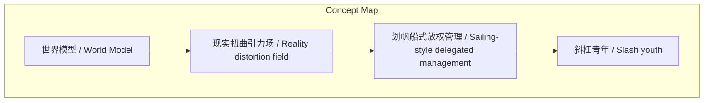
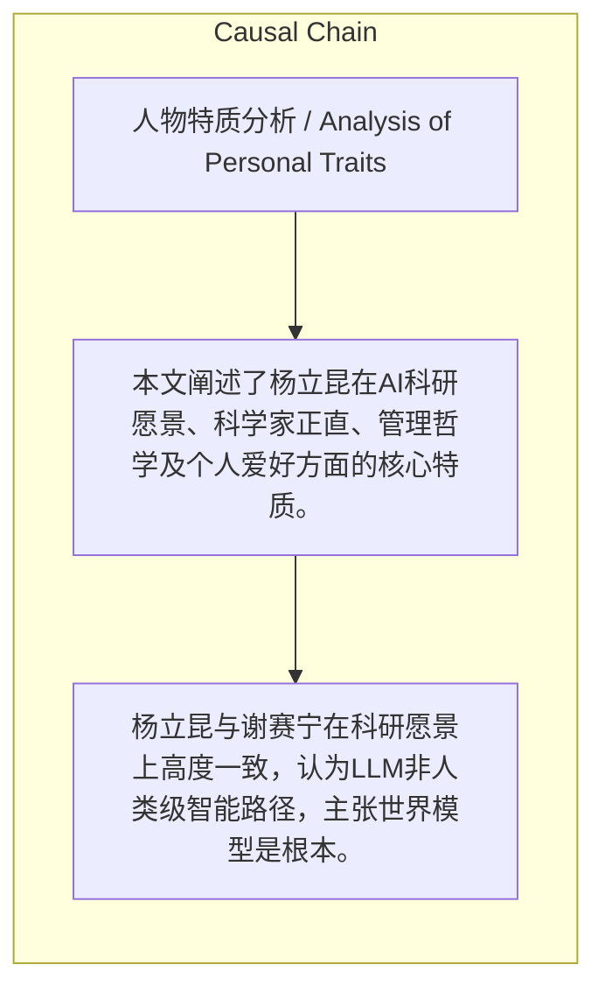

> 本文阐述了杨立昆在AI科研愿景、科学家正直、管理哲学及个人爱好方面的核心特质。

## 元信息
- 分类：`people-life/relationships-trust`
- 优先级：`medium` (`11`)
- 文档类型：`text-summary`
- 来源分组：`news`
- 原始文件：`reports/news/2026-03-22/1774221562620-news-news-task-1774221448730-vrzxjs.md`
- 请求 ID：`1774221448730-vrzxjs`

## 原始内容

#### 文本总结

##### 运行信息
- model: stepfun/step-3.5-flash:free
- schema_fallback: yes
- attempted_models: stepfun/step-3.5-flash:free

### 杨立昆：科研愿景与管理哲学解读

#### 整体结构化文档表达
##### 文档卡片
- 主题（中文/English）：人物特质分析 / Analysis of Personal Traits
- 一句话摘要：本文阐述了杨立昆在AI科研愿景、科学家正直、管理哲学及个人爱好方面的核心特质。
- 目标读者：AI研究者、管理者及对人物传记感兴趣的读者
- 核心结论（3条）：
- 杨立昆与谢赛宁在科研愿景上高度一致，认为LLM非人类级智能路径，主张世界模型是根本。
- 他以科学家正直拒绝停止批评LLM的压力，坚持事实驱动和独立批判。
- 其管理哲学融合帆船放权理念，并具备强大的团队凝聚力与舒适氛围。

##### 内容结构树
1. 背景与问题定义
2. 核心观点与关键证据
3. 方法/机制/路径
4. 风险与边界条件
5. 结论与行动建议

##### 结构化元数据（JSON）
```json
{
  "title": "杨立昆：科研愿景与管理哲学解读",
  "topic_zh": "人物特质分析",
  "topic_en": "Analysis of Personal Traits",
  "audience": "AI研究者、管理者及对人物传记感兴趣的读者",
  "claims": [
    "杨立昆和谢赛宁都认为LLM无法直接通向人类级智能，坚信世界需要世界模型，致力于打造如JEPA的底层认知架构。",
    "杨立昆绝不盲从热点，只基于事实改变观点，并以科学家正直为由拒绝大厂停止批评LLM的要求。",
    "杨立昆具有强大的'现实扭曲引力场'，能通过愿景讲述让周围人感到宁静、克服挑战感；管理上采用'划帆船'式放权，给予团队充分自主权。",
    "杨立昆是'斜杠青年'，精神世界广阔，在科研与生活多领域卓越，拥有造模型飞机、天文摄影、电子乐爵士乐、划帆船四大爱好。"
  ],
  "evidence": [
    "两人共同认为LLM无法通向人类级智能，致力于世界模型如JEPA。",
    "面对大厂压力，杨立昆以'科学家的正直无法接受'为由拒绝停止批评LLM。",
    "谢赛宁形容杨立昆像施了魔法；管理上'只在需要时校正航向'。",
    "何恺明评价其精神广阔；Zoom背景星云为亲手拍摄；经常去加勒比海划帆船。"
  ],
  "risks": [],
  "actions": []
}
```

#### 处理流程
1. 输入识别
2. 信息抽取（实体、概念、问题、事实、观点）
3. 结构化归纳（定义/分类/比较/因果/方法论）
4. 关系建模（概念关系、等式/方程/逻辑链）
5. 可视化表达（Mermaid）

#### 概念清单（中英文）
- 世界模型 / World Model
- 现实扭曲引力场 / Reality distortion field
- 划帆船式放权管理 / Sailing-style delegated management
- 斜杠青年 / Slash youth

#### 概念定义（中英文）
##### 世界模型 / World Model
- 中文定义：能预测和理解物理世界的底层认知架构
- English Definition: An underlying cognitive architecture that can predict and understand the physical world

##### 现实扭曲引力场 / Reality distortion field
- 中文定义：能让人感到宁静、觉得挑战不再是阻碍的影响力
- English Definition: The ability to make people feel calm and see challenges as non-obstacles

##### 划帆船式放权管理 / Sailing-style delegated management
- 中文定义：给予团队充分信任与自主决断权，只在需要时校正航向
- English Definition: Granting team full trust and autonomy, correcting course only when necessary

##### 斜杠青年 / Slash youth
- 中文定义：未提及
- English Definition: Not mentioned


#### 概念关联与逻辑关系（中英文）
- 未发现明确概念关系

##### 可形式化关系
- 杨立昆的科研愿景与谢赛宁一致 → 共同主张世界模型作为LLM的替代路径
- 科学家正直基于事实 → 导致拒绝盲从热点和拒绝停止批评LLM
- 划帆船式放权管理 → 实现团队充分信任与自主决断，仅在必要时校正航向

#### COT逻辑梳理（定义/分类/比较/因果/科学方法论）
- Step 1: 从科研愿景、科学家正直、现实扭曲引力场、放权管理、相处氛围五方面说明选择杨立昆的理由。
- Step 2: 通过何恺明评价引出杨立昆作为'斜杠青年'的特质，即精神世界广阔，在科研与生活多领域卓越。
- Step 3: 具体列举四大爱好——造模型飞机、天文摄影、电子乐爵士乐、划帆船，以佐证其斜杠青年特质。

#### 事实与看法（区分）
##### 事实
- 杨立昆与谢赛宁均认为LLM无法直接通向人类级智能。
- 杨立昆拒绝大厂要求停止批评LLM的压力。
- 杨立昆的Zoom会议背景星云桌面是其亲手拍摄的天文摄影作品。
- 杨立昆经常去加勒比海划帆船。

##### 看法
- 谢赛宁认为杨立昆具有强大的'现实扭曲引力场'，能让人感到宁静、克服挑战感。
- 何恺明评价杨立昆是'16岁青春期一直延续到65岁'的人，精神世界极其广阔。
- 杨立昆的相处氛围极度舒适，交流没有任何畏惧感。

#### FAQ（原文问题整理）
- 未发现明确 FAQ

#### Visualization
##### Mermaid 图 1（概念结构图）


##### Mermaid 图 2（逻辑/因果图）


#### 文章中的类比
- 杨立昆的愿景讲述被形容为具有'现实扭曲引力场'，能让周围人感到宁静、觉得挑战不再是阻碍。
- 其管理风格被比喻为'划帆船'式，给予团队充分信任与自主决断权，只在需要时校正航向。

#### 10个金句
- 科学家的正直无法接受这一点。
- 他是一个16岁青春期一直延续到65岁的这样一个人。
