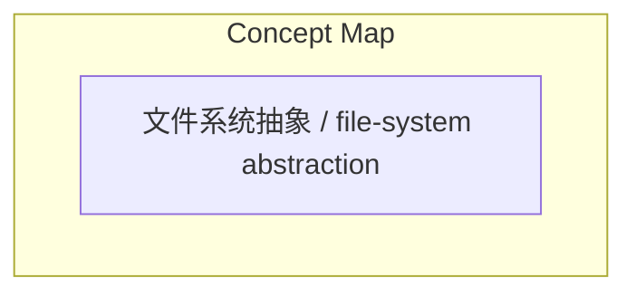
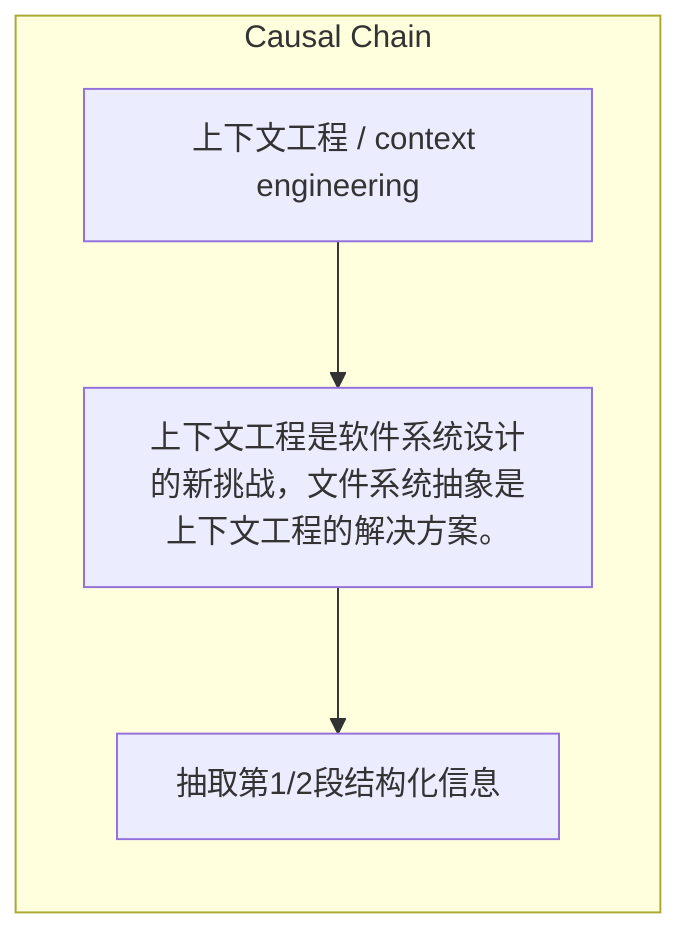

> 上下文工程是软件系统设计的新挑战，文件系统抽象是上下文工程的解决方案。

## 元信息
- 分类：`people-life/relationships-trust`
- 优先级：`medium` (`11`)
- 文档类型：`link-summary`
- 来源分组：`news`
- 原始文件：`reports/news/2026-03-28/1774701400646-news-news-task-1774701361610-90fw4v.md`
- 请求 ID：`1774701361610-90fw4v`

## 原始内容

#### 链接总结

- URL: https://arxiv.org/abs/2512.05470

##### 运行信息
- model: openrouter/free
- schema_fallback: no
- attempted_models: openrouter/free

### 上下文工程挑战与文件系统抽象解决方案

#### 整体结构化文档表达
##### 文档卡片
- 主题（中文/English）：上下文工程 / context engineering
- 一句话摘要：上下文工程是软件系统设计的新挑战，文件系统抽象是上下文工程的解决方案。
- 目标读者：资深新闻分析助理
- 核心结论（3条）：
- 上下文工程是软件系统设计的新挑战
- 文件系统抽象是上下文工程的解决方案

##### 内容结构树
1. 背景与问题定义
2. 核心观点与关键证据
3. 方法/机制/路径
4. 风险与边界条件
5. 结论与行动建议

##### 结构化元数据（JSON）
```json
{
  "title": "上下文工程挑战与文件系统抽象解决方案",
  "topic_zh": "上下文工程",
  "topic_en": "context engineering",
  "audience": "资深新闻分析助理",
  "claims": [
    "Generative AI (GenAI) has reshaped software system design by introducing foundation models as pre-trained subsystems that redefine architectures and operations. The emerging challenge is no longer model fine-tuning but context engineering-how systems capture, structure, and govern external knowledge, memory, tools, and human input to enable trustworthy reasoning."
  ],
  "evidence": [
    "Existing practices such as prompt engineering, retrieval-augmented generation (RAG), and tool integration remain fragmented, producing transient artefacts that limit traceability and accountability."
  ],
  "risks": [],
  "actions": [
    "抽取第1/2段结构化信息"
  ]
}
```

#### 处理流程
1. 输入识别
2. 信息抽取（实体、概念、问题、事实、观点）
3. 结构化归纳（定义/分类/比较/因果/方法论）
4. 关系建模（概念关系、等式/方程/逻辑链）
5. 可视化表达（Mermaid）

#### 概念清单（中英文）
- 文件系统抽象 / file-system abstraction

#### 概念定义（中英文）
##### 文件系统抽象 / file-system abstraction
- 中文定义：用于上下文工程的文件系统抽象
- English Definition: file-system abstraction for context engineering


#### 概念关联与逻辑关系（中英文）
- 上下文工程/context engineering -> 软件系统设计/软件系统设计 | concept | 是软件系统设计的新挑战
- 文件系统抽象/文件系统抽象 -> 上下文工程实践/上下文工程实践 | concept | 解决上下文工程实践的碎片化

##### 可形式化关系
- 文件系统抽象解决上下文工程实践的碎片化

#### COT逻辑梳理（定义/分类/比较/因果/科学方法论）
- Step 1: 上下文工程是软件系统设计的新挑战
- Step 2: 不再是模型微调，而是上下文工程
- Step 3: 现有实践如prompt工程、RAG、工具集成碎片化，产生临时 artefact，限制可追溯性和可追责性
- Step 4: 提出文件系统抽象，基于Unix理念

#### 事实与看法（区分）
##### 事实
- Generative AI (GenAI) has reshaped software system design by introducing foundation models as pre-trained subsystems that redefine architectures and operations.
- The emerging challenge is no longer model fine-tuning but context engineering-how systems capture, structure, and govern external knowledge, memory, tools, and human input to enable trustworthy reasoning.
- Existing practices such as prompt engineering, retrieval-augmented generation (RAG), and tool integration remain fragmented, producing transient artefacts that limit traceability and accountability.
- This paper proposes a file-system abstraction for context engineering, inspired by the Unix notion that 'everything is a file'.

##### 看法
- 论文提出文件系统抽象解决上下文工程碎片化

#### FAQ（原文问题整理）
##### What is the emerging challenge in software system design according to the paper?
- 上下文工程是软件系统设计的新挑战

#### Visualization
##### Mermaid 图 1（概念结构图）


##### Mermaid 图 2（逻辑/因果图）


#### 文章中的类比
- 基于输入内容输出，不杜撰

#### 10个金句
- 'everything is a file'
