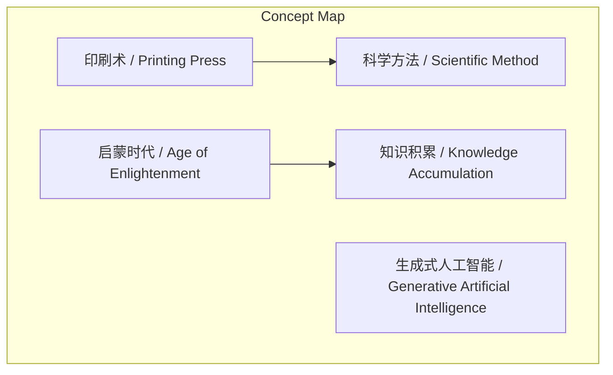
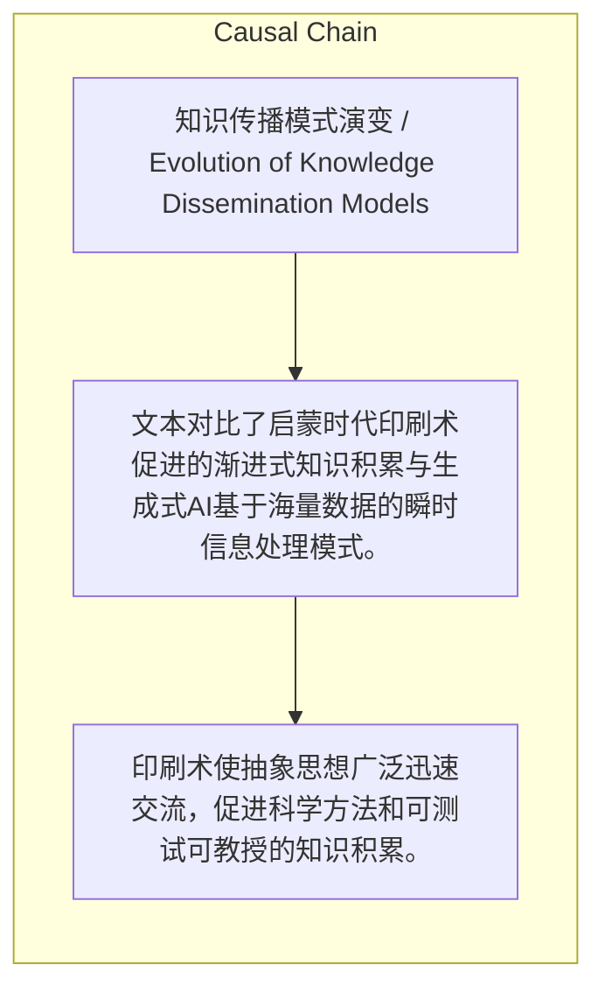

> 文本对比了启蒙时代印刷术促进的渐进式知识积累与生成式AI基于海量数据的瞬时信息处理模式。

## 元信息
- 分类：`people-life/relationships-trust`
- 优先级：`medium` (`12`)
- 文档类型：`text-summary`
- 来源分组：`news`
- 原始文件：`reports/news/2026-03-21/1774109336204-news-news-task-1774109293009-84h663.md`
- 请求 ID：`1774109293009-84h663`

## 原始内容

#### 文本总结

### 印刷术与生成式AI的知识传播模式对比

#### 整体结构化文档表达
##### 文档卡片
- 主题（中文/English）：知识传播模式演变 / Evolution of Knowledge Dissemination Models
- 一句话摘要：文本对比了启蒙时代印刷术促进的渐进式知识积累与生成式AI基于海量数据的瞬时信息处理模式。
- 目标读者：未提及
- 核心结论（3条）：
- 印刷术使抽象思想广泛迅速交流，促进科学方法和可测试可教授的知识积累。
- 生成式AI通过存储提炼海量信息，短时间内处理信息超越人类能力。
- 两种知识传播模式相反：启蒙时代为渐进积累，AI为瞬时处理。

##### 内容结构树
1. 背景与问题定义
2. 核心观点与关键证据
3. 方法/机制/路径
4. 风险与边界条件
5. 结论与行动建议

##### 结构化元数据（JSON）
```json
{
  "title": "印刷术与生成式AI的知识传播模式对比",
  "topic_zh": "知识传播模式演变",
  "topic_en": "Evolution of Knowledge Dissemination Models",
  "audience": "未提及",
  "claims": [
    "印刷术的发明使得信息得以快速复制与传播。",
    "学者们能够迅速复制彼此的发现并分享，使得信息以前所未有的速度整合与传播。",
    "生成式人工智能基于大量的现有信息进行存储和提炼。",
    "生成式AI的方式与启蒙时代的知识积累过程相反。"
  ],
  "evidence": [
    "1455年古登堡圣经的印刷。",
    "ChatGPT的训练数据包含了互联网上的大量文本材料和众多书籍。"
  ],
  "risks": [],
  "actions": []
}
```

#### 处理流程
1. 输入识别
2. 信息抽取（实体、概念、问题、事实、观点）
3. 结构化归纳（定义/分类/比较/因果/方法论）
4. 关系建模（概念关系、等式/方程/逻辑链）
5. 可视化表达（Mermaid）

#### 概念清单（中英文）
- 启蒙时代 / Age of Enlightenment
- 印刷术 / Printing Press
- 生成式人工智能 / Generative Artificial Intelligence
- 科学方法 / Scientific Method
- 知识积累 / Knowledge Accumulation

#### 概念定义（中英文）
##### 启蒙时代 / Age of Enlightenment
- 中文定义：未提及
- English Definition: Not mentioned

##### 印刷术 / Printing Press
- 中文定义：发明使得信息得以快速复制与传播的技术。
- English Definition: A technology that enabled rapid copying and dissemination of information.

##### 生成式人工智能 / Generative Artificial Intelligence
- 中文定义：基于大量现有信息进行存储和提炼，能短时间内处理海量信息的系统。
- English Definition: Systems that store and refine vast existing information to process massive data in short time.

##### 科学方法 / Scientific Method
- 中文定义：未提及
- English Definition: Not mentioned

##### 知识积累 / Knowledge Accumulation
- 中文定义：逐步的、可测试、可教授的知识增长过程。
- English Definition: A gradual, testable, and teachable process of knowledge growth.


#### 概念关联与逻辑关系（中英文）
- 印刷术/Printing Press -> 科学方法/Scientific Method | concept | 促进产生
- 生成式人工智能/Generative Artificial Intelligence -> 知识处理/Knowledge Processing | concept | 超越人类能力
- 启蒙时代/Age of Enlightenment -> 知识积累/Knowledge Accumulation | concept | 关联模式

##### 可形式化关系
- 印刷术发明 → 信息快速复制传播
- 信息快速传播 → 科学方法产生
- 生成式AI训练 → 海量信息瞬时处理

#### COT逻辑梳理（定义/分类/比较/因果/科学方法论）
- Step 1: 印刷术发明使信息得以快速复制与传播，例如古登堡圣经印刷。
- Step 2: 学者迅速复制分享发现，信息整合传播，产生科学方法，知识逐步积累。
- Step 3: 生成式AI开启新模式，基于海量信息存储提炼，短时间内处理信息超越人类。

#### 事实与看法（区分）
##### 事实
- 1455年古登堡圣经被印刷。
- ChatGPT的训练数据包含互联网文本和众多书籍。

##### 看法
- 生成式AI的知识处理方式与启蒙时代的渐进积累过程相反。

#### FAQ（原文问题整理）
- 未发现明确 FAQ

#### Visualization
##### Mermaid 图 1（概念结构图）


##### Mermaid 图 2（逻辑/因果图）


#### 文章中的类比
- 未发现明确类比

#### 10个金句
- 原文未提供
