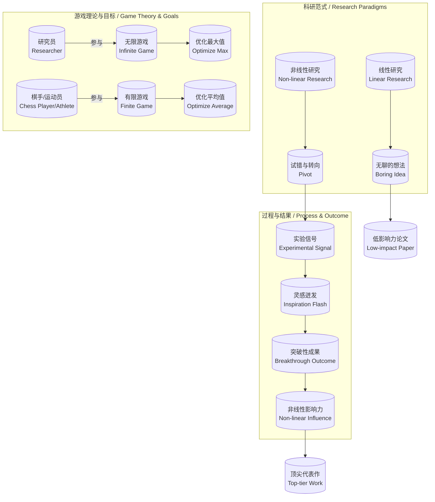
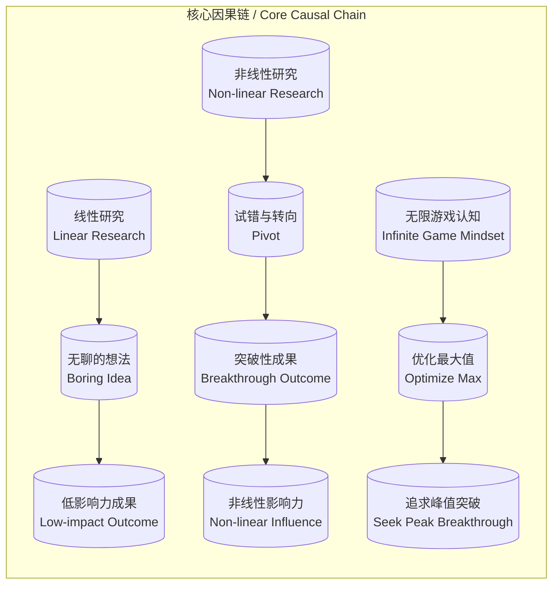

> 谢赛宁基于自身科研经历，系统阐述追求非线性研究的四大核心理由，认为科研本质是探索未知的“无限游戏”，优化目标是职业生涯的“最大值”。

## 元信息
- 分类：`people-life/relationships-trust`
- 优先级：`high` (`13`)
- 文档类型：`text-summary`
- 来源分组：`news`
- 原始文件：`reports/news/2026-03-20/1773966490891-news-news-task-1773966439876-rq7myn.md`
- 请求 ID：`1773966439876-rq7myn`

## 原始内容

#### 文本总结

### 谢赛宁：非线性研究是突破性科研的必经之路

#### 整体结构化文档表达
##### 文档卡片
- 主题（非线性研究 / Non-linear Research）：
- 一句话摘要：谢赛宁基于自身科研经历，系统阐述追求非线性研究的四大核心理由，认为科研本质是探索未知的“无限游戏”，优化目标是职业生涯的“最大值”。
- 目标读者：科研工作者、学术管理者、对科研方法论感兴趣的研究者。
- 核心结论（3条）：
    1.  线性发展的研究往往源于“无聊的想法”，无法产生突破性成果。
    2.  真实的科研必须常态性地拥抱“试错与转向（Pivot）”，低谷后的灵感迸发是突破的关键。
    3.  科研是一场优化“最大值”的“无限游戏”，研究员只需一生取得一两次巅峰突破即可。

##### 内容结构树
1.  **背景与问题定义**：批判将科研视为按部就班“工程执行”的线性思维，指出其导致“无聊想法”和低影响力成果。
2.  **核心观点与关键证据**：
    -   观点1：线性研究 = 无聊想法。证据：最差状态是初始设想与最终论文完全一致，无波折。
    -   观点2：科研需拥抱试错与转向。证据：优秀工作常经历长期“做不出来”后，依据实验信号（梯度）在最后一个月灵感迸发并收敛。
    -   观点3：影响力是非线性的。证据：引用Bill Freeman，一般论文无实质伤害，代表作影响力瞬间冲顶。
    -   观点4：科研是优化“最大值”的无限游戏。证据：研究员如发明家，非棋手/运动员，目标非优化“平均值”。
3.  **方法/机制/路径**：接受非线性的常态化挫折；在探索中根据实验反馈灵活“Pivot”；以职业生涯“最大值”为优化目标。
4.  **风险与边界条件**：长期处于“怎么做都做不出来”的低谷可能带来心理与资源压力；非线性路径难以被传统评价体系即时认可。
5.  **结论与行动建议**：研究员应主动追求非线性研究，将试错与转向视为常态，并树立“一生一突破”的长期主义价值观。

##### 结构化元数据（JSON）
```json
{
  "title": "谢赛宁：非线性研究是突破性科研的必经之路",
  "topic_zh": "非线性研究",
  "topic_en": "Non-linear Research",
  "audience": "科研工作者、学术管理者",
  "claims": [
    "线性发展的研究往往意味着‘无聊的想法’",
    "真实的科研必须拥抱‘试错与转向（Pivot）’",
    "科研成果的影响力本身就是非线性的",
    "科研是一场优化‘最大值’的无限游戏"
  ],
  "evidence": [
    "最差科研状态：初始Iidea与最终论文完全一致，无任何障碍或波折",
    "优秀工作经历前几个月‘怎么做都做不出来’的低谷，最后一个月依据实验信号（梯度）灵感迸发并Pivot",
    "一篇极出色的代表作其影响力会呈非线性地瞬间冲向顶点",
    "研究员如发明家，参与‘无限游戏’，优化‘最大值’；非棋手/运动员，困于‘有限游戏’，优化‘平均值’"
  ],
  "risks": [
    "长期非线性探索伴随的高不确定性及心理压力",
    "传统评价体系可能难以即时认可非线性路径的阶段性‘失败’"
  ],
  "actions": [
    "主动接受非线性的常态化挫折",
    "在实验中敏锐捕捉信号，勇于在关键时刻转向（Pivot）",
    "以职业生涯‘最大值’而非短期‘平均值’为成功标准"
  ]
}
```

#### 处理流程
1.  **输入识别**：来源为用户提供的关于谢赛宁科研理念的访谈内容文本。
2.  **信息抽取**：抽取实体（谢赛宁、Bill Freeman）、核心概念（非线性研究、线性研究、试错与转向、最大值优化、无限游戏、有限游戏）、问题（科研如何产生突破？）、事实（其优秀工作经历、引用观点）、观点（对科研本质的理解）。
3.  **结构化归纳**：将观点归纳为“批判线性思维”、“拥抱试错转向”、“影响力非线性”、“优化最大值”四个层次；将科研活动与“游戏理论”进行类比分类。
4.  **关系建模**：建立“非线性研究”与“试错转向”、“试错转向”与“突破性成果”、“最大值优化”与“无限游戏”等逻辑链。
5.  **可视化表达**：使用Mermaid绘制概念关系与因果链条图。

#### 概念清单（中英文）
-   非线性研究 / Non-linear Research
-   线性研究 / Linear Research
-   试错与转向 / Pivot
-   无聊的想法 / Boring Idea
-   探索的过程 / Exploration Process
-   实验信号（梯度） / Experimental Signal (Gradient)
-   影响力 / Influence
-   最大值 / Max
-   平均值 / Average
-   无限游戏 / Infinite Game
-   有限游戏 / Finite Game
-   研究员 / Researcher
-   棋手 / Chess Player
-   运动员（奥运会） / Athlete (Olympian)
-   发明家 / Inventor

#### 概念定义（中英文）
-   **非线性研究 / Non-linear Research**：一种科研范式，其过程充满不确定性、试错与方向调整，目标是从探索未知中实现突破性发现，而非按预设计划执行。
-   **线性研究 / Linear Research**：一种科研范式，其步骤按部就班、可预测，从明确想法出发，中间无重大障碍，最终产出与初始设想高度一致的成果。
-   **试错与转向（Pivot）/ Pivot**：在科研过程中，基于实验反馈或新认知，对原有研究方向、方法或假设进行根本性、及时调整的策略。
-   **无聊的想法 / Boring Idea**：指那些缺乏新意、可预测性强、执行过程平顺、最终产出与预期完全一致的初始研究构思，通常难以产生高影响力成果。
-   **探索的过程 / Exploration Process**：科研的本质状态，其未来不可完全预测，需要研究者不断尝试、面对挫折并根据新信息调整路径。
-   **实验信号（梯度）/ Experimental Signal (Gradient)**：在实验过程中获得的、指示当前路径是否可行或需要调整的反馈信息（如数据趋势、失败模式等）。
-   **影响力 / Influence**：一篇学术论文或一项成果对其领域及研究者职业生涯所产生的深远作用和认可度。
-   **最大值 / Max**：在职业生涯跨度内，所能达到的成就或影响力的最高点。是“无限游戏”的优化目标。
-   **平均值 / Average**：在多个独立、有限任务中表现的平均水平。是“有限游戏”的优化目标。
-   **无限游戏 / Infinite Game**：一种以延续游戏本身、创造新可能性为目标的长期活动，参与者关注的是打破边界、实现峰值，而非单次胜负。
-   **有限游戏 / Finite Game**：一种有明确规则、终点和胜负标准的短期活动，参与者关注的是在规则内每一步的精确执行以优化平均表现。
-   **研究员 / Researcher**：以探索未知、创造新知识为使命的科学家，其工作本质更接近“无限游戏”。
-   **棋手 / Chess Player**：在固定规则下进行有限对弈的竞技者，每一步都需精算，优化“平均值”表现，是“有限游戏”的典型。
-   **运动员（奥运会）/ Athlete (Olympian)**：在标准化规则和明确赛事中追求奖牌的竞技者，其表现受限于规则，优化“平均值”，是“有限游戏”的典型。
-   **发明家 / Inventor**：通过不断尝试、失败和灵感创造新事物的实践者，其过程充满未知，追求的是颠覆性“最大值”，是“无限游戏”的典型。

#### 概念关联与逻辑关系（中英文）
1.  **非线性研究 / Non-linear Research** 必然包含 **试错与转向（Pivot）/ Pivot**，而 **试错与转向（Pivot）/ Pivot** 是触发 **突破性成果 / Breakthrough Outcome**（文中隐含）的关键机制。
    *   `非线性研究 → 试错与转向 → 突破性成果`
2.  **线性研究 / Linear Research** 直接源于 **无聊的想法 / Boring Idea**，并导致 **低影响力论文 / Low-impact Paper**（文中隐含）。
    *   `线性研究 ← 无聊的想法 → 低影响力论文`
3.  **研究员 / Researcher** 参与 **无限游戏 / Infinite Game**，其优化目标是 **职业生涯最大值 / Career Max**；而非参与 **有限游戏 / Finite Game** 的 **棋手/运动员**，其优化目标是 **表现平均值 / Performance Average**。
    *   `研究员 + 无限游戏 → 优化最大值`
    *   `棋手/运动员 + 有限游戏 → 优化平均值`

#### COT逻辑梳理（定义/分类/比较/因果/科学方法论）
*   **Step 1 (定义与问题提出)**：定义两种科研范式。**线性研究**是按计划执行的工程，**非线性研究**是拥抱未知的探索。核心问题：何种范式更能产生突破性成果？
*   **Step 2 (比较与批判)**：比较二者。**线性研究**过程无波折，表明初始 **“无聊的想法”** 缺乏探索空间，产出通常平庸。**非线性研究**过程充满障碍与转向，是探索未知的必然。
*   **Step 3 (因果分析)**：建立因果链。**非线性研究** → 经历长期试错与低谷 → 依据 **“实验信号”** 进行关键 **“Pivot”** → 灵感迸发 → 产生 **“突破性成果”**。同时，成果的 **“影响力”** 本身呈 **“非线性”**（平庸无害，顶尖冲天）。
*   **Step 4 (哲学归类与类比)**：将科研活动进行游戏理论分类。研究员如 **“发明家”**，参与 **“无限游戏”**，优化 **“最大值”**；棋手/运动员参与 **“有限游戏”**，优化 **“平均值”**。这解释了为何研究员不应怕失败，而应追求生涯峰值。
*   **Step 5 (科学方法论总结)**：提出非线性研究的科学方法论：1) 接受试错常态化；2) 敏锐解读实验信号；3) 勇于在关键时刻Pivot；4) 以生涯Max值为终极目标，而非单次任务的平均表现。

#### 事实与看法（病毒）
##### 事实
-   谢赛宁认为一个线性发展的研究永远不是好的研究。
-   最差的科研状态是：从定义好Idea开始，中间无任何障碍或波折，最终论文与初始设想完全一致。
-   谢赛宁自己的许多优秀工作，是在前几个月“怎么做都做不出来”后，根据实验信号（梯度），在最后一个月灵感迸发并迅速收敛方向（Pivot）。
-   谢赛宁引用MIT教授Bill Freeman的观点：一篇论文对职业生涯的影响不是线性曲线；一篇极出色的代表作，其影响力会呈非线性地瞬间冲向顶点。
-   谢赛宁将研究员类比为发明家，参与“无限游戏”，优化“最大值”；将棋手/运动员类比为参与“有限游戏”，优化“平均值”。

##### 看法
-   线性发展的研究意味着“无聊的想法”。
-   真实的科研注定永远是一个探索的过程。
-   接受非线性的常态化挫折是做出突破性研究的必经之路。
-   研究员终其一生不需要每次都成功，只要能取得一两次真正的巅峰突破就足够了。
-   科研是一场优化“最大值”的无限游戏（这是驱动他追求非线性研究的最深层哲学）。

#### FAQ（原文问题整理）
-   **Q：为什么线性研究不是好研究？**
    -   A：因为它通常意味着初始想法是“无聊的”，过程无探索、无波折，产出缺乏惊喜。
-   **Q：真实的科研过程应该是什么样的？**
    -   A：应该是一个充满试错、障碍和方向调整（Pivot）的探索过程，低谷后的灵感迸发是突破的关键。
-   **Q：科研成果的影响力如何分布？**
    -   A：影响力是非线性的。一般论文伤害有限，但顶尖代表作的影响力会瞬间冲顶，形成巨大差距。
-   **Q：研究员应该用什么标准衡量自己的职业生涯？**
    -   A：应该用“最大值”（生涯巅峰成就）而非“平均值”（每次任务的常规表现）作为优化目标，因为科研是“无限游戏”。

#### Visualization
##### Mermaid 图 1（概念结构图）

##### Mermaid 图 2（逻辑/因果图）


#### 文章中的类比
-   研究员 vs. 棋手/运动员：研究员是“发明家”，参与“无限游戏”，优化“最大值”；棋手/运动员受困于“有限游戏”，优化“平均值”。
-   科研影响力曲线：一篇论文对职业生涯的影响不是“线性增长曲线”，而是平庸者无害，顶尖者“瞬间冲向顶点”的非线性曲线。

#### 10个金句
1.  最差的科研状态就是从一开始定义好了一个Idea，然后中间没有遇到任何障碍或波折，最后发了一篇与初始设想完全一致的论文。
2.  这通常说明一开始的想法是一个毫无惊喜的“无聊的想法”。
3.  真实的科研注定永远是一个探索的过程。
4.  最好的工作往往是在探索的过程中弯弯绕绕、跳来跳去，走了很多弯路才最终到达终点。
5.  接受非线性的常态化挫折是做出突破性研究的必经之路。
6.  一篇很差或一般的论文其实不会对职业生涯造成什么实质性伤害（没有人会真正在意）。
7.  但一旦做出一篇极其出色的代表作，它的影响力就会呈非线性地瞬间冲向顶点。
8.  研究员不像是下棋的棋手或参加奥运会的运动员。
9.  研究员更像是发明家，参与的是一场“无限游戏”。
10. 优化的目标是职业生涯的“最大值”。
