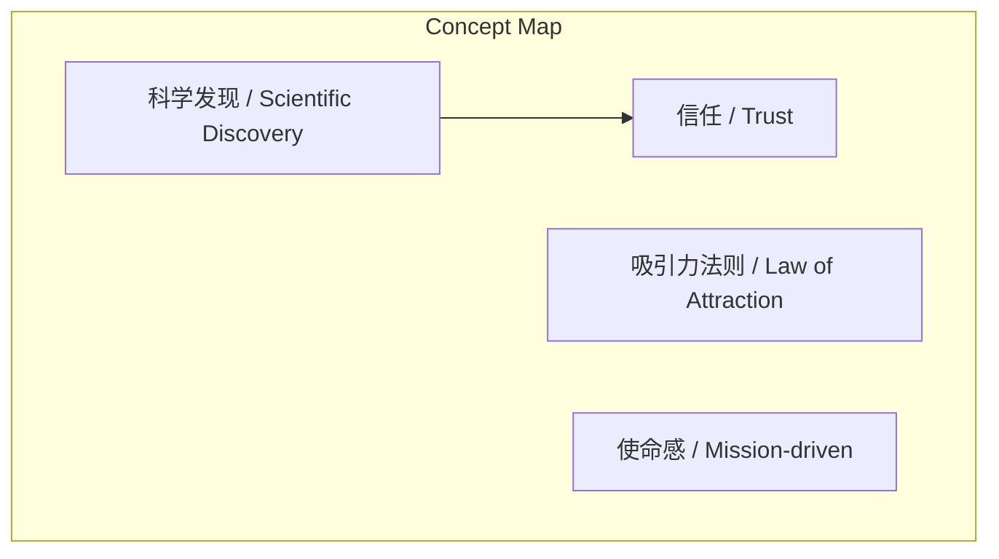
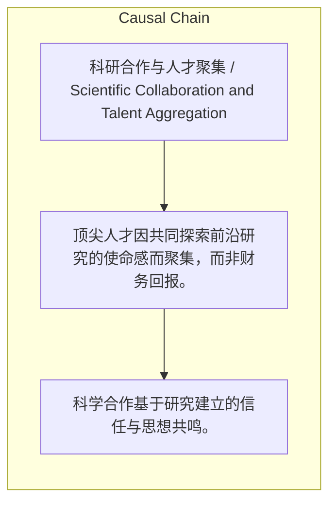

> 顶尖人才因共同探索前沿研究的使命感而聚集，而非财务回报。

## 元信息
- 分类：`people-life/relationships-trust`
- 优先级：`medium` (`11`)
- 文档类型：`text-summary`
- 来源分组：`news`
- 原始文件：`reports/news/2026-03-22/1774199142549-news-news-task-1774199099383-4v3ji6.md`
- 请求 ID：`1774199099383-4v3ji6`

## 原始内容

#### 文本总结

##### 运行信息
- model: stepfun/step-3.5-flash:free
- schema_fallback: yes
- attempted_models: stepfun/step-3.5-flash:free

### 顶尖人才因共同使命聚集做前沿研究

#### 整体结构化文档表达
##### 文档卡片
- 主题（中文/English）：科研合作与人才聚集 / Scientific Collaboration and Talent Aggregation
- 一句话摘要：顶尖人才因共同探索前沿研究的使命感而聚集，而非财务回报。
- 目标读者：人工智能领域顶尖科研人才
- 核心结论（3条）：
- 科学合作基于研究建立的信任与思想共鸣。
- 学术认知根基吻合促进自然合作。
- 共同使命是聚拢顶尖人才的核心动力。

##### 内容结构树
1. 背景与问题定义
2. 核心观点与关键证据
3. 方法/机制/路径
4. 风险与边界条件
5. 结论与行动建议

##### 结构化元数据（JSON）
```json
{
  "title": "顶尖人才因共同使命聚集做前沿研究",
  "topic_zh": "科研合作与人才聚集",
  "topic_en": "Scientific Collaboration and Talent Aggregation",
  "audience": "人工智能领域顶尖科研人才",
  "claims": [
    "做研究、发表论文是为了分享知识、启发他人。",
    "想法一致、学术认知根基吻合的人会自然聚集。",
    "真正聚拢顶尖人才的是共同使命而非财务回报。"
  ],
  "evidence": [],
  "risks": [],
  "actions": []
}
```

#### 处理流程
1. 输入识别
2. 信息抽取（实体、概念、问题、事实、观点）
3. 结构化归纳（定义/分类/比较/因果/方法论）
4. 关系建模（概念关系、等式/方程/逻辑链）
5. 可视化表达（Mermaid）

#### 概念清单（中英文）
- 科学发现 / Scientific Discovery
- 信任 / Trust
- 吸引力法则 / Law of Attraction
- 使命感 / Mission-driven

#### 概念定义（中英文）
##### 科学发现 / Scientific Discovery
- 中文定义：通过研究获得新知识的过程，建立研究员间信任。
- English Definition: The process of gaining new knowledge through research, building trust among researchers.

##### 信任 / Trust
- 中文定义：研究员之间深刻的信任和互相欣赏。
- English Definition: Deep trust and mutual appreciation among researchers.

##### 吸引力法则 / Law of Attraction
- 中文定义：想法一致、学术认知根基吻合的人最终会自然地聚到一起。
- English Definition: People with consistent ideas and compatible academic foundations naturally gather together.

##### 使命感 / Mission-driven
- 中文定义：基于共同使命驱动探索前沿研究的心理状态。
- English Definition: A mindset driven by a shared mission to explore cutting-edge research.


#### 概念关联与逻辑关系（中英文）
- 科学发现/Scientific Discovery -> 信任/Trust | concept | 建立
- 学术认知一致/Academic Consistency -> 合作/Collaboration | concept | 促进
- 共同使命/Shared Mission -> 人才聚集/Talent Aggregation | concept | 驱动

##### 可形式化关系
- 科学发现 → 信任
- 学术认知一致 → 合作
- 共同使命 → 人才聚集

#### COT逻辑梳理（定义/分类/比较/因果/科学方法论）
- Step 1: 科学发现与共同研究建立研究员间深刻信任与思想共鸣。
- Step 2: 想法一致、学术认知根基吻合的人自然聚集并展开合作。
- Step 3: 共同使命超越财务回报，聚拢顶尖人才探索前沿研究。

#### 事实与看法（区分）
##### 事实
- 未发现明确客观事实

##### 看法
- 做研究是为了分享知识、启发他人。
- 真正聚拢顶尖人才的是共同使命而非财务回报。

#### FAQ（原文问题整理）
- 未发现明确 FAQ

#### Visualization
##### Mermaid 图 1（概念结构图）


##### Mermaid 图 2（逻辑/因果图）


#### 文章中的类比
- 未发现明确类比

#### 10个金句
- 原文未提供
