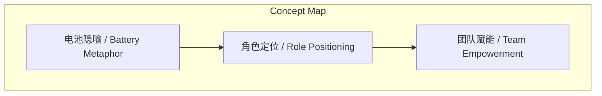
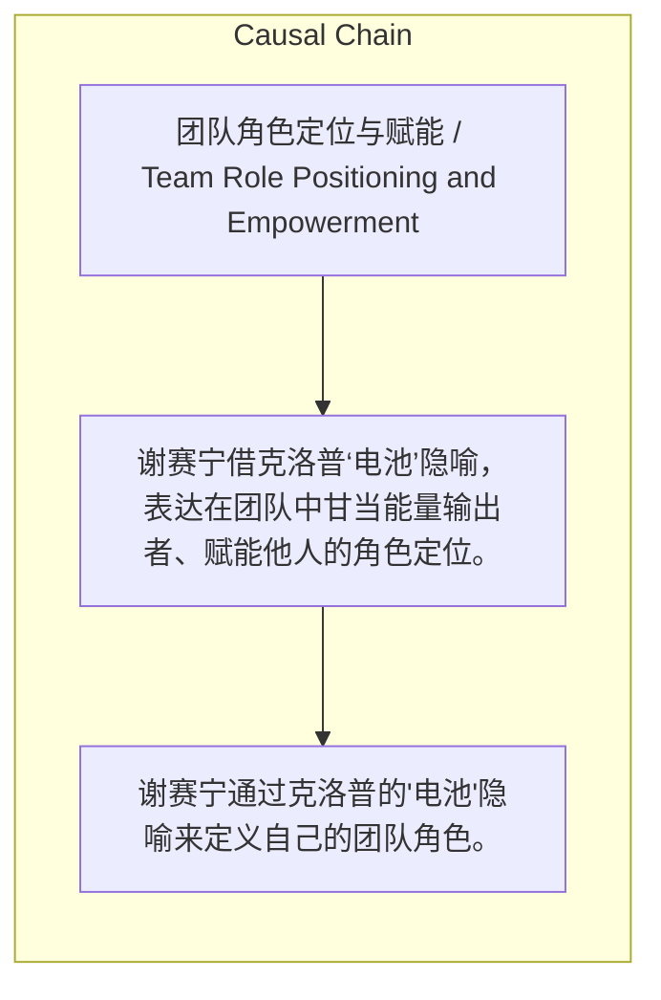

> 谢赛宁借克洛普‘电池’隐喻，表达在团队中甘当能量输出者、赋能他人的角色定位。

## 元信息
- 分类：`people-life/relationships-trust`
- 优先级：`medium` (`11`)
- 文档类型：`text-summary`
- 来源分组：`news`
- 原始文件：`reports/news/2026-03-23/1774225341101-news-news-task-1774225298808-8v2d23.md`
- 请求 ID：`1774225298808-8v2d23`

## 原始内容

#### 文本总结

##### 运行信息
- model: stepfun/step-3.5-flash:free
- schema_fallback: yes
- attempted_models: stepfun/step-3.5-flash:free

### 谢赛宁以‘电池’自喻的团队角色观

#### 整体结构化文档表达
##### 文档卡片
- 主题（中文/English）：团队角色定位与赋能 / Team Role Positioning and Empowerment
- 一句话摘要：谢赛宁借克洛普‘电池’隐喻，表达在团队中甘当能量输出者、赋能他人的角色定位。
- 目标读者：教育工作者、创业团队成员
- 核心结论（3条）：
- 谢赛宁通过克洛普的'电池'隐喻来定义自己的团队角色。
- 他拒绝'天选之子'的孤高形象，选择做普通但持续供电的'电池'。
- 这种理念适用于教育和创业场景，旨在为团队提供勇气和能量。

##### 内容结构树
1. 背景与问题定义
2. 核心观点与关键证据
3. 方法/机制/路径
4. 风险与边界条件
5. 结论与行动建议

##### 结构化元数据（JSON）
```json
{
  "title": "谢赛宁以‘电池’自喻的团队角色观",
  "topic_zh": "团队角色定位与赋能",
  "topic_en": "Team Role Positioning and Empowerment",
  "audience": "教育工作者、创业团队成员",
  "claims": [
    "主张在团队中应扮演赋能者而非中心化英雄角色"
  ],
  "evidence": [
    "克洛普自述：'我在团队里的定位就是一块电池——希望通过自己的热情和能量去为其他人发电'",
    "谢赛宁的共鸣：不仅因克洛普气质，更因其对自身价值的认知"
  ],
  "risks": [],
  "actions": []
}
```

#### 处理流程
1. 输入识别
2. 信息抽取（实体、概念、问题、事实、观点）
3. 结构化归纳（定义/分类/比较/因果/方法论）
4. 关系建模（概念关系、等式/方程/逻辑链）
5. 可视化表达（Mermaid）

#### 概念清单（中英文）
- 电池隐喻 / Battery Metaphor
- 团队赋能 / Team Empowerment
- 角色定位 / Role Positioning

#### 概念定义（中英文）
##### 电池隐喻 / Battery Metaphor
- 中文定义：将个人比作可充电电池，持续为团队输出能量
- English Definition: Metaphor comparing an individual to a rechargeable battery that continuously outputs energy to the team.

##### 团队赋能 / Team Empowerment
- 中文定义：通过个人能量激发团队整体能力与士气
- English Definition: Stimulating the overall capability and morale of the team through individual energy.

##### 角色定位 / Role Positioning
- 中文定义：个人在团队中自我定义的功能与价值
- English Definition: Self-defined function and value of an individual within a team.


#### 概念关联与逻辑关系（中英文）
- 电池隐喻/Battery Metaphor -> 角色定位/Role Positioning | concept | informs
- 天选之子/Chosen One -> 电池/Battery | concept | contrasts with
- 角色定位/Role Positioning -> 团队赋能/Team Empowerment | concept | aims at

##### 可形式化关系
- 克洛普的'电池'隐喻 → 谢赛宁的角色定位
- '天选之子'模式 ≠ '电池'模式
- 角色定位（电池） → 团队赋能

#### COT逻辑梳理（定义/分类/比较/因果/科学方法论）
- Step 1: 谢赛宁从克洛普的言论中提取'电池'隐喻。
- Step 2: 他将此隐喻与自身经历结合，形成自我角色认知。
- Step 3: 他拒绝'天选之子'模式，确立'电池'模式，并应用于教育和创业场景。

#### 事实与看法（区分）
##### 事实
- 谢赛宁喜欢利物浦球队超过20年。
- 他最欣赏的教练是尤尔根·克洛普。
- 克洛普曾回应穆里尼奥的名言：'我不是那个特别的人，我是个普通人'。
- 克洛普将自己在团队中的定位描述为'电池'。

##### 看法
- 谢赛宁认为克洛普的朋克和摇滚气质令人欣赏。
- 谢赛宁渴望成为'电池'，将电力和激情输送给周围的人。

#### FAQ（原文问题整理）
- 未发现明确 FAQ

#### Visualization
##### Mermaid 图 1（概念结构图）


##### Mermaid 图 2（逻辑/因果图）


#### 文章中的类比
- 未发现明确类比

#### 10个金句
- 穆里尼奥：'我是特殊的一个（I am the special one）'
- 克洛普：'我不是那个特别的人，我是个普通人（I'm not the special one I'm the normal one）'
- 克洛普：'我在团队里的定位就是一块电池——希望通过自己的热情和能量去为其他人发电'
