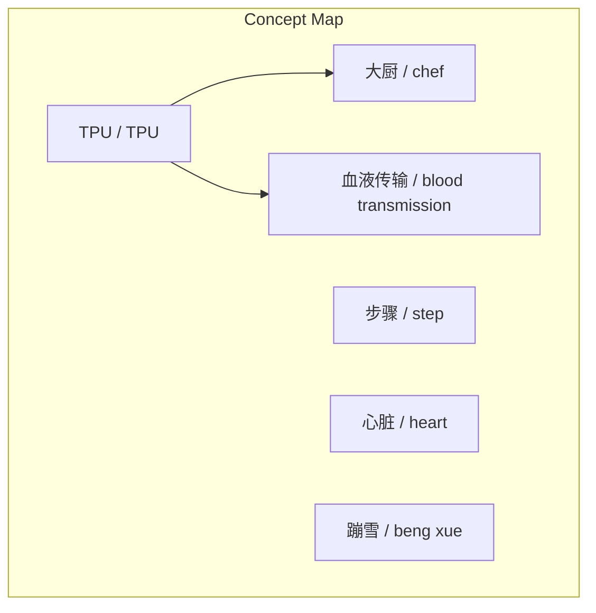
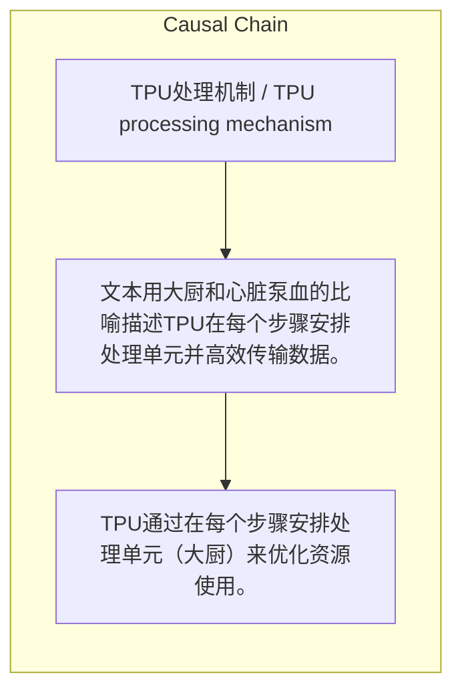

> 文本用大厨和心脏泵血的比喻描述TPU在每个步骤安排处理单元并高效传输数据。

## 元信息
- 分类：`people-life/relationships-trust`
- 优先级：`medium` (`12`)
- 文档类型：`text-summary`
- 来源分组：`news`
- 原始文件：`reports/news/2026-03-25/1774446173293-news-news-task-1774446103512-14hgwg.md`
- 请求 ID：`1774446103512-14hgwg`

## 原始内容

#### 文本总结

##### 运行信息
- model: stepfun/step-3.5-flash:free
- schema_fallback: yes
- attempted_models: stepfun/step-3.5-flash:free

### TPU处理机制比喻

#### 整体结构化文档表达
##### 文档卡片
- 主题（中文/English）：TPU处理机制 / TPU processing mechanism
- 一句话摘要：文本用大厨和心脏泵血的比喻描述TPU在每个步骤安排处理单元并高效传输数据。
- 目标读者：未提及
- 核心结论（3条）：
- TPU通过在每个步骤安排处理单元（大厨）来优化资源使用。
- 处理步骤被比喻为心脏的跳动（蹦雪），表示连续核心作用。
- TPU像心脏泵血一样将数据（血液）传输到各个角落。

##### 内容结构树
1. 背景与问题定义
2. 核心观点与关键证据
3. 方法/机制/路径
4. 风险与边界条件
5. 结论与行动建议

##### 结构化元数据（JSON）
```json
{
  "title": "TPU处理机制比喻",
  "topic_zh": "TPU处理机制",
  "topic_en": "TPU processing mechanism",
  "audience": "未提及",
  "claims": [],
  "evidence": [],
  "risks": [],
  "actions": []
}
```

#### 处理流程
1. 输入识别
2. 信息抽取（实体、概念、问题、事实、观点）
3. 结构化归纳（定义/分类/比较/因果/方法论）
4. 关系建模（概念关系、等式/方程/逻辑链）
5. 可视化表达（Mermaid）

#### 概念清单（中英文）
- TPU / TPU
- 大厨 / chef
- 步骤 / step
- 心脏 / heart
- 蹦雪 / beng xue
- 血液传输 / blood transmission

#### 概念定义（中英文）
##### TPU / TPU
- 中文定义：文本中比喻为一种高效处理单元系统
- English Definition: Metaphor for an efficient processing unit system in the text.

##### 大厨 / chef
- 中文定义：比喻为处理单元或资源
- English Definition: Metaphor for processing units or resources.

##### 步骤 / step
- 中文定义：处理过程中的阶段
- English Definition: Stages in the processing.

##### 心脏 / heart
- 中文定义：比喻为核心泵送机制
- English Definition: Metaphor for core pumping mechanism.

##### 蹦雪 / beng xue
- 中文定义：可能为‘跳动’的误写，比喻为心脏的跳动
- English Definition: Possible typo for 'beat', metaphor for heart beat.

##### 血液传输 / blood transmission
- 中文定义：比喻为数据传输
- English Definition: Metaphor for data transmission.


#### 概念关联与逻辑关系（中英文）
- TPU/TPU -> 大厨/chef | concept | 安排
- 步骤/step -> 心脏的蹦雪/heart's beng xue | concept | 比喻为
- TPU/TPU -> 血液传输/blood transmission | concept | 执行

##### 可形式化关系
- 安排(TPU, 大厨, 每个步骤)
- 比喻(步骤, 心脏的蹦雪)
- 传输(TPU, 血液, 各个角落)

#### COT逻辑梳理（定义/分类/比较/因果/科学方法论）
- Step 1: TPU在每个步骤安排大厨（处理单元）。
- Step 2: 每个步骤被理解为心脏的蹦雪（跳动）。
- Step 3: TPU每次将血液（数据）传输到各个角落。

#### 事实与看法（区分）
##### 事实
- 未发现明确客观事实

##### 看法
- 未发现明确主观看法

#### FAQ（原文问题整理）
- 未发现明确 FAQ

#### Visualization
##### Mermaid 图 1（概念结构图）


##### Mermaid 图 2（逻辑/因果图）


#### 文章中的类比
- TPU像大厨安排系统
- 步骤像心脏蹦雪
- 数据传输像血液传输

#### 10个金句
- 原文未提供
