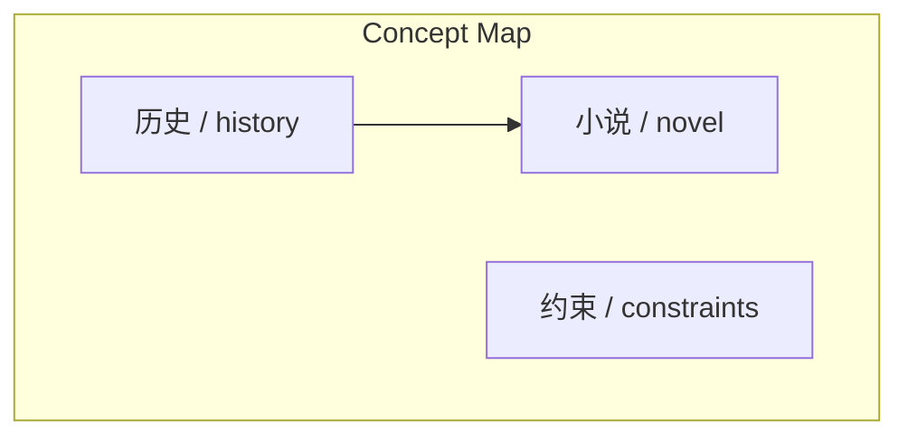
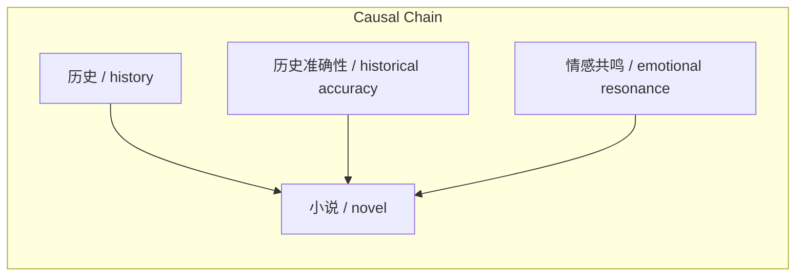

> 大仲马观点：历史提供素材，资料拓展：历史不被亵渎，需遵循规则，最终目的在于与现代人情感共鸣。

## 元信息
- 分类：`world-strategy/culture-history`
- 优先级：`medium` (`12`)
- 文档类型：`text-summary`
- 来源分组：`news`
- 原始文件：`reports/news/2026-03-29/1774780085841-news-news-task-1774780071099-260gjk.md`
- 请求 ID：`1774780071099-260gjk`

## 原始内容

#### 文本总结

##### 运行信息
- model: openrouter/free
- schema_fallback: no
- attempted_models: openrouter/free

### 历史为小说家提供支撑

#### 整体结构化文档表达
##### 文档卡片
- 主题（中文/English）：历史为小说家提供支撑 / History as a Nail
- 一句话摘要：大仲马观点：历史提供素材，资料拓展：历史不被亵渎，需遵循规则，最终目的在于与现代人情感共鸣。
- 目标读者：新闻分析助理
- 核心结论（3条）：
- 历史不被亵渎，而是被增色
- 创作需遵循历史规则（带镣铐跳舞）
- 最终目的在于与现代人情感共鸣

##### 内容结构树
1. 背景与问题定义
2. 核心观点与关键证据
3. 方法/机制/路径
4. 风险与边界条件
5. 结论与行动建议

##### 结构化元数据（JSON）
```json
{
  "title": "历史为小说家提供支撑",
  "topic_zh": "历史为小说家提供支撑",
  "topic_en": "History as a Nail",
  "audience": "新闻分析助理",
  "claims": [
    "大仲马观点：历史提供素材，小说家挂上想象与情节",
    "资料拓展：历史不被“亵渎”，而是被“增色”",
    "资料拓展：创作需“带着镣铐跳舞”",
    "资料拓展：最终目的在于与现代人情感共鸣"
  ],
  "evidence": [
    "资料明确指出“历史不容玩笑或恶搞”是伪命题",
    "资料通过《叶现》故事说明社会规则约束",
    "资料通过鉴真东渡例子说明情感共鸣"
  ],
  "risks": [
    "未提及其他历史事件",
    "未提及大仲马其他观点"
  ],
  "actions": [
    "生成标题",
    "提取核心结论",
    "整理形式化关系",
    "构建逻辑步骤"
  ]
}
```

#### 处理流程
1. 输入识别
2. 信息抽取（实体、概念、问题、事实、观点）
3. 结构化归纳（定义/分类/比较/因果/方法论）
4. 关系建模（概念关系、等式/方程/逻辑链）
5. 可视化表达（Mermaid）

#### 概念清单（中英文）
- 历史 / history
- 小说 / novel
- 约束 / constraints

#### 概念定义（中英文）
##### 历史 / history
- 中文定义：历史作为小说创作的支撑点
- English Definition: History as a nail

##### 小说 / novel
- 中文定义：小说作为小说家创作的衣物
- English Definition: Novel as clothing

##### 约束 / constraints
- 中文定义：历史准确性约束
- English Definition: Historical accuracy constraints


#### 概念关联与逻辑关系（中英文）
- 历史/history -> 小说/novel | support | provide
- 历史准确性/historical accuracy -> 小说/novel | support | require
- 情感共鸣/emotional resonance -> 小说/novel | support | achieve

##### 可形式化关系
- 历史（钉子）→ 小说（衣服）
- 历史规则（钉子规则）→ 创作约束
- 情感共鸣（现实意义）→ 小说价值

#### COT逻辑梳理（定义/分类/比较/因果/科学方法论）
- Step 1: 大仲马观点 - 历史提供素材
- Step 2: 资料拓展 - 历史不被亵渎，需遵循规则
- Step 3: 最终目的 - 情感共鸣

#### 事实与看法（区分）
##### 事实
- 大仲马观点：历史提供素材
- 资料拓展：历史不被亵渎
- 资料拓展：创作需遵循历史规则
- 资料拓展：最终目的在于与现代人情感共鸣

##### 看法
- 资料对大仲马观点持赞同态度
- 资料拓展了历史不被亵渎的理念
- 资料引入了歌德“带着镣铐跳舞”的理念

#### FAQ（原文问题整理）
##### 是否提及大仲马的其他观点
- 未提及

##### 是否提及具体历史事件
- 未提及

#### Visualization
##### Mermaid 图 1（概念结构图）


##### Mermaid 图 2（逻辑/因果图）


#### 文章中的类比
- 历史作为小说家创作的支撑点
- 历史作为“钉子”，小说为“衣服”

#### 10个金句
- 历史是墙上的一枚挂衣钉
- 带着镣铐跳舞
- 写论文没存盘遇停电的深刻共鸣
