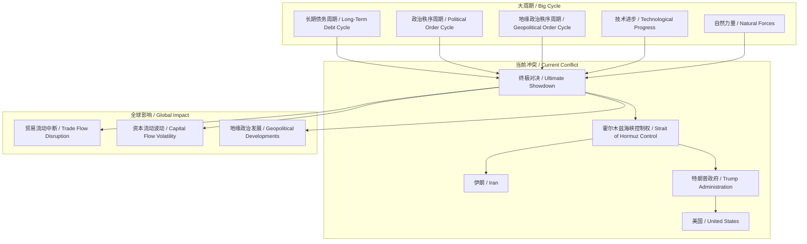

> 本文认为当前中东关于霍尔木兹海峡的冲突是“大周期”的体现，将引发全球性影响，并建议通过监测五大力量来应对。

## 元信息
- 分类：`world-strategy/strategic-research`
- 优先级：`high` (`14`)
- 文档类型：`text-summary`
- 来源分组：`news`
- 原始文件：`reports/news/2026-03-20/1773966197515-news-news-task-1773966111072-ife7tl.md`
- 请求 ID：`1773966111072-ife7tl`

## 原始内容

#### 文本总结

### 终极对决与大周期：中东局势的深层逻辑

#### 整体结构化文档表达
##### 文档卡片
- 主题（中文/English）：地缘政治冲突与历史周期分析 / Geopolitical Conflict and Historical Cycle Analysis
- 一句话摘要：本文认为当前中东关于霍尔木兹海峡的冲突是“大周期”的体现，将引发全球性影响，并建议通过监测五大力量来应对。
- 目标读者：对地缘政治、宏观投资及历史规律感兴趣的读者与决策者
- 核心结论（3条）：
  1. 当前中东冲突是“大周期”在当前时间点的具体表现，将升级为“终极对决”。
  2. 冲突的直接与间接影响将波及全球，后果难以预料且必然带来负面影响。
  3. 应对策略应基于对“大周期”五大力量指标的监测，通过研究历史来预判未来并采取行动。

##### 内容结构树
1. 背景与问题定义：讨论通过协议结束战争的无效性，指出霍尔木兹海峡控制权争夺将导致冲突升级为“终极对决”。
2. 核心观点与关键证据：引用伊朗军方声明说明攻击目标；分析“终极对决”对特朗普政府威望及美国力量的影响；指出冲突将波及全球贸易、资本流动及多国地缘政治。
3. 方法/机制/路径：提出“大周期”理论，包含五大相互关联的力量（长期债务周期、政治秩序周期、地缘政治秩序周期、技术进步、自然力量），主张通过研究历史战争经验来理解当前局势。
4. 风险与边界条件：战争会像疫情一样迅速蔓延；美国无能力同时进行多场战争；各国国内对代价承担存在争论；后果难以预料且负面。
5. 结论与行动建议：强调作者作为务实者的预判原则；建议自问大周期进程是否真实、指标是否准确、应采取何种行动；邀请读者共同探讨。

##### 结构化元数据（JSON）
```json
{
  "title": "终极对决与大周期：中东局势的深层逻辑",
  "topic_zh": "地缘政治冲突与历史周期分析",
  "topic_en": "Geopolitical Conflict and Historical Cycle Analysis",
  "audience": "对地缘政治、宏观投资及历史规律感兴趣的读者与决策者",
  "claims": [
    "当前中东冲突是“大周期”在当前时间点的具体表现，将升级为“终极对决”。",
    "冲突的直接与间接影响将波及全球，后果难以预料且必然带来负面影响。",
    "应对策略应基于对“大周期”五大力量指标的监测，通过研究历史来预判未来并采取行动。"
  ],
  "evidence": [
    "伊朗军方声明：所有该地区部分由美国拥有或与美国合作的石油公司的石油、经济和能源设施将立即被摧毁。",
    "五大力量列表：长期债务周期、政治秩序与失序周期、国际地缘政治秩序与失序周期、技术进步、自然力量。",
    "美国没有能力同时进行多场战争。",
    "作者提及著作《国家如何破产：大周期》及YouTube视频《变化中的世界秩序》。"
  ],
  "risks": [
    "战争会像疫情一样以难以想象的方式迅速蔓延。",
    "各国国内关于行动、代价承担形式的争论将加剧不确定性。",
    "直接或间接关联与后果难以预料且必然带来负面影响。"
  ],
  "actions": [
    "研究过去五百年帝国兴衰及储备货币变迁的历史经验。",
    "监测五大力量及整体大周期的健康状况和发展进程指标。",
    "自问：大周期发展进程是否真实？指标是否准确反映所处位置？据此决定行动。"
  ]
}
```

#### 处理流程
1. 输入识别：输入文本为一段关于中东霍尔木兹海峡冲突及其历史周期背景的论述，包含作者观点、证据与建议。
2. 信息抽取：抽取实体（伊朗、霍尔木兹海峡、特朗普政府、美国）、核心概念（终极对决、大周期、五大力量）、问题（冲突解决、全球影响）、事实（伊朗军方声明、五大力量列表、美国战争能力限制）、观点（协议无效、周期理论、行动原则）。
3. 结构化归纳：将内容归纳为背景、观点、方法、风险、结论五部分；定义“大周期”及其五大力量；比较历史战争经验以分析当前局势。
4. 关系建模：建立“终极对决”属于“大周期”表现、“五大力量”驱动“大周期”演进、“战争能力”受多重因素影响等逻辑关系。
5. 可视化表达：基于真实概念生成Mermaid概念结构图与逻辑因果图。

#### 概念清单（中英文）
- 终极对决 / Ultimate Showdown
- 霍尔木兹海峡 / Strait of Hormuz
- 伊朗 / Iran
- 特朗普政府 / Trump Administration
- 美国 / United States
- 石油公司 / Oil Companies
- 战争金融能力 / War Finance Capability
- 军事能力 / Military Capability
- 大周期 / Big Cycle
- 长期债务周期 / Long-Term Debt Cycle
- 政治秩序周期 / Political Order Cycle
- 地缘政治秩序周期 / Geopolitical Order Cycle
- 技术进步 / Technological Progress
- 自然力量 / Natural Forces
- 储备货币 / Reserve Currency
- 帝国兴衰 / Rise and Fall of Empires
- 全球贸易流动 / Global Trade Flows
- 资本流动 / Capital Flows
- 地缘政治发展 / Geopolitical Developments
- 俄朝古乌欧印日 / Russia, North Korea, Cuba, Ukraine, Europe, India, Japan
- 协议 / Agreement
- 水雷 / Naval Mines

#### 概念定义（中英文）
- 终极对决：文中指即将发生的、决定霍尔木兹海峡控制权及冲突胜负的最终大规模冲突。
- 霍尔木兹海峡：位于中东的关键石油运输通道，文中冲突的核心争夺目标。
- 伊朗：文中指霍尔木兹海峡当前控制方及潜在攻击目标国家。
- 特朗普政府：文中指美国时任政府，承诺重新开放海峡并可能组建护航联盟。
- 美国：文中指超级大国，其战争能力与政策选择影响冲突全局。
- 石油公司：文中指部分由美国拥有或与美国合作的公司，其设施可能成为攻击目标。
- 战争金融能力：国家支持战争的财务资源与机制，受同时进行战争数量、国内政治及国际关系影响。
- 军事能力：国家的武装力量实力与投射能力，受多重因素制约。
- 大周期：驱动货币秩序、政治秩序与地缘政治秩序更迭的长期循环，包含五大相互关联的力量。
- 长期债务周期：大周期五大力量之一，指债务积累与清偿的长期过程，影响国家财政与战争能力。
- 政治秩序周期：大周期五大力量之一，指国内政治稳定与失序的循环，严重时导致内战。
- 地缘政治秩序周期：大周期五大力量之一，指国际秩序与失序的循环，严重时引发世界大战。
- 技术进步：大周期五大力量之一，可能改善或摧毁生活，改变战争形态与能力。
- 自然力量：大周期五大力量之一，指自然灾害等外部力量，影响社会与经济稳定。
- 储备货币：作为国际交易与储备的主要货币，其变迁与帝国兴衰相关。
- 帝国兴衰：历史上强大国家的崛起与衰落过程，作者研究其与储备货币变迁的关联。
- 全球贸易流动：商品与服务跨国交易，受冲突影响可能中断。
- 资本流动：资金跨国移动，受地缘政治风险影响。
- 地缘政治发展：国家间战略关系与权力格局变化，受冲突波及。
- 俄朝古乌欧印日：文中列举的可能受冲突影响或参与关联的国家与地区。
- 协议：文中指旨在结束战争的谈判结果，作者认为毫无价值。
- 水雷：文中指可能被布设于霍尔木兹海峡的海上障碍，影响航行安全。

#### 概念关联与逻辑关系（中英文）
1. 终极对决（Ultimate Showdown） 是 大周期（Big Cycle） 在当前时间点的具体表现。  
   `Ultimate Showdown ⊆ Big Cycle (at current point)`
2. 五大力量（长期债务周期、政治秩序周期、地缘政治秩序周期、技术进步、自然力量）共同驱动 大周期（Big Cycle） 的演进。  
   `Five Forces → Big Cycle Evolution`
3. 战争金融能力（War Finance Capability） 与 军事能力（Military Capability） 受 同时进行的战争数量与烈度、国内政治状况、与利益相关国家关系 的影响。  
   `War Finance & Military Capability = f(Number/Intensity of Wars, Domestic Politics, Relations with Interested Countries)`

#### COT逻辑梳理（定义/分类/比较/因果/科学方法论）
- **Step 1: 定义**  
  定义核心概念：“终极对决”为最终决定性冲突；“大周期”为包含五大力量的长期循环，驱动货币、政治、地缘政治秩序更迭。
- **Step 2: 分类**  
  将当前中东冲突归类为“大周期”中的“地缘政治秩序与失序周期”阶段；参考历史战争经验进行分类比较。
- **Step 3: 比较**  
  比较过去五百年帝国兴衰与储备货币变迁，识别五大力量在不同历史时期的相互作用模式。
- **Step 4: 因果**  
  分析因果链：长期债务周期恶化 → 政治秩序失序 → 地缘政治冲突升级（如终极对决）；技术进步可能加速或改变冲突形态；自然力量可能成为触发或加剧因素。
- **Step 5: 科学方法论**  
  提出监测五大力量指标（如债务/GDP比率、政治稳定指数、技术突破事件、自然灾害频率）来评估大周期位置；基于历史类比预判影响；通过自问指标真实性来决定行动。

#### 事实与看法（病毒）
##### 事实
- 伊朗军方声明：所有该地区部分由美国拥有或与美国合作的石油公司的石油、经济和能源设施将立即被摧毁，化为灰烬。
- 作者提及著作《国家如何破产：大周期》及YouTube视频《变化中的世界秩序》。
- 美国没有能力同时进行多场战争（任何国家都不具备这种能力）。
- 五大力量列表：1）长期债务周期；2）相关的政治秩序与失序周期；3）相关的国际地缘政治秩序与失序周期；4）技术进步；5）自然力量。
- 当前中东事件是大周期在当下时间点的一个微小组成部分。

##### 看法
- 任何协议都无法解决这场战争，因为协议毫无价值。
- “终极对决”将清晰地表明哪一方获胜、哪一方失去控制权，很可能是一场规模巨大的较量。
- 若特朗普总统赢得这场最终战役，将在未来至少数年内消除伊朗威胁，极大震撼所有人，增强其威望并彰显美国力量。
- 直接或间接的关联与后果将难以预料，且必然带来负面影响。
- 作者是务实之人，必须对未来走势做出预判，并通过研究历史汲取经验以提升判断力。
- 应自问大周期发展进程是否真实、指标是否准确，并据此采取行动。

#### FAQ（原文问题整理）
- 未发现明确提问。原文结尾邀请读者在评论区提问，但未列出具体问题。

#### Visualization
##### Mermaid 图 1（概念结构图）


##### Mermaid 图 2（逻辑/因果图）

```mermaid
flowchart LR
  subgraph "驱动因素 / Drivers"
    D1["长期债务周期 / Long-Term Debt Cycle"]
    D2["政治秩序周期 / Political Order Cycle"]
    D3["地缘政治秩序周期 / Geopolitical Order Cycle"]
    D4["技术进步 / Technological Progress"]
    D5["自然力量 / Natural Forces"]
  end
  subgraph "核心事件 / Core Event"
    E["终极对决 / Ultimate Showdown"]
  end
  subgraph "直接结果 / Direct Outcomes"
    O1["霍尔木兹海峡控制权变更 / Strait of Hormuz Control Change"]
    O2["地区设施摧毁 / Regional Infrastructure Destruction"]
  end
  subgraph "间接影响 / Indirect Impacts"
    I1["全球贸易流动变化 / Global Trade Flow Change"]
    I2["资本流动波动 / Capital Flow Volatility"]
    I3["多国地缘政治发展 / Geopolitical Developments in Multiple Countries"]
  end
  D1 --> E
  D2 --> E
  D3 --> E
  D4 --> E
  D5 --> E
  E --> O1
  E --> O2
  O1 --> I1
  O2 --> I2
  E --> I3
```


#### 文章中的类比
- 战争会像疫情一样以难以想象的方式迅速蔓延。

#### 10个金句
1. 任何协议都无法解决这场战争，因为协议毫无价值。
2. 这场“最终决战”将清晰地表明哪一方获胜、哪一方失去控制权，很可能是一场规模巨大的较量。
3. 所有该地区部分由美国拥有或与美国合作的石油公司的石油、经济和能源设施将立即被摧毁，化为灰烬。
4. 决定胜负的最终战役仍在前方。
5. 如果特朗普总统赢得这场最终战役，并在未来至少数年内消除伊朗的威胁，这将极大地震撼所有人，增强特朗普总统的威望，并彰显美国的力量。
6. 这些直接或间接的关联与后果将难以预料，且必然带来负面影响。
7. 通过对过去五百年帝国兴衰及其储备货币变迁的研究，我发现驱动货币秩序、政治秩序与地缘政治秩序更迭的五大相互关联的力量。
8. 当前中东地区正在发生的事件，仅仅是这个大周期在当下时间点的一个微小组成部分。
9. 你需要做的重要事情是自问：这个大周期的发展进程是否真实？这些指标是否准确反映了我们在大周期中所处的位置？如果是这样，我应当采取何种行动？
10. 我始终准备就绪、乐于并能够与你共同探讨这些问题。
