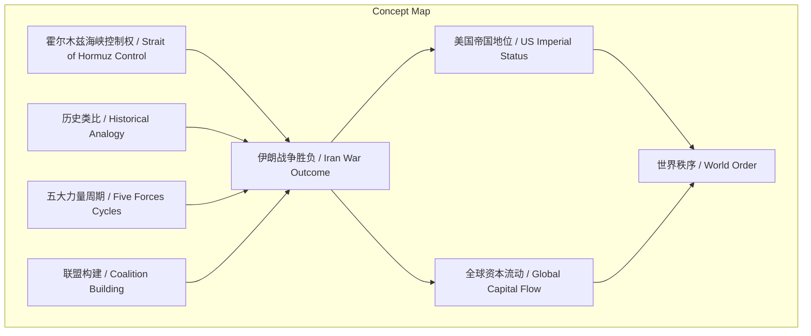
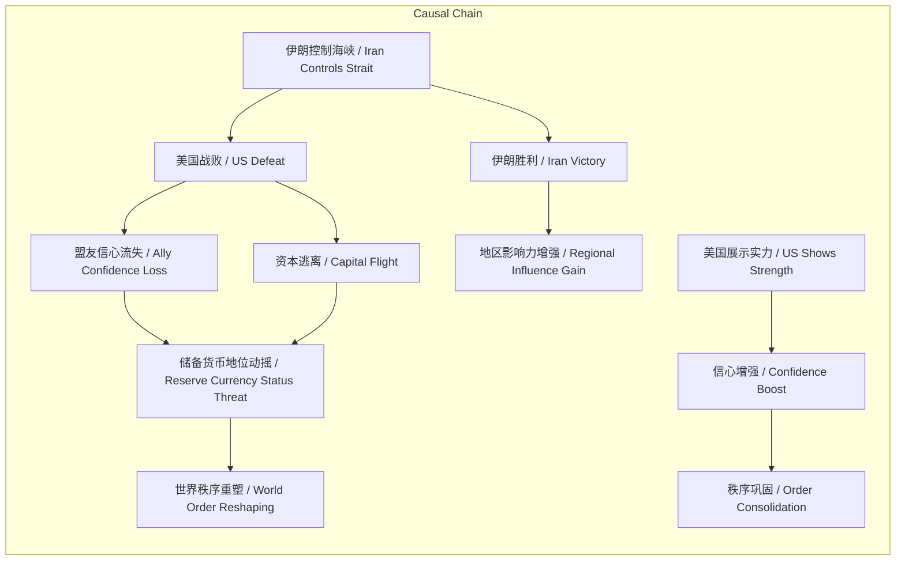

> 本文通过历史类比论证霍尔木兹海峡控制权是伊朗战争胜负决定性因素，并警示美国失败可能引发帝国衰落与秩序重塑。

## 元信息
- 分类：`world-strategy/strategic-research`
- 优先级：`high` (`13`)
- 文档类型：`text-summary`
- 来源分组：`news`
- 原始文件：`reports/news/2026-03-17/1773756015149-news-news-task-1773755948113-70pemc.md`
- 请求 ID：`1773755948113-70pemc`

## 原始内容

#### 文本总结

### 霍尔木兹海峡控制权定伊朗战争胜负

#### 整体结构化文档表达
##### 文档卡片
- 主题（中文/English）：伊朗战争战略分析 / Iran War Strategy Analysis
- 一句话摘要：本文通过历史类比论证霍尔木兹海峡控制权是伊朗战争胜负决定性因素，并警示美国失败可能引发帝国衰落与秩序重塑。
- 目标读者：政策制定者、地缘政治分析师、投资者
- 核心结论（3条）：
  1. 霍尔木兹海峡控制权是衡量伊朗战争胜负的唯一标准。
  2. 美国若失去控制权，将面临类似英国苏伊士运河危机的帝国衰落转折点。
  3. 战争结果将驱动全球资本流向，深刻影响世界秩序。

##### 内容结构树
1. **背景与问题定义**：将当前伊朗战争局势与历史情境对比，指出大多数战争充满意外，但此战关键明确为霍尔木兹海峡控制权。
2. **核心观点与关键证据**：核心观点为控制权决定胜负。证据包括：伊朗控制则美国战败；历史类比案例（苏伊士运河危机等）；美国失败原因分析（政治畏惧、不愿承受损失、军事实力不足、无法组建联盟）；历史规律（主导强国财政扩张时盟友信心流失）；胜利标准（保障海峡安全通航）；伊朗拖延战略；特朗普言论风险；联盟构建重要性。
3. **方法/机制/路径**：采用历史类比法，研究五百年帝国兴衰与储备货币变迁，识别五大相互关联力量（长期债务周期、政治秩序周期、地缘政治秩序周期、技术进步、自然力量）作为分析框架。
4. **风险与边界条件**：风险包括美国衰落、全球秩序动荡、资本逃离；边界条件如战争持久性、联盟有效性、伊朗抵抗意志。
5. **结论与行动建议**：结论是美国必须确保海峡控制权以避免灾难；行动建议是特朗普需展示实力、组建国际联盟、避免持久战。

##### 结构化元数据（JSON）
```json
{
  "title": "霍尔木兹海峡控制权定伊朗战争胜负",
  "topic_zh": "伊朗战争战略分析",
  "topic_en": "Iran War Strategy Analysis",
  "audience": "政策制定者、地缘政治分析师、投资者",
  "claims": [
    "霍尔木兹海峡控制权是伊朗战争胜负的决定性标准",
    "美国失去控制权将导致类似历史帝国衰落的转折点",
    "战争结果将影响全球资本流向与世界秩序"
  ],
  "evidence": [
    "伊朗控制海峡将表明美国无力扭转局面",
    "类比1956年苏伊士运河危机之于英国",
    "美国失败原因包括政治畏惧、不愿承受损失、军事实力不足、无法组建联盟",
    "历史规律：主导强国财政过度扩张时盟友信心流失",
    "伊朗计划拖延战事利用美国对持久战承受力低",
    "特朗普威胁言论若未兑现将损害信誉",
    "仅凭美以难以确保通航，需国际联盟"
  ],
  "risks": [
    "美国全球势力与现有世界秩序受威胁",
    "盟友关系削弱，资金流逃离",
    "债务、货币、黄金市场动荡"
  ],
  "actions": [
    "特朗普需展示实力确保海峡自由通行",
    "促成国际联盟派遣军舰护航",
    "避免战争长期化以维持国内支持"
  ]
}
```

#### 处理流程
1. **输入识别**：识别用户输入为关于伊朗战争与霍尔木兹海峡控制权的战略分析文本，包含历史类比与周期理论。
2. **信息抽取**：抽取实体（伊朗、美国、霍尔木兹海峡、特朗普等）、概念（控制权、战争胜负、帝国衰落等）、观点（控制权决定胜负）、事实（海峡重要性、军方声明等）。
3. **结构化归纳**：将内容归纳为背景、核心观点、方法、风险、结论五部分；识别五大力量周期作为分析框架。
4. **关系建模**：建立概念间逻辑关系，如控制权→胜负，胜负→资本流动，失败→帝国衰落。
5. **可视化表达**：设计Mermaid图展示概念结构与因果链。

#### 概念清单（中英文）
- 伊朗战争 / Iran War
- 霍尔木兹海峡 / Strait of Hormuz
- 控制权 / Control
- 美国 / United States
- 唐纳德·特朗普 / Donald Trump
- 苏伊士运河危机 / Suez Canal Crisis
- 英国 / United Kingdom
- 荷兰帝国 / Dutch Empire
- 西班牙帝国 / Spanish Empire
- 世界秩序 / World Order
- 盟友 / Allies
- 资本流动 / Capital Flow
- 债务市场 / Debt Market
- 货币市场 / Currency Market
- 黄金市场 / Gold Market
- 长期债务周期 / Long-Term Debt Cycle
- 政治秩序周期 / Political Order Cycle
- 地缘政治秩序周期 / Geopolitical Order Cycle
- 技术进步 / Technological Progress
- 自然力量 / Natural Forces
- 帝国崩解 / Empire Collapse
- 储备货币 / Reserve Currency
- 人员流动 / People Flow
- 国家流动 / Country Flow
- 资金流 / Fund Flow
- 承受痛苦的能力 / Capacity to Endure Pain
- 施加痛苦的能力 / Capacity to Inflict Pain
- 联盟 / Coalition
- 水雷 / Naval Mines
- 石油运输 / Oil Transportation
- 全球重要海峡 / Critical Global Strait
- 历史类比 / Historical Analogy
- 大周期 / Big Cycle
- 终极决战 / Ultimate Battle

#### 概念定义（中英文）
- 霍尔木兹海峡 / Strait of Hormuz：原文描述为“全球最重要的海峡”，其通行权必须保障。定义：位于中东的关键石油运输通道，原文强调其全球战略重要性。
- 控制权 / Control：指对霍尔木兹海峡通行权的掌控能力，原文中伊朗控制则美国战败。
- 伊朗战争 / Iran War：指涉及伊朗与美国的潜在或实际军事冲突，胜负以霍尔木兹海峡控制权为衡量标准。
- 帝国崩解 / Empire Collapse：原文指英国、荷兰、西班牙等帝国因失去关键航道控制权而衰落的模式，具有重复性。
- 苏伊士运河危机 / Suez Canal Crisis：1956年历史事件，埃及挑战英国对苏伊士运河控制权，被视为英国帝国衰落的转折点。
- 五大力量周期 / Five Forces Cycles：作者提出的驱动货币、政治与地缘政治秩序更迭的五个相互关联力量，包括长期债务周期、政治秩序周期、地缘政治秩序周期、技术进步、自然力量。
- 承受痛苦的能力 / Capacity to Endure Pain：在战争中，一方能承受损失（人员、经济）的限度，原文认为伊朗通过持久战可战胜承受力有限的美国。
- 施加痛苦的能力 / Capacity to Inflict Pain：在战争中，一方能对敌方造成损失的能力，原文指出伊朗计划通过攻击石油设施等实现。
- 联盟 / Coalition：国际联合行动，原文强调美国需组建他国联盟确保海峡通航，仅凭美以难以实现。
- 终极决战 / Ultimate Battle：指决定霍尔木兹海峡控制权的最终大规模军事较量，将清晰表明胜负。
- 未提及定义：对于“自然力量”、“技术进步”等，原文仅列为五大力量之一，未提供具体定义。

#### 概念关联与逻辑关系（中英文）
1. 霍尔木兹海峡控制权(Strait of Hormuz Control) → 伊朗战争胜负(Iran War Outcome)：若伊朗控制则美国战败，反之美国胜利（原文：一切归根结底取决于谁控制霍尔木兹海峡）。
2. 美国失败(US Failure) → 帝国衰落转折点(Empire Collapse Inflection Point)：类比苏伊士运河危机之于英国（原文：很可能如同1956年苏伊士运河危机之于英国）。
3. 战争结果(War Outcome) → 资本流动(Capital Flow)：资金流自然涌向赢家，逃离败者（原文：资金流与人潮正迅速而自然地逃离败者）。
4. 控制权丧失(Control Loss) ∧ 持久战(Protracted War) → 美国放弃战斗(US Abandons Fight)：伊朗拖延战事利用美国对痛苦承受力低（原文：如果这场战争足够痛苦且持续足够长的时间，美国人将会放弃战斗）。
5. 实力展示(Strength Demonstration) → 信心增强(Confidence Boost)：主导力量展示军事金融实力会增强他人持有其债务货币的意愿（原文：当世界主导力量展示其军事与金融实力时，这会增强人们对其的信心）。

#### COT逻辑梳理（定义/分类/比较/因果/科学方法论）
- **Step 1: 定义问题**：明确伊朗战争胜负取决于霍尔木兹海峡控制权（原文：一切归根结底取决于谁控制霍尔木兹海峡）。
- **Step 2: 分类**：通过历史类比，将当前局势与苏伊士运河危机、荷兰帝国战败、西班牙帝国衰落等案例分类比较，识别主导强国衰落模式。
- **Step 3: 比较**：比较美国与历史主导强国（英国等）在财政过度扩张、军事控制力显露颓势、盟友信心流失等方面的相似性。
- **Step 4: 因果**：建立因果链：控制权丧失 → 美国战败 → 盟友信心流失 & 资本逃离 → 储备货币地位动摇 → 世界秩序重塑；反之，控制权掌握 → 实力展示 → 信心增强 → 秩序巩固。
- **Step 5: 科学方法论**：作者采用历史研究法，分析过去五百年帝国兴衰及储备货币变迁，提炼五大相互关联力量（长期债务周期、政治秩序周期、地缘政治秩序周期、技术进步、自然力量）作为分析框架，应用于当前中东事件，认为其是大周期在当下的组成部分。

#### 事实与看法（病毒）
##### 事实
- 霍尔木兹海峡是全球最重要的石油运输通道。
- 伊朗军方声明将摧毁该地区由美国拥有或合作的石油公司设施。
- 特朗普曾发表威胁言论，如“伊朗将面临前所未有的军事后果”。
- 里根总统曾下令美国海军为油轮护航。
- 历史案例：1956年苏伊士运河危机、18世纪荷兰帝国战败、17世纪西班牙帝国衰落。
- 美国没有能力同时进行多场战争。
##### 看法
- 控制霍尔木兹海峡是伊朗战争胜负的唯一决定因素。
- 美国若失败将面临类似英国的帝国衰落转折点。
- 在战争中，承受痛苦的能力比施加痛苦的能力更重要。
- 伊朗通过拖延战事可战胜美国。
- 任何协议都无法解决这场战争。
- 特朗普的夸夸其谈若未兑现将损害其信誉。
- 资金流逃离败者如同斗兽场观众等待终极对决。

#### FAQ（原文问题整理）
未发现明确提问。原文主要为条件假设与陈述，如“如果伊朗得以掌控谁能通过霍尔木兹海峡……”等，未以问句形式提出。

#### Visualization
##### Mermaid 图 1（概念结构图）


##### Mermaid 图 2（逻辑/因果图）


#### 文章中的类比
- 将当前伊朗战争局势与1956年苏伊士运河危机（英国）类比。
- 与18世纪荷兰帝国战败类比。
- 与17世纪西班牙帝国衰落类比。
- 资金流逃离败者如同古罗马斗兽场观众或体育迷等待终极对决。
- 战争如同疫情般在互联世界中迅速蔓延。

#### 10个金句
1. “一切归根结底取决于谁控制霍尔木兹海峡。”
2. “伊朗控制霍尔木兹海峡并将其武器化，将清晰表明美国无力扭转这一局面。”
3. “如果唐纳德·特朗普和美国未能赢得这场战争……他们还将被视作制造了一场自身无法收拾的灾难性局面。”
4. “帝国崩解的事件模式几乎总是如出一辙。”
5. “被视作次等的力量会为关键贸易航道的控制权向世界主导强国发起挑战。”
6. “资金流与人潮正迅速而自然地逃离败者。”
7. “当拥有世界储备货币的全球主导国家陷入财政过度扩张……须警惕盟友与债权人的信心流失、其储备货币地位的崩塌。”
8. “当世界主导力量展示其军事与金融实力时，这会增强人们对其的信心以及持有其债务与货币的意愿。”
9. “在战争中，承受痛苦的能力比施加痛苦的能力更为重要。”
10. “任何协议都无法解决这场战争，因为协议毫无价值。”
