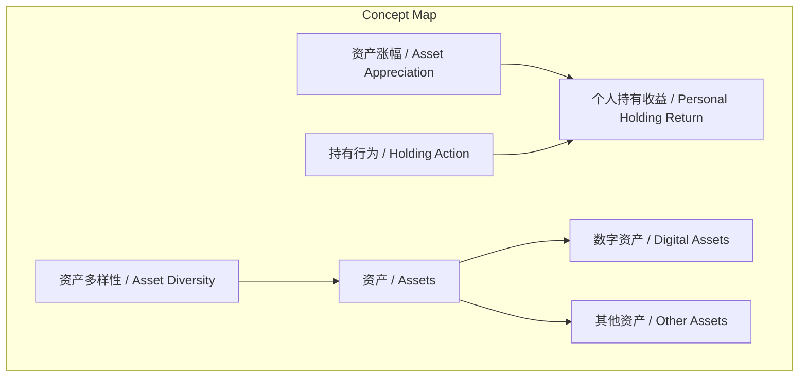
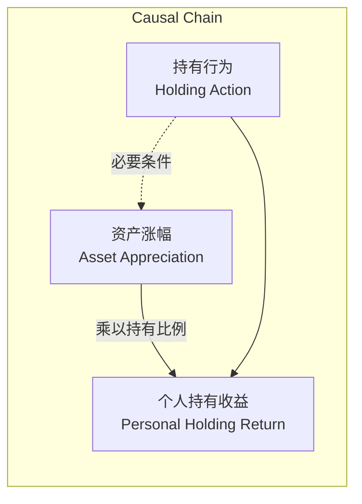

# 任务报告

- requestId: 1771466206773-ll5xx5
- 生成时间(UTC): 2026-02-19T01:57:09.157Z

## 文本总结

# 标题
资产涨幅与个人收益的区别及资产多样性

## 处理流程
1.  **输入识别**：来源为用户提供的关于资产涨幅与个人持有收益关系的论述文本。
2.  **信息抽取**：抽取核心概念（资产涨幅、个人持有收益、数字资产、资产多样性）、观点（涨幅意义取决于持有）、事实（存在多种值得持有的资产）。
3.  **结构化归纳**：通过对比（涨幅 vs. 持有收益）、分类（资产类型）进行归纳。
4.  **关系建模**：建立“资产涨幅 × 持有比例 = 个人持有收益”等逻辑关系。
5.  **可视化表达**：使用 Mermaid 绘制概念与因果图。

## 概念清单（中英文）
- 资产涨幅 / Asset Appreciation
- 个人持有收益 / Personal Holding Return
- 数字资产 / Digital Assets
- 资产多样性 / Asset Diversity

## 概念定义（中英文）
- **资产涨幅 / Asset Appreciation**：指某项资产在市场交易中价值上升的倍数。
- **个人持有收益 / Personal Holding Return**：指个人因实际持有某资产而实际获得的价值增长倍数。
- **数字资产 / Digital Assets**：指以数字形式存在的资产类别（如加密货币等）。
- **资产多样性 / Asset Diversity**：指可供投资的资产类型丰富、不局限于某一特定类别。

## 概念关联与逻辑关系（中英文）
1.  `个人持有收益(Personal Holding Return) = 资产涨幅(Asset Appreciation) × 个人持有比例(Holding Ratio)`
2.  `数字资产(Digital Assets) ⊂ 资产(Assets)`
3.  `资产多样性(Asset Diversity) → 扩大投资选择范围(Expand Investment Choices)`

## COT逻辑梳理（定义/分类/比较/因果/科学方法论）
- **Step 1 (定义)**：明确“资产涨幅”是市场客观变动，“个人持有收益”是个人主观实际所得。
- **Step 2 (分类)**：将资产分为“数字资产”与“非数字资产”等类别。
- **Step 3 (比较)**：比较“资产涨幅”与“个人持有收益”的核心差异——前者是全局变量，后者是个人变量，二者通过“持有行为”关联。
- **Step 4 (因果)**：持有行为是导致“资产涨幅”转化为“个人持有收益”的直接原因。未持有则涨幅与个人无关。
- **Step 5 (科学方法论)**：提出投资分析应关注“个人实际持仓”而非“市场整体涨幅”，并基于“资产多样性”进行分散配置，避免过度聚焦单一资产类别（如数字资产）。

## 事实与看法（病毒）
### 事实
- 世界上值得持有的资产有很多。
- 资产类别不局限于数字资产。

### 看法
- 某个资产涨了多少倍，跟“你”没啥关系（除非你持有它）。
- 重要的不是资产涨了多少倍，而是你持有的资产享受了多少倍。

## FAQ（原文问题整理）
- **问题**：在什么情况下，某个资产的涨幅才与个人相关？
    - **回答**：当个人实际持有该资产时。
- **问题**：投资时应重点关注什么？
    - **回答**：应重点关注个人实际持有的资产所带来的收益，而非市场传闻的资产涨幅。
- **问题**：投资选择是否应局限于数字资产？
    - **回答**：否，世界上值得持有的资产类型很多，不只有数字资产。

## Visualization
### Mermaid 图 1（概念结构图）

### Mermaid 图 2（逻辑/因果图）

## 文章中的类比
- 未发现明确类比

## 10个金句
1.  某个资产涨了多少倍跟你没啥关系 除非......
2.  重要的不是资产涨了多少倍 而是你持有的资产享受了多少倍。
3.  世界上值得持有的资产有很多。
4.  不只是数字资产。
5.  原文未提供
6.  原文未提供
7.  原文未提供
8.  原文未提供
9.  原文未提供
10. 原文未提供
