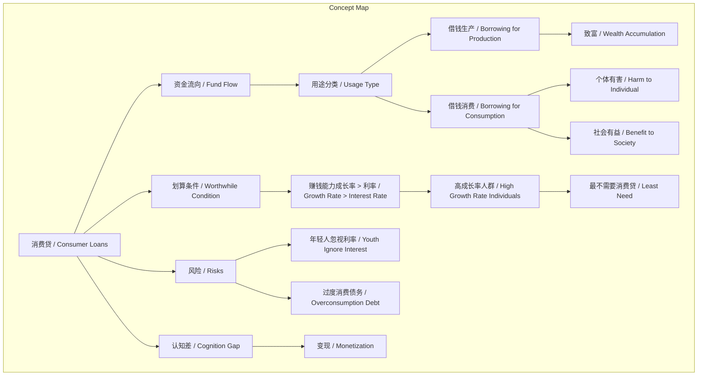
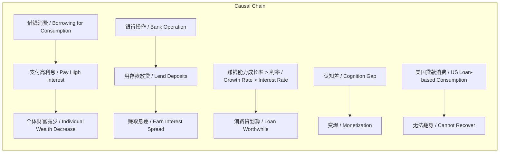

# 任务报告

- requestId: 1771466438221-tacs54
- 生成时间(UTC): 2026-02-19T02:02:13.144Z

## 文本总结

# 标题
消费贷资金流向：生产与消费的财富逻辑

## 整体结构化文档表达
### 文档卡片
- **主题**：消费贷资金流向 / Consumer Loan Fund Flow  
- **一句话摘要**：文章通过分析消费贷资金流向，论证借钱消费对个体有害但对社会有益，并指出其划算条件与风险。  
- **目标读者**：对金融、消费行为及财富积累感兴趣的普通读者或年轻群体。  
- **核心结论**：
  1. 消费贷资金流向决定其经济影响：用于生产则促进致富，用于消费则导致个体贫穷。
  2. 消费贷仅对赚钱能力成长率高于利率者划算，但这类人最不需要消费贷。
  3. 过度依赖消费贷（如美国现状）会导致个人债务陷阱和社会问题。

### 内容结构树
1. **背景与问题定义**：消费贷普及，但资金流向常被忽视，需分析其对社会和个体的不同影响。
2. **核心观点与关键证据**：
   - 观点1：财富来源是生产、销售、组织，借钱生产致富，借钱消费贫穷。
   - 观点2：消费贷对个体有害（支付高利息），对社会有益（拉动消费）。
   - 观点3：年轻人消费欲望强烈，常忽视利率风险。
   - 观点4：资金流向分析：银行用存款（如父母存款）放贷，赚取息差。
   - 观点5：消费贷划算条件矛盾：需高成长率，但高成长率人群不依赖消费贷。
   - 观点6：认知差（而非认知本身）才能变现，形成价值瀑布。
   - 观点7：美国问题在于过多贷款消费导致难以翻身。
3. **方法/机制/路径**：通过比较借贷用途（生产/消费）和个人财务指标（赚钱能力成长率 vs 利率）评估消费贷影响。
4. **风险与边界条件**：年轻人欲望强易忽视风险；高成长率人群稀少；过度消费导致债务陷阱。
5. **结论与行动建议**：传递资金流向分析给下一代；关注认知差变现；警惕消费贷风险。

### 结构化元数据（JSON）
```json
{
  "title": "消费贷资金流向分析：生产与消费的财富逻辑",
  "topic_zh": "消费贷资金流向",
  "topic_en": "Consumer Loan Fund Flow",
  "audience": "普通读者、年轻消费者",
  "claims": [
    "消费贷用于生产则致富，用于消费则致贫",
    "消费贷仅对高赚钱能力成长率人群划算，但他们最不需要",
    "过度消费贷导致个人和社会问题"
  ],
  "evidence": [
    "财富创造来源于生产、销售、组织",
    "借钱消费对个体有害，对社会有益",
    "年轻人消费欲望强烈，忽视利率",
    "银行用存款放贷，支付低息给存款人",
    "赚钱能力成长率需高于利率才划算",
    "美国过多贷款消费导致无法翻身"
  ],
  "risks": [
    "年轻人因欲望忽视利率风险",
    "高成长率人群稀少，条件难满足",
    "过度消费导致债务陷阱"
  ],
  "actions": [
    "将消费贷资金流向分析传递给下一代",
    "关注认知差以变现",
    "警惕消费贷，避免过度借贷"
  ]
}
```

## 处理流程
未提及

## 概念清单（中英文）
- 消费贷 / Consumer Loans
- 资金流向 / Fund Flow
- 财富 / Wealth
- 生产 / Production
- 销售 / Sales
- 组织（网络） / Organization (Network)
- 借钱生产 / Borrowing for Production
- 借钱消费 / Borrowing for Consumption
- 银行 / Bank
- 父母 / Parents
- 利率 / Interest Rate
- 赚钱能力 / Earning Ability
- 成长率 / Growth Rate
- 认知 / Cognition
- 认知差 / Cognition Gap
- 美国 / United States
- 贷款消费 / Loan-based Consumption

## 概念定义（中英文）
- **消费贷 / Consumer Loans**：为消费目的（如购物、服务）而借入的资金，通常无特定资产抵押。
- **资金流向 / Fund Flow**：资金从贷方（如银行）流向借方（如消费者）的方向和用途。
- **财富 / Wealth**：通过生产、销售和组织活动创造和积累的经济资源。
- **生产 / Production**：创造商品或服务的过程，是财富来源之一。
- **销售 / Sales**：商品或服务的交易过程，是财富来源之一。
- **组织（网络） / Organization (Network)**：协调资源和活动的结构或网络，是财富来源之一。
- **借钱生产 / Borrowing for Production**：将贷款用于生产性投资，预期产生回报。
- **借钱消费 / Borrowing for Consumption**：将贷款用于即时消费，不产生直接经济回报。
- **银行 / Bank**：金融中介，吸收存款并发放贷款，赚取息差。
- **父母 / Parents**：文中指存款人，其存款被银行用于放贷。
- **利率 / Interest Rate**：贷款成本，以百分比表示，影响借贷决策。
- **赚钱能力 / Earning Ability**：个人或实体赚取收入的能力。
- **成长率 / Growth Rate**：赚钱能力随时间增长的比率。
- **认知 / Cognition**：对事物的理解和认识。
- **认知差 / Cognition Gap**：不同主体间认知水平的差异，可转化为竞争优势。
- **美国 / United States**：文中指代存在过度贷款消费问题的国家。
- **贷款消费 / Loan-based Consumption**：通过借贷进行消费的行为，同“借钱消费”。

## 概念关联与逻辑关系（中英文）
1. 借钱消费 / Borrowing for Consumption + 对个体 / Individual -> 有害 / Harm  
   （逻辑表达式：Borrowing for Consumption → Harm to Individual）
2. 赚钱能力成长率 / Earning Ability Growth Rate > 利率 / Interest Rate -> 消费贷划算 / Consumer Loan is worthwhile  
   （逻辑表达式：Growth Rate > Interest Rate → Worthwhile）
3. 认知差 / Cognition Gap -> 变现 / Monetization  
   （逻辑表达式：Cognition Gap → Monetization）

## COT逻辑梳理（定义/分类/比较/因果/科学方法论）
- **Step 1（定义）**：定义财富来源为生产、销售、组织（网络），并定义消费贷为用于消费的贷款。
- **Step 2（分类）**：将借贷用途分为生产性借贷和消费性借贷，对比其不同经济影响。
- **Step 3（比较）**：比较借钱生产（致富）与借钱消费（贫穷）的结果；比较消费贷对社会（有益）与个体（有害）的影响。
- **Step 4（因果）**：因果链：消费贷资金流向消费 → 个体支付高利息 → 个体财富减少；银行用存款放贷 → 息差收益 → 银行盈利。
- **Step 5（科学方法论）**：提出评估消费贷的方法：分析资金流向（生产/消费）和个人财务指标（赚钱能力成长率 vs 利率），以判断是否划算。

## 事实与看法（病毒）
### 事实
- 2020年11月4日存在相关讨论。
- 消费贷资金可流向生产或消费。
- 银行吸收存款（如父母存款）并发放贷款。
- 银行支付存款人低利息，收取借款人高利息。
- 美国存在贷款消费现象。
### 看法
- 财富创造和积累来源于生产、销售、组织。
- 借钱生产走向致富，借钱消费走向贫穷。
- 消费贷对社会有益，对个体有害。
- 年轻人消费欲望强烈，常忽视利率。
- 消费贷仅对赚钱能力成长率高于利率者划算。
- 高成长率人群最不需要借钱消费。
- 认知不能变现，认知差才能变现。
- 美国问题在于过多人贷款消费导致无法翻身。

## FAQ（原文问题整理）
未发现明确提问

## Visualization
### Mermaid 图 1（概念结构图）


### Mermaid 图 2（逻辑/因果图）


## 文章中的类比
未发现明确类比

## 10个金句
1. 财富的创造和积累来源来源于生产、销售、组织（网络）
2. 借钱生产走向致富
3. 借钱消费走向贫穷
4. 借钱消费对社会有益 对个体有害
5. 对年轻人来说 消费的欲望太强烈的 以至于利率对他们而言可以视而不见
6. 另一种说服方式：研究下借贷的资金流向
7. 借贷消费就是向银行付钱 用你父母存在银行里的钱消费
8. 与此同时 银行只给你父母 你付给银行的钱的一小部分
9. 消费贷只对那些赚钱能力的成长率 高于利率的人划算
10. 然而 这样的人是最不需要借钱消费的
（原文未提供）
