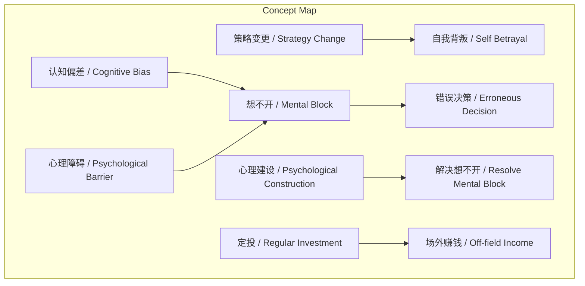

# 任务报告

- requestId: 1771467260972-yqa8jj
- 生成时间(UTC): 2026-02-19T02:14:55.662Z

## 文本总结

# 标题
改变策略即背叛自己

## 整体结构化文档表达
### 文档卡片
- 主题（中文/English）：投资策略与心理 / Investment Strategy and Psychology
- 一句话摘要：中途改变投资策略被视为对过去自己的背叛，错误决策常源于心理障碍而非逻辑，解决之道在于心理建设和坚持定投。
- 目标读者：个人投资者
- 核心结论（3条）：
  1. 改变策略等同于背叛过去自己。
  2. 决策错误多因“想不开”而非逻辑失误。
  3. 解决方案是心理建设与定投策略。

### 内容结构树
1. 背景与问题定义：投资中常见中途改变策略的现象，引发自我背叛感与后果承担问题。
2. 核心观点与关键证据：观点一：改变策略即背叛自己；观点二：错误决策源于“想不开”而非逻辑；观点三：解决靠心理建设。
3. 方法/机制/路径：心理建设以克服认知偏差和心理障碍；定投策略依赖场外赚钱能力，无需纠结标的。
4. 风险与边界条件：未明确提及风险，但隐含改变策略可能导致更大损失；定投需持续场外收入支持。
5. 结论与行动建议：坚持初始策略，注重心理建设，采用定投并专注于场外赚钱。

### 结构化元数据（JSON）
```json
{
  "title": "改变策略即背叛自己",
  "topic_zh": "投资策略与心理",
  "topic_en": "Investment Strategy and Psychology",
  "audience": "个人投资者",
  "claims": ["改变策略等同于背叛过去自己", "决策错误多因“想不开”而非逻辑失误", "解决方案是心理建设与定投策略"],
  "evidence": ["任何一次中途改变策略都意味着对过去自己的背叛", "很多事时候做出错误的决策和逻辑没有关系而是“想不开”", "“想不开”和逻辑决策没关系而是认知偏差和心理障碍有关系", "解决之道在于心理建设", "定投在于场外赚钱，一旦开始就不用究竟选择标的"],
  "risks": ["未提及明确风险"],
  "actions": ["进行心理建设", "采用定投策略", "专注于场外赚钱"]
}
```

## 处理流程
1. 输入识别：用户提供关于投资策略与心理的论述文本。
2. 信息抽取：实体包括策略、自己、后果、逻辑、想不开、认知偏差、心理障碍、心理建设、定投、场外赚钱、标的；问题为策略变更的心理影响；观点为改变策略即背叛、错误决策源于心理、解决靠心理建设。
3. 结构化归纳：定义策略变更为中途调整；分类决策错误为逻辑型与心理型；比较改变与否均需担后果但改变有背叛感；因果为心理障碍导致想不开进而错误决策；方法论为心理建设与定投。
4. 关系建模：策略变更导致自我背叛；认知偏差与心理障碍引起想不开；心理建设解决想不开；定投依赖场外赚钱。
5. 可视化表达：使用Mermaid绘制概念结构与因果链图。

## 概念清单（中英文）
- 改变策略 / Strategy Change
- 自己 / Self
- 后果 / Consequence
- 投资 / Investment
- 决策 / Decision
- 逻辑 / Logic
- 想不开 / Mental Block
- 认知偏差 / Cognitive Bias
- 心理障碍 / Psychological Barrier
- 解决之道 / Solution
- 心理建设 / Psychological Construction
- 纠结 / Obsession
- 定投 / Regular Investment
- 场外赚钱 / Off-field Income
- 标的 / Target Asset

## 概念定义（中英文）
- 改变策略：中途调整原有投资计划。
- 自己：指过去做出决策的自我。
- 后果：选择所带来的结果或影响。
- 投资：将资金投入资产以期望回报的行为。
- 决策：在投资中做出选择的过程。
- 逻辑：基于理性推理的决策方式。
- 想不开：心理上无法释怀或克服障碍的状态。
- 认知偏差：思维中的系统性错误。
- 心理障碍：影响决策的心理因素。
- 解决之道：应对问题的方法。
- 心理建设：通过心理调节克服障碍。
- 纠结：过度思考无用之事。
- 定投：定期定额投资策略。
- 场外赚钱：通过投资以外的途径获取收入。
- 标的：投资的目标资产。

## 概念关联与逻辑关系（中英文）
1. 策略变更(Strategy Change) -> 自我背叛(Self Betrayal)  
   [原文：改变策略就意味着对过去自己的背叛]
2. 认知偏差(Cognitive Bias) + 心理障碍(Psychological Barrier) -> 想不开(Mental Block) -> 错误决策(Erroneous Decision)  
   [原文：想不开和认知偏差、心理障碍有关系，导致错误决策]
3. 定投(Regular Investment) -> 依赖场外赚钱(Depend on Off-field Income)  
   [原文：定投在于场外赚钱]

## COT逻辑梳理（定义/分类/比较/因果/科学方法论）
- Step 1: 定义问题——在投资中，中途改变策略是否可取？文本认为改变策略意味着背叛自己。
- Step 2: 分类决策错误——分为逻辑错误和心理障碍导致（想不开）。
- Step 3: 比较改变与不改变——无论改变与否，都需承担后果；但改变带来背叛感。
- Step 4: 因果分析——认知偏差和心理障碍导致想不开，进而做出错误决策。
- Step 5: 科学方法论——通过心理建设解决想不开；采用定投策略，依赖场外赚钱，避免纠结标的。

## 事实与看法（病毒）
### 事实
- 未发现明确客观事实（所有陈述为主观观点）。
### 看法
- 任何一次中途改变策略都意味着对过去自己的背叛。
- 无论改不改变都需要承担自己选择的后果。
- 投资是罕见的需要自己独自承担后果的行动。
- 很多事时候做出错误的决策和逻辑没有关系而是“想不开”。
- “想不开”和逻辑决策没关系而是认知偏差和心理障碍有关系。
- 解决之道在于心理建设。
- 不要纠结没有用的东西。
- 定投在于场外赚钱。
- 一旦开始就不用究竟选择标的。

## FAQ（原文问题整理）
- 未发现明确提问。

## Visualization
### Mermaid 图 1（概念结构图）

### Mermaid 图 2（逻辑/因果图）
```mermaid
flowchart LR
  subgraph "Causal Chain"
    K["认知偏差 / Cognitive Bias"] + L["心理障碍 / Psychological Barrier"] --> M["想不开 / Mental Block"]
    M --> N["错误决策 / Erroneous Decision"]
    O["心理建设 / Psychological Construction"] --> M
    P["定投 / Regular Investment"] --> Q["无需纠结标的 / No Obsession on Target Asset"]
    P --> J
  end
```

## 文章中的类比
- 未发现明确类比。

## 10个金句
1. 改变策略就等于背叛自己。
2. 任何一次中途改变策略都意味着对过去自己的背叛。
3. 无论改不改变都需要承担自己选择的后果。
4. 投资是罕见的需要自己独自承担后果的行动。
5. 很多事时候做出错误的决策和逻辑没有关系而是“想不开”。
6. “想不开”和逻辑决策没关系而是认知偏差和心理障碍有关系。
7. 解决之道在于心理建设。
8. 不要纠结没有用的东西。
9. 定投在于场外赚钱。
10. 一旦开始就不用究竟选择标的。
