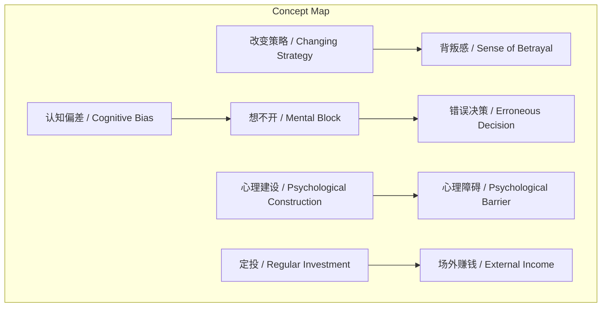
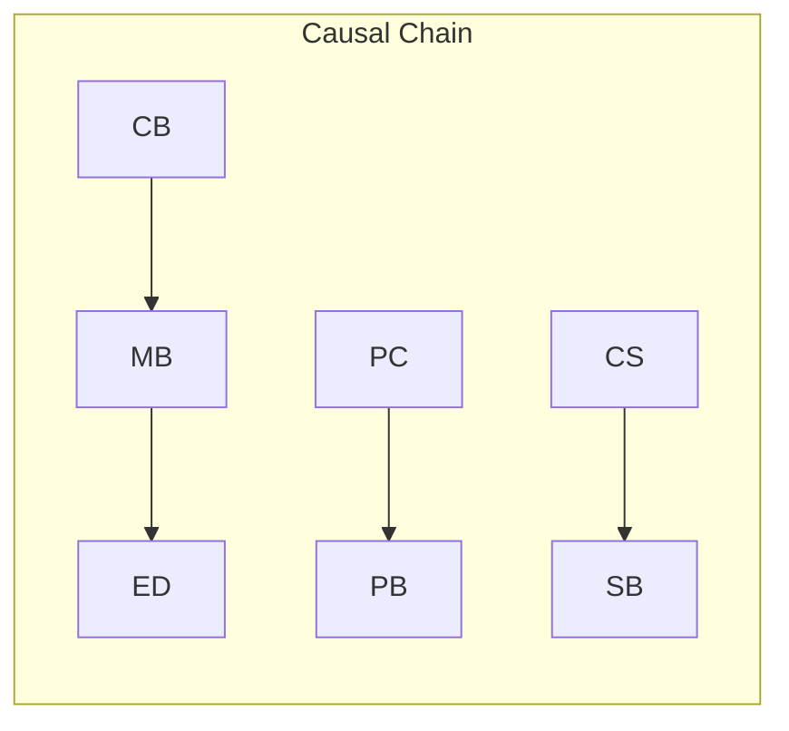

# 任务报告

- requestId: 1771467603591-9f6bsc
- 生成时间(UTC): 2026-02-19T02:21:06.941Z

## 文本总结

# 改变策略即背叛自己

## 整体结构化文档表达
### 文档卡片
- 主题（中文/English）：投资策略与心理建设 / Investment Strategy and Psychological Construction
- 一句话摘要：中途改变投资策略被视为对自我的背叛，决策错误常源于心理障碍而非逻辑，解决需心理建设并专注场外收入。
- 目标读者：投资者及金融学习者
- 核心结论（3条）：
  1. 改变策略即背叛自己。
  2. 错误决策多由“想不开”引起，与逻辑无关。
  3. 解决之道在于心理建设，定投关键在场外赚钱。

### 内容结构树
1. 背景与问题定义：投资中策略改变的困境与后果。
2. 核心观点与关键证据：改变策略即背叛；错误决策源于心理障碍；需心理建设。
3. 方法/机制/路径：心理建设；定投中忽略标的纠结，专注场外赚钱。
4. 风险与边界条件：未提及。
5. 结论与行动建议：坚持策略，加强心理建设，注重场外收入。

### 结构化元数据（JSON）
```json
{
  "title": "改变策略即背叛自己",
  "topic_zh": "投资策略与心理建设",
  "topic_en": "Investment Strategy and Psychological Construction",
  "audience": "投资者及金融学习者",
  "claims": ["改变策略即背叛自己", "错误决策常源于心理障碍", "解决之道在于心理建设"],
  "evidence": ["任何一次中途改变策略都意味着对过去自己的背叛", "做出错误的决策和逻辑没有关系而是'想不开'", "'想不开'和认知偏差与心理障碍有关系"],
  "risks": ["未提及"],
  "actions": ["不要纠结没有用的东西", "定投在于场外赚钱", "一旦开始就不用究竟选择标的"]
}
```

## 处理流程
1. 输入识别：来源为用户提供的文本，内容聚焦投资策略与心理因素。
2. 信息抽取：抽取实体（策略、背叛、心理建设）、概念（改变策略、想不开）、问题（策略改变的后果）、观点（决策错误源于心理）。
3. 结构化归纳：将内容归纳为背景、观点、方法、风险、结论五部分。
4. 关系建模：建立概念间因果与影响关系，如认知偏差导致想不开。
5. 可视化表达：设计Mermaid图展示概念结构与因果链。

## 概念清单（中英文）
- 策略 / Strategy
- 背叛 / Betrayal
- 自己 / Self
- 后果 / Consequence
- 投资 / Investment
- 决策 / Decision
- 逻辑 / Logic
- 想不开 / Mental Block
- 认知偏差 / Cognitive Bias
- 心理障碍 / Psychological Barrier
- 解决之道 / Solution
- 心理建设 / Psychological Construction
- 定投 / Regular Investment
- 场外赚钱 / Off-field Income
- 标的 / Target Asset

## 概念定义（中英文）
- 策略：投资中 planned course of action。
- 背叛：违背自身先前的承诺或选择。
- 自己：决策主体，特指过去的自我。
- 后果：选择带来的结果或影响。
- 投资：资本 allocation for return。
- 决策：做出选择的过程。
- 逻辑：基于原则的 reasoning。
- 想不开：心理上无法接受或放下某些事，导致纠结。
- 认知偏差：系统性思维错误，偏离理性。
- 心理障碍：心理因素导致的决策阻碍。
- 解决之道：解决问题的方法或途径。
- 心理建设：培养健康心理状态以应对挑战的过程。
- 定投：定期定额投资策略。
- 场外赚钱：通过投资以外的途径获取收入。
- 标的：投资的目标资产或对象。

## 概念关联与逻辑关系（中英文）
1. 改变策略 / Changing Strategy 导致 背叛感 / Sense of Betrayal：Changing Strategy → Sense of Betrayal
2. 认知偏差 / Cognitive Bias 引起 想不开 / Mental Block：Cognitive Bias → Mental Block
3. 心理建设 / Psychological Construction 缓解 心理障碍 / Psychological Barrier：Psychological Construction → Mitigates Psychological Barrier

## COT逻辑梳理（定义/分类/比较/因果/科学方法论）
- Step 1（定义）：界定核心问题——中途改变投资策略是否合理及其心理影响。
- Step 2（分类）：将决策错误分为逻辑型（基于信息分析）与心理型（源于情绪或认知偏差）。
- Step 3（比较）：逻辑错误可通过学习修正，心理障碍需心理干预；改变策略在逻辑上可能优化，但心理上构成背叛。
- Step 4（因果）：认知偏差和心理障碍 → 想不开 → 错误决策；改变策略 → 背叛感。
- Step 5（科学方法论）：通过心理建设（如认知重构、情绪管理）克服心理障碍，减少“想不开”，从而改善决策；定投中采用“一旦开始不纠结标的”的行为策略，依赖场外收入支撑。

## 事实与看法（病毒）
### 事实
- 未提及明确客观事实（原文均为观点性论述）。
### 看法
- 改变策略就等于背叛自己。
- 任何一次中途改变策略都意味着对过去自己的背叛。
- 无论改不改变都需要承担自己选择的后果。
- 很多时候做出错误的决策和逻辑没有关系而是“想不开”。
- “想不开”和逻辑决策没关系而是认知偏差和心理障碍有关系。
- 解决之道在于心理建设。
- 不要纠结没有用的东西。
- 定投在于场外赚钱。
- 一旦开始就不用究竟选择标的。

## FAQ（原文问题整理）
- 未发现明确提问（原文为陈述句，无直接问题）。

## Visualization
### Mermaid 图 1（概念结构图）

### Mermaid 图 2（逻辑/因果图）


## 文章中的类比
- 未发现明确类比。

## 10个金句
1. 改变策略就等于背叛自己。
2. 任何一次中途改变策略都意味着对过去自己的背叛。
3. 无论改不改变都需要承担自己选择的后果。
4. 很多时候做出错误的决策和逻辑没有关系而是“想不开”。
5. “想不开”和逻辑决策没关系而是认知偏差和心理障碍有关系。
6. 解决之道在于心理建设。
7. 不要纠结没有用的东西。
8. 定投在于场外赚钱。
9. 一旦开始就不用究竟选择标的。
10. 原文未提供。
