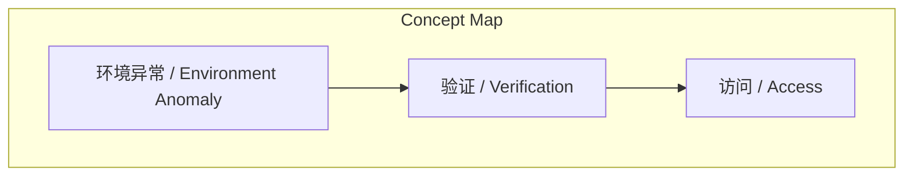
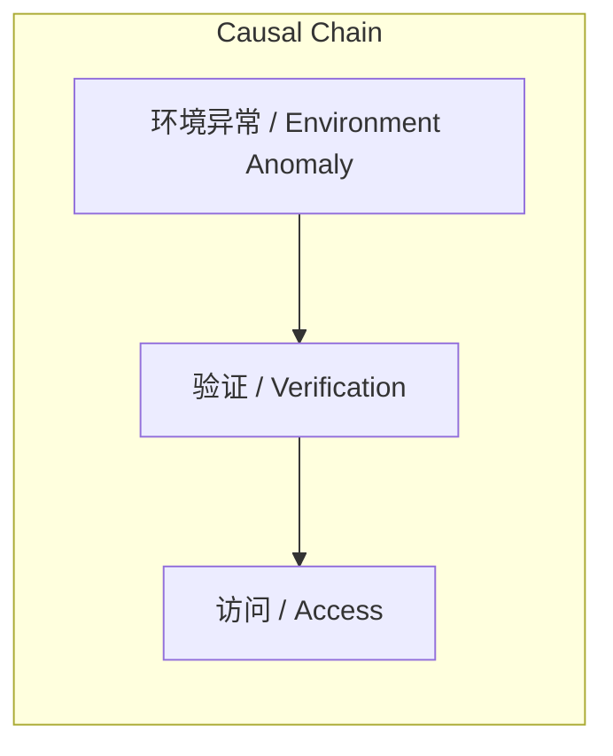

# 任务报告

- requestId: 1771468303351-fzykvz
- 生成时间(UTC): 2026-02-19T02:35:16.020Z

## 链接总结

- URL: https://mp.weixin.qq.com/s/oSd2LwrFzYuUmvfy62tXTQ

# 环境异常验证提示

## 整体结构化文档表达
### 文档卡片
- 主题（中文/English）：环境异常 / Environment Anomaly
- 一句话摘要：当前访问环境存在环境异常 / Environment Anomaly，需完成验证 / Verification 后方可继续访问 / Access。
- 目标读者：尝试访问该微信链接的用户 / Users attempting to access the WeChat link。
- 核心结论（3条）：
  1. 系统检测到环境异常 / Environment Anomaly，导致访问中断。
  2. 用户必须完成验证 / Verification 流程才能恢复访问 / Access。
  3. 未说明环境异常 / Environment Anomaly 的具体原因及验证 / Verification 的详细要求。

### 内容结构树
1. 背景与问题定义：背景为用户访问微信文章链接；问题定义为系统提示环境异常 / Environment Anomaly，访问被阻断。
2. 核心观点与关键证据：未提及明确观点；关键证据为页面显示的“环境异常”提示及验证链接。
3. 方法/机制/路径：用户需点击“去验证”链接，完成验证 / Verification 操作。
4. 风险与边界条件：未提及明确风险；边界条件为验证成功前访问 / Access 受限。
5. 结论与行动建议：结论为访问因环境异常 / Environment Anomaly 被中断；行动建议为执行验证 / Verification 步骤。

### 结构化元数据（JSON）
```json
{
  "title": "环境异常验证提示",
  "topic_zh": "环境异常",
  "topic_en": "Environment Anomaly",
  "audience": "访问该链接的用户",
  "claims": ["存在环境异常 / Environment Anomaly", "需完成验证 / Verification 方可继续访问 / Access"],
  "evidence": ["提示文本：'环境异常'", "存在验证链接"],
  "risks": ["未提及明确风险"],
  "actions": ["执行验证 / Verification"]
}
```

## 处理流程
1. 输入识别：来源为微信文章链接，但实际返回环境异常警告页面，非预期正文。
2. 信息抽取：实体包括“环境异常”、“验证”；问题为访问受阻；事实为警告提示内容；无观点表达。
3. 结构化归纳：内容为简单警告，无法进行复杂归纳，仅能识别状态与应对措施。
4. 关系建模：建立“环境异常”与“验证”之间的需求关系，“验证”与“访问”之间的授权关系。
5. 可视化表达：生成概念关联图与因果链图。

## 概念清单（中英文）
- 环境异常 / Environment Anomaly
- 验证 / Verification
- 访问 / Access

## 概念定义（中英文）
- 环境异常 / Environment Anomaly：未提及
- 验证 / Verification：未提及
- 访问 / Access：未提及

## 概念关联与逻辑关系（中英文）
1. 环境异常 / Environment Anomaly → 验证 / Verification（环境异常触发验证需求）
2. 验证 / Verification → 访问 / Access（验证成功后允许访问）
3. 环境异常 / Environment Anomaly ∧ 验证 / Verification → 访问 / Access（在环境异常下，验证是访问的充分条件）

## COT逻辑梳理（定义/分类/比较/因果/科学方法论）
Step 1: 定义问题：输入为微信链接的访问警告，核心概念是环境异常、验证、访问。
Step 2: 分类：内容属于技术性访问控制通知，非新闻论述。
Step 3: 比较：无比较对象。
Step 4: 因果：环境异常是因，验证是应对措施，访问是潜在结果。
Step 5: 科学方法论：基于单一信源，信息有限，推断需谨慎，结论具有条件性。

## 事实与看法（病毒）
### 事实
- 页面显示“环境异常”文字提示。
- 提供“去验证”链接。
- 说明“完成验证后即可继续访问”。
### 看法
- 无

## FAQ（原文问题整理）
- 未发现明确提问。

## Visualization
### Mermaid 图 1（概念结构图）

### Mermaid 图 2（逻辑/因果图）


## 文章中的类比
- 未发现明确类比。

## 10个金句
1. 环境异常 ---- 当前环境异常，完成验证后即可继续访问。
2. 原文未提供
3. 原文未提供
4. 原文未提供
5. 原文未提供
6. 原文未提供
7. 原文未提供
8. 原文未提供
9. 原文未提供
10. 原文未提供
