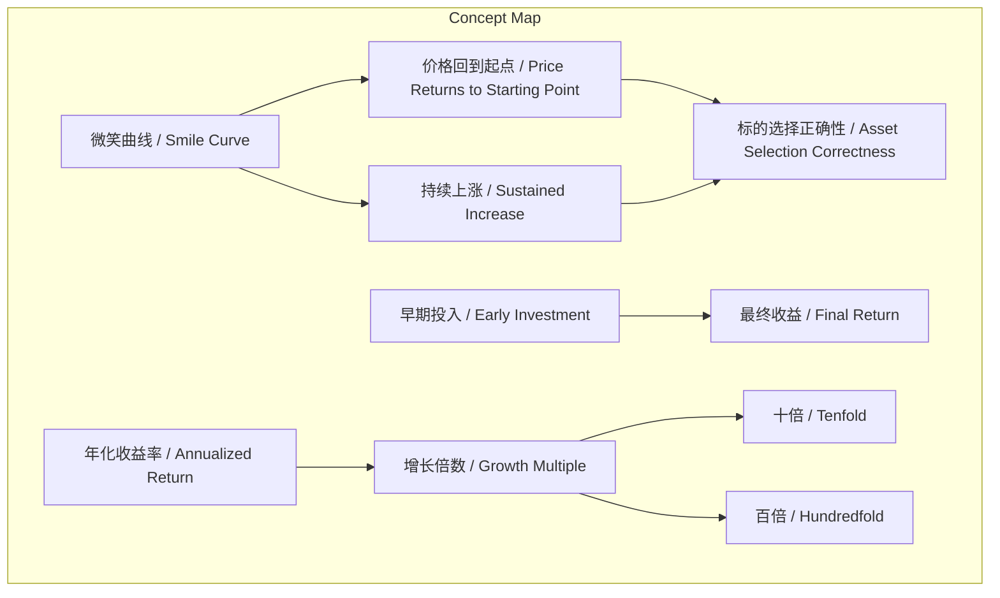
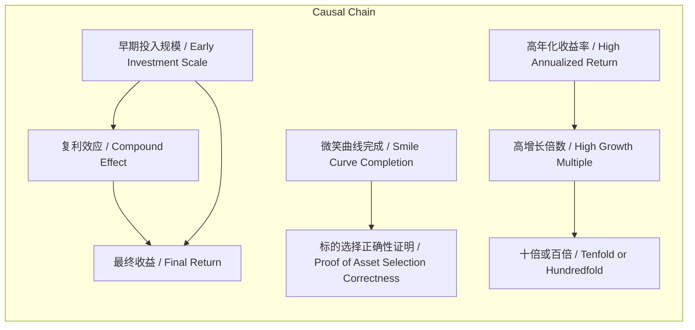

# 任务报告

- requestId: 1771468645854-7qdgvw
- 生成时间(UTC): 2026-02-19T02:38:01.480Z

## 文本总结

# 微笑曲线：投资标的质量的长期验证

## 整体结构化文档表达
### 文档卡片
- 主题（中文/English）：微笑曲线在投资中的应用 / Smile Curve in Investment
- 一句话摘要：通过分析价格波动与长期复利，论证微笑曲线作为投资标的选择正确性的验证工具，并强调早期投入和长期持有的重要性。
- 目标读者：个人投资者、金融学习者
- 核心结论（3条）：
  1. 微笑曲线的完成是标的选择正确性的最终证明。
  2. 投资者不应因短期价格翻倍而退出，应坚持长期持有以获取更高回报。
  3. 早期投入规模是决定最终收益的关键因素，资产增长潜力（如10倍至100倍）取决于持续投入和复利。

### 内容结构树
1. 背景与问题定义：投资中如何通过价格波动模式（微笑曲线）判断标的质量，以及短期收益与长期复利的关系。
2. 核心观点与关键证据：列出收益率计算、持有策略、标的选择验证、投入规模与增长潜力的具体论述。
3. 方法/机制/路径：以“微笑曲线”为框架，观察价格从起点回归并持续增长的过程，作为验证投资决策的机制。
4. 风险与边界条件：未提及明确风险，但隐含高年化收益率（如35%）在现实中可能难以持续。
5. 结论与行动建议：坚持长期持有，避免过早退出；在早期阶段加大投入规模以最大化复利效应。

### 结构化元数据（JSON）
```json
{
  "title": "微笑曲线：投资标的质量的长期验证",
  "topic_zh": "微笑曲线在投资中的应用",
  "topic_en": "Smile Curve in Investment",
  "audience": "个人投资者、金融学习者",
  "claims": [
    "微笑曲线的完成证明标的选择的正确性",
    "不应因短期翻倍抽出本金，应长期持有",
    "早期投入不足导致收益不够多，资产增长潜力（10倍至100倍）取决于持续投入"
  ],
  "evidence": [
    "十年十倍需年化26%，二十年百倍需年化26%",
    "十年二十倍需年化35%，二十年四百倍需年化35%",
    "价格回到起点是微笑曲线的一部分",
    "一个资产能涨10倍，就能涨100倍"
  ],
  "risks": [
    "未提及明确风险"
  ],
  "actions": [
    "长期持有资产，不因短期翻倍退出",
    "在投资早期阶段加大投入规模"
  ]
}
```

## 处理流程
1. 输入识别：用户提供关于“微笑曲线”的投资论述文本。
2. 信息抽取：提取实体（微笑曲线、价格、年化收益率）、概念（标的选择、早期投入）、事实（收益率计算）、观点（不应抽本金）。
3. 结构化归纳：将内容按背景、观点、方法、风险、建议分类；定义微笑曲线为价格波动验证模式。
4. 关系建模：建立早期投入、年化收益率、增长倍数之间的复利关系；微笑曲线完成与标的选择正确性的正相关。
5. 可视化表达：使用Mermaid绘制概念与因果图。

## 概念清单（中英文）
- 微笑曲线 / Smile Curve
- 价格 / Price
- 起点 / Starting Point
- 十年 / Ten Years
- 二十年 / Twenty Years
- 十倍 / Tenfold
- 百倍 / Hundredfold
- 年化收益率 / Annualized Return
- 翻倍 / Double
- 本金 / Principal
- 标的选择 / Asset Selection
- 资产 / Asset
- 早期投入 / Early Investment

## 概念定义（中英文）
- 微笑曲线 / Smile Curve：一种价格波动模式，指资产价格先回落至起点（或附近），随后持续上涨，用于证明投资标的选择的正确性。
- 价格 / Price：资产的市场交易价值。
- 起点 / Starting Point：投资初期资产的价格水平。
- 十年 / Ten Years：投资时间周期之一。
- 二十年 / Twenty Years：投资时间周期之一。
- 十倍 / Tenfold：资产价格增长至初始值的10倍。
- 百倍 / Hundredfold：资产价格增长至初始值的100倍。
- 年化收益率 / Annualized Return：衡量投资回报的年度化比率，用于计算复利增长。
- 翻倍 / Double：资产价格增长至初始值的2倍。
- 本金 / Principal：初始投入的投资资金。
- 标的选择 / Asset Selection：投资者对资产（如股票、基金）的挑选决策。
- 资产 / Asset：可投资的金融产品或资源。
- 早期投入 / Early Investment：投资初期投入的资金规模。

## 概念关联与逻辑关系（中英文）
1. 早期投入（Early Investment）与最终收益（Final Return）正相关：早期投入规模越大，复利效应下最终收益越高。形式化：Final Return ∝ Early Investment × (1 + Annualized Return)^Years。
2. 微笑曲线完成（Smile Curve Completion）与标的选择正确性（Asset Selection Correctness）正相关：微笑曲线的完成是标的选择正确的证明。形式化：Smile Curve Completion → Asset Selection Correctness。
3. 年化收益率（Annualized Return）与增长倍数（Growth Multiple）存在复利关系：给定年数，增长倍数由年化收益率决定。形式化：Growth Multiple = (1 + Annualized Return)^Years（例如，十年十倍需年化26%）。

## COT逻辑梳理（定义/分类/比较/因果/科学方法论）
- Step 1（定义）：定义“微笑曲线”为价格先回落至起点再持续上涨的模式，用于验证标的选择。
- Step 2（分类）：按时间周期（十年、二十年）和增长目标（十倍、百倍、二十倍、四百倍）分类讨论所需年化收益率。
- Step 3（比较）：比较不同增长目标所需的年化收益率（如十年十倍需26%，十年二十倍需35%），说明高回报需要更高收益率。
- Step 4（因果）：因果分析早期投入不足导致收益不够多；微笑曲线完成是因，标的选择正确性是果。
- Step 5（科学方法论）：采用复利计算公式（终值=现值×(1+年化收益率)^年数）科学推导增长倍数与收益率、时间的关系，强调长期持有和早期投入的数学依据。

## 事实与看法（病毒）
### 事实
- 十年十倍需要年化26%的收益率。
- 二十年百倍需要年化26%的收益率。
- 十年二十倍需要年化35%的收益率。
- 二十年四百倍需要年化35%的收益率。
- 价格回到起点是微笑曲线的一部分。
- 一个资产能涨10倍，就能涨100倍（基于增长潜力论述）。

### 看法
- 微笑曲线是用来证明标的质量的。
- 你不应该因为翻倍就抽出本金。
- 每一次微笑曲线的完成，证明标的选择的正确性，一切才刚刚开始。
- 很多时候赚到的不够多，就是因为早期投入的不够。

## FAQ（原文问题整理）
- 未发现明确提问。原文为论述性内容，无直接提问句。

## Visualization
### Mermaid 图 1（概念结构图）


### Mermaid 图 2（逻辑/因果图）


## 文章中的类比
- 未发现明确类比。

## 10个金句
1. 微笑曲线是用来证明标的质量的。
2. 价格回到起点。
3. 十年十倍需要年化26%。
4. 二十年百倍需要年化26%。
5. 你不应该因为翻倍就抽出本金。
6. 每一次微笑曲线的完成，证明标的选择的正确性，一切才刚刚开始。
7. 很多时候赚到的不够多，就是因为早期投入的不够。
8. 一个资产能涨10倍，就能涨100倍。
9. 十年二十倍需要年化35%。
10. 二十年四百倍需要年化35%。
