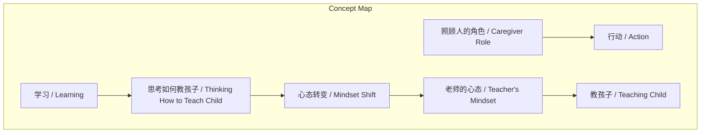
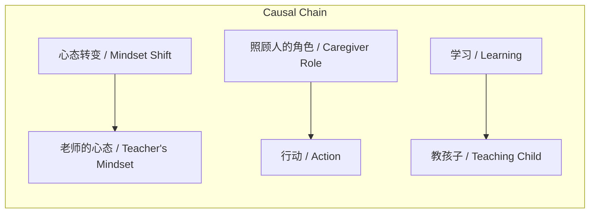

# 任务报告

- requestId: 1771468839585-jd2avn
- 生成时间(UTC): 2026-02-19T02:41:27.777Z

## 文本总结

# 从学习者到教育者的角色转变

## 整体结构化文档表达
### 文档卡片
- 主题（中文/English）：教育心态转变 / Educational Mindset Shift
- 一句话摘要：本文强调学习后应思考如何传授给孩子，并主张转变心态为主动教育者角色，认为教育孩子具有最高优先级。
- 目标读者：家长、教育工作者、终身学习者
- 核心结论（3条）：
  1. 学习的终极目标在于将知识传授给孩子。
  2. 角色定位决定行动，应主动成为照顾者而非被动接受照顾。
  3. 心态转变为教育者是实现有效教学的关键。

### 内容结构树
1. 背景与问题定义：未提及明确背景，直接提出如何将所学传授给孩子的问题。
2. 核心观点与关键证据：提出四点观点，但未提供外部证据支持。
3. 方法/机制/路径：通过心态转变，从学习者转变为教育者（老师心态）。
4. 风险与边界条件：未提及。
5. 结论与行动建议：强调教孩子的重要性，并建议主动调整角色与心态。

### 结构化元数据（JSON）
```json
{
  "title": "从学习者到教育者的角色转变",
  "topic_zh": "教育心态转变",
  "topic_en": "Educational Mindset Shift",
  "audience": "家长、教育工作者、终身学习者",
  "claims": [
    "学习后应思考如何让孩子学会所学内容",
    "应成为照顾人的角色而非被照顾的角色",
    "转变心态为老师的心态是教育的关键",
    "教孩子比教其他人都重要"
  ],
  "evidence": [],
  "risks": [],
  "actions": [
    "主动思考知识传递方法",
    "调整角色定位为照顾者",
    "实践老师心态进行教学",
    "优先教育孩子"
  ]
}
```

## 处理流程
1. 输入识别（来源：用户输入文本）
2. 信息抽取（实体、概念、问题、事实、观点）
3. 结构化归纳（定义/分类/比较/因果/方法论）
4. 关系建模（概念关系、等式/方程/逻辑链）
5. 可视化表达（Mermaid）

## 概念清单（中英文）
- 投资收益计算 / Investment Return Calculation
- 公式 / Formula
- 今天学到的东西 / Learned Content Today
- 孩子 / Child
- 照顾人的角色 / Caregiver Role
- 被照顾的角色 / Care-receiver Role
- 行动 / Action
- 心态 / Mindset
- 老师的心态 / Teacher's Mindset
- 教 / Teaching

## 概念定义（中英文）
- 投资收益计算：未提及明确定义。
- 公式：未提及明确定义。
- 今天学到的东西：未提及明确定义。
- 孩子：未提及明确定义。
- 照顾人的角色：未提及明确定义。
- 被照顾的角色：未提及明确定义。
- 行动：未提及明确定义。
- 心态：未提及明确定义。
- 老师的心态：未提及明确定义。
- 教：未提及明确定义。

## 概念关联与逻辑关系（中英文）
1. 心态转变（Mindset Shift） → 老师的心态（Teacher's Mindset）
2. 照顾人的角色（Caregiver Role） → 行动（Action）
3. 学习（Learning） → 教孩子（Teaching Child）

## COT逻辑梳理（定义/分类/比较/因果/科学方法论）
Step 1: 定义问题：如何将今日所学有效传授给孩子？
Step 2: 分类角色：区分照顾人角色与被照顾角色。
Step 3: 比较：两种角色导致截然不同的行动模式。
Step 4: 因果：心态转变是角色变化的前提，进而影响行动。
Step 5: 方法论：通过实践老师心态，优先教育孩子，实现学习价值的传递。

## 事实与看法（病毒）
### 事实
- 文本日期为2020.10.22。
- 文本包含四点陈述。
- 第一点以提问形式提出如何让孩子学会所学。
### 看法
- 一定要思考如何让孩子学会所学。
- 要成为照顾人的角色而非被照顾的角色。
- 转变心态后即为老师的心态。
- 教孩子比教其他人都重要。

## FAQ（原文问题整理）
- Q: 今天学到的东西如何让自己的孩子学会呢？
  A: 通过转变心态为老师，并主动成为照顾人的角色来教育孩子。

## Visualization
### Mermaid 图 1（概念结构图）

### Mermaid 图 2（逻辑/因果图）


## 文章中的类比
未发现明确类比。

## 10个金句
1. 一定要思考这个问题：今天学到的东西 如何让自己的孩子学会呢？
2. 要成为照顾人的角色 而不是被照顾的角色 两种人的行动是完全不同的
3. 转变心态后 你就是老师的心态
4. 教谁能比教孩子重要？
5. 原文未提供
6. 原文未提供
7. 原文未提供
8. 原文未提供
9. 原文未提供
10. 原文未提供
