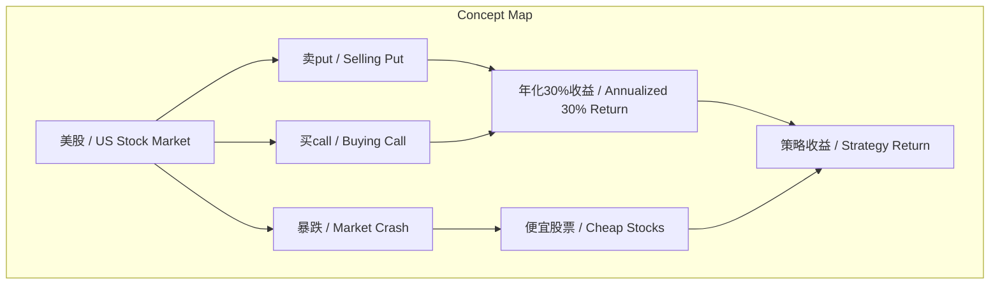
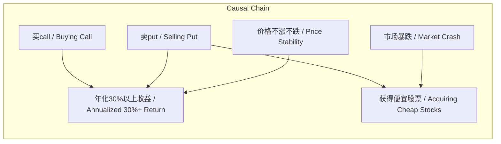

# 任务报告

- requestId: 1771472419619-ozqh94
- 生成时间(UTC): 2026-02-19T03:41:06.978Z

## 文本总结

# 美股期权策略收益预期

## 整体结构化文档表达
### 文档卡片
- 主题（中文/English）：期权策略 / Options Strategy
- 一句话摘要：投资者在美股下跌后通过卖put买call布局，预期若价格稳定则年化收益超30%，若暴跌则获廉价股票。
- 目标读者：个人投资者、期权交易者
- 核心结论（3条）：
  1. 卖put买call策略在年底价格不涨不跌时预期年化收益率超过30%。
  2. 市场继续暴跌将导致以低价获得股票持仓。
  3. 策略收益与风险高度依赖年底标的价格走势。

### 内容结构树
1. 背景与问题定义：美股狂跌后，投资者布局期权策略以寻求收益或低成本建仓。
2. 核心观点与关键证据：观点为策略能实现高收益或获取廉价资产；关键证据包括“年化30%以上”和“一堆便宜股票”。
3. 方法/机制/路径：具体操作是“卖put”和“买call”的期权组合。
4. 风险与边界条件：边界条件是收益假设年底价格不涨不跌；风险未在原文中明确提及。
5. 结论与行动建议：结论是策略在当前市场环境下可能有效；行动建议为持有头寸并根据市场变化调整。

### 结构化元数据（JSON）
```json
{
  "title": "美股期权策略收益预期",
  "topic_zh": "期权策略",
  "topic_en": "Options Strategy",
  "audience": "个人投资者、期权交易者",
  "claims": [
    "卖put买call策略在年底价格不涨不跌时预期年化收益率超过30%",
    "市场继续暴跌将导致以低价获得股票持仓",
    "策略收益与风险高度依赖年底标的价格走势"
  ],
  "evidence": [
    "年化30%以上估计没问题",
    "如果继续暴跌 就一堆便宜股票"
  ],
  "risks": [],
  "actions": [
    "持有当前期权和股票头寸",
    "根据市场变化调整策略"
  ]
}
```

## 处理流程
1. 输入识别：用户提供个人投资操作描述，涉及美股、期权策略、收益预期。
2. 信息抽取：实体：美股、卖put、买call、年化30%、暴跌、便宜股票；观点：收益预期、应对策略。
3. 结构化归纳：将内容分为背景、观点、方法、风险、结论。
4. 关系建模：建立卖put买call与收益、市场走势与结果的关系。
5. 可视化表达：用Mermaid绘制概念和因果图。

## 概念清单（中英文）
- 美股 / US Stock Market
- 卖put / Selling Put
- 买call / Buying Call
- 年化30% / Annualized 30% Return
- 暴跌 / Market Crash
- 便宜股票 / Cheap Stocks

## 概念定义（中英文）
- 美股：原文中提及“美股”，指美国股票市场，但未提供具体定义。
- 卖put：原文中提及“卖 put”，指卖出看跌期权的操作，但未提供具体定义。
- 买call：原文中提及“买 call”，指买入看涨期权的操作，但未提供具体定义。
- 年化30%：原文中提及“年化 30%”，指年化收益率30%，但未提供计算细节。
- 暴跌：原文中提及“暴跌”，指市场急剧下跌，但未提供具体标准。
- 便宜股票：原文中提及“便宜股票”，指估值较低的股票，但未提供具体定义。

## 概念关联与逻辑关系（中英文）
1. 卖put / Selling Put 与 买call / Buying Call 共同影响 策略收益 / Strategy Return（基于策略组合）。
2. 价格不涨不跌 / Price Stability 导致 年化30%以上收益 / Annualized 30%+ Return（从“如果按照现在的价格到年底不涨不跌 年化 30% 以上估计没问题”推断）。
3. 市场暴跌 / Market Crash 导致 获得便宜股票 / Acquiring Cheap Stocks（从“如果继续暴跌 就一堆便宜股票”推断）。

## COT逻辑梳理（定义/分类/比较/因果/科学方法论）
Step 1 定义：卖put买call是一种期权交易策略，涉及卖出看跌期权和买入看涨期权，但原文未提供精确定义。
Step 2 分类：按期权类型，卖put属于看跌期权操作，买call属于看涨期权操作；按策略目的，可视为收益增强或低位建仓策略，但原文未明确分类。
Step 3 比较：与直接买入股票相比，此策略可能获得权利金收入但面临不同风险；与单一期权操作相比，组合可能平衡风险收益，但原文未进行比较。
Step 4 因果：如果标的价格在年底保持稳定，卖put的权利金收入和买call的潜在盈利共同导致高年化收益；如果价格暴跌，卖put可能被行权导致以低价买入股票（获得便宜股票），同时买call可能亏损，但原文未分析因果机制。
Step 5 科学方法论：策略评估需考虑波动率、时间衰减、概率分布等，但原文未提及具体分析方法。

## 事实与看法（病毒）
### 事实
- 用户在前几天美股狂跌时布局了卖put和买call。
- 用户预期如果价格到年底不涨不跌，年化收益30%以上。
- 用户认为如果市场继续暴跌，将获得一堆便宜股票。
### 看法
- “估计没问题”表达对收益实现的乐观判断。
- “拿着就拿着了”表达对持有廉价股票的接受或随意态度。

## FAQ（原文问题整理）
未提及明确问题。

## Visualization
### Mermaid 图 1（概念结构图）

### Mermaid 图 2（逻辑/因果图）


## 文章中的类比
未发现明确类比。

## 10个金句
1. 前几天美股狂跌时候 布局了一堆卖 put 买 call
2. 这两天就开始收获了
3. 如果按照现在的价格到年底不涨不跌 年化 30% 以上估计没问题
4. 如果继续暴跌 就一堆便宜股票
5. 拿着就拿着了
6. 原文未提供
7. 原文未提供
8. 原文未提供
9. 原文未提供
10. 原文未提供
