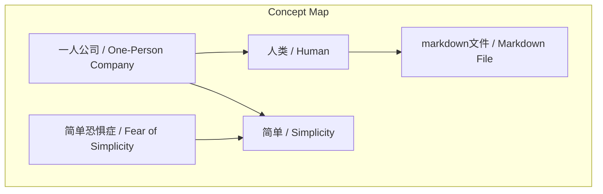
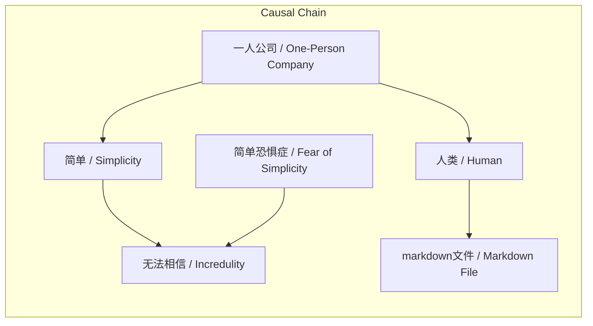

# 任务报告

- requestId: 1771483046601-dmqto6
- 生成时间(UTC): 2026-02-19T06:38:16.765Z

## 文本总结

# 一人公司本质：人类管理Markdown文件

## 整体结构化文档表达
### 文档卡片
- 主题（中文/English）：一人公司本质 / Essence of One-Person Company
- 一句话摘要：一人公司的本质被描述为个人通过管理markdown文件实现运营，其简单性常因“简单恐惧症”而被忽视。
- 目标读者：未提及
- 核心结论（3条）：
  1. 一人公司的本质是个人管理markdown文件。
  2. 该模式具有高度简单性。
  3. 简单性常因“简单恐惧症”被忽视。

### 内容结构树
1. 背景与问题定义：社会普遍认为公司运营复杂，但一人公司的真实简单本质被掩盖。
2. 核心观点与关键证据：核心观点是一人公司本质是人类管理markdown文件；关键证据为原文直接陈述。
3. 方法/机制/路径：机制是使用markdown文件作为核心管理工具。
4. 风险与边界条件：未提及。
5. 结论与行动建议：未提及。

### 结构化元数据（JSON）
```json
{
  "title": "一人公司本质：人类管理Markdown文件",
  "topic_zh": "一人公司本质",
  "topic_en": "Essence of One-Person Company",
  "audience": "未提及",
  "claims": ["一人公司的本质是个人管理markdown文件", "该模式具有高度简单性", "简单性常因“简单恐惧症”被忽视"],
  "evidence": ["原文直接陈述：一人公司的本质：其实就是一个人类管理一堆 markdown 文件", "原文描述：简单到无法相信的地步", "原文提及：人类普遍拥有“简单恐惧症”"],
  "risks": [],
  "actions": []
}
```

## 处理流程
1. 输入识别：识别到文本讨论一人公司的本质及其简单性。
2. 信息抽取：抽取关键概念：一人公司、人类、markdown文件、简单、简单恐惧症。
3. 结构化归纳：归纳出核心观点和结论。
4. 关系建模：建立概念间关系，如一人公司本质涉及人类管理markdown文件，简单性与简单恐惧症关联。
5. 可视化表达：准备Mermaid图展示概念结构和因果链。

## 概念清单（中英文）
- 一人公司 / One-Person Company
- 人类 / Human
- markdown文件 / Markdown File
- 简单 / Simplicity
- 简单恐惧症 / Fear of Simplicity

## 概念定义（中英文）
- 一人公司 / One-Person Company：未提及明确内容
- 人类 / Human：未提及明确内容
- markdown文件 / Markdown File：未提及明确内容
- 简单 / Simplicity：未提及明确内容
- 简单恐惧症 / Fear of Simplicity：未提及明确内容

## 概念关联与逻辑关系（中英文）
1. 一人公司 / One-Person Company 的本质 是 人类 / Human 管理 / Managing markdown文件 / Markdown File。形式化：Essence(一人公司) ≡ 人类管理(markdown文件)
2. 一人公司 / One-Person Company 具有 简单 / Simplicity。形式化：HasProperty(一人公司, 简单) = True
3. 简单 / Simplicity 与 简单恐惧症 / Fear of Simplicity 共同导致 无法相信 / Incredulity。形式化：简单 ∧ 简单恐惧症 → 无法相信

## COT逻辑梳理（定义/分类/比较/因果/科学方法论）
Step 1: 定义问题：基于原文，一人公司的本质是什么？原文主张是“人类管理markdown文件”。
Step 2: 分类：原文未对一人公司进行分类，未提及。
Step 3: 比较：原文未与传统公司或其他形态比较，未提及。
Step 4: 因果：因为一人公司本质是管理markdown文件（简单操作），所以具有简单性；因为简单性，且人类有简单恐惧症，所以导致“无法相信”的认知。
Step 5: 科学方法论：原文未涉及科学方法论，未提及。

## 事实与看法（病毒）
### 事实
- 未提及客观事实（原文全为主观陈述）
### 看法
- 这事儿特别搞笑（主观评价）
- 一人公司的本质是“一个人类管理一堆markdown文件”（作者观点）
- 这种本质“简单到无法相信的地步”（作者判断）
- 人类普遍拥有“简单恐惧症”（作者主张）

## FAQ（原文问题整理）
- 未发现明确提问

## Visualization
### Mermaid 图 1（概念结构图）

### Mermaid 图 2（逻辑/因果图）


## 文章中的类比
- 未发现明确类比

## 10个金句
1. 这事儿特别搞笑
2. 简单到无法相信的地步
3. 人类普遍拥有“简单恐惧症”
4. 一人公司的本质：其实就是一个人类管理一堆 markdown 文件
5. 原文未提供
6. 原文未提供
7. 原文未提供
8. 原文未提供
9. 原文未提供
10. 原文未提供
