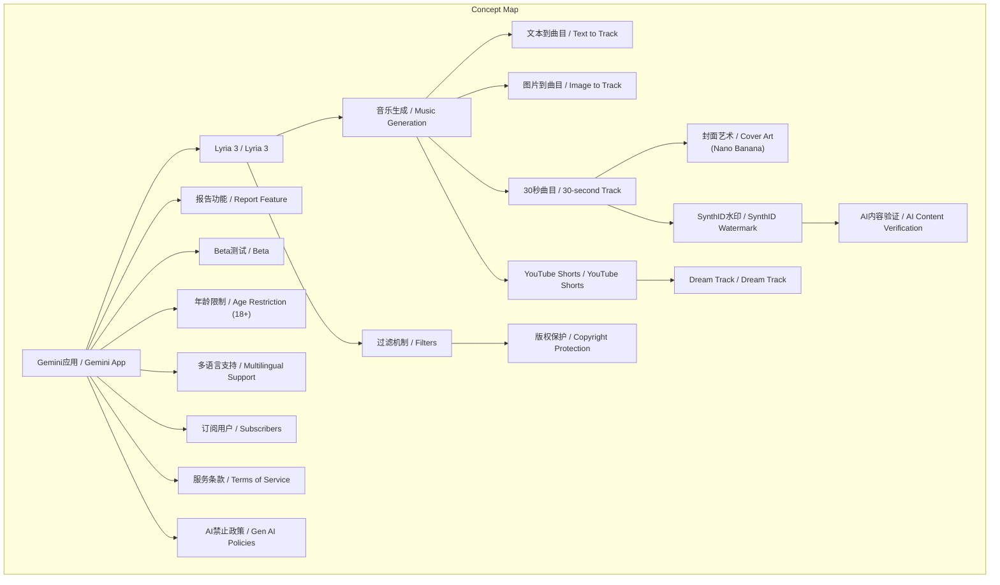
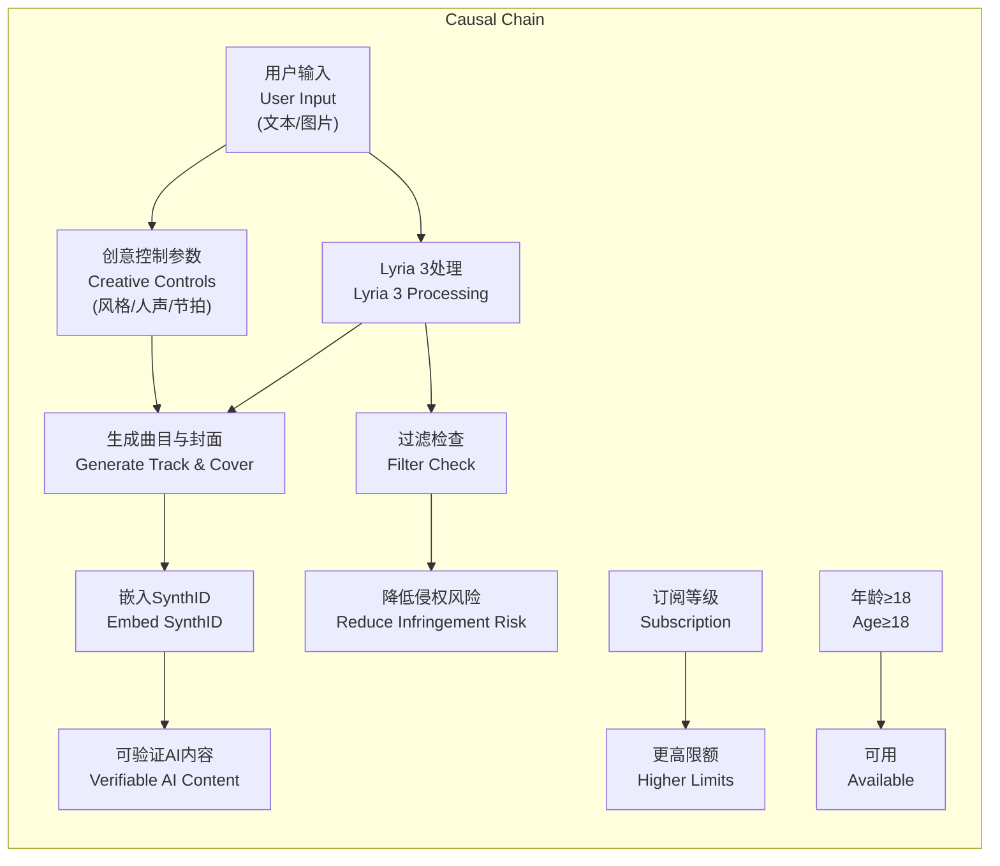

# 任务报告

- requestId: 1771483104064-ock7j2
- 生成时间(UTC): 2026-02-19T06:41:50.657Z

## 链接总结

- URL: https://blog.google/innovation-and-ai/products/gemini-app/lyria-3

# Gemini应用集成Lyria 3实现AI音乐生成

## 整体结构化文档表达
### 文档卡片
- 主题（中文/English）：AI音乐生成 / AI Music Generation
- 一句话摘要：Gemini应用集成Lyria 3模型，用户可通过文本或图像指令生成30秒自定义高质量音乐音轨，并嵌入SynthID水印，以Beta形式提供，面向18岁以上用户，支持多语言，订阅用户享有更高生成限额。
- 目标读者：Gemini应用用户、音乐创作者、AI技术爱好者
- 核心结论（3条）：
  1. Gemini应用现已支持音乐生成功能（事实）
  2. 用户可通过文本或图像输入创建30秒音乐（事实）
  3. 生成音轨嵌入SynthID水印，有年龄和订阅限制（事实）

### 内容结构树
1. 背景与问题定义：Gemini应用扩展创意工具至音乐领域，旨在为用户提供新的自我表达方式。
2. 核心观点与关键证据：
   - Lyria 3是Google DeepMind最新生成音乐模型，支持文本/图像输入，自动生成歌词，提供风格、人声、节拍等创意控制，生成更复杂逼真音频。
   - 生成音乐附带Nano Banana生成的定制封面艺术，所有曲目嵌入SynthID不可见水印。
   - 与YouTube Shorts的Dream Track集成，增强短视频配乐。
   - 负责任开发：设置过滤机制检查输出相似性，用户可报告问题，设计用于原创表达而非模仿艺术家。
3. 方法/机制/路径：用户输入文本描述或上传图片/视频 → Gemini调用Lyria 3模型生成30秒曲目及封面艺术 → 输出带SynthID水印的可下载曲目。
4. 风险与边界条件：
   - 过滤机制可能不完美，存在无意生成与现有内容相似的风险。
   - 若提示提及特定艺术家，系统仅取风格灵感，不模仿具体作品。
   - 功能目前在美国推出，逐步扩展至其他国家；仅限18岁以上用户；支持8种语言；订阅用户有更高限额。
5. 结论与行动建议：目标是为日常生活添加有趣自定义配乐，而非创作音乐杰作；鼓励用户尝试并报告潜在问题以持续改进。

### 结构化元数据（JSON）
```json
{
  "title": "Gemini应用集成Lyria 3实现AI音乐生成",
  "topic_zh": "AI音乐生成",
  "topic_en": "AI Music Generation",
  "audience": "Gemini应用用户、音乐创作者、AI技术爱好者",
  "claims": [
    "Lyria 3模型已集成至Gemini应用",
    "支持文本或图像输入生成30秒音乐",
    "生成音乐嵌入SynthID水印并支持验证",
    "功能以Beta形式提供，限18岁以上用户",
    "订阅用户享有更高生成限额"
  ],
  "evidence": [
    "Lyria 3是Google DeepMind的最新生成音乐模型",
    "改进包括：自动生成歌词、更多创意控制、更复杂逼真音频",
    "生成曲目附带Nano Banana生成的定制封面艺术",
    "所有曲目嵌入SynthID不可见水印",
    "Gemini应用支持AI内容验证功能",
    "设有过滤机制检查与现有内容的相似性",
    "支持英语、德语等8种语言",
    "桌面端今日推出，移动端陆续推出",
    "用户必须遵守服务条款和AI禁止政策"
  ],
  "risks": [
    "过滤机制可能无法完全防止生成与现有作品相似的内容",
    "功能目前仅在美国推出，其他国家逐步扩展",
    "生成内容旨在表达而非替代专业音乐创作"
  ],
  "actions": [
    "用户可通过描述或上传图片在Gemini应用中创建30秒曲目",
    "创作者可在YouTube Shorts中使用Dream Track增强配乐",
    "用户可报告潜在版权或内容问题",
    "订阅Google AI Plus/Pro/Ultra享更高限额"
  ]
}
```

## 处理流程
1. 输入识别：来源为Google官方博客文章（https://blog.google/.../lyria-3），内容为产品发布公告。
2. 信息抽取：从分段摘要中抽取实体（Gemini App、Lyria 3、SynthID等）、概念（音乐生成、水印等）、事实（功能特性、限制）和观点（目标陈述）。
3. 结构化归纳：将内容归纳为文档卡片、结构树、元数据；定义关键概念；比较Lyria 3改进；归纳因果链和方法论。
4. 关系建模：建立概念间逻辑关系，如输入触发处理、水印支持验证、订阅影响限额。
5. 可视化表达：设计Mermaid图展示概念结构和因果流程。

## 概念清单（中英文）
- Gemini应用 / Gemini App
- Lyria 3 / Lyria 3
- Google DeepMind / Google DeepMind
- 音乐生成 / Music Generation
- 文本输入 / Text Input
- 图像输入 / Image Input
- 30秒曲目 / 30-second Track
- 自定义封面艺术 / Custom Cover Art
- Nano Banana / Nano Banana
- SynthID水印 / SynthID Watermark
- AI内容验证 / AI Content Verification
- YouTube Shorts / YouTube Shorts
- Dream Track / Dream Track
- 版权 / Copyright
- 过滤机制 / Filters
- 报告功能 / Report Feature
- 原创表达 / Original Expression
- 风格灵感 / Broad Creative Inspiration
- Beta测试 / Beta
- 年龄限制 / Age Restriction (18+)
- 多语言支持 / Multilingual Support
- 订阅用户 / Subscribers
- 服务条款 / Terms of Service
- 生成式AI禁止使用政策 / Gen AI Prohibited Use Policies
- 桌面端 / Desktop
- 移动应用 / Mobile App
- gemini.google.com/music / 网址

## 概念定义（中英文）
- **Gemini应用**：Google的AI助手应用，现集成音乐生成功能。 / **Gemini App**: Google's AI assistant app, now integrated with music generation.
- **Lyria 3**：Google DeepMind开发的最新生成音乐模型，可从文本或图像创建高质量音频。 / **Lyria 3**: Google DeepMind's most advanced music generation model, creates high-quality audio from text or images.
- **Google DeepMind**：Google旗下人工智能研究公司，开发Lyria系列模型。 / **Google DeepMind**: Google's AI research division, developer of Lyria models.
- **音乐生成**：使用人工智能模型根据文本或图像输入自动创作音乐曲目的过程。 / **Music Generation**: The process of automatically creating music tracks from text or image inputs using AI models.
- **文本输入**：用户描述音乐想法的文字输入。 / **Text Input**: User's textual description of musical ideas.
- **图像输入**：用户上传的用于生成音乐的图片或视频。 / **Image Input**: User-uploaded images or videos for music generation.
- **30秒曲目**：Lyria 3在Gemini应用中生成的默认时长音乐片段。 / **30-second Track**: Default duration music snippet generated by Lyria 3 in Gemini App.
- **自定义封面艺术**：为生成音乐曲目自动创建的视觉封面图像，由Nano Banana模型生成。 / **Custom Cover Art**: Automatically created visual cover image for generated music tracks, produced by Nano Banana model.
- **Nano Banana**：Google的生成式模型，用于为音乐曲目创建封面艺术。 / **Nano Banana**: Google's generative model for creating cover art for music tracks. （原文未提供明确定义）
- **SynthID水印**：Google开发的不可见数字水印技术，用于标识AI生成内容。 / **SynthID Watermark**: Google's imperceptible digital watermark technology for identifying AI-generated content.
- **AI内容验证**：在Gemini应用中，通过检测SynthID或AI推理判断文件是否由Google AI生成的功能。 / **AI Content Verification**: Feature in Gemini app that detects SynthID or uses AI reasoning to determine if a file is generated by Google AI.
- **YouTube Shorts**：YouTube的短视频平台，集成Lyria 3以增强配乐创作。 / **YouTube Shorts**: YouTube's short-form video platform, integrated with Lyria 3 to enhance soundtrack creation.
- **Dream Track**：YouTube Shorts中的功能，允许创作者使用Lyria 3生成定制配乐。 / **Dream Track**: Feature in YouTube Shorts allowing creators to generate custom soundtracks using Lyria 3.
- **版权**：法律赋予创作者对其作品的专有权利，Lyria 3开发中注重尊重版权。 / **Copyright**: Legal right granting creators exclusive rights to their works; Lyria 3 development emphasizes respect for copyright.
- **过滤机制**：Lyria 3内置的检查系统，用于比对生成输出与现有音乐内容，减少侵权风险。 / **Filters**: Built-in check system in Lyria 3 that compares generated output with existing music to reduce infringement risk.
- **报告功能**：用户可在Gemini应用中报告潜在问题的渠道。 / **Report Feature**: Channel for users to report potential issues in Gemini app.
- **原创表达**：指生成内容旨在体现用户独特创意，而非复制现有作品。 / **Original Expression**: Generated content aims to reflect user's unique creativity, not replicate existing works.
- **风格灵感**：当提示提及特定艺术家时，系统仅借鉴其整体风格或情绪，不模仿具体作品。 / **Broad Creative Inspiration**: When prompts mention specific artists, system only draws on overall style or mood, not specific works.
- **Beta测试**：功能的公开测试阶段，可能不稳定。 / **Beta**: Public testing phase of a feature, may be unstable.
- **年龄限制**：功能仅限18岁以上用户使用。 / **Age Restriction**: Feature limited to users aged 18 and above.
- **多语言支持**：功能支持多种语言输入。 / **Multilingual Support**: Feature supports input in multiple languages.
- **订阅用户**：付费订阅Gemini应用的用户，享有更高限额。 / **Subscribers**: Paid users of Gemini app with higher limits.
- **服务条款**：Google产品使用协议，规定用户行为规范。 / **Terms of Service**: Google's product use agreement, defines user conduct.
- **生成式AI禁止使用政策**：Google针对生成式AI的禁用政策，禁止侵犯知识产权、隐私等行为。 / **Gen AI Prohibited Use Policies**: Google's prohibited use policies for generative AI, banning IP infringement, privacy violations, etc.
- **桌面端**：Lyria 3首先推出的平台类型。 / **Desktop**: Initial platform for Lyria 3 release.
- **移动应用**：Lyria 3后续推出的平台类型。 / **Mobile App**: Subsequent platform for Lyria 3 release.
- **gemini.google.com/music**：Lyria 3的访问入口网址。 / **gemini.google.com/music**: Access URL for Lyria 3.

## 概念关联与逻辑关系（中英文）
1. **用户输入（文本/图像） / User Input (Text/Image)** 触发 **Lyria 3处理 / Lyria 3 Processing**，生成 **30秒曲目 / 30-second Track** 与 **自定义封面艺术 / Custom Cover Art**  
   `Input(Text/Image) → Process(Lyria3) → Output(Track + CoverArt)`
2. **SynthID水印 / SynthID Watermark** 嵌入 **生成曲目 / Generated Track**，支持 **AI内容验证 / AI Content Verification**  
   `Embed(SynthID, Track) → Enables(Verification)`
3. **订阅等级（Plus/Pro/Ultra） / Subscription Level** 与 **使用限额 / Usage Limits** 正相关  
   `SubscriptionLevel ∈ {Plus,Pro,Ultra} → HigherLimits`

## COT逻辑梳理（定义/分类/比较/因果/科学方法论）
- **Step 1 (定义)**：音乐生成（Music Generation）指利用AI模型（如Lyria 3）将非音频输入（文本、图像）转换为音频内容的技术。
- **Step 2 (分类)**：按输入模态分为文本到曲目（Text-to-Track）和图片到曲目（Image-to-Track）；按输出分为带歌词曲目和纯器乐曲目；按用户类型分为普通用户（18+）和订阅用户。
- **Step 3 (比较)**：Lyria 3较前代Lyria模型在三个方面改进：1) 自动生成歌词（无需用户提供）；2) 提供风格、人声、节拍等更多控制参数；3) 生成更逼真、音乐结构更复杂的音频。
- **Step 4 (因果)**：技术改进（如自动歌词生成、更优训练）直接导致用户体验提升（降低创作门槛）和输出质量提高（更复杂逼真）；同时，嵌入SynthID和验证工具是因应AI内容可识别性需求的果；集成Lyria 3是Gemini应用获得音乐生成能力的原因。
- **Step 5 (科学方法论)**：负责任开发方法论包括：a) 与音乐社区合作（如Music AI Sandbox）；b) 训练数据选择注重版权与合作伙伴协议；c) 部署输出过滤机制比对现有内容；d) 提供用户反馈渠道（报告功能）以持续迭代；e) 通过桌面端先行发布收集反馈，计划扩展语言覆盖。

## 事实与看法（病毒）
### 事实
- Lyria 3是Google DeepMind的最新生成音乐模型，于今日在Gemini应用中以测试版推出。
- Lyria 3支持两种生成方式：文本到曲目（描述风格、情绪等）和图片/视频到曲目（上传媒体文件）。
- 生成曲目时长为30秒，并附带由Nano Banana生成的定制封面艺术。
- Lyria 3相比前代有三点改进：自动生成歌词、更多创意控制（风格、人声、节拍）、生成更复杂逼真的音频。
- 所有生成曲目均嵌入SynthID不可见水印。
- Gemini应用新增AI内容验证功能，可检测SynthID或通过推理判断文件是否由Google AI生成。
- Lyria 3设有过滤机制检查输出与现有音乐内容的相似性。
- 功能目前在美国推出，并逐步扩展至其他国家（如YouTube Shorts创作者）。
- Lyria 3与YouTube Shorts的Dream Track集成，用于增强短片配乐。
- 用户可通过Gemini应用报告潜在问题。
- 支持英语、德语、西班牙语、法语、印地语、日语、韩语、葡萄牙语。
- 仅限18岁以上用户使用。
- Google AI Plus、Pro、Ultra订阅者享有更高使用限额。
- 桌面端今日推出，移动应用未来几天推出。
- 用户必须遵守Google服务条款和生成式AI禁止使用政策。
### 看法
- 生成曲目的目标不是创作音乐杰作，而是提供一种有趣、独特的自我表达方式。
- 若用户提示提及特定艺术家，系统仅将其作为 broad creative inspiration（宽泛创意灵感），生成风格或情绪相似但不模仿具体作品的曲目。
- 尽管有过滤机制，但承认 approach might not be foolproof（方法可能并非万无一失）。
- 音乐生成设计用于 original expression（原创表达），而非 mimicking existing artists（模仿现有艺术家）。

## FAQ（原文问题整理）
- **未发现明确提问**：原文为公告性文本，未包含直接提问句式。

## Visualization
### Mermaid 图 1（概念结构图）


### Mermaid 图 2（逻辑/因果图）


## 文章中的类比
- **未发现明确类比**

## 10个金句
1. "A new way to express yourself: Gemini can now create music"
2. "The Gemini app now features our most advanced music generation model Lyria 3"
3. "empowering anyone to make 30-second tracks using text or images in beta"
4. "Just describe an idea or upload a photo, and Gemini will generate a 30-second track with custom cover art."
5. "Lyria 3 improves on previous models with lyrics, creative control, and complex tracks."
6. "all tracks generated in the Gemini app are embedded with SynthID"
7. "our imperceptible watermark for identifying Google AI-generated content"
8. "Available in the Gemini app for users 18+ in multiple languages"
9. "with higher limits for subscribers"
10. "Generative AI is experimental."
