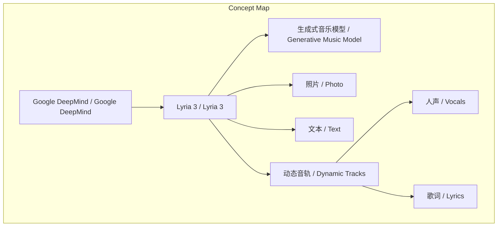
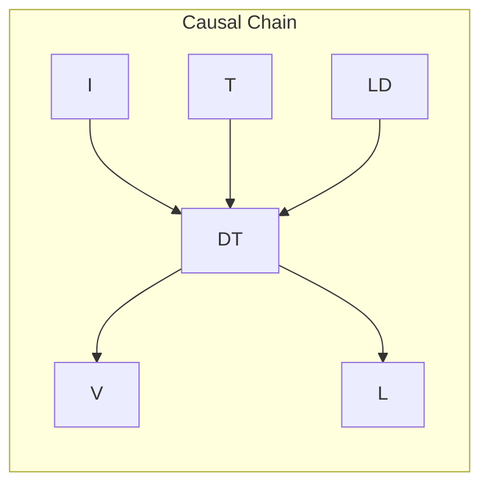

# 任务报告

- requestId: 1771483326968-fk6662
- 生成时间(UTC): 2026-02-19T06:42:41.497Z

## 链接总结

- URL: https://x.com/GoogleDeepMind/status/2024153067654902014

# Google DeepMind发布Lyria 3生成式音乐模型

## 整体结构化文档表达
### 文档卡片
- 主题（中文/English）：生成式音乐模型 / Generative Music Model
- 一句话摘要：Google DeepMind推出Lyria 3，可将照片与文本转换为包含人声和歌词的动态音乐。
- 目标读者：未提及
- 核心结论（3条）：
  1. Lyria 3是Google DeepMind发布的生成式音乐模型。
  2. 该模型能将照片和文本转化为动态音轨。
  3. 生成的动态音轨包含人声和歌词。

### 内容结构树
1. 背景与问题定义：未提及
2. 核心观点与关键证据：核心观点为Lyria 3具备将多模态输入转化为音乐的能力；关键证据为帖子中的功能描述。
3. 方法/机制/路径：未提及
4. 风险与边界条件：未提及
5. 结论与行动建议：结论是Lyria 3已发布；行动建议是通过帖子链接获取更多信息。

### 结构化元数据（JSON）
```json
{
  "title": "Google DeepMind发布Lyria 3生成式音乐模型",
  "topic_zh": "生成式音乐模型",
  "topic_en": "Generative Music Model",
  "audience": "未提及",
  "claims": [
    "Lyria 3是Google DeepMind的最新生成式音乐模型",
    "Lyria 3能将照片和文本转化为动态音轨",
    "生成的动态音轨包含人声和歌词"
  ],
  "evidence": [
    "帖子发布时间：2026年2月18日16:04",
    "浏览量：228.7K",
    "模型名称：Lyria 3"
  ],
  "risks": [],
  "actions": ["通过帖子中的链接访问更多信息"]
}
```

## 处理流程
1. **输入识别**：来源为X平台帖子（URL: https://x.com/GoogleDeepMind/status/2024153067654902014），内容为Google DeepMind关于Lyria 3的发布声明。
2. **信息抽取**：实体包括Google DeepMind、Lyria 3；概念包括生成式音乐模型、照片、文本、动态音轨、人声、歌词；事实包括发布事件、时间、浏览量；观点为模型功能描述。
3. **结构化归纳**：定义Lyria 3为生成式音乐模型；分类为AI音乐生成工具（输入未明确分类）；比较未提及；因果链：输入照片/文本导致输出动态音轨；方法论未提及。
4. **关系建模**：Lyria 3作为转换器，关联输入（照片、文本）与输出（动态音轨）；动态音轨包含人声和歌词。
5. **可视化表达**：使用Mermaid绘制概念与因果图。

## 概念清单（中英文）
- Google DeepMind / Google DeepMind
- Lyria 3 / Lyria 3
- 生成式音乐模型 / Generative Music Model
- 照片 / Photo
- 文本 / Text
- 动态音轨 / Dynamic Tracks
- 人声 / Vocals
- 歌词 / Lyrics

## 概念定义（中英文）
- Google DeepMind / Google DeepMind：未提及
- Lyria 3 / Lyria 3：未提及
- 生成式音乐模型 / Generative Music Model：未提及
- 照片 / Photo：未提及
- 文本 / Text：未提及
- 动态音轨 / Dynamic Tracks：未提及
- 人声 / Vocals：未提及
- 歌词 / Lyrics：未提及

## 概念关联与逻辑关系（中英文）
1. Lyria 3 (Generative Music Model) 将 照片 (Photo) 和 文本 (Text) 转化为 动态音轨 (Dynamic Tracks)。形式化：`Lyria_3(Photo, Text) → Dynamic_Tracks`
2. 动态音轨 (Dynamic Tracks) 包含 人声 (Vocals) 和 歌词 (Lyrics)。形式化：`Dynamic_Tracks ⊇ {Vocals, Lyrics}`
3. Google DeepMind (Google DeepMind) 开发了 Lyria 3 (Lyria 3)。形式化：`Google_DeepMind → develops → Lyria_3`

## COT逻辑梳理（定义/分类/比较/因果/科学方法论）
- Step 1（定义）：基于帖子，Lyria 3被标识为“our latest generative music model”，即一种生成式音乐模型。
- Step 2（分类）：输入未提供分类信息，未提及。
- Step 3（比较）：输入未涉及与其他模型的比较，未提及。
- Step 4（因果）：因Lyria 3具备所述功能，故输入照片和文本可导致输出动态音轨（含人声和歌词）。
- Step 5（科学方法论）：输入未描述技术方法或实验过程，未提及。

## 事实与看法
### 事实
- Google DeepMind在X平台发布了关于Lyria 3的帖子。
- 帖子发布时间为2026年2月18日16:04。
- 帖子获得228.7K浏览量。
- Lyria 3被描述为生成式音乐模型。
- Lyria 3能将照片和文本转化为动态音轨。
- 生成的动态音轨包含人声和歌词。
### 看法
- 未发现明确主观看法或评价（所有陈述均为功能描述或客观事实）。

## FAQ（原文问题整理）
- 未发现明确提问。

## Visualization
### Mermaid 图 1（概念结构图）

### Mermaid 图 2（逻辑/因果图）


## 文章中的类比
- 未发现明确类比。

## 10个金句
1. "We just dropped Lyria 3: our latest generative music model."
2. "It can turn photos and text into dynamic tracks - complete with vocals and lyrics."
3. 原文未提供
4. 原文未提供
5. 原文未提供
6. 原文未提供
7. 原文未提供
8. 原文未提供
9. 原文未提供
10. 原文未提供
