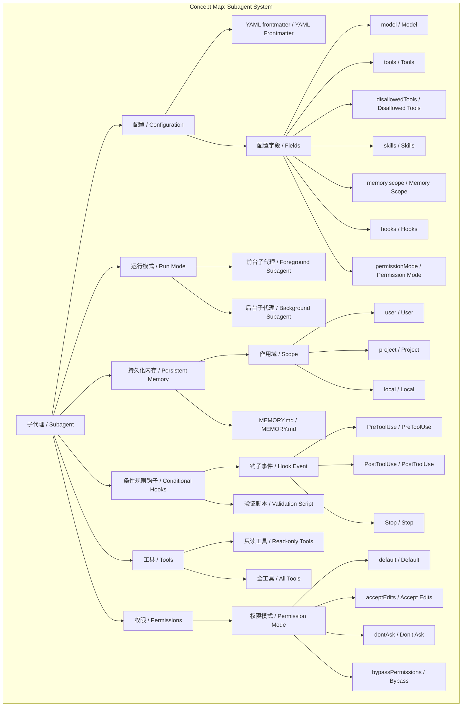
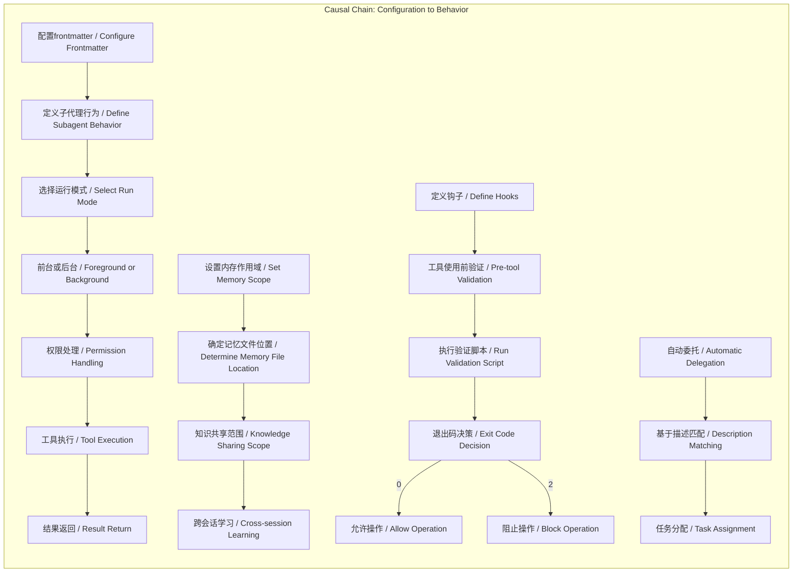

# 任务报告

- requestId: 1771485189230-wtbvat
- 生成时间(UTC): 2026-02-19T07:20:43.749Z

## 链接总结

- URL: https://code.claude.com/docs/en/sub-agents

# Claude Code子代理配置与管理全解析

## 整体结构化文档表达
### 文档卡片
- 主题（子代理系统 / Subagent System）：
- 一句话摘要：全面介绍Claude Code中子代理的创建、配置、运行机制及最佳实践，涵盖上下文管理、持久化内存、条件规则等高级功能。
- 目标读者：Claude Code开发者、技术用户及团队负责人
- 核心结论（3条）：
  1. 子代理是Claude Code中用于任务隔离的专用AI助手，拥有独立上下文、可配置工具和权限，支持前台/后台运行模式。
  2. 通过YAML frontmatter可精细配置模型、工具、技能、持久化内存和条件钩子，实现能力定制与安全控制。
  3. 应根据任务特性（如输出量、上下文需求、安全性）选择内置或自定义子代理，并遵循最佳实践（聚焦任务、限制权限、版本控制）以优化效率。

### 内容结构树
1. 背景与问题定义：Claude处理复杂多任务时，主对话上下文窗口有限，需隔离任务以避免混乱，子代理提供独立执行环境。
2. 核心观点与关键证据：子代理通过独立会话保留主对话上下文；内置子代理（Explore、Plan、General-purpose）针对常见场景优化；自定义子代理通过配置实现任务专用化；证据包括配置字段、运行模式、恢复机制等。
3. 方法/机制/路径：创建方式（/agents命令、文件、CLI、插件）；配置字段（model、tools、skills、memory、hooks、permissionMode等）；运行模式（前台阻塞/后台并发）；持久化内存作用域（user/project/local）；条件规则钩子（PreToolUse等）；恢复与压缩机制。
4. 风险与边界条件：配置错误导致权限问题；后台子代理权限失败需恢复前台；MCP工具在后台不可用；正则匹配可能被绕过；子代理不能spawn其他子代理；内存文件需管理。
5. 结论与行动建议：根据任务选择代理类型；配置时遵循最佳实践（聚焦、详细描述、权限最小化）；使用恢复和自动压缩；测试验证逻辑；版本控制项目子代理。

### 结构化元数据（JSON）
```json
{
  "title": "Claude Code子代理配置与管理全解析",
  "topic_zh": "子代理系统",
  "topic_en": "Subagent System",
  "audience": "Claude Code开发者、技术用户及团队负责人",
  "claims": [
    "子代理是处理特定任务的专用AI助手",
    "子代理在自己的上下文窗口中运行",
    "可通过配置控制子代理行为和权限",
    "支持前台和后台运行模式",
    "持久化内存允许跨会话存储信息",
    "条件规则钩子可动态验证工具使用",
    "子代理不能spawn其他子代理",
    "工具限制可控制成本和安全",
    "子代理恢复机制保留完整历史",
    "设计子代理应聚焦任务、详细描述、限制权限"
  ],
  "evidence": [
    "每个子代理在自己的上下文窗口中运行",
    "具有自定义系统提示和特定工具",
    "支持配置frontmatter字段",
    "Explore子代理使用Haiku模型，只读工具",
    "Plan子代理在计划模式中由Claude自动调用",
    "General-purpose子代理继承主模型，全工具",
    "子代理不能spawn其他子代理",
    "子代理通过描述匹配触发委托",
    "子代理定义于Markdown文件，使用YAML frontmatter",
    "持久化内存有三种作用域：user、project、local"
  ],
  "risks": [
    "配置复杂性可能导致权限错误",
    "后台子代理因权限失败需恢复前台重试",
    "MCP工具在后台子代理中不可用",
    "正则表达式匹配可能不完善，无法覆盖所有写操作变体",
    "验证脚本路径必须与钩子配置完全匹配，否则验证失效"
  ],
  "actions": [
    "创建子代理文件并配置frontmatter",
    "使用/agents命令调用子代理",
    "根据任务选择子代理范围和权限",
    "使用user作用域以最大化知识积累",
    "在子代理提示中要求更新内存并测试验证逻辑"
  ]
}
```

## 处理流程
1. 输入识别：来源为Claude Code官方文档网页正文，主题为子代理的创建、配置、运行与管理。
2. 信息抽取：抽取实体（子代理、上下文、工具、配置字段、钩子、内存等）、概念（前台/后台、持久化、条件规则等）、问题（如何配置？如何安全运行？）、事实（配置方法、运行模式）和观点（最佳实践建议）。
3. 结构化归纳：按定义、分类、配置方法、运行机制、风险、建议进行归纳。
4. 关系建模：建立配置-行为、工具-能力、权限-访问、内存-知识、钩子-安全等关系。
5. 可视化表达：使用Mermaid绘制概念图和因果图。

## 概念清单（中英文）
- 子代理 / Subagents
- 上下文窗口 / Context Window
- 系统提示 / System Prompt
- 工具 / Tools
- Frontmatter
- 权限模式 / Permission Modes
- 技能 / Skills
- 持久化内存 / Persistent Memory
- 钩子 / Hooks
- 自动委托 / Automatic Delegation
- 前台/后台运行 / Foreground/Background Execution
- 上下文管理 / Context Management
- Claude Code
- 权限 / Permissions
- 会话 / Session
- 代理团队 / Agent teams
- 约束 / Constraints
- 配置 / Configurations
- 成本 / Costs
- 模型 / Model
- Explore子代理 / Explore Subagent
- Plan子代理 / Plan Subagent
- General-purpose子代理 / General-purpose Subagent
- Bash代理 / Bash Agent
- statusline-setup代理 / statusline-setup Agent
- Claude Code Guide代理 / Claude Code Guide Agent
- Markdown文件 / Markdown File
- YAML frontmatter / YAML Frontmatter
- /agents命令 / /agents Command
- 只读工具 / Read-only Tools
- Write工具 / Write Tools
- Edit工具 / Edit Tools
- thoroughly级别 / Thoroughness Levels
- 计划模式 / Plan Mode
- 用户级子代理 / User-level Subagents
- maxTurns / Maximum Turns
- mcpServers / MCP Servers
- sonnet / Sonnet Model
- opus / Opus Model
- haiku / Haiku Model
- inherit / Inherit Model
- disallowedTools / Disallowed Tools
- Task / Task Tool
- permissionMode / Permission Mode
- default / Default Mode
- acceptEdits / Accept Edits Mode
- dontAsk / Don't Ask Mode
- bypassPermissions / Bypass Permissions Mode
- context: fork / Context Fork
- user / User Scope
- project / Project Scope
- local / Local Scope
- MEMORY.md / MEMORY.md
- PreToolUse / PreToolUse Hook
- PostToolUse / PostToolUse Hook
- Stop / Stop Hook
- 条件规则 / Conditional Rules
- 验证脚本 / Validation Script
- 权限设置 / Permission Settings
- deny数组 / Deny Array
- settings.json / settings.json
- SubagentStop / SubagentStop Event
- 退出码 / Exit Code
- 匹配器 / Matcher
- 项目级钩子 / Project-level Hooks
- 生命周期事件 / Lifecycle Events
- SubagentStart事件 / SubagentStart Event
- SubagentStop事件 / SubagentStop Event
- description字段 / Description Field
- 前台子代理 / Foreground Subagent
- 后台子代理 / Background Subagent
- 工具权限 / Tool Permissions
- MCP工具 / MCP Tools
- 环境变量 / Environment Variable
- 常见模式 / Common Patterns
- 隔离高容量操作 / Isolate High-volume Operations
- 并行研究 / Run Parallel Research
- 链式子代理 / Chain Subagents
- 主对话 / Main Conversation
- 自动压缩 / Auto-compaction
- 转录文件 / Transcript
- 代码审查者 / Code Reviewer
- 调试器 / Debugger
- 数据科学家 / Data Scientist
- SQL查询 / SQL Query
- BigQuery / BigQuery
- 数据库查询验证器 / Database Query Validator
- 只读查询 / Read-only Query
- 正则表达式 / Regular Expression
- 工具输入 / Tool Input
- JSON / JSON
- jq / jq
- 写操作 / Write Operation
- SELECT语句 / SELECT Statement

## 概念定义（中英文）
- 子代理 / Subagents：Claude Code中用于处理特定任务的专用AI助手，运行在独立的上下文窗口中，可自定义系统提示、工具和权限。
- 上下文窗口 / Context Window：AI模型处理信息的有限内存空间，子代理拥有独立的上下文窗口。
- 系统提示 / System Prompt：定义AI助手行为和角色的初始指令，子代理可自定义。
- 工具 / Tools：子代理可使用的功能或API，扩展其能力。
- Frontmatter：子代理配置文件中的元数据部分，用于定义配置字段。
- 权限模式 / Permission Modes：控制子代理访问和操作权限的设置。
- 技能 / Skills：预定义的能力模块，可预加载到子代理中。
- 持久化内存 / Persistent Memory：子代理跨会话保存信息的能力，通过MEMORY.md文件实现。
- 钩子 / Hooks：在子代理生命周期特定事件（如工具使用前后）自动执行的外部命令或脚本。
- 自动委托 / Automatic Delegation：Claude根据任务描述和子代理配置中的description字段自动将任务分配给合适子代理的机制。
- 前台/后台运行 / Foreground/Background Execution：子代理运行方式，前台阻塞主对话，后台异步运行。
- 上下文管理 / Context Management：管理对话历史和信息以优化AI性能的策略。
- Claude Code：Claude的集成开发环境，支持代码编辑与任务自动化。
- 权限 / Permissions：代理访问工具的授权范围。
- 会话 / Session：独立对话上下文，子代理在单独会话中运行。
- 代理团队 / Agent teams：跨多个会话协调的多个代理集合。
- 约束 / Constraints：对代理行为的限制，如工具禁用。
- 配置 / Configurations：代理的设置参数，包括工具、模型、提示等。
- 成本 / Costs：使用代理的计算资源消耗，与模型选择相关。
- 模型 / Model：底层AI模型，如Haiku（快速低成本）、Sonnet（平衡）、主对话模型。
- Explore子代理 / Explore Subagent：内置快速只读代理，用于代码库搜索与分析。
- Plan子代理 / Plan Subagent：内置研究代理，在计划模式中收集上下文以生成计划。
- General-purpose子代理 / General-purpose Subagent：内置通用代理，支持探索与修改的复杂多步骤任务。
- Bash代理 / Bash Agent：辅助代理，用于在独立上下文运行终端命令。
- statusline-setup代理 / statusline-setup Agent：辅助代理，在运行`/statusline`时配置状态行。
- Claude Code Guide代理 / Claude Code Guide Agent：辅助代理，回答关于Claude Code功能的问题。
- Markdown文件 / Markdown File：用于定义子代理的文本文件，支持YAML frontmatter。
- YAML frontmatter / YAML Frontmatter：Markdown文件顶部的元数据块，定义代理配置。
- /agents命令 / /agents Command：Claude Code中用于打开子代理管理界面的命令。
- 只读工具 / Read-only Tools：仅允许读取文件、搜索等，禁止写入或编辑。
- Write工具 / Write Tools：允许创建或覆盖文件的工具。
- Edit工具 / Edit Tools：允许修改现有文件的工具。
- thoroughly级别 / Thoroughness Levels：Explore子代理的探索深度设置，包括quick、medium、very thorough。
- 计划模式 / Plan Mode：Claude Code的安全分析模式，先研究再行动。
- 用户级子代理 / User-level Subagents：保存在用户主目录，跨项目可用的自定义代理。
- maxTurns / Maximum Turns：子代理在停止前的最大代理轮次数。
- mcpServers / MCP Servers：子代理可用的MCP服务器配置。
- sonnet / Sonnet Model：模型别名，指代Sonnet模型。
- opus / Opus Model：模型别名，指代Opus模型。
- haiku / Haiku Model：模型别名，指代Haiku模型。
- inherit / Inherit Model：模型选项，使用父对话相同模型。
- disallowedTools / Disallowed Tools：子代理禁止使用的工具列表（拒绝列表）。
- Task / Task Tool：子代理 spawning 工具，可指定类型。
- permissionMode / Permission Mode：子代理权限提示处理模式。
- default / Default Mode：标准权限检查模式，有提示。
- acceptEdits / Accept Edits Mode：自动接受文件编辑。
- dontAsk / Don't Ask Mode：自动拒绝权限提示（显式允许工具仍可用）。
- bypassPermissions / Bypass Permissions Mode：跳过所有权限检查。
- context: fork / Context Fork：技能配置中上下文分支选项。
- user / User Scope：内存作用域，用户级持久化。
- project / Project Scope：内存作用域，项目级持久化。
- local / Local Scope：内存作用域，本地级持久化。
- MEMORY.md / MEMORY.md：持久化内存的默认存储文件。
- PreToolUse / PreToolUse Hook：在工具使用前触发的事件，用于条件验证。
- PostToolUse / PostToolUse Hook：在工具使用后触发的事件。
- Stop / Stop Hook：在子代理完成时触发的事件。
- 条件规则 / Conditional Rules：通过钩子实现的、基于动态条件控制工具使用或行为的机制。
- 验证脚本 / Validation Script：由钩子调用的外部程序，用于检查即将执行的操作是否允许。
- 权限设置 / Permission Settings：在`settings.json`中配置的全局规则，用于控制子代理和工具的使用权限。
- deny数组 / Deny Array：`settings.json`中`permissions`下的一个数组，列出被禁止使用的子代理或工具。
- settings.json / settings.json：Claude的全局配置文件，用于定义权限、钩子等设置。
- SubagentStop / SubagentStop Event：主会话接收到的、表示子代理已停止的事件。
- 退出码 / Exit Code：钩子命令执行后返回的数值，用于指示操作是否允许（0允许，2阻止）。
- 匹配器 / Matcher：在钩子配置中用于指定触发事件（如工具名称）的字符串或模式。
- 项目级钩子 / Project-level Hooks：在`settings.json`中配置的钩子，用于响应子代理生命周期事件。
- 生命周期事件 / Lifecycle Events：子代理执行过程中触发的事件，包括`SubagentStart`和`SubagentStop`。
- SubagentStart事件 / SubagentStart Event：当子代理开始执行时触发的事件。
- SubagentStop事件 / SubagentStop Event：当子代理完成执行时触发的事件。
- description字段 / Description Field：子代理配置中的描述字段，用于定义子代理功能。
- 前台子代理 / Foreground Subagent：阻塞主对话直到完成的子代理，权限提示和澄清问题传递给用户。
- 后台子代理 / Background Subagent：并发运行的子代理，不阻塞主对话，启动前需获取工具权限预批准。
- 工具权限 / Tool Permissions：子代理执行工具操作所需的用户批准。
- MCP工具 / MCP Tools：在后台子代理中不可用的工具类型。
- 环境变量 / Environment Variable：系统级配置变量，如`CLAUDE_CODE_DISABLE_BACKGROUND_TASKS`。
- 常见模式 / Common Patterns：子代理的典型使用方式，包括隔离高容量操作、并行研究、链式子代理。
- 隔离高容量操作 / Isolate High-volume Operations：将产生大量输出的任务委托给子代理，使详细输出保留在子代理上下文中。
- 并行研究 / Run Parallel Research：为独立研究任务启动多个子代理同时工作。
- 链式子代理 / Chain Subagents：按顺序使用多个子代理，每个子代理完成并将结果传递给下一个。
- 主对话 / Main Conversation：用户与Claude的主要交互上下文，共享所有对话历史。
- 自动压缩 / Auto-compaction：子代理转录文件的自动清理机制，在容量达到阈值时触发。
- 转录文件 / Transcript：存储子代理对话历史的独立文件。
- 代码审查者 / Code Reviewer：只读子代理，审查代码质量与安全，无编辑权限。
- 调试器 / Debugger：可分析并修复问题的子代理，拥有编辑权限。
- 数据科学家 / Data Scientist：领域专用子代理，用于数据分析，可指定模型。
- SQL查询 / SQL Query：结构化查询语言语句，用于从关系数据库检索或操作数据。
- BigQuery / BigQuery：Google Cloud的无服务器数据仓库，用于大规模数据分析。
- 数据库查询验证器 / Database Query Validator：通过钩子机制验证并仅允许只读数据库查询的子代理。
- 只读查询 / Read-only Query：仅检索数据而不修改的数据库操作，如SELECT语句。
- 正则表达式 / Regular Expression：用于字符串匹配的模式，脚本中用于检测SQL写操作关键词。
- 工具输入 / Tool Input：传递给工具或钩子的参数，包含命令等字段的JSON对象。
- JSON / JSON：JavaScript对象表示法，用于数据交换的轻量级格式。
- jq / jq：命令行JSON处理器，用于提取和转换JSON数据。
- 写操作 / Write Operation：修改数据库数据的SQL语句，如INSERT、UPDATE、DELETE等。
- SELECT语句 / SELECT Statement：SQL中用于查询数据的语句，属于只读操作。

## 概念关联与逻辑关系（中英文）
1. **子代理配置 (Subagent Configuration)** 通过 **YAML frontmatter** 定义 **工具集 (Tool Set)** 和 **钩子 (Hooks)**，从而限制代理能力。形式化：`Config(frontmatter) → Behavior(subagent)`
2. **工具集 (Tool Set)** 与 **禁止工具列表 (Disallowed Tools)** 共同决定 **有效工具集 (Effective Tool Set)**：`EffectiveTools = Tools \ DisallowedTools`，进而影响 **子代理能力 (Subagent Capability)`。
3. **内存作用域 (Memory Scope)** 决定 **记忆文件位置 (Memory File Location)** 和 **知识共享范围 (Knowledge Sharing Scope)`：`Scope(user) → path=~/.claude/agent-memory/ & sharing=all_projects`；`Scope(project) → path=.claude/agent-memory/ & sharing=project_only`。
4. **钩子事件 (Hook Event)** 与 **匹配器 (Matcher)** 共同触发 **验证脚本执行 (Validation Script Execution)`：`Event(PreToolUse) ∧ Matcher("Bash")` → 执行 `command` → `ExitCode(2)` → `Block Operation`。
5. **自动委托 (Automatic Delegation)** 基于 **任务描述 (Task Description)** 和 **description字段 (Description Field)** 决定是否使用 **子代理 (Subagent)`：`Delegate(task, subagent) ⇔ Match(description, task) ∨ ExplicitRequest`。

## COT逻辑梳理（定义/分类/比较/因果/科学方法论）
- **Step 1（定义）**：子代理是Claude Code中可独立配置和运行的代理实例，拥有自己的模型、工具、技能和内存设置，用于任务隔离和专业化。
- **Step 2（分类）**：按运行模式分前台子代理（阻塞主对话）和后台子代理（并发）；按作用域分用户级、项目级、本地级；按来源分内置子代理和自定义子代理；按功能分只读探索型、研究规划型、通用操作型。
- **Step 3（比较）**：前台vs后台：前台实时交互权限，后台需预批准且MCP工具不可用；不同内存作用域：user跨项目共享，project项目内版本控制，local本地私密；不同权限模式：default有提示，acceptEdits自动接受编辑，dontAsk自动拒绝，bypassPermissions无检查。
- **Step 4（因果）**：配置字段直接影响子代理行为；工具限制导致能力受限但成本降低；内存作用域决定知识积累范围；钩子事件提供动态控制；自动委托基于描述匹配；恢复机制保留上下文。
- **Step 5（科学方法论）**：通过控制变量法测试不同配置对任务完成效果的影响；使用案例研究分析内置子代理在不同场景的效果；基于日志监控优化压缩阈值和验证脚本；遵循最佳实践（聚焦、详细描述、权限最小化）进行迭代设计。

## 事实与看法（病毒）
### 事实
- 子代理是处理特定类型任务的专用AI助手。
- 每个子代理在自己的上下文窗口中运行。
- 子代理具有自定义系统提示和特定工具。
- 子代理通过配置文件（frontmatter）进行配置。
- 支持使用/agents命令调用子代理。
- Explore子代理使用Haiku模型，只读工具。
- Plan子代理在计划模式中由Claude自动调用。
- General-purpose子代理继承主模型，全工具。
- 子代理不能spawning其他子代理。
- 子代理通过描述匹配触发委托。
- 子代理定义于Markdown文件，使用YAML frontmatter。
- 持久化内存有三种作用域：user、project、local。
- PreToolUse钩子在工具使用前运行，通过退出码控制。
- 后台子代理继承预批准权限，MCP工具不可用。
- 恢复子代理保留完整对话历史。
- 自动压缩默认95%容量触发。
- 验证脚本使用正则表达式匹配写操作关键词。
- 退出码2阻止操作。
- 子代理转录文件独立存储于`~/.claude/projects/{project}/{sessionId}/subagents/`。
- 主对话压缩不影响子代理转录文件。
- 子代理转录文件在会话内持久，重启后可恢复。
- 自动清理基于`cleanupPeriodDays`设置（默认30天）。
- 环境变量`CLAUDE_AUTOCOMPACT_PCT_OVERRIDE`可调整压缩阈值。
- 压缩事件在转录文件中记录，包含`preTokens`值。
- 代码审查者子代理工具为Read、Grep、Glob、Bash，无Edit。
- 调试器子代理工具包括Read、Edit、Bash、Grep、Glob。
- 数据科学家子代理可设置`model: sonnet`。
- 后台子代理因权限失败可恢复前台重试。
- 环境变量`CLAUDE_CODE_DISABLE_BACKGROUND_TASKS`设为1禁用后台任务。
- 验证脚本需chmod +x设置可执行权限。
- 在`settings.json`的`deny`数组中添加`Task(子代理名)`可禁用子代理。
- `Stop`钩子在子代理frontmatter中定义会自动转换为`SubagentStop`事件。
- Claude Code将钩子输入作为JSON通过stdin传递给命令。
### 看法
- 子代理有助于保留上下文（观点：保持主对话清洁）。
- 使用子代理可提升复杂工作流效率（观点：任务特定工作流）。
- user是推荐默认作用域（观点：最大化知识积累）。
- 隔离高容量操作是子代理最有效的用途之一（观点：基于实践）。
- 并行研究在研究路径不依赖时效果最好（观点：基于场景）。
- 应询问子代理在开始工作前查阅内存，在完成后更新内存（观点：最佳实践）。
- 设计聚焦子代理：每个子代理应专注于一项特定任务以 excel（观点：设计原则）。
- 详细描述帮助Claude决定何时委托（观点：描述重要性）。
- 限制工具访问可增强安全与聚焦（观点：安全原则）。
- 子代理应纳入版本控制以便团队共享（观点：协作建议）。

## FAQ（原文问题整理）
- Q: 如何创建子代理？
  A: 使用`/agents`命令交互创建，或手动创建Markdown文件，或通过CLI标志`--agents`，或从插件安装。
- Q: 子代理的作用域如何选择？
  A: 根据共享需求：项目特定用`.claude/agents/`，个人全局用`~/.claude/agents/`，临时测试用`--agents`标志，插件分发用插件目录。
- Q: 同名子代理如何处理？
  A: 按优先级覆盖，高优先级位置的同名子代理会取代低优先级的。
- Q: 子代理文件格式是什么？
  A: YAML frontmatter配置后接Markdown系统提示，必填`name`和`description`。
- Q: 如何立即加载手动创建的子代理？
  A: 重启会话或运行`/agents`命令加载。
- Q: 如何选择持久化内存的作用域？
  A: 根据知识共享需求选择。`user`用于跨所有项目的通用知识；`project`用于项目内可版本控制的共享知识；`local`用于项目内私密、不共享的知识。
- Q: 如何设置条件规则来限制子代理的操作？
  A: 在子代理的markdown文件frontmatter或`settings.json`中定义`hooks`。例如，使用`PreToolUse`钩子匹配`Bash`工具，并运行一个验证脚本，该脚本检查命令并返回退出码0（允许）或2（阻止）。
- Q: 如何全局禁用某个特定的子代理？
  A: 在`settings.json`的`permissions.deny`数组中添加`"Task(子代理名)"`格式的条目。也可使用CLI标志`--disallowedTools "Task(子代理名)"`。
- Q: 何时使用Explore子代理？
  A: 当需要搜索或理解代码库而不做修改时。
- Q: 子代理与代理团队有何区别？
  A: 子代理在单会话工作，代理团队跨会话协调多代理。

## Visualization
### Mermaid 图 1（概念结构图）


### Mermaid 图 2（逻辑/因果图）


## 文章中的类比
未发现明确类比。

## 10个金句
1. "Subagents are specialized AI assistants that handle specific types of tasks." -> "子代理是处理特定类型任务的专用AI助手。"
2. "Each subagent runs in its own context window with a custom system prompt and specific tools." -> "每个子代理在自己的上下文窗口中运行，带有自定义系统提示和特定工具。"
3. "Create and use specialized AI subagents in Claude Code for task-specific workflows and improved context management." -> "在Claude Code中创建和使用专用AI子代理，以实现任务特定工作流和改进上下文管理。"
4. "Subagents help you: Preserve context, Enforce constraints, Reuse configurations, Specialize behavior, Control costs." -> "子代理帮助你：保留上下文、强制执行约束、重用配置、专业化行为、控制成本。"
5. "When you create a subagent, write a clear description so Claude knows when to use it." -> "创建子代理时，请编写清晰的描述，以便Claude知道何时使用它。"
6. "Subagents are defined in Markdown files with YAML frontmatter." -> "子代理在带有YAML frontmatter的Markdown文件中定义。"
7. "This prevents infinite nesting (subagents cannot spawn other subagents)." -> "这防止了无限嵌套（子代理不能生成其他子代理）。"
8. "A fast, read-only agent optimized for searching and analyzing codebases." -> "一个快速、只读的代理，针对搜索和分析代码库进行了优化。"
9. "One of the most effective uses for subagents is isolating operations that produce large amounts of output." -> "子代理最有效的用途之一是隔离产生大量输出的操作。"
10. "For independent investigations, spawn multiple subagents to work simultaneously." -> "对于独立调查，生成多个子代理同时工作。"
