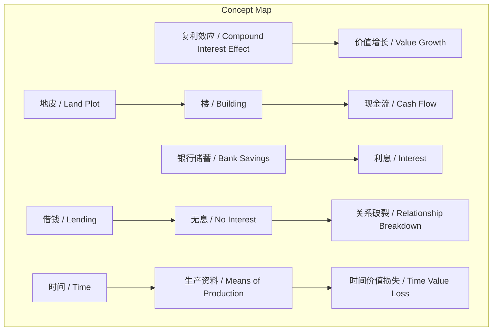
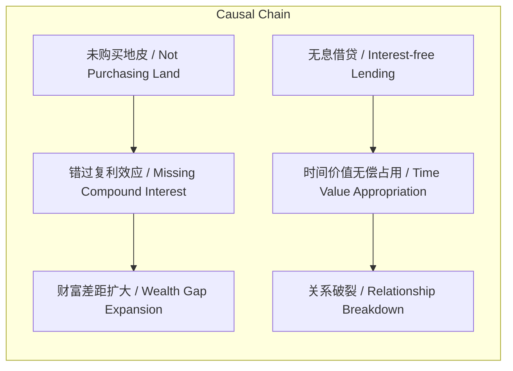

# 任务报告

- requestId: 1771635480764-bl1cql
- 生成时间(UTC): 2026-02-21T00:58:48.063Z

## 文本总结

# 从家族往事看复利与借贷的财富启示

## 整体结构化文档表达
### 文档卡片
- 主题（中文/English）：家庭经济教训 / Family Economic Lessons
- 一句话摘要：通过爷爷两段亲身经历，阐述复利效应的重要性及无息借贷对时间价值与人际关系的侵蚀。
- 目标读者：对个人理财、家庭经济关系感兴趣的普通读者。
- 核心结论（3条）：
  1. 复利效应具有长期缓慢累积后突然爆发的特性，错过关键资产购置可能导致永久性财富差距。
  2. 无息借贷出借资金且无时间补偿，本质上是无偿占有他人的时间与生产资料。
  3. 借贷关系（尤其无息）极易因长期拖欠而彻底破坏亲情与友情。

### 内容结构树
1. 背景与问题定义：作者通过春节闲聊，从爷爷经历中反思财富积累与借贷的深层逻辑。
2. 核心观点与关键证据：复利效应“慢慢地然后突然地”；无息借贷导致“几十年求人家还钱”及关系破裂。
3. 方法/机制/路径：采用历史对比案例（地皮投资 vs 银行储蓄；有偿借贷 vs 无息借贷）进行论证。
4. 风险与边界条件：案例基于特定历史时期（2000年前后、九几年）与个人经历，结论未必普适于所有经济环境。
5. 结论与行动建议：个人立下“不借不贷”规矩，将钱与时间视为核心生产资料加以保护。

### 结构化元数据（JSON）
```json
{
  "title": "从家族往事看复利与借贷的财富启示",
  "topic_zh": "家庭经济教训",
  "topic_en": "Family Economic Lessons",
  "audience": "对个人理财、家庭经济关系感兴趣的普通读者",
  "claims": [
    "复利效应具有长期累积后突然爆发的特性，错过关键资产购置可能导致永久性财富差距",
    "无息借贷出借资金且无时间补偿，本质上是无偿占有他人的时间与生产资料",
    "借贷关系（尤其无息）极易因长期拖欠而彻底破坏亲情与友情"
  ],
  "evidence": [
    "2000年前后南方四五线城镇地皮价格1-2万元，同事购买后建楼，一楼出租商铺每月现金流超1万元，地皮和楼的价值翻了100多倍",
    "爷爷九几年借给亲戚5000元，直到前几年才还清，无利息，且需长期追讨",
    "爷爷将钱存银行，利息跟不上房价上涨，后续再也买不起房"
  ],
  "risks": [
    "案例基于特定历史时期（2000年前后、九几年）与个人经历，结论未必普适于所有经济环境",
    "复利效应的“突然性”依赖特定资产（如地皮）与市场环境，非所有投资均适用",
    "无息借贷的结论可能过度概括，现实中存在基于信任的无偿借贷且未破坏关系的情况"
  ],
  "actions": [
    "重视复利效应，在能力范围内尽早配置能产生长期增值的资产",
    "立下规矩：不借钱给他人，也努力不向他人借钱，保护资金与时间价值",
    "借贷必须明确利息与期限，避免因人情模糊导致时间价值损失与关系破裂"
  ]
}
```

## 处理流程
1. 输入识别：识别用户提供的春节闲聊文本，主题为个人财富认知与借贷风险。
2. 信息抽取：抽取核心概念（复利效应、地皮、银行储蓄、借钱、生产资料、现金流、利息、时间）、事实（价格、时间跨度、收益）与观点（对复利与借贷的看法）。
3. 结构化归纳：归纳出“复利效应的重要性”与“无息借贷的风险”两大核心，并分类支撑证据。
4. 关系建模：建立概念间因果逻辑，如“未购买地皮”导致“错过复利”进而导致“财富差距”；“无息借贷”结合“长时间”导致“关系破裂”。
5. 可视化表达：生成概念结构图与因果链图，节点均使用文中真实概念。

## 概念清单（中英文）
- 春节 / Spring Festival
- 复利效应 / Compound Interest Effect
- 地皮 / Land Plot
- 银行储蓄 / Bank Savings
- 借钱 / Borrowing/Lending
- 亲戚 / Relatives
- 现金流 / Cash Flow
- 生产资料 / Means of Production
- 利息 / Interest
- 时间 / Time
- 楼 / Building
- 房价 / Housing Price
- 价值 / Value

## 概念定义（中英文）
- 春节（Spring Festival）：中国农历新年，文中作为闲聊发生的背景时间点。
- 复利效应（Compound Interest Effect）：指资产价值在长时间内缓慢累积，最终突然大幅增长的现象，文中描述为“慢慢地 然后突然地”。
- 地皮（Land Plot）：指用于建造楼房的可建设用地，文中指2000年前后以1-2万元购买的南方城镇土地。
- 银行储蓄（Bank Savings）：将资金存入银行获取利息的财富存储方式，文中与地皮投资对比。
- 借钱（Borrowing/Lending）：资金在个人间的无偿或有偿转移，文中特指无息借贷。
- 亲戚（Relatives）：有血缘或婚姻关系的家庭成员，文中指借款对象。
- 现金流（Cash Flow）：资产定期产生的现金收入，文中指楼一楼出租商铺的月收入。
- 生产资料（Means of Production）：用于生产商品或服务的基本资源，文中特指资金与时间。
- 利息（Interest）：资金出借的补偿回报，文中强调无息借贷的缺失。
- 时间（Time）：文中视为可产生价值的生产资料，借贷中未补偿的时间成本。
- 楼（Building）：在地皮上建造的建筑物，文中用于出租产生现金流。
- 房价（Housing Price）：房地产的市场价格，文中指上涨趋势。
- 价值（Value）：资产的市场或使用价值，文中指地皮与楼的价值增长。

## 概念关联与逻辑关系（中英文）
1. 地皮（Land Plot） 通过 建造楼（Building） 与 出租（Leasing） 产生 现金流（Cash Flow），并随时间（Time） 经历 复利效应（Compound Interest Effect） 导致 价值翻倍（Value Multiplication）。形式化：Value = f(Land_Plot, Time, Compound_Interest_Effect)。
2. 银行储蓄（Bank Savings） 的 利息（Interest） 低于 房价上涨（Housing Price Rise） 导致 购买力丧失（Loss of Purchasing Power），进而使后续资产购置（如地皮）变得不可能。形式化：Purchasing_Power ∝ Interest - Housing_Price_Rise < 0。
3. 借钱（Lending） 无 利息（No Interest） 且 时间（Extended Time） 漫长（如几十年） 导致 关系破裂（Relationship Breakdown）与 时间价值损失（Time_Value_Loss）。形式化：Relationship_Deterioration = Lending × (No_Interest ∧ Long_Duration)。

## COT逻辑梳理（定义/分类/比较/因果/科学方法论）
- Step 1（定义）：明确核心概念。复利效应为资产价值长期累积后突然增长；无息借贷为资金出借无利息补偿，时间亦无补偿。
- Step 2（分类）：财富积累方式分为资产购置（如地皮）与储蓄（银行）；借贷关系分为有偿（有利息）与无偿（无息）。
- Step 3（比较）：对比地皮投资与银行储蓄——前者产生现金流与百倍价值增长，后者利息追不上房价；对比有偿与无息借贷——后者导致长期追债与关系恶化。
- Step 4（因果）：未购买地皮（因爷爷保守）→ 错过复利效应 → 财富差距扩大；无息借贷（亲戚拖欠）→ 时间价值无偿占用 → 关系破裂。
- Step 5（科学方法论）：通过历史案例对比（控制变量：时间、资金量）验证复利效应；通过个人经历归纳借贷风险，但需注意案例的特定历史边界。

## 事实与看法（病毒）
### 事实
- 2000年前后南方四五线城镇地皮价格1-2万元。
- 同事购买地皮后建楼，一楼出租商铺每月现金流超1万元。
- 地皮和楼的价值翻了100多倍。
- 爷爷九几年借给亲戚5000元，直到前几年才还清，无利息。
- 爷爷将钱存银行，利息跟不上房价上涨，后续再也买不起房。
### 看法
- 复利效应是“慢慢地 然后突然地”。
- 钱是最本质生产资料。
- 出借竟然没有利息？几十年时间也是生产资料竟然没有补偿？
- 跟亲戚朋友绝交最容易的方式可能就是借钱。
- 作者立下规矩：绝对不借钱给他人，也努力不向他人借钱。

## FAQ（原文问题整理）
- 未发现明确提问。原文为经历分享与观点陈述，未提出具体问题。

## Visualization
### Mermaid 图 1（概念结构图）

### Mermaid 图 2（逻辑/因果图）


## 文章中的类比
- 未发现明确类比。

## 10个金句
1. 慢慢地 然后突然地……
2. 复利效应的震撼。
3. 银行的存钱利息跟不上上涨的房价。
4. 后面再也买不起。
5. 不要借钱 不要借钱 不要借钱。
6. 钱是最本质生产资料。
7. 出借竟然没有利息？
8. 几十年时间也是生产资料 竟然没有补偿？
9. 跟亲戚朋友绝交 最容易的方式 可能就是借钱了吧。
10. 绝对不借钱给他人 也努力不向他人借钱。
（原文未提供）
